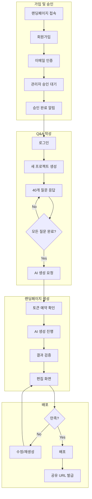
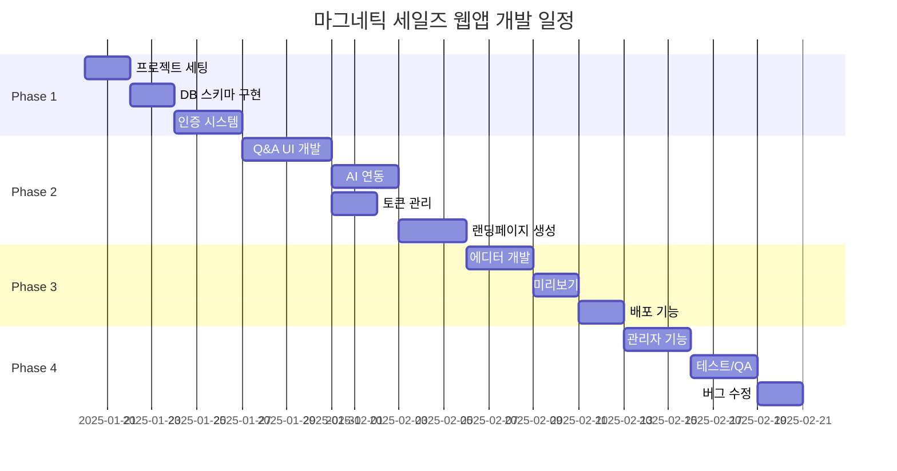
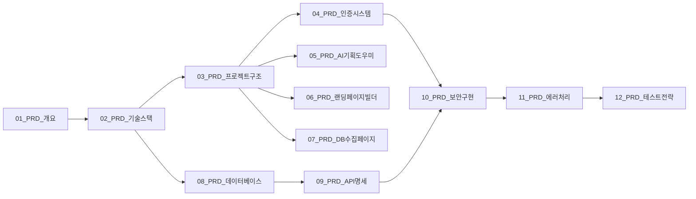

# PRD: 프로젝트 개요

## 1. 개요

### 1.1 프로젝트 정보

| 항목 | 내용 |
|------|------|
| 프로젝트명 | 마그네틱 세일즈 웹앱 (Magnetic Sales WebApp) |
| 버전 | 1.0.0 |
| PRD 버전 | v1 |
| 작성일 | 2025-01-15 |
| 기반 문서 | 기획_v2 (Red Team 보안 리뷰 반영) |

### 1.2 프로젝트 목적

AI 기반 Q&A 인터뷰를 통해 고객의 비즈니스 정보를 수집하고, 마그네틱 세일즈 방법론에 기반한 고전환율 랜딩페이지를 자동 생성하는 웹 애플리케이션.

### 1.3 핵심 가치 제안

```yaml
타겟_사용자:
  - 1인 코칭/컨설팅 사업자
  - 소규모 온라인 비즈니스 운영자
  - 마케팅 전문 지식이 부족한 창업자

해결하는_문제:
  - 전문 카피라이터 비용 (100만원+)
  - 랜딩페이지 제작 시간 (1-2주)
  - 마케팅 지식 부족

제공하는_가치:
  - 40개 질문 응답만으로 전문가급 랜딩페이지 생성
  - 10분 내 초안 완성
  - 마그네틱 세일즈 방법론 자동 적용
```

---

## 2. 성공 지표 (KPI)

### 2.1 비즈니스 메트릭

| 지표 | 목표 | 측정 방법 |
|------|------|----------|
| MAU (월간 활성 사용자) | 1,000명 (3개월 내) | Supabase Analytics |
| 전환율 (가입 → 유료) | 5% | 유료 전환 추적 |
| 랜딩페이지 생성 완료율 | 70% | Q&A 완료 / 시작 |
| NPS (순추천지수) | 50+ | 인앱 설문 |

### 2.2 기술 메트릭

| 지표 | 목표 | 측정 방법 |
|------|------|----------|
| API 응답 시간 (P95) | < 200ms | Vercel Analytics |
| AI 생성 시간 (평균) | < 90초 | 로그 분석 |
| 에러율 | < 0.1% | Sentry |
| 업타임 | 99.9% | Vercel Status |

### 2.3 보안 메트릭

| 지표 | 목표 | 측정 방법 |
|------|------|----------|
| 보안 사고 | 0건 | 감사 로그 |
| Rate Limit 차단 | < 1% | rate_limits 테이블 |
| Prompt Injection 시도 | 100% 차단 | audit_logs |

---

## 3. 프로젝트 범위

### 3.1 MVP 기능 (Phase 1)

```yaml
인증_시스템:
  - 이메일/비밀번호 회원가입
  - 관리자 승인 플로우
  - Refresh Token Rotation
  - 세션 관리

AI_기획_도우미:
  - 40개 질문 Q&A 인터페이스
  - 진행률 자동 저장
  - Claude API 연동
  - DESIRE-MAGNETIC 공식 적용

랜딩페이지_빌더:
  - AI 생성 결과 편집
  - 실시간 미리보기
  - 반응형 디자인
  - 배포 (Vercel Edge)

관리자_기능:
  - 사용자 승인/거부
  - 대시보드 (통계)
  - 감사 로그 조회
```

### 3.2 Phase 2 (향후 확장)

```yaml
추가_기능:
  - 소셜 로그인 (Google, Kakao)
  - A/B 테스트
  - 커스텀 도메인 연결
  - 결제 시스템 (Stripe)
  - 팀 협업 기능
```

### 3.3 범위 제외 (Out of Scope)

- 모바일 네이티브 앱
- 다국어 지원 (한국어 전용)
- 실시간 협업 편집
- 고급 분석 대시보드

---

## 4. 사용자 플로우

### 4.1 전체 여정 다이어그램



### 4.2 주요 화면 목록

| 화면 | 경로 | 설명 |
|------|------|------|
| 랜딩 홈 | `/` | 서비스 소개, CTA |
| 회원가입 | `/signup` | 이메일 가입 폼 |
| 로그인 | `/login` | 이메일 로그인 |
| 대시보드 | `/dashboard` | 프로젝트 목록 |
| Q&A 작성 | `/qa/[id]` | 40개 질문 인터페이스 |
| 생성 중 | `/generating/[id]` | AI 생성 진행률 |
| 편집기 | `/editor/[id]` | 랜딩페이지 편집 |
| 미리보기 | `/preview/[id]` | 반응형 미리보기 |
| 배포 페이지 | `/p/[slug]` | 공개 랜딩페이지 |
| 관리자 | `/admin/*` | 사용자 관리, 통계 |

---

## 5. 기술 스택 요약

### 5.1 프론트엔드

| 기술 | 버전 | 용도 |
|------|------|------|
| Next.js | 14.x | App Router, SSR |
| React | 18.x | UI 컴포넌트 |
| TypeScript | 5.x | 타입 안전성 |
| Tailwind CSS | 3.x | 스타일링 |
| Zustand | 4.x | 상태 관리 |
| React Hook Form | 7.x | 폼 관리 |
| Zod | 3.x | 스키마 검증 |

### 5.2 백엔드

| 기술 | 버전 | 용도 |
|------|------|------|
| Next.js API Routes | 14.x | 서버리스 API |
| Supabase | - | Auth, DB, Storage |
| PostgreSQL | 15.x | 데이터베이스 |
| Claude API | Sonnet 4 | AI 생성 |

### 5.3 인프라

| 기술 | 용도 |
|------|------|
| Vercel | 호스팅, Edge Functions |
| Supabase | BaaS (Auth, DB, Storage) |
| GitHub Actions | CI/CD |

---

## 6. 일정

### 6.1 마일스톤

| 단계 | 기간 | 주요 산출물 |
|------|------|------------|
| **Phase 1: 기반 구축** | 1주 | 프로젝트 세팅, DB 스키마, 인증 |
| **Phase 2: 핵심 기능** | 2주 | Q&A UI, AI 연동, 랜딩페이지 생성 |
| **Phase 3: 편집/배포** | 1주 | 에디터, 미리보기, 배포 |
| **Phase 4: 관리자/QA** | 1주 | 관리자 기능, 테스트, 버그 수정 |

### 6.2 상세 일정



---

## 7. 위험 요소 및 대응

### 7.1 기술적 위험

| 위험 | 영향 | 확률 | 대응 |
|------|------|------|------|
| Claude API 장애 | 높음 | 낮음 | 재시도 로직, 사용자 안내 |
| Supabase 장애 | 높음 | 낮음 | 에러 페이지, 상태 모니터링 |
| 토큰 한도 초과 | 중간 | 중간 | 예약 시스템, 사용량 알림 |

### 7.2 보안 위험

| 위험 | 영향 | 확률 | 대응 |
|------|------|------|------|
| Prompt Injection | 높음 | 중간 | 다중 레이어 방어 |
| XSS 공격 | 높음 | 낮음 | DOMPurify, CSP |
| 토큰 탈취 | 높음 | 낮음 | HttpOnly Cookie, Rotation |

### 7.3 비즈니스 위험

| 위험 | 영향 | 확률 | 대응 |
|------|------|------|------|
| 낮은 전환율 | 중간 | 중간 | A/B 테스트, 사용자 피드백 |
| 경쟁사 진입 | 중간 | 높음 | 차별화 기능 개발 |

---

## 8. 의존성

### 8.1 외부 서비스

| 서비스 | 용도 | SLA | 대체안 |
|--------|------|-----|--------|
| Anthropic Claude | AI 생성 | 99.9% | OpenAI GPT-4 |
| Supabase | Auth, DB | 99.9% | Firebase |
| Vercel | 호스팅 | 99.99% | Cloudflare |

### 8.2 문서 간 의존성



---

## 9. 승인

| 역할 | 담당자 | 승인일 |
|------|--------|--------|
| 프로젝트 오너 | - | - |
| 기술 리드 | - | - |
| 보안 담당 | - | - |

---

## 변경 이력

| 버전 | 날짜 | 변경 내용 | 작성자 |
|------|------|----------|--------|
| 1.0 | 2025-01-15 | 초기 작성 | CTO |
