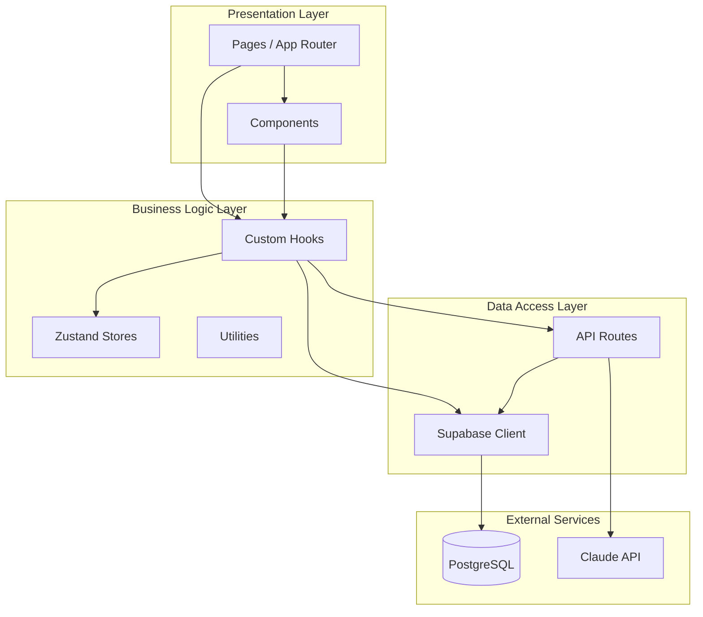

# PRD: 프로젝트 구조

## 1. 개요

이 문서는 마그네틱 세일즈 웹앱의 폴더 구조, 파일 네이밍 컨벤션, 모듈 분리 전략을 정의합니다.

## 2. 의존성

- 이 문서 작성 전 필요: `02_PRD_기술스택.md`
- 이 문서 작성 후 진행: `04_PRD_인증시스템.md` ~ `07_PRD_DB수집페이지.md`

---

## 3. 폴더 구조

### 3.1 전체 구조

```
magnetic-sales-webapp/
├── .github/
│   └── workflows/
│       ├── ci.yml                    # CI 파이프라인
│       └── deploy.yml                # 배포 파이프라인
├── .husky/
│   └── pre-commit                    # 커밋 전 린트
├── public/
│   ├── favicon.ico
│   ├── robots.txt
│   └── images/
│       └── logo.svg
├── src/
│   ├── app/                          # Next.js App Router
│   │   ├── (auth)/                   # 인증 관련 라우트 그룹
│   │   │   ├── login/
│   │   │   │   └── page.tsx
│   │   │   ├── signup/
│   │   │   │   └── page.tsx
│   │   │   └── layout.tsx
│   │   ├── (dashboard)/              # 대시보드 라우트 그룹
│   │   │   ├── dashboard/
│   │   │   │   └── page.tsx
│   │   │   ├── qa/
│   │   │   │   └── [id]/
│   │   │   │       └── page.tsx
│   │   │   ├── editor/
│   │   │   │   └── [id]/
│   │   │   │       └── page.tsx
│   │   │   └── layout.tsx
│   │   ├── (public)/                 # 공개 페이지
│   │   │   ├── p/
│   │   │   │   └── [slug]/
│   │   │   │       └── page.tsx
│   │   │   └── layout.tsx
│   │   ├── admin/                    # 관리자 페이지
│   │   │   ├── dashboard/
│   │   │   │   └── page.tsx
│   │   │   ├── users/
│   │   │   │   └── page.tsx
│   │   │   ├── audit-logs/
│   │   │   │   └── page.tsx
│   │   │   └── layout.tsx
│   │   ├── api/                      # API 라우트
│   │   │   ├── auth/
│   │   │   │   ├── signup/
│   │   │   │   │   └── route.ts
│   │   │   │   ├── login/
│   │   │   │   │   └── route.ts
│   │   │   │   ├── logout/
│   │   │   │   │   └── route.ts
│   │   │   │   └── refresh/
│   │   │   │       └── route.ts
│   │   │   ├── ai/
│   │   │   │   ├── generate/
│   │   │   │   │   └── route.ts
│   │   │   │   └── tokens/
│   │   │   │       └── route.ts
│   │   │   ├── lp/
│   │   │   │   ├── route.ts
│   │   │   │   ├── [id]/
│   │   │   │   │   ├── route.ts
│   │   │   │   │   └── restore/
│   │   │   │   │       └── route.ts
│   │   │   │   └── deleted/
│   │   │   │       └── route.ts
│   │   │   ├── qa/
│   │   │   │   ├── route.ts
│   │   │   │   └── [id]/
│   │   │   │       └── route.ts
│   │   │   └── admin/
│   │   │       ├── users/
│   │   │       │   ├── route.ts
│   │   │       │   └── [id]/
│   │   │       │       ├── route.ts
│   │   │       │       └── approve/
│   │   │       │           └── route.ts
│   │   │       └── audit-logs/
│   │   │           └── route.ts
│   │   ├── error.tsx                 # 전역 에러 핸들러
│   │   ├── not-found.tsx             # 404 페이지
│   │   ├── loading.tsx               # 전역 로딩
│   │   ├── layout.tsx                # 루트 레이아웃
│   │   ├── page.tsx                  # 홈페이지
│   │   └── globals.css               # 전역 스타일
│   ├── components/
│   │   ├── ui/                       # 기본 UI 컴포넌트
│   │   │   ├── button.tsx
│   │   │   ├── input.tsx
│   │   │   ├── card.tsx
│   │   │   ├── modal.tsx
│   │   │   ├── toast.tsx
│   │   │   ├── skeleton.tsx
│   │   │   ├── badge.tsx
│   │   │   ├── dropdown.tsx
│   │   │   ├── tabs.tsx
│   │   │   └── index.ts
│   │   ├── forms/                    # 폼 컴포넌트
│   │   │   ├── login-form.tsx
│   │   │   ├── signup-form.tsx
│   │   │   ├── qa-form.tsx
│   │   │   └── index.ts
│   │   ├── layout/                   # 레이아웃 컴포넌트
│   │   │   ├── header.tsx
│   │   │   ├── sidebar.tsx
│   │   │   ├── footer.tsx
│   │   │   ├── nav-link.tsx
│   │   │   └── index.ts
│   │   ├── landing-page/             # 랜딩페이지 빌더 컴포넌트
│   │   │   ├── editor/
│   │   │   │   ├── toolbar.tsx
│   │   │   │   ├── canvas.tsx
│   │   │   │   ├── section-editor.tsx
│   │   │   │   └── index.ts
│   │   │   ├── sections/
│   │   │   │   ├── headline-section.tsx
│   │   │   │   ├── cta-section.tsx
│   │   │   │   ├── testimonial-section.tsx
│   │   │   │   ├── faq-section.tsx
│   │   │   │   └── index.ts
│   │   │   ├── preview/
│   │   │   │   ├── preview-frame.tsx
│   │   │   │   ├── device-toggle.tsx
│   │   │   │   └── index.ts
│   │   │   └── index.ts
│   │   ├── qa/                       # Q&A 관련 컴포넌트
│   │   │   ├── question-card.tsx
│   │   │   ├── progress-bar.tsx
│   │   │   ├── answer-input.tsx
│   │   │   ├── category-nav.tsx
│   │   │   └── index.ts
│   │   ├── admin/                    # 관리자 컴포넌트
│   │   │   ├── user-table.tsx
│   │   │   ├── stats-card.tsx
│   │   │   ├── audit-log-list.tsx
│   │   │   └── index.ts
│   │   └── common/                   # 공통 컴포넌트
│   │       ├── error-boundary.tsx
│   │       ├── loading-spinner.tsx
│   │       ├── empty-state.tsx
│   │       ├── confirm-dialog.tsx
│   │       └── index.ts
│   ├── lib/
│   │   ├── supabase/                 # Supabase 클라이언트
│   │   │   ├── client.ts
│   │   │   ├── server.ts
│   │   │   ├── admin.ts
│   │   │   └── index.ts
│   │   ├── ai/                       # AI 관련 모듈
│   │   │   ├── anthropic.ts
│   │   │   ├── generator.ts
│   │   │   ├── input-sanitizer.ts
│   │   │   ├── output-validator.ts
│   │   │   ├── system-prompt.ts
│   │   │   ├── token-manager.ts
│   │   │   └── index.ts
│   │   ├── auth/                     # 인증 관련 모듈
│   │   │   ├── refresh-token.ts
│   │   │   ├── session.ts
│   │   │   ├── middleware.ts
│   │   │   └── index.ts
│   │   ├── security/                 # 보안 관련 모듈
│   │   │   ├── sanitize.ts
│   │   │   ├── rate-limit.ts
│   │   │   ├── cors.ts
│   │   │   └── index.ts
│   │   ├── audit/                    # 감사 로그 모듈
│   │   │   ├── logger.ts
│   │   │   └── index.ts
│   │   ├── validations/              # Zod 스키마
│   │   │   ├── auth.ts
│   │   │   ├── landing-page.ts
│   │   │   ├── qa.ts
│   │   │   ├── common.ts
│   │   │   └── index.ts
│   │   ├── utils/                    # 유틸리티 함수
│   │   │   ├── cn.ts                 # className 머지
│   │   │   ├── format.ts             # 포맷팅 함수
│   │   │   ├── date.ts               # 날짜 함수
│   │   │   ├── crypto.ts             # 암호화 함수
│   │   │   └── index.ts
│   │   └── constants/                # 상수 정의
│   │       ├── routes.ts
│   │       ├── errors.ts
│   │       ├── questions.ts
│   │       └── index.ts
│   ├── hooks/                        # 커스텀 훅
│   │   ├── use-auth.ts
│   │   ├── use-toast.ts
│   │   ├── use-debounce.ts
│   │   ├── use-local-storage.ts
│   │   ├── use-media-query.ts
│   │   └── index.ts
│   ├── stores/                       # Zustand 스토어
│   │   ├── auth-store.ts
│   │   ├── qa-store.ts
│   │   ├── editor-store.ts
│   │   ├── ui-store.ts
│   │   └── index.ts
│   ├── types/                        # 타입 정의
│   │   ├── supabase.ts               # Supabase 자동 생성
│   │   ├── api.ts                    # API 타입
│   │   ├── landing-page.ts           # 랜딩페이지 타입
│   │   ├── qa.ts                     # Q&A 타입
│   │   └── index.ts
│   └── middleware.ts                 # Next.js 미들웨어
├── supabase/
│   ├── migrations/                   # DB 마이그레이션
│   │   ├── 20250115000001_initial.sql
│   │   └── 20250115000002_functions.sql
│   ├── seed.sql                      # 시드 데이터
│   └── config.toml                   # Supabase 설정
├── tests/
│   ├── unit/                         # 단위 테스트
│   ├── integration/                  # 통합 테스트
│   └── e2e/                          # E2E 테스트
├── .env.local                        # 로컬 환경변수
├── .env.example                      # 환경변수 예시
├── .eslintrc.cjs                     # ESLint 설정
├── .prettierrc                       # Prettier 설정
├── .gitignore
├── next.config.ts                    # Next.js 설정
├── tailwind.config.ts                # Tailwind 설정
├── tsconfig.json                     # TypeScript 설정
├── package.json
├── package-lock.json
├── vercel.json                       # Vercel 설정
└── README.md
```

---

## 4. 네이밍 컨벤션

### 4.1 파일 네이밍

| 유형 | 패턴 | 예시 |
|------|------|------|
| 컴포넌트 | kebab-case.tsx | `user-table.tsx` |
| 페이지 | page.tsx (App Router) | `app/login/page.tsx` |
| API 라우트 | route.ts | `app/api/auth/login/route.ts` |
| 훅 | use-{name}.ts | `use-auth.ts` |
| 스토어 | {name}-store.ts | `auth-store.ts` |
| 유틸리티 | {name}.ts | `format.ts` |
| 타입 | {name}.ts | `api.ts` |
| 상수 | {name}.ts | `routes.ts` |

### 4.2 컴포넌트 네이밍

```typescript
// 파일: src/components/ui/button.tsx
// 컴포넌트: PascalCase

// 기본 컴포넌트
export function Button() {}

// 변형 컴포넌트
export function PrimaryButton() {}
export function OutlineButton() {}

// 복합 컴포넌트 패턴
export function Card() {}
Card.Header = function CardHeader() {};
Card.Body = function CardBody() {};
Card.Footer = function CardFooter() {};
```

### 4.3 변수/함수 네이밍

```typescript
// 변수: camelCase
const userName = 'John';
const isLoading = true;
const hasPermission = false;

// 상수: UPPER_SNAKE_CASE
const MAX_RETRY_COUNT = 3;
const API_BASE_URL = '/api';

// 함수: camelCase (동사 시작)
function getUserById() {}
function createLandingPage() {}
function handleSubmit() {}

// 이벤트 핸들러: handle{Event}
function handleClick() {}
function handleChange() {}
function handleSubmit() {}

// 비동기 함수: 동사 사용
async function fetchUsers() {}
async function submitForm() {}
async function generateContent() {}
```

### 4.4 타입 네이밍

```typescript
// Interface: PascalCase (I 접두사 없음)
interface User {
  id: string;
  email: string;
}

// Type Alias: PascalCase
type ButtonVariant = 'primary' | 'secondary' | 'outline';

// Enum: PascalCase
enum UserRole {
  Admin = 'ADMIN',
  User = 'USER',
}

// 제네릭: T, K, V 또는 의미있는 이름
type ApiResponse<TData> = {
  success: boolean;
  data: TData;
};
```

---

## 5. 모듈 분리 전략

### 5.1 레이어 아키텍처



### 5.2 의존성 규칙

```yaml
의존성_방향:
  - "Pages → Components → Hooks → Stores"
  - "API Routes → Lib 모듈"
  - "하위 레이어는 상위 레이어를 import 하지 않음"

금지된_의존성:
  - "Components → Pages"
  - "Lib → Components"
  - "Stores → Hooks"

허용된_의존성:
  - "모든 레이어 → Types"
  - "모든 레이어 → Utils"
  - "모든 레이어 → Constants"
```

---

## 6. 주요 파일 구현

### 6.1 루트 레이아웃

```typescript
// src/app/layout.tsx
import type { Metadata } from 'next';
import { Pretendard } from '@/lib/fonts';
import { Toaster } from '@/components/ui/toast';
import '@/app/globals.css';

export const metadata: Metadata = {
  title: {
    default: '마그네틱 세일즈',
    template: '%s | 마그네틱 세일즈',
  },
  description: 'AI 기반 고전환율 랜딩페이지 생성 서비스',
  keywords: ['랜딩페이지', 'AI', '마케팅', '세일즈'],
  authors: [{ name: 'Magnetic Sales' }],
  openGraph: {
    type: 'website',
    locale: 'ko_KR',
    url: process.env.NEXT_PUBLIC_APP_URL,
    siteName: '마그네틱 세일즈',
  },
};

export default function RootLayout({
  children,
}: {
  children: React.ReactNode;
}) {
  return (
    <html lang="ko" className={Pretendard.variable}>
      <body className="min-h-screen bg-gray-50 font-sans antialiased">
        {children}
        <Toaster />
      </body>
    </html>
  );
}
```

### 6.2 미들웨어

```typescript
// src/middleware.ts
import { NextResponse } from 'next/server';
import type { NextRequest } from 'next/server';
import { createServerSupabaseClient } from '@/lib/supabase/server';

// CORS 화이트리스트
const ALLOWED_ORIGINS = new Set([
  'https://magnetic-sales.vercel.app',
  'https://www.magnetic-sales.com',
]);

if (process.env.NODE_ENV === 'development') {
  ALLOWED_ORIGINS.add('http://localhost:3000');
}

// 보호된 경로
const PROTECTED_ROUTES = ['/dashboard', '/qa', '/editor', '/admin'];
const AUTH_ROUTES = ['/login', '/signup'];

export async function middleware(request: NextRequest) {
  const { pathname } = request.nextUrl;

  // API 라우트: CORS 처리
  if (pathname.startsWith('/api')) {
    return handleApiCors(request);
  }

  // 인증 체크
  const supabase = await createServerSupabaseClient();
  const { data: { session } } = await supabase.auth.getSession();

  // 보호된 경로 접근 시 로그인 필요
  if (PROTECTED_ROUTES.some((route) => pathname.startsWith(route))) {
    if (!session) {
      const loginUrl = new URL('/login', request.url);
      loginUrl.searchParams.set('redirect', pathname);
      return NextResponse.redirect(loginUrl);
    }

    // 관리자 페이지 권한 체크
    if (pathname.startsWith('/admin')) {
      const { data: profile } = await supabase
        .from('profiles')
        .select('tier')
        .eq('id', session.user.id)
        .single();

      if (profile?.tier !== 'ENTERPRISE') {
        return NextResponse.redirect(new URL('/dashboard', request.url));
      }
    }
  }

  // 로그인 상태에서 인증 페이지 접근 시 대시보드로
  if (AUTH_ROUTES.includes(pathname) && session) {
    return NextResponse.redirect(new URL('/dashboard', request.url));
  }

  return NextResponse.next();
}

function handleApiCors(request: NextRequest): NextResponse {
  const origin = request.headers.get('origin');
  const response = NextResponse.next();

  if (!origin) {
    const fetchSite = request.headers.get('sec-fetch-site');
    if (fetchSite === 'same-origin' || fetchSite === 'none') {
      return response;
    }
    return new NextResponse(null, { status: 403 });
  }

  if (!ALLOWED_ORIGINS.has(origin)) {
    return new NextResponse(
      JSON.stringify({
        success: false,
        error: { code: 'CORS_001', message: 'Origin not allowed' },
      }),
      { status: 403, headers: { 'Content-Type': 'application/json' } }
    );
  }

  response.headers.set('Access-Control-Allow-Origin', origin);
  response.headers.set('Access-Control-Allow-Credentials', 'true');
  response.headers.set(
    'Access-Control-Allow-Methods',
    'GET, POST, PUT, PATCH, DELETE, OPTIONS'
  );
  response.headers.set(
    'Access-Control-Allow-Headers',
    'Content-Type, Authorization, X-Request-ID'
  );
  response.headers.set('Access-Control-Max-Age', '86400');

  if (request.method === 'OPTIONS') {
    return new NextResponse(null, { status: 204, headers: response.headers });
  }

  return response;
}

export const config = {
  matcher: [
    '/((?!_next/static|_next/image|favicon.ico|public).*)',
  ],
};
```

### 6.3 className 유틸리티

```typescript
// src/lib/utils/cn.ts
import { clsx, type ClassValue } from 'clsx';
import { twMerge } from 'tailwind-merge';

/**
 * Tailwind CSS 클래스를 조건부로 결합
 * @example cn('base-class', isActive && 'active-class', { 'conditional': isTrue })
 */
export function cn(...inputs: ClassValue[]) {
  return twMerge(clsx(inputs));
}
```

### 6.4 API 응답 헬퍼

```typescript
// src/lib/utils/api-response.ts
import { NextResponse } from 'next/server';
import { nanoid } from 'nanoid';

interface SuccessResponseData<T> {
  success: true;
  data: T;
  meta?: {
    page?: number;
    limit?: number;
    total?: number;
  };
}

interface ErrorResponseData {
  success: false;
  error: {
    code: string;
    message: string;
    reference?: string;
  };
}

export function successResponse<T>(
  data: T,
  status: number = 200,
  meta?: SuccessResponseData<T>['meta']
): NextResponse<SuccessResponseData<T>> {
  return NextResponse.json(
    { success: true, data, ...(meta && { meta }) },
    { status }
  );
}

export function errorResponse(
  code: string,
  message: string,
  status: number = 400
): NextResponse<ErrorResponseData> {
  const reference = `ERR-${Date.now()}-${nanoid(4).toUpperCase()}`;
  return NextResponse.json(
    {
      success: false,
      error: { code, message, reference },
    },
    { status }
  );
}

// 에러 코드 상수
export const ERROR_CODES = {
  // 인증
  AUTH_001: { status: 401, message: '이메일 또는 비밀번호를 확인해주세요' },
  AUTH_002: { status: 403, message: '관리자 승인 대기 중입니다' },
  AUTH_003: { status: 401, message: '세션이 만료되었습니다' },
  AUTH_004: { status: 401, message: '보안 문제가 감지되었습니다' },
  AUTH_005: { status: 409, message: '이미 가입된 이메일입니다' },
  AUTH_006: { status: 403, message: '탈퇴한 계정입니다' },

  // 토큰
  TOKEN_001: { status: 429, message: '토큰이 부족합니다' },
  TOKEN_002: { status: 429, message: '오늘의 사용량을 모두 소진했습니다' },

  // 랜딩페이지
  LP_001: { status: 404, message: '랜딩페이지를 찾을 수 없습니다' },
  LP_002: { status: 410, message: '복구 기간(30일)이 만료되었습니다' },
  LP_003: { status: 429, message: '랜딩페이지 수 제한을 초과했습니다' },

  // AI
  AI_001: { status: 500, message: '생성에 실패했습니다' },
  AI_002: { status: 408, message: '요청 시간이 초과되었습니다' },

  // Rate Limit
  RATE_001: { status: 429, message: '요청이 너무 많습니다' },

  // 일반
  GEN_001: { status: 500, message: '서비스 연결에 문제가 있습니다' },
  GEN_002: { status: 400, message: '잘못된 요청입니다' },
  GEN_003: { status: 403, message: '접근 권한이 없습니다' },
} as const;

export function errorFromCode(code: keyof typeof ERROR_CODES) {
  const { status, message } = ERROR_CODES[code];
  return errorResponse(code, message, status);
}
```

### 6.5 인덱스 파일 패턴

```typescript
// src/components/ui/index.ts
export { Button, type ButtonProps } from './button';
export { Input, type InputProps } from './input';
export { Card, type CardProps } from './card';
export { Modal, type ModalProps } from './modal';
export { Toast, Toaster, useToast } from './toast';
export { Skeleton } from './skeleton';
export { Badge, type BadgeProps } from './badge';
export { Dropdown, type DropdownProps } from './dropdown';
export { Tabs, type TabsProps } from './tabs';
```

```typescript
// 사용 예시
import { Button, Input, Card } from '@/components/ui';
```

---

## 7. 체크리스트

### 7.1 폴더 생성
- [ ] `src/app` 구조 생성
- [ ] `src/components` 구조 생성
- [ ] `src/lib` 구조 생성
- [ ] `src/hooks` 생성
- [ ] `src/stores` 생성
- [ ] `src/types` 생성

### 7.2 기본 파일 생성
- [ ] `layout.tsx` (루트)
- [ ] `middleware.ts`
- [ ] `globals.css`
- [ ] `cn.ts` 유틸리티
- [ ] `api-response.ts` 헬퍼

### 7.3 인덱스 파일
- [ ] 각 컴포넌트 폴더에 `index.ts` 생성
- [ ] 각 lib 폴더에 `index.ts` 생성
- [ ] `types/index.ts` 생성

---

## 변경 이력

| 버전 | 날짜 | 변경 내용 | 작성자 |
|------|------|----------|--------|
| 1.0 | 2025-01-15 | 초기 작성 | CTO |
