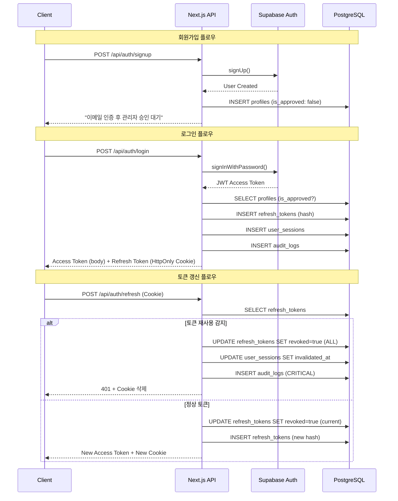

# PRD: 인증 시스템

## 문서 정보

| 항목 | 내용 |
|------|------|
| 문서명 | 인증 시스템 상세 구현 명세 |
| 버전 | 1.0 |
| 작성일 | 2025-01-15 |
| 의존성 | 02_PRD_기술스택.md, 03_PRD_프로젝트구조.md |

---

## 1. 인증 아키텍처 개요

### 1.1 인증 플로우 다이어그램



### 1.2 토큰 구성

| 토큰 유형 | 저장 위치 | 만료 시간 | 용도 |
|----------|----------|----------|------|
| Access Token | JavaScript 메모리 | 15분 | API 인증 |
| Refresh Token | HttpOnly Cookie | 7일 | Access Token 갱신 |

### 1.3 보안 원칙

```yaml
핵심_보안_원칙:
  - Refresh Token은 절대 JavaScript에서 접근 불가 (HttpOnly)
  - 모든 Refresh Token 사용 시 Rotation 적용
  - 재사용 감지 시 모든 세션 즉시 무효화
  - 승인 상태 변경 시 세션 자동 무효화
  - 모든 인증 이벤트 감사 로그 기록
```

---

## 2. 회원가입 구현

### 2.1 Zod 스키마 정의

```typescript
// lib/validation/auth.ts
import { z } from 'zod';

// 비밀번호 정책
export const passwordSchema = z
  .string()
  .min(8, '비밀번호는 8자 이상이어야 합니다')
  .max(128, '비밀번호가 너무 깁니다')
  .regex(/[a-zA-Z]/, '영문을 포함해야 합니다')
  .regex(/[0-9]/, '숫자를 포함해야 합니다')
  .regex(/^[a-zA-Z0-9!@#$%^&*()_+\-=\[\]{}|;:,.<>?]+$/, '허용되지 않는 문자가 포함되어 있습니다');

// 회원가입 스키마
export const signupSchema = z.object({
  email: z
    .string()
    .email('유효한 이메일을 입력해주세요')
    .max(255)
    .toLowerCase()
    .transform(val => val.trim()),
  password: passwordSchema,
  confirmPassword: z.string(),
  fullName: z
    .string()
    .min(2, '이름은 2자 이상이어야 합니다')
    .max(50, '이름이 너무 깁니다')
    .trim(),
  agreeTerms: z.literal(true, {
    errorMap: () => ({ message: '서비스 이용약관에 동의해주세요' }),
  }),
  agreePrivacy: z.literal(true, {
    errorMap: () => ({ message: '개인정보 처리방침에 동의해주세요' }),
  }),
  agreeMarketing: z.boolean().optional().default(false),
}).refine(data => data.password === data.confirmPassword, {
  message: '비밀번호가 일치하지 않습니다',
  path: ['confirmPassword'],
});

// 로그인 스키마
export const loginSchema = z.object({
  email: z.string().email('유효한 이메일을 입력해주세요').toLowerCase().trim(),
  password: z.string().min(1, '비밀번호를 입력해주세요'),
});

// 비밀번호 변경 스키마
export const changePasswordSchema = z.object({
  currentPassword: z.string().min(1, '현재 비밀번호를 입력해주세요'),
  newPassword: passwordSchema,
  confirmNewPassword: z.string(),
}).refine(data => data.newPassword === data.confirmNewPassword, {
  message: '새 비밀번호가 일치하지 않습니다',
  path: ['confirmNewPassword'],
}).refine(data => data.currentPassword !== data.newPassword, {
  message: '새 비밀번호는 현재 비밀번호와 달라야 합니다',
  path: ['newPassword'],
});

export type SignupInput = z.infer<typeof signupSchema>;
export type LoginInput = z.infer<typeof loginSchema>;
export type ChangePasswordInput = z.infer<typeof changePasswordSchema>;
```

### 2.2 회원가입 API

```typescript
// app/api/auth/signup/route.ts
import { NextRequest, NextResponse } from 'next/server';
import { createClient } from '@supabase/supabase-js';
import { signupSchema } from '@/lib/validation/auth';
import { generateErrorReference } from '@/lib/utils/error';
import { logAudit, createAuditContext } from '@/lib/audit/logger';

// Service Role 클라이언트 (서버 전용)
const supabaseAdmin = createClient(
  process.env.NEXT_PUBLIC_SUPABASE_URL!,
  process.env.SUPABASE_SERVICE_ROLE_KEY!
);

export async function POST(request: NextRequest) {
  const auditContext = createAuditContext(request);

  try {
    // 1. 요청 파싱 및 검증
    const body = await request.json();
    const validationResult = signupSchema.safeParse(body);

    if (!validationResult.success) {
      const errors = validationResult.error.errors.map(e => e.message).join(', ');
      return NextResponse.json(
        {
          success: false,
          error: {
            code: 'GEN_002',
            message: errors,
          },
        },
        { status: 400 }
      );
    }

    const { email, password, fullName, agreeMarketing } = validationResult.data;

    // 2. 이메일 중복 확인
    const { data: existingUser } = await supabaseAdmin
      .from('profiles')
      .select('id, deleted_at')
      .eq('email', email)
      .maybeSingle();

    if (existingUser) {
      // Soft Delete된 사용자인 경우
      if (existingUser.deleted_at) {
        return NextResponse.json(
          {
            success: false,
            error: {
              code: 'AUTH_006',
              message: '탈퇴한 계정입니다. 고객센터에 문의해주세요',
            },
          },
          { status: 403 }
        );
      }

      return NextResponse.json(
        {
          success: false,
          error: {
            code: 'AUTH_005',
            message: '이미 가입된 이메일입니다',
          },
        },
        { status: 409 }
      );
    }

    // 3. Supabase Auth 사용자 생성
    const { data: authData, error: authError } = await supabaseAdmin.auth.admin.createUser({
      email,
      password,
      email_confirm: false, // 이메일 인증 필요
    });

    if (authError) {
      console.error('Supabase Auth Error:', authError);
      return NextResponse.json(
        {
          success: false,
          error: {
            code: 'GEN_001',
            message: '회원가입에 실패했습니다',
            reference: generateErrorReference(),
          },
        },
        { status: 500 }
      );
    }

    // 4. Profile 생성
    const { error: profileError } = await supabaseAdmin
      .from('profiles')
      .insert({
        id: authData.user.id,
        email,
        full_name: fullName,
        tier: 'FREE',
        is_approved: false, // 관리자 승인 필요
        agree_terms: true,
        agree_privacy: true,
        agree_marketing: agreeMarketing,
      });

    if (profileError) {
      // 롤백: Auth 사용자 삭제
      await supabaseAdmin.auth.admin.deleteUser(authData.user.id);

      console.error('Profile Creation Error:', profileError);
      return NextResponse.json(
        {
          success: false,
          error: {
            code: 'GEN_001',
            message: '회원가입에 실패했습니다',
            reference: generateErrorReference(),
          },
        },
        { status: 500 }
      );
    }

    // 5. 감사 로그
    await logAudit({
      userId: authData.user.id,
      action: 'signup',
      details: {
        email,
        agreeMarketing,
      },
      ...auditContext,
    });

    // 6. 이메일 인증 메일 발송 (Supabase에서 자동 처리)

    return NextResponse.json(
      {
        success: true,
        data: {
          message: '이메일 인증 후 관리자 승인을 기다려주세요',
        },
      },
      { status: 201 }
    );
  } catch (error) {
    console.error('Signup Error:', error);
    return NextResponse.json(
      {
        success: false,
        error: {
          code: 'GEN_001',
          message: '서비스 연결에 문제가 있습니다',
          reference: generateErrorReference(),
        },
      },
      { status: 500 }
    );
  }
}
```

---

## 3. 로그인 구현

### 3.1 암호화 유틸리티

```typescript
// lib/crypto/index.ts
import crypto from 'crypto';

/**
 * 보안 토큰 생성 (Base64URL 인코딩)
 * @param length 바이트 길이 (기본 64바이트 = 512비트)
 */
export function generateSecureToken(length: number = 64): string {
  return crypto.randomBytes(length).toString('base64url');
}

/**
 * 토큰 SHA-256 해싱 (저장용)
 * @param token 원본 토큰
 */
export async function hashToken(token: string): Promise<string> {
  const encoder = new TextEncoder();
  const data = encoder.encode(token);
  const hashBuffer = await crypto.subtle.digest('SHA-256', data);
  const hashArray = Array.from(new Uint8Array(hashBuffer));
  return hashArray.map(b => b.toString(16).padStart(2, '0')).join('');
}

/**
 * 토큰 비교 (타이밍 공격 방지)
 * @param a 토큰 A
 * @param b 토큰 B
 */
export function secureCompare(a: string, b: string): boolean {
  if (a.length !== b.length) return false;

  const bufA = Buffer.from(a);
  const bufB = Buffer.from(b);

  return crypto.timingSafeEqual(bufA, bufB);
}
```

### 3.2 로그인 API

```typescript
// app/api/auth/login/route.ts
import { NextRequest, NextResponse } from 'next/server';
import { createClient } from '@supabase/supabase-js';
import { loginSchema } from '@/lib/validation/auth';
import { generateSecureToken, hashToken } from '@/lib/crypto';
import { generateErrorReference } from '@/lib/utils/error';
import { logAudit, createAuditContext } from '@/lib/audit/logger';
import { checkRateLimit } from '@/lib/security/rate-limit';

const supabaseAdmin = createClient(
  process.env.NEXT_PUBLIC_SUPABASE_URL!,
  process.env.SUPABASE_SERVICE_ROLE_KEY!
);

// Refresh Token 쿠키 설정
const REFRESH_TOKEN_COOKIE_OPTIONS = {
  httpOnly: true,
  secure: process.env.NODE_ENV === 'production',
  sameSite: 'strict' as const,
  path: '/api/auth',
  maxAge: 7 * 24 * 60 * 60, // 7일 (초)
};

export async function POST(request: NextRequest) {
  const auditContext = createAuditContext(request);

  try {
    // 1. Rate Limiting
    const rateLimitResult = await checkRateLimit(
      auditContext.ipAddress,
      '/api/auth/login'
    );

    if (!rateLimitResult.allowed) {
      return NextResponse.json(
        {
          success: false,
          error: {
            code: 'RATE_001',
            message: '로그인 시도가 너무 많습니다. 잠시 후 다시 시도해주세요',
          },
        },
        {
          status: 429,
          headers: {
            'Retry-After': Math.ceil(
              (rateLimitResult.resetAt.getTime() - Date.now()) / 1000
            ).toString(),
          },
        }
      );
    }

    // 2. 요청 검증
    const body = await request.json();
    const validationResult = loginSchema.safeParse(body);

    if (!validationResult.success) {
      return NextResponse.json(
        {
          success: false,
          error: {
            code: 'GEN_002',
            message: '이메일 또는 비밀번호를 확인해주세요',
          },
        },
        { status: 400 }
      );
    }

    const { email, password } = validationResult.data;

    // 3. Supabase Auth 로그인
    const { data: authData, error: authError } = await supabaseAdmin.auth.signInWithPassword({
      email,
      password,
    });

    if (authError) {
      // 로그인 실패 감사 로그
      await logAudit({
        action: 'login_failed',
        details: { email, reason: 'invalid_credentials' },
        ...auditContext,
      });

      return NextResponse.json(
        {
          success: false,
          error: {
            code: 'AUTH_001',
            message: '이메일 또는 비밀번호를 확인해주세요',
          },
        },
        { status: 401 }
      );
    }

    // 4. 프로필 조회 및 상태 확인
    const { data: profile } = await supabaseAdmin
      .from('profiles')
      .select('full_name, tier, is_approved, deleted_at')
      .eq('id', authData.user.id)
      .single();

    // 탈퇴한 계정 확인
    if (profile?.deleted_at) {
      return NextResponse.json(
        {
          success: false,
          error: {
            code: 'AUTH_006',
            message: '탈퇴한 계정입니다',
          },
        },
        { status: 403 }
      );
    }

    // 승인 대기 확인
    if (!profile?.is_approved) {
      return NextResponse.json(
        {
          success: false,
          error: {
            code: 'AUTH_002',
            message: '관리자 승인 대기 중입니다',
          },
        },
        { status: 403 }
      );
    }

    // 5. Refresh Token 생성 및 저장
    const refreshToken = generateSecureToken(64);
    const tokenHash = await hashToken(refreshToken);
    const expiresAt = new Date(Date.now() + 7 * 24 * 60 * 60 * 1000); // 7일

    await supabaseAdmin.from('refresh_tokens').insert({
      user_id: authData.user.id,
      token_hash: tokenHash,
      expires_at: expiresAt.toISOString(),
      revoked: false,
    });

    // 6. 세션 기록
    await supabaseAdmin.from('user_sessions').insert({
      user_id: authData.user.id,
      ip_address: auditContext.ipAddress,
      user_agent: auditContext.userAgent,
    });

    // 7. 감사 로그
    await logAudit({
      userId: authData.user.id,
      action: 'login',
      details: {},
      ...auditContext,
    });

    // 8. 응답 생성
    const response = NextResponse.json(
      {
        success: true,
        data: {
          accessToken: authData.session.access_token,
          expiresIn: 900, // 15분
          user: {
            id: authData.user.id,
            email: authData.user.email,
            fullName: profile.full_name,
            tier: profile.tier,
          },
        },
      },
      { status: 200 }
    );

    // 9. HttpOnly Cookie 설정
    response.cookies.set('refresh_token', refreshToken, REFRESH_TOKEN_COOKIE_OPTIONS);

    return response;
  } catch (error) {
    console.error('Login Error:', error);
    return NextResponse.json(
      {
        success: false,
        error: {
          code: 'GEN_001',
          message: '서비스 연결에 문제가 있습니다',
          reference: generateErrorReference(),
        },
      },
      { status: 500 }
    );
  }
}
```

---

## 4. 토큰 갱신 (Rotation) 구현

### 4.1 Refresh Token 검증 및 Rotation

```typescript
// lib/auth/refresh-token.ts
import { createClient } from '@supabase/supabase-js';
import { hashToken, generateSecureToken } from '@/lib/crypto';
import { logAudit } from '@/lib/audit/logger';

const supabaseAdmin = createClient(
  process.env.NEXT_PUBLIC_SUPABASE_URL!,
  process.env.SUPABASE_SERVICE_ROLE_KEY!
);

export interface RefreshResult {
  success: boolean;
  userId?: string;
  newRefreshToken?: string;
  error?: {
    code: string;
    message: string;
    isSecurityThreat?: boolean;
  };
}

/**
 * Refresh Token 검증 및 Rotation
 * - 토큰 재사용 감지 시 모든 세션 무효화
 */
export async function validateAndRotateRefreshToken(
  refreshToken: string,
  ipAddress: string,
  userAgent: string
): Promise<RefreshResult> {
  const tokenHash = await hashToken(refreshToken);

  // 1. 토큰 조회
  const { data: tokenRecord, error } = await supabaseAdmin
    .from('refresh_tokens')
    .select('*')
    .eq('token_hash', tokenHash)
    .single();

  if (error || !tokenRecord) {
    return {
      success: false,
      error: {
        code: 'AUTH_003',
        message: '세션이 만료되었습니다',
      },
    };
  }

  // 2. 토큰 재사용 감지 (CRITICAL)
  if (tokenRecord.revoked) {
    // 보안 위협: 이미 사용된 토큰이 다시 사용됨
    // -> 모든 토큰과 세션 폐기

    // 모든 Refresh Token 폐기
    await supabaseAdmin
      .from('refresh_tokens')
      .update({ revoked: true, revoked_at: new Date().toISOString() })
      .eq('user_id', tokenRecord.user_id);

    // 모든 세션 무효화
    await supabaseAdmin
      .from('user_sessions')
      .update({ invalidated_at: new Date().toISOString() })
      .eq('user_id', tokenRecord.user_id)
      .is('invalidated_at', null);

    // 감사 로그 (CRITICAL)
    await logAudit({
      userId: tokenRecord.user_id,
      action: 'token_reuse_detected',
      details: {
        severity: 'critical',
        token_id: tokenRecord.id,
        action_taken: 'all_sessions_revoked',
      },
      ipAddress,
      userAgent,
    });

    return {
      success: false,
      error: {
        code: 'AUTH_004',
        message: '보안 문제가 감지되었습니다. 다시 로그인해주세요',
        isSecurityThreat: true,
      },
    };
  }

  // 3. 만료 확인
  if (new Date(tokenRecord.expires_at) < new Date()) {
    return {
      success: false,
      error: {
        code: 'AUTH_003',
        message: '세션이 만료되었습니다',
      },
    };
  }

  // 4. 사용자 승인 상태 확인
  const { data: profile } = await supabaseAdmin
    .from('profiles')
    .select('is_approved, deleted_at')
    .eq('id', tokenRecord.user_id)
    .single();

  if (!profile || profile.deleted_at || !profile.is_approved) {
    return {
      success: false,
      error: {
        code: 'AUTH_002',
        message: '계정 상태가 변경되었습니다. 다시 로그인해주세요',
      },
    };
  }

  // 5. 기존 토큰 폐기 (Rotation)
  await supabaseAdmin
    .from('refresh_tokens')
    .update({ revoked: true, revoked_at: new Date().toISOString() })
    .eq('id', tokenRecord.id);

  // 6. 새 토큰 발급
  const newRefreshToken = generateSecureToken(64);
  const newTokenHash = await hashToken(newRefreshToken);
  const expiresAt = new Date(Date.now() + 7 * 24 * 60 * 60 * 1000);

  await supabaseAdmin.from('refresh_tokens').insert({
    user_id: tokenRecord.user_id,
    token_hash: newTokenHash,
    expires_at: expiresAt.toISOString(),
    revoked: false,
  });

  return {
    success: true,
    userId: tokenRecord.user_id,
    newRefreshToken,
  };
}
```

### 4.2 토큰 갱신 API

```typescript
// app/api/auth/refresh/route.ts
import { NextRequest, NextResponse } from 'next/server';
import { createClient } from '@supabase/supabase-js';
import { validateAndRotateRefreshToken } from '@/lib/auth/refresh-token';
import { createAuditContext } from '@/lib/audit/logger';
import { generateErrorReference } from '@/lib/utils/error';

const supabaseAdmin = createClient(
  process.env.NEXT_PUBLIC_SUPABASE_URL!,
  process.env.SUPABASE_SERVICE_ROLE_KEY!
);

const REFRESH_TOKEN_COOKIE_OPTIONS = {
  httpOnly: true,
  secure: process.env.NODE_ENV === 'production',
  sameSite: 'strict' as const,
  path: '/api/auth',
  maxAge: 7 * 24 * 60 * 60,
};

export async function POST(request: NextRequest) {
  const auditContext = createAuditContext(request);

  try {
    // 1. Cookie에서 Refresh Token 추출
    const refreshToken = request.cookies.get('refresh_token')?.value;

    if (!refreshToken) {
      return NextResponse.json(
        {
          success: false,
          error: {
            code: 'AUTH_003',
            message: '세션이 만료되었습니다',
          },
        },
        { status: 401 }
      );
    }

    // 2. 토큰 검증 및 Rotation
    const result = await validateAndRotateRefreshToken(
      refreshToken,
      auditContext.ipAddress,
      auditContext.userAgent
    );

    if (!result.success) {
      const response = NextResponse.json(
        {
          success: false,
          error: result.error,
        },
        { status: 401 }
      );

      // 보안 위협 시 Cookie 삭제
      if (result.error?.isSecurityThreat) {
        response.cookies.delete('refresh_token');
      }

      return response;
    }

    // 3. 새 Access Token 발급
    // Supabase Admin API로 사용자 정보 조회 후 세션 생성
    const { data: userData } = await supabaseAdmin.auth.admin.getUserById(
      result.userId!
    );

    if (!userData.user) {
      return NextResponse.json(
        {
          success: false,
          error: {
            code: 'AUTH_003',
            message: '세션이 만료되었습니다',
          },
        },
        { status: 401 }
      );
    }

    // Access Token 재발급을 위한 세션 생성
    const { data: sessionData, error: sessionError } = await supabaseAdmin.auth.admin.generateLink({
      type: 'recovery',
      email: userData.user.email!,
    });

    // 대안: 직접 JWT 생성 또는 Supabase Session API 활용
    // 여기서는 Supabase의 기존 세션을 활용

    // 4. 응답 생성
    const response = NextResponse.json(
      {
        success: true,
        data: {
          accessToken: sessionData.properties?.access_token || '',
          expiresIn: 900, // 15분
        },
      },
      { status: 200 }
    );

    // 5. 새 Refresh Token Cookie 설정
    response.cookies.set(
      'refresh_token',
      result.newRefreshToken!,
      REFRESH_TOKEN_COOKIE_OPTIONS
    );

    return response;
  } catch (error) {
    console.error('Token Refresh Error:', error);
    return NextResponse.json(
      {
        success: false,
        error: {
          code: 'GEN_001',
          message: '서비스 연결에 문제가 있습니다',
          reference: generateErrorReference(),
        },
      },
      { status: 500 }
    );
  }
}
```

---

## 5. 로그아웃 구현

### 5.1 로그아웃 API

```typescript
// app/api/auth/logout/route.ts
import { NextRequest, NextResponse } from 'next/server';
import { createClient } from '@supabase/supabase-js';
import { hashToken } from '@/lib/crypto';
import { logAudit, createAuditContext } from '@/lib/audit/logger';
import { getUserIdFromToken } from '@/lib/auth/verify';

const supabaseAdmin = createClient(
  process.env.NEXT_PUBLIC_SUPABASE_URL!,
  process.env.SUPABASE_SERVICE_ROLE_KEY!
);

export async function POST(request: NextRequest) {
  const auditContext = createAuditContext(request);

  try {
    // 1. Access Token에서 사용자 ID 추출
    const userId = await getUserIdFromToken(request);

    // 2. Refresh Token 폐기
    const refreshToken = request.cookies.get('refresh_token')?.value;

    if (refreshToken) {
      const tokenHash = await hashToken(refreshToken);

      await supabaseAdmin
        .from('refresh_tokens')
        .update({ revoked: true, revoked_at: new Date().toISOString() })
        .eq('token_hash', tokenHash);
    }

    // 3. 현재 세션 무효화
    if (userId) {
      await supabaseAdmin
        .from('user_sessions')
        .update({ invalidated_at: new Date().toISOString() })
        .eq('user_id', userId)
        .eq('ip_address', auditContext.ipAddress)
        .is('invalidated_at', null);

      // 4. 감사 로그
      await logAudit({
        userId,
        action: 'logout',
        details: {},
        ...auditContext,
      });
    }

    // 5. 응답 생성 및 Cookie 삭제
    const response = NextResponse.json(
      {
        success: true,
        data: {
          message: '로그아웃되었습니다',
        },
      },
      { status: 200 }
    );

    // Cookie 삭제
    response.cookies.set('refresh_token', '', {
      httpOnly: true,
      secure: process.env.NODE_ENV === 'production',
      sameSite: 'strict',
      path: '/api/auth',
      maxAge: 0, // 즉시 만료
    });

    return response;
  } catch (error) {
    console.error('Logout Error:', error);

    // 에러가 발생해도 Cookie는 삭제
    const response = NextResponse.json(
      {
        success: true,
        data: {
          message: '로그아웃되었습니다',
        },
      },
      { status: 200 }
    );

    response.cookies.set('refresh_token', '', {
      httpOnly: true,
      secure: process.env.NODE_ENV === 'production',
      sameSite: 'strict',
      path: '/api/auth',
      maxAge: 0,
    });

    return response;
  }
}
```

---

## 6. 세션 무효화 트리거

### 6.1 승인 상태 변경 시 세션 무효화 (PostgreSQL)

```sql
-- 세션 무효화 트리거 함수
CREATE OR REPLACE FUNCTION invalidate_user_sessions()
RETURNS TRIGGER AS $$
BEGIN
    -- is_approved가 변경된 경우
    IF OLD.is_approved IS DISTINCT FROM NEW.is_approved THEN
        -- 모든 Refresh Token 폐기
        UPDATE refresh_tokens
        SET revoked = TRUE, revoked_at = NOW()
        WHERE user_id = NEW.id AND revoked = FALSE;

        -- 세션 무효화
        UPDATE user_sessions
        SET invalidated_at = NOW()
        WHERE user_id = NEW.id AND invalidated_at IS NULL;

        -- 감사 로그
        INSERT INTO audit_logs (user_id, action, details)
        VALUES (
            NEW.id,
            'sessions_invalidated',
            jsonb_build_object(
                'reason', 'approval_status_changed',
                'old_status', OLD.is_approved,
                'new_status', NEW.is_approved,
                'trigger', 'on_approval_change'
            )
        );
    END IF;

    -- 비밀번호가 변경된 경우 (Supabase Auth 연동)
    -- Note: 이 부분은 별도의 비밀번호 변경 API에서 처리

    RETURN NEW;
END;
$$ LANGUAGE plpgsql SECURITY DEFINER;

-- 트리거 생성
DROP TRIGGER IF EXISTS on_approval_change ON profiles;
CREATE TRIGGER on_approval_change
    AFTER UPDATE ON profiles
    FOR EACH ROW
    EXECUTE FUNCTION invalidate_user_sessions();
```

### 6.2 비밀번호 변경 시 세션 무효화

```typescript
// app/api/auth/change-password/route.ts
import { NextRequest, NextResponse } from 'next/server';
import { createClient } from '@supabase/supabase-js';
import { changePasswordSchema } from '@/lib/validation/auth';
import { getUserIdFromToken } from '@/lib/auth/verify';
import { logAudit, createAuditContext } from '@/lib/audit/logger';
import { generateErrorReference } from '@/lib/utils/error';

const supabaseAdmin = createClient(
  process.env.NEXT_PUBLIC_SUPABASE_URL!,
  process.env.SUPABASE_SERVICE_ROLE_KEY!
);

export async function POST(request: NextRequest) {
  const auditContext = createAuditContext(request);

  try {
    // 1. 사용자 인증 확인
    const userId = await getUserIdFromToken(request);

    if (!userId) {
      return NextResponse.json(
        {
          success: false,
          error: {
            code: 'AUTH_003',
            message: '세션이 만료되었습니다',
          },
        },
        { status: 401 }
      );
    }

    // 2. 요청 검증
    const body = await request.json();
    const validationResult = changePasswordSchema.safeParse(body);

    if (!validationResult.success) {
      const errors = validationResult.error.errors.map(e => e.message).join(', ');
      return NextResponse.json(
        {
          success: false,
          error: {
            code: 'GEN_002',
            message: errors,
          },
        },
        { status: 400 }
      );
    }

    const { currentPassword, newPassword } = validationResult.data;

    // 3. 현재 비밀번호 확인
    const { data: userData } = await supabaseAdmin.auth.admin.getUserById(userId);

    if (!userData.user?.email) {
      return NextResponse.json(
        {
          success: false,
          error: {
            code: 'GEN_001',
            message: '사용자 정보를 찾을 수 없습니다',
          },
        },
        { status: 404 }
      );
    }

    // 현재 비밀번호 검증
    const { error: verifyError } = await supabaseAdmin.auth.signInWithPassword({
      email: userData.user.email,
      password: currentPassword,
    });

    if (verifyError) {
      return NextResponse.json(
        {
          success: false,
          error: {
            code: 'AUTH_001',
            message: '현재 비밀번호가 일치하지 않습니다',
          },
        },
        { status: 401 }
      );
    }

    // 4. 비밀번호 변경
    const { error: updateError } = await supabaseAdmin.auth.admin.updateUserById(
      userId,
      { password: newPassword }
    );

    if (updateError) {
      return NextResponse.json(
        {
          success: false,
          error: {
            code: 'GEN_001',
            message: '비밀번호 변경에 실패했습니다',
            reference: generateErrorReference(),
          },
        },
        { status: 500 }
      );
    }

    // 5. 모든 세션 무효화 (현재 세션 제외)
    const currentRefreshToken = request.cookies.get('refresh_token')?.value;

    // 다른 모든 Refresh Token 폐기
    await supabaseAdmin
      .from('refresh_tokens')
      .update({ revoked: true, revoked_at: new Date().toISOString() })
      .eq('user_id', userId)
      .eq('revoked', false);

    // 다른 모든 세션 무효화
    await supabaseAdmin
      .from('user_sessions')
      .update({ invalidated_at: new Date().toISOString() })
      .eq('user_id', userId)
      .is('invalidated_at', null);

    // 6. 감사 로그
    await logAudit({
      userId,
      action: 'password_changed',
      details: {
        all_sessions_invalidated: true,
      },
      ...auditContext,
    });

    // 7. 응답 (재로그인 필요)
    const response = NextResponse.json(
      {
        success: true,
        data: {
          message: '비밀번호가 변경되었습니다. 다시 로그인해주세요',
        },
      },
      { status: 200 }
    );

    // Cookie 삭제 (재로그인 유도)
    response.cookies.set('refresh_token', '', {
      httpOnly: true,
      secure: process.env.NODE_ENV === 'production',
      sameSite: 'strict',
      path: '/api/auth',
      maxAge: 0,
    });

    return response;
  } catch (error) {
    console.error('Change Password Error:', error);
    return NextResponse.json(
      {
        success: false,
        error: {
          code: 'GEN_001',
          message: '서비스 연결에 문제가 있습니다',
          reference: generateErrorReference(),
        },
      },
      { status: 500 }
    );
  }
}
```

---

## 7. 인증 미들웨어

### 7.1 토큰 검증 유틸리티

```typescript
// lib/auth/verify.ts
import { NextRequest } from 'next/server';
import { createClient } from '@supabase/supabase-js';
import { jwtVerify } from 'jose';

const supabaseAdmin = createClient(
  process.env.NEXT_PUBLIC_SUPABASE_URL!,
  process.env.SUPABASE_SERVICE_ROLE_KEY!
);

/**
 * Access Token에서 사용자 ID 추출
 */
export async function getUserIdFromToken(request: NextRequest): Promise<string | null> {
  const authHeader = request.headers.get('authorization');

  if (!authHeader?.startsWith('Bearer ')) {
    return null;
  }

  const token = authHeader.substring(7);

  try {
    // Supabase JWT 검증
    const { data: { user }, error } = await supabaseAdmin.auth.getUser(token);

    if (error || !user) {
      return null;
    }

    return user.id;
  } catch (error) {
    console.error('Token Verification Error:', error);
    return null;
  }
}

/**
 * 인증 필수 API용 미들웨어 래퍼
 */
export function withAuth<T>(
  handler: (request: NextRequest, userId: string) => Promise<T>
) {
  return async (request: NextRequest): Promise<T | Response> => {
    const userId = await getUserIdFromToken(request);

    if (!userId) {
      return new Response(
        JSON.stringify({
          success: false,
          error: {
            code: 'AUTH_003',
            message: '세션이 만료되었습니다',
          },
        }),
        {
          status: 401,
          headers: { 'Content-Type': 'application/json' },
        }
      );
    }

    return handler(request, userId);
  };
}

/**
 * 관리자 권한 확인 미들웨어 래퍼
 */
export function withAdminAuth<T>(
  handler: (request: NextRequest, userId: string) => Promise<T>
) {
  return async (request: NextRequest): Promise<T | Response> => {
    const userId = await getUserIdFromToken(request);

    if (!userId) {
      return new Response(
        JSON.stringify({
          success: false,
          error: {
            code: 'AUTH_003',
            message: '세션이 만료되었습니다',
          },
        }),
        {
          status: 401,
          headers: { 'Content-Type': 'application/json' },
        }
      );
    }

    // 관리자 권한 확인
    const { data: profile } = await supabaseAdmin
      .from('profiles')
      .select('role')
      .eq('id', userId)
      .single();

    if (profile?.role !== 'admin') {
      return new Response(
        JSON.stringify({
          success: false,
          error: {
            code: 'GEN_003',
            message: '접근 권한이 없습니다',
          },
        }),
        {
          status: 403,
          headers: { 'Content-Type': 'application/json' },
        }
      );
    }

    return handler(request, userId);
  };
}
```

### 7.2 API Route에서 사용

```typescript
// app/api/protected/route.ts
import { NextRequest, NextResponse } from 'next/server';
import { withAuth } from '@/lib/auth/verify';

export const GET = withAuth(async (request: NextRequest, userId: string) => {
  // userId가 보장됨
  return NextResponse.json({
    success: true,
    data: {
      userId,
      message: '인증된 사용자입니다',
    },
  });
});
```

---

## 8. 클라이언트 인증 상태 관리

### 8.1 Zustand 인증 스토어

```typescript
// stores/auth.ts
import { create } from 'zustand';
import { persist, createJSONStorage } from 'zustand/middleware';

interface User {
  id: string;
  email: string;
  fullName: string;
  tier: 'FREE' | 'PREMIUM' | 'ENTERPRISE';
}

interface AuthState {
  // 상태
  user: User | null;
  accessToken: string | null;
  expiresAt: number | null; // Unix timestamp
  isAuthenticated: boolean;
  isLoading: boolean;

  // 액션
  setAuth: (user: User, accessToken: string, expiresIn: number) => void;
  clearAuth: () => void;
  setLoading: (loading: boolean) => void;

  // 토큰 관리
  isTokenExpired: () => boolean;
  getTimeUntilExpiry: () => number;
}

export const useAuthStore = create<AuthState>()(
  persist(
    (set, get) => ({
      // 초기 상태
      user: null,
      accessToken: null,
      expiresAt: null,
      isAuthenticated: false,
      isLoading: true,

      // 인증 설정
      setAuth: (user, accessToken, expiresIn) => {
        const expiresAt = Date.now() + expiresIn * 1000;
        set({
          user,
          accessToken,
          expiresAt,
          isAuthenticated: true,
          isLoading: false,
        });
      },

      // 인증 해제
      clearAuth: () => {
        set({
          user: null,
          accessToken: null,
          expiresAt: null,
          isAuthenticated: false,
          isLoading: false,
        });
      },

      // 로딩 상태
      setLoading: (loading) => {
        set({ isLoading: loading });
      },

      // 토큰 만료 확인
      isTokenExpired: () => {
        const { expiresAt } = get();
        if (!expiresAt) return true;
        // 1분 여유를 두고 만료 판정
        return Date.now() > expiresAt - 60000;
      },

      // 만료까지 남은 시간 (ms)
      getTimeUntilExpiry: () => {
        const { expiresAt } = get();
        if (!expiresAt) return 0;
        return Math.max(0, expiresAt - Date.now());
      },
    }),
    {
      name: 'auth-storage',
      storage: createJSONStorage(() => sessionStorage),
      // accessToken은 저장하지 않음 (보안)
      partialize: (state) => ({
        user: state.user,
        expiresAt: state.expiresAt,
        isAuthenticated: state.isAuthenticated,
      }),
    }
  )
);
```

### 8.2 인증 Provider

```typescript
// providers/auth-provider.tsx
'use client';

import { useEffect, useRef, useCallback } from 'react';
import { useRouter } from 'next/navigation';
import { useAuthStore } from '@/stores/auth';

interface AuthProviderProps {
  children: React.ReactNode;
}

export function AuthProvider({ children }: AuthProviderProps) {
  const router = useRouter();
  const refreshTimeoutRef = useRef<NodeJS.Timeout | null>(null);

  const {
    accessToken,
    isAuthenticated,
    isTokenExpired,
    getTimeUntilExpiry,
    setAuth,
    clearAuth,
    setLoading,
  } = useAuthStore();

  // 토큰 갱신 함수
  const refreshToken = useCallback(async () => {
    try {
      const response = await fetch('/api/auth/refresh', {
        method: 'POST',
        credentials: 'include', // Cookie 전송
      });

      if (!response.ok) {
        // 갱신 실패 -> 로그아웃
        clearAuth();
        router.push('/login');
        return;
      }

      const { data } = await response.json();

      // 현재 사용자 정보 유지하며 토큰만 갱신
      const currentUser = useAuthStore.getState().user;
      if (currentUser) {
        setAuth(currentUser, data.accessToken, data.expiresIn);
      }

      // 다음 갱신 예약
      scheduleRefresh(data.expiresIn * 1000);
    } catch (error) {
      console.error('Token refresh failed:', error);
      clearAuth();
      router.push('/login');
    }
  }, [clearAuth, setAuth, router]);

  // 토큰 갱신 예약
  const scheduleRefresh = useCallback((expiresIn: number) => {
    // 기존 타이머 제거
    if (refreshTimeoutRef.current) {
      clearTimeout(refreshTimeoutRef.current);
    }

    // 만료 1분 전에 갱신
    const refreshTime = Math.max(0, expiresIn - 60000);

    refreshTimeoutRef.current = setTimeout(() => {
      refreshToken();
    }, refreshTime);
  }, [refreshToken]);

  // 초기 로드 시 토큰 확인
  useEffect(() => {
    const initAuth = async () => {
      setLoading(true);

      if (isAuthenticated && isTokenExpired()) {
        // 토큰 만료 -> 갱신 시도
        await refreshToken();
      } else if (isAuthenticated) {
        // 토큰 유효 -> 갱신 예약
        const timeUntilExpiry = getTimeUntilExpiry();
        scheduleRefresh(timeUntilExpiry);
      }

      setLoading(false);
    };

    initAuth();

    // 클린업
    return () => {
      if (refreshTimeoutRef.current) {
        clearTimeout(refreshTimeoutRef.current);
      }
    };
  }, []);

  // 탭 포커스 시 토큰 확인
  useEffect(() => {
    const handleVisibilityChange = () => {
      if (document.visibilityState === 'visible' && isAuthenticated) {
        if (isTokenExpired()) {
          refreshToken();
        }
      }
    };

    document.addEventListener('visibilitychange', handleVisibilityChange);

    return () => {
      document.removeEventListener('visibilitychange', handleVisibilityChange);
    };
  }, [isAuthenticated, isTokenExpired, refreshToken]);

  return <>{children}</>;
}
```

### 8.3 인증 API 클라이언트

```typescript
// lib/api/auth.ts
import { useAuthStore } from '@/stores/auth';

interface LoginResponse {
  accessToken: string;
  expiresIn: number;
  user: {
    id: string;
    email: string;
    fullName: string;
    tier: 'FREE' | 'PREMIUM' | 'ENTERPRISE';
  };
}

/**
 * 로그인 API 호출
 */
export async function login(email: string, password: string): Promise<LoginResponse> {
  const response = await fetch('/api/auth/login', {
    method: 'POST',
    headers: { 'Content-Type': 'application/json' },
    body: JSON.stringify({ email, password }),
    credentials: 'include', // Cookie 수신
  });

  const result = await response.json();

  if (!result.success) {
    throw new Error(result.error.message);
  }

  // Zustand 스토어 업데이트
  useAuthStore.getState().setAuth(
    result.data.user,
    result.data.accessToken,
    result.data.expiresIn
  );

  return result.data;
}

/**
 * 로그아웃 API 호출
 */
export async function logout(): Promise<void> {
  const { accessToken, clearAuth } = useAuthStore.getState();

  try {
    await fetch('/api/auth/logout', {
      method: 'POST',
      headers: {
        'Authorization': `Bearer ${accessToken}`,
      },
      credentials: 'include',
    });
  } catch (error) {
    console.error('Logout error:', error);
  } finally {
    // 에러 발생해도 로컬 상태는 클리어
    clearAuth();
  }
}

/**
 * 인증된 API 요청 헬퍼
 */
export async function authFetch(
  url: string,
  options: RequestInit = {}
): Promise<Response> {
  const { accessToken, isTokenExpired, clearAuth } = useAuthStore.getState();

  // 토큰 만료 확인
  if (!accessToken || isTokenExpired()) {
    // 토큰 갱신 시도
    const refreshResponse = await fetch('/api/auth/refresh', {
      method: 'POST',
      credentials: 'include',
    });

    if (!refreshResponse.ok) {
      clearAuth();
      throw new Error('Session expired');
    }

    const { data } = await refreshResponse.json();
    const currentUser = useAuthStore.getState().user;
    if (currentUser) {
      useAuthStore.getState().setAuth(currentUser, data.accessToken, data.expiresIn);
    }
  }

  // 최신 토큰으로 요청
  const currentToken = useAuthStore.getState().accessToken;

  return fetch(url, {
    ...options,
    headers: {
      ...options.headers,
      'Authorization': `Bearer ${currentToken}`,
      'Content-Type': 'application/json',
    },
    credentials: 'include',
  });
}
```

---

## 9. 감사 로그 구현

### 9.1 감사 로그 유틸리티

```typescript
// lib/audit/logger.ts
import { createClient } from '@supabase/supabase-js';

const supabaseAdmin = createClient(
  process.env.NEXT_PUBLIC_SUPABASE_URL!,
  process.env.SUPABASE_SERVICE_ROLE_KEY!
);

interface AuditLogEntry {
  userId?: string;
  action: string;
  details: Record<string, any>;
  ipAddress?: string;
  userAgent?: string;
}

// 심각한 이벤트 목록
const CRITICAL_EVENTS = [
  'token_reuse_detected',
  'prompt_injection_attempt',
  'malicious_output_detected',
  'multiple_login_failures',
];

/**
 * 감사 로그 기록
 */
export async function logAudit(entry: AuditLogEntry): Promise<void> {
  try {
    await supabaseAdmin.from('audit_logs').insert({
      user_id: entry.userId,
      action: entry.action,
      details: entry.details,
      ip_address: entry.ipAddress,
      user_agent: entry.userAgent,
    });

    // 심각한 이벤트는 즉시 알림
    if (CRITICAL_EVENTS.includes(entry.action)) {
      await sendSecurityAlert(entry);
    }
  } catch (error) {
    // 로깅 실패는 서비스에 영향 주지 않음
    console.error('Audit log failed:', error);
  }
}

/**
 * 요청에서 감사 컨텍스트 추출
 */
export function createAuditContext(request: Request): {
  ipAddress: string;
  userAgent: string;
} {
  return {
    ipAddress: request.headers.get('x-forwarded-for')?.split(',')[0]?.trim() || 'unknown',
    userAgent: request.headers.get('user-agent') || 'unknown',
  };
}

/**
 * 보안 알림 전송
 */
async function sendSecurityAlert(entry: AuditLogEntry): Promise<void> {
  const webhook = process.env.SECURITY_ALERT_WEBHOOK;

  if (!webhook) {
    console.warn('Security alert webhook not configured');
    return;
  }

  try {
    await fetch(webhook, {
      method: 'POST',
      headers: { 'Content-Type': 'application/json' },
      body: JSON.stringify({
        text: `[SECURITY ALERT] ${entry.action}`,
        blocks: [
          {
            type: 'section',
            text: {
              type: 'mrkdwn',
              text: [
                '*Security Event Detected*',
                `Action: \`${entry.action}\``,
                `User: ${entry.userId || 'N/A'}`,
                `IP: ${entry.ipAddress || 'N/A'}`,
                `Time: ${new Date().toISOString()}`,
                `Details: \`\`\`${JSON.stringify(entry.details, null, 2)}\`\`\``,
              ].join('\n'),
            },
          },
        ],
      }),
    });
  } catch (error) {
    console.error('Failed to send security alert:', error);
  }
}
```

---

## 10. 에러 참조 ID 생성

```typescript
// lib/utils/error.ts

/**
 * 에러 추적용 참조 ID 생성
 * 형식: ERR-YYYYMMDDHHMMSS-XXXX
 */
export function generateErrorReference(): string {
  const now = new Date();

  const timestamp = [
    now.getFullYear(),
    String(now.getMonth() + 1).padStart(2, '0'),
    String(now.getDate()).padStart(2, '0'),
    String(now.getHours()).padStart(2, '0'),
    String(now.getMinutes()).padStart(2, '0'),
    String(now.getSeconds()).padStart(2, '0'),
  ].join('');

  const random = Math.random().toString(36).substring(2, 6).toUpperCase();

  return `ERR-${timestamp}-${random}`;
}
```

---

## 11. 테스트 케이스

### 11.1 회원가입 테스트

```typescript
// __tests__/api/auth/signup.test.ts
import { POST } from '@/app/api/auth/signup/route';
import { NextRequest } from 'next/server';

describe('POST /api/auth/signup', () => {
  it('유효한 데이터로 회원가입 성공', async () => {
    const request = new NextRequest('http://localhost/api/auth/signup', {
      method: 'POST',
      body: JSON.stringify({
        email: 'test@example.com',
        password: 'Password123!',
        confirmPassword: 'Password123!',
        fullName: '테스트 유저',
        agreeTerms: true,
        agreePrivacy: true,
      }),
    });

    const response = await POST(request);
    const data = await response.json();

    expect(response.status).toBe(201);
    expect(data.success).toBe(true);
  });

  it('비밀번호 불일치 시 실패', async () => {
    const request = new NextRequest('http://localhost/api/auth/signup', {
      method: 'POST',
      body: JSON.stringify({
        email: 'test@example.com',
        password: 'Password123!',
        confirmPassword: 'DifferentPassword123!',
        fullName: '테스트 유저',
        agreeTerms: true,
        agreePrivacy: true,
      }),
    });

    const response = await POST(request);
    const data = await response.json();

    expect(response.status).toBe(400);
    expect(data.success).toBe(false);
    expect(data.error.message).toContain('일치하지 않습니다');
  });

  it('약관 미동의 시 실패', async () => {
    const request = new NextRequest('http://localhost/api/auth/signup', {
      method: 'POST',
      body: JSON.stringify({
        email: 'test@example.com',
        password: 'Password123!',
        confirmPassword: 'Password123!',
        fullName: '테스트 유저',
        agreeTerms: false, // 미동의
        agreePrivacy: true,
      }),
    });

    const response = await POST(request);
    const data = await response.json();

    expect(response.status).toBe(400);
    expect(data.success).toBe(false);
  });
});
```

### 11.2 토큰 재사용 감지 테스트

```typescript
// __tests__/api/auth/refresh.test.ts
describe('POST /api/auth/refresh - Token Reuse Detection', () => {
  it('폐기된 토큰 재사용 시 모든 세션 무효화', async () => {
    // 1. 로그인하여 Refresh Token 획득
    const loginResponse = await login('test@example.com', 'Password123!');
    const firstRefreshToken = extractCookie(loginResponse, 'refresh_token');

    // 2. 토큰 갱신 (첫 번째 토큰 폐기됨)
    await refresh(firstRefreshToken);

    // 3. 폐기된 토큰으로 다시 갱신 시도 (재사용 공격)
    const reuseResponse = await refresh(firstRefreshToken);
    const data = await reuseResponse.json();

    expect(reuseResponse.status).toBe(401);
    expect(data.error.code).toBe('AUTH_004');
    expect(data.error.message).toContain('보안 문제');

    // 4. 모든 세션이 무효화되었는지 확인
    const sessionsResponse = await getUserSessions(loginResponse.userId);
    expect(sessionsResponse.every(s => s.invalidated_at !== null)).toBe(true);

    // 5. 감사 로그 확인
    const auditLogs = await getAuditLogs(loginResponse.userId, 'token_reuse_detected');
    expect(auditLogs.length).toBeGreaterThan(0);
    expect(auditLogs[0].details.severity).toBe('critical');
  });
});
```

---

## 12. 구현 체크리스트

### 12.1 회원가입
- [ ] Zod 스키마 검증
- [ ] 이메일 중복 확인 (Soft Delete 포함)
- [ ] Supabase Auth 사용자 생성
- [ ] profiles 테이블 생성 (is_approved: false)
- [ ] 생성 실패 시 롤백
- [ ] 감사 로그 기록

### 12.2 로그인
- [ ] Rate Limiting (5회/분)
- [ ] Supabase Auth 인증
- [ ] 승인 상태 확인
- [ ] Soft Delete 확인
- [ ] Refresh Token 생성 및 해시 저장
- [ ] 세션 기록
- [ ] HttpOnly Cookie 설정
- [ ] 감사 로그 기록

### 12.3 토큰 갱신
- [ ] Cookie에서 Refresh Token 추출
- [ ] 토큰 해시 조회
- [ ] 재사용 감지 시 모든 세션 폐기
- [ ] 만료 확인
- [ ] 승인 상태 재확인
- [ ] Rotation: 기존 토큰 폐기 + 새 토큰 발급
- [ ] 새 Cookie 설정

### 12.4 로그아웃
- [ ] Refresh Token 폐기
- [ ] 현재 세션 무효화
- [ ] Cookie 삭제
- [ ] 감사 로그 기록

### 12.5 세션 무효화 트리거
- [ ] 승인 상태 변경 시 트리거
- [ ] 비밀번호 변경 시 모든 세션 무효화
- [ ] 감사 로그 자동 기록

### 12.6 클라이언트
- [ ] Zustand 인증 스토어
- [ ] AuthProvider (자동 갱신)
- [ ] 탭 포커스 시 토큰 확인
- [ ] authFetch 헬퍼

---

## 변경 이력

| 버전 | 날짜 | 변경 내용 | 작성자 |
|------|------|----------|--------|
| 1.0 | 2025-01-15 | 초기 작성 | CTO |
