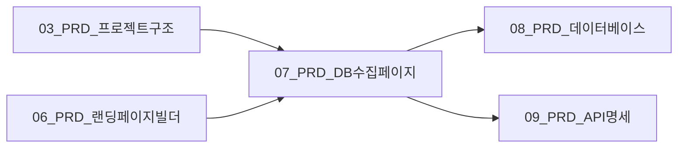

# PRD: DB 수집 페이지

## 1. 개요

### 1.1 문서 정보

| 항목 | 내용 |
|------|------|
| 문서명 | 07_PRD_DB수집페이지.md |
| 버전 | 1.0.0 |
| 작성일 | 2025-01-15 |
| 의존 문서 | 03_PRD_프로젝트구조.md, 06_PRD_랜딩페이지빌더.md |
| 참조 문서 | 기획_v2/03_기능_정의_v2.md, 기획_v1/03_DB_설계.md |

### 1.2 기능 목적

랜딩페이지에서 방문자의 연락처 정보(DB)를 수집하기 위한 구글 폼 연동 및 CTA(Call-To-Action) 버튼 삽입 시스템. MVP에서는 구글 폼을 활용하여 별도의 폼 빌더 구현 없이 빠르게 리드(Lead) 수집 기능을 제공한다.

### 1.3 핵심 기능

```yaml
기능_목록:
  DB-001: 구글 폼 URL 연결
  DB-002: CTA 버튼 삽입
  DB-003: 폼 연결 상태 검증
  DB-004: CTA 클릭 추적
  DB-005: 폼 미리보기 및 테스트
```

### 1.4 MVP 범위 및 제한사항

```yaml
MVP_범위:
  포함:
    - 구글 폼 URL 연결 및 검증
    - CTA 버튼 자동 삽입
    - 버튼 스타일 커스터마이징 (제한적)
    - 클릭 추적 (기본)
    - iframe 임베드 방식

  제외:
    - 자체 폼 빌더 (Phase 2)
    - Supabase 직접 저장 (Phase 2)
    - 조건부 폼 표시 (Phase 2)
    - 멀티스텝 폼 (Phase 2)
    - A/B 테스트 (Phase 2)
```

---

## 2. 데이터 타입 정의

### 2.1 TypeScript 타입

```typescript
// src/types/db-collection.ts

// ============================================================
// 1. 구글 폼 관련 타입
// ============================================================

export interface GoogleFormConfig {
  id: string;
  landingPageId: string;
  formUrl: string;
  formId: string | null;  // 구글 폼 고유 ID (URL에서 추출)
  embedUrl: string;       // iframe 임베드용 URL
  status: GoogleFormStatus;
  lastVerifiedAt: string | null;
  createdAt: string;
  updatedAt: string;
}

export type GoogleFormStatus =
  | 'pending'      // 아직 검증되지 않음
  | 'verified'     // URL 검증 완료
  | 'invalid'      // 잘못된 URL
  | 'unavailable'  // 폼이 비공개/삭제됨
  | 'error';       // 검증 중 오류 발생

export interface GoogleFormValidationResult {
  isValid: boolean;
  formId: string | null;
  embedUrl: string | null;
  status: GoogleFormStatus;
  error?: {
    code: string;
    message: string;
  };
}

// ============================================================
// 2. CTA 버튼 관련 타입
// ============================================================

export interface CTAButton {
  id: string;
  landingPageId: string;
  sectionId: string;        // CTA가 삽입될 섹션 ID
  type: CTAType;
  text: string;
  action: CTAAction;
  style: CTAStyle;
  position: CTAPosition;
  isVisible: boolean;
  clickCount: number;       // 클릭 추적
  createdAt: string;
  updatedAt: string;
}

export type CTAType =
  | 'primary'      // 메인 CTA (강조)
  | 'secondary'    // 서브 CTA
  | 'floating'     // 플로팅 버튼
  | 'inline';      // 본문 중간 삽입

export interface CTAAction {
  type: 'google_form' | 'external_link' | 'scroll_to' | 'popup';
  target: string;          // URL 또는 섹션 ID
  openInNewTab: boolean;
  trackingEnabled: boolean;
}

export interface CTAStyle {
  backgroundColor: string;
  textColor: string;
  borderRadius: number;
  fontSize: number;
  fontWeight: 'normal' | 'medium' | 'semibold' | 'bold';
  padding: {
    vertical: number;
    horizontal: number;
  };
  shadow: 'none' | 'sm' | 'md' | 'lg';
  hoverEffect: 'darken' | 'lighten' | 'scale' | 'none';
  animation: 'none' | 'pulse' | 'bounce' | 'shake';
}

export interface CTAPosition {
  alignment: 'left' | 'center' | 'right';
  marginTop: number;
  marginBottom: number;
}

// ============================================================
// 3. 클릭 추적 관련 타입
// ============================================================

export interface CTAClickEvent {
  id: string;
  ctaId: string;
  landingPageId: string;
  sessionId: string;        // 익명 방문자 세션
  timestamp: string;
  referrer: string | null;
  userAgent: string;
  ipHash: string;           // 해시된 IP (개인정보 보호)
  deviceType: 'desktop' | 'tablet' | 'mobile';
  country: string | null;
}

export interface CTAClickStats {
  ctaId: string;
  totalClicks: number;
  uniqueClicks: number;
  clicksByDevice: {
    desktop: number;
    tablet: number;
    mobile: number;
  };
  clicksByDate: Array<{
    date: string;
    count: number;
  }>;
  conversionRate: number | null;  // 폼 제출률 (Phase 2)
}

// ============================================================
// 4. 폼 임베드 관련 타입
// ============================================================

export type EmbedMode = 'iframe' | 'popup' | 'redirect';

export interface FormEmbedConfig {
  landingPageId: string;
  mode: EmbedMode;
  googleFormConfig: GoogleFormConfig;
  iframeSettings: {
    width: string;          // '100%' 또는 '600px'
    height: string;         // '800px'
    border: boolean;
    scrolling: boolean;
    allowFullscreen: boolean;
  };
  popupSettings: {
    width: number;
    height: number;
    triggerText: string;
    closeOnSubmit: boolean;
  };
}

// ============================================================
// 5. 섹션 CTA 매핑 타입
// ============================================================

export interface SectionCTAMapping {
  sectionType: string;
  ctaType: CTAType;
  defaultText: string;
  position: CTAPosition;
  style: Partial<CTAStyle>;
}

export const DEFAULT_CTA_MAPPINGS: SectionCTAMapping[] = [
  {
    sectionType: 'hero',
    ctaType: 'primary',
    defaultText: '무료 상담 신청하기',
    position: { alignment: 'center', marginTop: 24, marginBottom: 0 },
    style: { fontSize: 18, fontWeight: 'bold', shadow: 'lg', animation: 'pulse' },
  },
  {
    sectionType: 'offer',
    ctaType: 'primary',
    defaultText: '지금 시작하기',
    position: { alignment: 'center', marginTop: 32, marginBottom: 16 },
    style: { fontSize: 20, fontWeight: 'bold', shadow: 'lg' },
  },
  {
    sectionType: 'cta',
    ctaType: 'primary',
    defaultText: '무료로 시작하기',
    position: { alignment: 'center', marginTop: 24, marginBottom: 24 },
    style: { fontSize: 22, fontWeight: 'bold', shadow: 'lg', animation: 'bounce' },
  },
  {
    sectionType: 'testimonials',
    ctaType: 'secondary',
    defaultText: '나도 경험해보기',
    position: { alignment: 'center', marginTop: 32, marginBottom: 0 },
    style: { fontSize: 16, fontWeight: 'semibold', shadow: 'md' },
  },
];
```

### 2.2 Zod 스키마

```typescript
// src/lib/validations/db-collection.ts

import { z } from 'zod';

// ============================================================
// 1. 구글 폼 URL 검증 스키마
// ============================================================

// 구글 폼 URL 패턴
const GOOGLE_FORM_URL_PATTERN = /^https:\/\/docs\.google\.com\/forms\/d\/e\/([a-zA-Z0-9_-]+)\/viewform/;
const GOOGLE_FORM_SHORT_PATTERN = /^https:\/\/forms\.gle\/([a-zA-Z0-9]+)$/;

export const googleFormUrlSchema = z.string()
  .url('올바른 URL 형식이 아닙니다.')
  .refine(
    (url) => {
      return GOOGLE_FORM_URL_PATTERN.test(url) || GOOGLE_FORM_SHORT_PATTERN.test(url);
    },
    {
      message: 'ERR_DB_4001: 올바른 구글 폼 URL이 아닙니다. (https://docs.google.com/forms/... 형식)',
    }
  );

export const connectGoogleFormSchema = z.object({
  landingPageId: z.string().uuid('유효하지 않은 랜딩페이지 ID입니다.'),
  formUrl: googleFormUrlSchema,
});

export type ConnectGoogleFormInput = z.infer<typeof connectGoogleFormSchema>;

// ============================================================
// 2. CTA 버튼 설정 스키마
// ============================================================

export const ctaStyleSchema = z.object({
  backgroundColor: z.string().regex(/^#([A-Fa-f0-9]{6}|[A-Fa-f0-9]{3})$/, '유효한 HEX 색상 코드가 아닙니다.'),
  textColor: z.string().regex(/^#([A-Fa-f0-9]{6}|[A-Fa-f0-9]{3})$/, '유효한 HEX 색상 코드가 아닙니다.'),
  borderRadius: z.number().min(0).max(50),
  fontSize: z.number().min(12).max(32),
  fontWeight: z.enum(['normal', 'medium', 'semibold', 'bold']),
  padding: z.object({
    vertical: z.number().min(8).max(32),
    horizontal: z.number().min(16).max(64),
  }),
  shadow: z.enum(['none', 'sm', 'md', 'lg']),
  hoverEffect: z.enum(['darken', 'lighten', 'scale', 'none']),
  animation: z.enum(['none', 'pulse', 'bounce', 'shake']),
});

export const ctaActionSchema = z.object({
  type: z.enum(['google_form', 'external_link', 'scroll_to', 'popup']),
  target: z.string().min(1, 'CTA 대상이 지정되지 않았습니다.'),
  openInNewTab: z.boolean().default(false),
  trackingEnabled: z.boolean().default(true),
});

export const ctaPositionSchema = z.object({
  alignment: z.enum(['left', 'center', 'right']),
  marginTop: z.number().min(0).max(100),
  marginBottom: z.number().min(0).max(100),
});

export const createCTAButtonSchema = z.object({
  landingPageId: z.string().uuid(),
  sectionId: z.string().uuid(),
  type: z.enum(['primary', 'secondary', 'floating', 'inline']),
  text: z.string()
    .min(2, 'CTA 텍스트는 최소 2자 이상이어야 합니다.')
    .max(50, 'CTA 텍스트는 최대 50자까지 가능합니다.'),
  action: ctaActionSchema,
  style: ctaStyleSchema.optional(),
  position: ctaPositionSchema.optional(),
});

export type CreateCTAButtonInput = z.infer<typeof createCTAButtonSchema>;

export const updateCTAButtonSchema = createCTAButtonSchema.partial().extend({
  ctaId: z.string().uuid(),
});

export type UpdateCTAButtonInput = z.infer<typeof updateCTAButtonSchema>;

// ============================================================
// 3. 폼 임베드 설정 스키마
// ============================================================

export const iframeSettingsSchema = z.object({
  width: z.string().regex(/^(\d+px|100%)$/, '너비는 "100%" 또는 "600px" 형식이어야 합니다.'),
  height: z.string().regex(/^\d+px$/, '높이는 "800px" 형식이어야 합니다.'),
  border: z.boolean().default(false),
  scrolling: z.boolean().default(true),
  allowFullscreen: z.boolean().default(false),
});

export const popupSettingsSchema = z.object({
  width: z.number().min(400).max(1200),
  height: z.number().min(400).max(900),
  triggerText: z.string().max(100),
  closeOnSubmit: z.boolean().default(true),
});

export const formEmbedConfigSchema = z.object({
  landingPageId: z.string().uuid(),
  mode: z.enum(['iframe', 'popup', 'redirect']),
  iframeSettings: iframeSettingsSchema.optional(),
  popupSettings: popupSettingsSchema.optional(),
});

export type FormEmbedConfigInput = z.infer<typeof formEmbedConfigSchema>;

// ============================================================
// 4. 클릭 추적 스키마
// ============================================================

export const recordClickSchema = z.object({
  ctaId: z.string().uuid(),
  landingPageId: z.string().uuid(),
  sessionId: z.string().uuid(),
  referrer: z.string().url().nullable().optional(),
  userAgent: z.string().max(500),
});

export type RecordClickInput = z.infer<typeof recordClickSchema>;
```

---

## 3. 구글 폼 연동 시스템 (DB-001)

### 3.1 URL 검증 및 파싱 유틸리티

```typescript
// src/lib/utils/google-form.ts

import { GoogleFormValidationResult } from '@/types/db-collection';

// ============================================================
// 구글 폼 URL 패턴 정의
// ============================================================

const PATTERNS = {
  // 표준 구글 폼 URL: https://docs.google.com/forms/d/e/{FORM_ID}/viewform
  STANDARD: /^https:\/\/docs\.google\.com\/forms\/d\/e\/([a-zA-Z0-9_-]+)\/viewform/,

  // 편집 URL (변환 필요): https://docs.google.com/forms/d/{FORM_ID}/edit
  EDIT: /^https:\/\/docs\.google\.com\/forms\/d\/([a-zA-Z0-9_-]+)\/edit/,

  // 단축 URL: https://forms.gle/{SHORT_ID}
  SHORT: /^https:\/\/forms\.gle\/([a-zA-Z0-9]+)$/,

  // 공유 URL: https://docs.google.com/forms/d/{FORM_ID}/viewform?usp=sharing
  SHARING: /^https:\/\/docs\.google\.com\/forms\/d\/([a-zA-Z0-9_-]+)\/viewform/,
};

// ============================================================
// URL 파싱 함수
// ============================================================

/**
 * 구글 폼 URL에서 폼 ID 추출
 */
export function extractFormId(url: string): string | null {
  // 표준 URL 체크
  let match = url.match(PATTERNS.STANDARD);
  if (match) return match[1];

  // 편집 URL 체크
  match = url.match(PATTERNS.EDIT);
  if (match) return match[1];

  // 공유 URL 체크
  match = url.match(PATTERNS.SHARING);
  if (match) return match[1];

  // 단축 URL은 별도 처리 필요 (리다이렉트 따라가야 함)
  if (PATTERNS.SHORT.test(url)) {
    return null; // resolveShortUrl 함수 호출 필요
  }

  return null;
}

/**
 * 폼 ID로 임베드 URL 생성
 */
export function generateEmbedUrl(formId: string): string {
  return `https://docs.google.com/forms/d/e/${formId}/viewform?embedded=true`;
}

/**
 * 편집 URL을 뷰 URL로 변환
 */
export function convertEditToViewUrl(url: string): string | null {
  const match = url.match(PATTERNS.EDIT);
  if (!match) return null;

  const formId = match[1];
  return `https://docs.google.com/forms/d/e/${formId}/viewform`;
}

// ============================================================
// URL 검증 함수 (클라이언트 + 서버)
// ============================================================

/**
 * 구글 폼 URL 검증 (클라이언트 측 - 형식만 체크)
 */
export function validateGoogleFormUrlFormat(url: string): boolean {
  return (
    PATTERNS.STANDARD.test(url) ||
    PATTERNS.EDIT.test(url) ||
    PATTERNS.SHORT.test(url) ||
    PATTERNS.SHARING.test(url)
  );
}

/**
 * 구글 폼 URL 정규화 (일관된 형식으로 변환)
 */
export function normalizeGoogleFormUrl(url: string): string {
  // URL 파라미터 제거
  const urlObj = new URL(url);
  const cleanUrl = `${urlObj.origin}${urlObj.pathname}`;

  // 편집 URL인 경우 뷰 URL로 변환
  if (PATTERNS.EDIT.test(cleanUrl)) {
    return convertEditToViewUrl(cleanUrl) || url;
  }

  return cleanUrl;
}
```

### 3.2 서버 측 폼 검증 API

```typescript
// src/app/api/db-collection/validate-form/route.ts

import { NextRequest, NextResponse } from 'next/server';
import { createClient } from '@/lib/supabase/server';
import { connectGoogleFormSchema } from '@/lib/validations/db-collection';
import { extractFormId, generateEmbedUrl, normalizeGoogleFormUrl } from '@/lib/utils/google-form';
import { GoogleFormValidationResult, GoogleFormStatus } from '@/types/db-collection';
import { withAuth, withRateLimit } from '@/lib/middleware';
import { logAudit } from '@/lib/audit';

// ============================================================
// 구글 폼 URL 검증 API
// ============================================================

async function handler(req: NextRequest) {
  const supabase = createClient();

  // 요청 바디 파싱 및 검증
  const body = await req.json();
  const validation = connectGoogleFormSchema.safeParse(body);

  if (!validation.success) {
    return NextResponse.json(
      {
        error: 'ERR_DB_4002',
        message: '입력값이 유효하지 않습니다.',
        details: validation.error.flatten().fieldErrors,
      },
      { status: 400 }
    );
  }

  const { landingPageId, formUrl } = validation.data;

  // 세션에서 사용자 ID 추출
  const { data: { user } } = await supabase.auth.getUser();
  if (!user) {
    return NextResponse.json(
      { error: 'ERR_AUTH_1007', message: '인증이 필요합니다.' },
      { status: 401 }
    );
  }

  // 랜딩페이지 소유권 확인
  const { data: landingPage, error: lpError } = await supabase
    .from('landing_pages')
    .select('id, user_id')
    .eq('id', landingPageId)
    .is('deleted_at', null)
    .single();

  if (lpError || !landingPage) {
    return NextResponse.json(
      { error: 'ERR_DB_4003', message: '랜딩페이지를 찾을 수 없습니다.' },
      { status: 404 }
    );
  }

  if (landingPage.user_id !== user.id) {
    return NextResponse.json(
      { error: 'ERR_DB_4004', message: '접근 권한이 없습니다.' },
      { status: 403 }
    );
  }

  // URL 정규화
  const normalizedUrl = normalizeGoogleFormUrl(formUrl);

  // 폼 ID 추출
  const formId = extractFormId(normalizedUrl);

  if (!formId) {
    return NextResponse.json({
      isValid: false,
      formId: null,
      embedUrl: null,
      status: 'invalid' as GoogleFormStatus,
      error: {
        code: 'ERR_DB_4001',
        message: '올바른 구글 폼 URL이 아닙니다.',
      },
    } satisfies GoogleFormValidationResult);
  }

  // 임베드 URL 생성
  const embedUrl = generateEmbedUrl(formId);

  // 실제 폼 접근 가능 여부 확인 (HEAD 요청)
  let status: GoogleFormStatus = 'pending';

  try {
    const checkResponse = await fetch(embedUrl, {
      method: 'HEAD',
      headers: {
        'User-Agent': 'Mozilla/5.0 (compatible; MagneticSalesBot/1.0)',
      },
    });

    if (checkResponse.ok) {
      status = 'verified';
    } else if (checkResponse.status === 404) {
      status = 'unavailable';
    } else {
      status = 'error';
    }
  } catch (error) {
    console.error('Google Form validation error:', error);
    status = 'error';
  }

  // 검증 결과 저장
  if (status === 'verified') {
    const { error: upsertError } = await supabase
      .from('google_form_configs')
      .upsert({
        landing_page_id: landingPageId,
        form_url: normalizedUrl,
        form_id: formId,
        embed_url: embedUrl,
        status,
        last_verified_at: new Date().toISOString(),
        updated_at: new Date().toISOString(),
      }, {
        onConflict: 'landing_page_id',
      });

    if (upsertError) {
      console.error('Failed to save form config:', upsertError);
    }

    // 감사 로그
    await logAudit({
      userId: user.id,
      action: 'google_form_connected',
      details: {
        landingPageId,
        formId,
        formUrl: normalizedUrl,
      },
    });
  }

  const result: GoogleFormValidationResult = {
    isValid: status === 'verified',
    formId,
    embedUrl: status === 'verified' ? embedUrl : null,
    status,
    error: status !== 'verified' ? {
      code: status === 'unavailable' ? 'ERR_DB_4005' : 'ERR_DB_4006',
      message: status === 'unavailable'
        ? '폼이 비공개이거나 삭제되었습니다.'
        : '폼 검증 중 오류가 발생했습니다.',
    } : undefined,
  };

  return NextResponse.json(result);
}

export const POST = withAuth(withRateLimit(handler, { limit: 20, window: 60 }));
```

### 3.3 구글 폼 연결 상태 조회 API

```typescript
// src/app/api/db-collection/form-config/[landingPageId]/route.ts

import { NextRequest, NextResponse } from 'next/server';
import { createClient } from '@/lib/supabase/server';
import { withAuth } from '@/lib/middleware';
import { GoogleFormConfig } from '@/types/db-collection';

// ============================================================
// 구글 폼 설정 조회 API
// ============================================================

async function handler(
  req: NextRequest,
  { params }: { params: { landingPageId: string } }
) {
  const supabase = createClient();
  const { landingPageId } = params;

  // UUID 형식 검증
  const UUID_REGEX = /^[0-9a-f]{8}-[0-9a-f]{4}-[0-9a-f]{4}-[0-9a-f]{4}-[0-9a-f]{12}$/i;
  if (!UUID_REGEX.test(landingPageId)) {
    return NextResponse.json(
      { error: 'ERR_DB_4007', message: '유효하지 않은 ID 형식입니다.' },
      { status: 400 }
    );
  }

  // 세션 확인
  const { data: { user } } = await supabase.auth.getUser();
  if (!user) {
    return NextResponse.json(
      { error: 'ERR_AUTH_1007', message: '인증이 필요합니다.' },
      { status: 401 }
    );
  }

  // 랜딩페이지 소유권 확인
  const { data: landingPage, error: lpError } = await supabase
    .from('landing_pages')
    .select('id, user_id')
    .eq('id', landingPageId)
    .is('deleted_at', null)
    .single();

  if (lpError || !landingPage || landingPage.user_id !== user.id) {
    return NextResponse.json(
      { error: 'ERR_DB_4003', message: '랜딩페이지를 찾을 수 없습니다.' },
      { status: 404 }
    );
  }

  // 폼 설정 조회
  const { data: formConfig, error: fcError } = await supabase
    .from('google_form_configs')
    .select('*')
    .eq('landing_page_id', landingPageId)
    .single();

  if (fcError && fcError.code !== 'PGRST116') { // PGRST116 = no rows
    console.error('Form config query error:', fcError);
    return NextResponse.json(
      { error: 'ERR_SYS_9999', message: '서버 오류가 발생했습니다.' },
      { status: 500 }
    );
  }

  if (!formConfig) {
    return NextResponse.json(
      {
        connected: false,
        config: null,
        message: '연결된 구글 폼이 없습니다.',
      }
    );
  }

  // snake_case를 camelCase로 변환
  const config: GoogleFormConfig = {
    id: formConfig.id,
    landingPageId: formConfig.landing_page_id,
    formUrl: formConfig.form_url,
    formId: formConfig.form_id,
    embedUrl: formConfig.embed_url,
    status: formConfig.status,
    lastVerifiedAt: formConfig.last_verified_at,
    createdAt: formConfig.created_at,
    updatedAt: formConfig.updated_at,
  };

  return NextResponse.json({
    connected: true,
    config,
  });
}

export const GET = withAuth(handler);
```

### 3.4 구글 폼 연결 해제 API

```typescript
// src/app/api/db-collection/disconnect-form/route.ts

import { NextRequest, NextResponse } from 'next/server';
import { createClient } from '@/lib/supabase/server';
import { withAuth, withRateLimit } from '@/lib/middleware';
import { logAudit } from '@/lib/audit';
import { z } from 'zod';

const disconnectSchema = z.object({
  landingPageId: z.string().uuid(),
});

async function handler(req: NextRequest) {
  const supabase = createClient();

  const body = await req.json();
  const validation = disconnectSchema.safeParse(body);

  if (!validation.success) {
    return NextResponse.json(
      { error: 'ERR_DB_4002', message: '입력값이 유효하지 않습니다.' },
      { status: 400 }
    );
  }

  const { landingPageId } = validation.data;

  const { data: { user } } = await supabase.auth.getUser();
  if (!user) {
    return NextResponse.json(
      { error: 'ERR_AUTH_1007', message: '인증이 필요합니다.' },
      { status: 401 }
    );
  }

  // 랜딩페이지 소유권 확인
  const { data: landingPage } = await supabase
    .from('landing_pages')
    .select('id, user_id')
    .eq('id', landingPageId)
    .is('deleted_at', null)
    .single();

  if (!landingPage || landingPage.user_id !== user.id) {
    return NextResponse.json(
      { error: 'ERR_DB_4003', message: '랜딩페이지를 찾을 수 없습니다.' },
      { status: 404 }
    );
  }

  // 폼 설정 삭제
  const { error: deleteError } = await supabase
    .from('google_form_configs')
    .delete()
    .eq('landing_page_id', landingPageId);

  if (deleteError) {
    console.error('Failed to disconnect form:', deleteError);
    return NextResponse.json(
      { error: 'ERR_SYS_9999', message: '서버 오류가 발생했습니다.' },
      { status: 500 }
    );
  }

  // 연결된 CTA 버튼의 action.type도 업데이트 필요
  await supabase
    .from('cta_buttons')
    .update({
      action: {
        type: 'external_link',
        target: '',
        openInNewTab: true,
        trackingEnabled: true,
      },
      updated_at: new Date().toISOString(),
    })
    .eq('landing_page_id', landingPageId)
    .contains('action', { type: 'google_form' });

  // 감사 로그
  await logAudit({
    userId: user.id,
    action: 'google_form_disconnected',
    details: { landingPageId },
  });

  return NextResponse.json({
    success: true,
    message: '구글 폼 연결이 해제되었습니다.',
  });
}

export const POST = withAuth(withRateLimit(handler, { limit: 10, window: 60 }));
```

---

## 4. CTA 버튼 시스템 (DB-002)

### 4.1 CTA 버튼 CRUD API

```typescript
// src/app/api/db-collection/cta/route.ts

import { NextRequest, NextResponse } from 'next/server';
import { createClient } from '@/lib/supabase/server';
import { createCTAButtonSchema, updateCTAButtonSchema } from '@/lib/validations/db-collection';
import { withAuth, withRateLimit } from '@/lib/middleware';
import { CTAButton, CTAStyle, CTAPosition } from '@/types/db-collection';
import { logAudit } from '@/lib/audit';

// ============================================================
// 기본 스타일 상수
// ============================================================

const DEFAULT_CTA_STYLE: CTAStyle = {
  backgroundColor: '#2563eb',
  textColor: '#ffffff',
  borderRadius: 8,
  fontSize: 16,
  fontWeight: 'semibold',
  padding: { vertical: 16, horizontal: 32 },
  shadow: 'md',
  hoverEffect: 'darken',
  animation: 'none',
};

const DEFAULT_CTA_POSITION: CTAPosition = {
  alignment: 'center',
  marginTop: 24,
  marginBottom: 24,
};

// ============================================================
// CTA 버튼 생성 API
// ============================================================

async function createHandler(req: NextRequest) {
  const supabase = createClient();

  const body = await req.json();
  const validation = createCTAButtonSchema.safeParse(body);

  if (!validation.success) {
    return NextResponse.json(
      {
        error: 'ERR_DB_4002',
        message: '입력값이 유효하지 않습니다.',
        details: validation.error.flatten().fieldErrors,
      },
      { status: 400 }
    );
  }

  const { landingPageId, sectionId, type, text, action, style, position } = validation.data;

  const { data: { user } } = await supabase.auth.getUser();
  if (!user) {
    return NextResponse.json(
      { error: 'ERR_AUTH_1007', message: '인증이 필요합니다.' },
      { status: 401 }
    );
  }

  // 랜딩페이지 소유권 확인
  const { data: landingPage } = await supabase
    .from('landing_pages')
    .select('id, user_id')
    .eq('id', landingPageId)
    .is('deleted_at', null)
    .single();

  if (!landingPage || landingPage.user_id !== user.id) {
    return NextResponse.json(
      { error: 'ERR_DB_4003', message: '랜딩페이지를 찾을 수 없습니다.' },
      { status: 404 }
    );
  }

  // CTA 버튼 생성
  const { data: ctaButton, error: createError } = await supabase
    .from('cta_buttons')
    .insert({
      landing_page_id: landingPageId,
      section_id: sectionId,
      type,
      text,
      action,
      style: style || DEFAULT_CTA_STYLE,
      position: position || DEFAULT_CTA_POSITION,
      is_visible: true,
      click_count: 0,
    })
    .select()
    .single();

  if (createError) {
    console.error('Failed to create CTA button:', createError);
    return NextResponse.json(
      { error: 'ERR_SYS_9999', message: '서버 오류가 발생했습니다.' },
      { status: 500 }
    );
  }

  // 감사 로그
  await logAudit({
    userId: user.id,
    action: 'cta_button_created',
    details: { landingPageId, ctaId: ctaButton.id },
  });

  return NextResponse.json({
    success: true,
    cta: ctaButton,
  }, { status: 201 });
}

// ============================================================
// CTA 버튼 목록 조회 API
// ============================================================

async function listHandler(req: NextRequest) {
  const supabase = createClient();
  const { searchParams } = new URL(req.url);
  const landingPageId = searchParams.get('landingPageId');

  if (!landingPageId) {
    return NextResponse.json(
      { error: 'ERR_DB_4007', message: 'landingPageId가 필요합니다.' },
      { status: 400 }
    );
  }

  const { data: { user } } = await supabase.auth.getUser();
  if (!user) {
    return NextResponse.json(
      { error: 'ERR_AUTH_1007', message: '인증이 필요합니다.' },
      { status: 401 }
    );
  }

  // 랜딩페이지 소유권 확인
  const { data: landingPage } = await supabase
    .from('landing_pages')
    .select('id, user_id')
    .eq('id', landingPageId)
    .is('deleted_at', null)
    .single();

  if (!landingPage || landingPage.user_id !== user.id) {
    return NextResponse.json(
      { error: 'ERR_DB_4003', message: '랜딩페이지를 찾을 수 없습니다.' },
      { status: 404 }
    );
  }

  // CTA 버튼 목록 조회
  const { data: ctaButtons, error } = await supabase
    .from('cta_buttons')
    .select('*')
    .eq('landing_page_id', landingPageId)
    .order('created_at', { ascending: true });

  if (error) {
    console.error('Failed to fetch CTA buttons:', error);
    return NextResponse.json(
      { error: 'ERR_SYS_9999', message: '서버 오류가 발생했습니다.' },
      { status: 500 }
    );
  }

  return NextResponse.json({
    buttons: ctaButtons || [],
    total: ctaButtons?.length || 0,
  });
}

export const POST = withAuth(withRateLimit(createHandler, { limit: 30, window: 60 }));
export const GET = withAuth(listHandler);
```

### 4.2 CTA 버튼 수정/삭제 API

```typescript
// src/app/api/db-collection/cta/[ctaId]/route.ts

import { NextRequest, NextResponse } from 'next/server';
import { createClient } from '@/lib/supabase/server';
import { updateCTAButtonSchema } from '@/lib/validations/db-collection';
import { withAuth, withRateLimit } from '@/lib/middleware';
import { logAudit } from '@/lib/audit';

// ============================================================
// CTA 버튼 수정 API
// ============================================================

async function updateHandler(
  req: NextRequest,
  { params }: { params: { ctaId: string } }
) {
  const supabase = createClient();
  const { ctaId } = params;

  const body = await req.json();
  const validation = updateCTAButtonSchema.safeParse({ ...body, ctaId });

  if (!validation.success) {
    return NextResponse.json(
      {
        error: 'ERR_DB_4002',
        message: '입력값이 유효하지 않습니다.',
        details: validation.error.flatten().fieldErrors,
      },
      { status: 400 }
    );
  }

  const { data: { user } } = await supabase.auth.getUser();
  if (!user) {
    return NextResponse.json(
      { error: 'ERR_AUTH_1007', message: '인증이 필요합니다.' },
      { status: 401 }
    );
  }

  // CTA 버튼 및 소유권 확인
  const { data: ctaButton } = await supabase
    .from('cta_buttons')
    .select(`
      id,
      landing_page_id,
      landing_pages!inner(user_id)
    `)
    .eq('id', ctaId)
    .single();

  if (!ctaButton || (ctaButton.landing_pages as any).user_id !== user.id) {
    return NextResponse.json(
      { error: 'ERR_DB_4008', message: 'CTA 버튼을 찾을 수 없습니다.' },
      { status: 404 }
    );
  }

  // 업데이트할 필드만 추출
  const { ctaId: _, landingPageId, sectionId, ...updateFields } = validation.data;

  // CTA 버튼 수정
  const { data: updatedCta, error: updateError } = await supabase
    .from('cta_buttons')
    .update({
      ...updateFields,
      updated_at: new Date().toISOString(),
    })
    .eq('id', ctaId)
    .select()
    .single();

  if (updateError) {
    console.error('Failed to update CTA button:', updateError);
    return NextResponse.json(
      { error: 'ERR_SYS_9999', message: '서버 오류가 발생했습니다.' },
      { status: 500 }
    );
  }

  // 감사 로그
  await logAudit({
    userId: user.id,
    action: 'cta_button_updated',
    details: { ctaId, changes: Object.keys(updateFields) },
  });

  return NextResponse.json({
    success: true,
    cta: updatedCta,
  });
}

// ============================================================
// CTA 버튼 삭제 API
// ============================================================

async function deleteHandler(
  req: NextRequest,
  { params }: { params: { ctaId: string } }
) {
  const supabase = createClient();
  const { ctaId } = params;

  const { data: { user } } = await supabase.auth.getUser();
  if (!user) {
    return NextResponse.json(
      { error: 'ERR_AUTH_1007', message: '인증이 필요합니다.' },
      { status: 401 }
    );
  }

  // CTA 버튼 및 소유권 확인
  const { data: ctaButton } = await supabase
    .from('cta_buttons')
    .select(`
      id,
      landing_page_id,
      landing_pages!inner(user_id)
    `)
    .eq('id', ctaId)
    .single();

  if (!ctaButton || (ctaButton.landing_pages as any).user_id !== user.id) {
    return NextResponse.json(
      { error: 'ERR_DB_4008', message: 'CTA 버튼을 찾을 수 없습니다.' },
      { status: 404 }
    );
  }

  // CTA 버튼 삭제
  const { error: deleteError } = await supabase
    .from('cta_buttons')
    .delete()
    .eq('id', ctaId);

  if (deleteError) {
    console.error('Failed to delete CTA button:', deleteError);
    return NextResponse.json(
      { error: 'ERR_SYS_9999', message: '서버 오류가 발생했습니다.' },
      { status: 500 }
    );
  }

  // 감사 로그
  await logAudit({
    userId: user.id,
    action: 'cta_button_deleted',
    details: { ctaId, landingPageId: ctaButton.landing_page_id },
  });

  return NextResponse.json({
    success: true,
    message: 'CTA 버튼이 삭제되었습니다.',
  });
}

export const PATCH = withAuth(withRateLimit(updateHandler, { limit: 30, window: 60 }));
export const DELETE = withAuth(withRateLimit(deleteHandler, { limit: 10, window: 60 }));
```

---

## 5. 클릭 추적 시스템 (DB-004)

### 5.1 클릭 이벤트 기록 API

```typescript
// src/app/api/db-collection/track-click/route.ts

import { NextRequest, NextResponse } from 'next/server';
import { createClient } from '@/lib/supabase/server';
import { recordClickSchema } from '@/lib/validations/db-collection';
import { withRateLimit } from '@/lib/middleware';
import { hashIP } from '@/lib/utils/privacy';
import { getDeviceType } from '@/lib/utils/device';

// ============================================================
// CTA 클릭 추적 API (인증 불필요 - 공개 페이지에서 호출)
// ============================================================

async function handler(req: NextRequest) {
  const supabase = createClient();

  const body = await req.json();
  const validation = recordClickSchema.safeParse(body);

  if (!validation.success) {
    // 클릭 추적 실패는 조용히 처리 (사용자 경험 영향 최소화)
    return NextResponse.json({ success: false }, { status: 200 });
  }

  const { ctaId, landingPageId, sessionId, referrer, userAgent } = validation.data;

  // IP 주소 추출 및 해시
  const forwardedFor = req.headers.get('x-forwarded-for');
  const realIP = req.headers.get('x-real-ip');
  const ip = forwardedFor?.split(',')[0] || realIP || '0.0.0.0';
  const ipHash = hashIP(ip);

  // 디바이스 타입 추출
  const deviceType = getDeviceType(userAgent);

  // CTA 버튼 존재 및 배포 상태 확인
  const { data: ctaButton } = await supabase
    .from('cta_buttons')
    .select(`
      id,
      click_count,
      landing_pages!inner(status)
    `)
    .eq('id', ctaId)
    .eq('landing_pages.status', 'published')
    .single();

  if (!ctaButton) {
    // 존재하지 않거나 비공개 페이지 - 조용히 무시
    return NextResponse.json({ success: false }, { status: 200 });
  }

  // 클릭 이벤트 기록
  const { error: insertError } = await supabase
    .from('cta_click_events')
    .insert({
      cta_id: ctaId,
      landing_page_id: landingPageId,
      session_id: sessionId,
      referrer,
      user_agent: userAgent.substring(0, 500), // 최대 500자
      ip_hash: ipHash,
      device_type: deviceType,
    });

  if (insertError) {
    console.error('Failed to record click event:', insertError);
    return NextResponse.json({ success: false }, { status: 200 });
  }

  // 클릭 카운트 증가 (비동기, 에러 무시)
  supabase
    .from('cta_buttons')
    .update({
      click_count: ctaButton.click_count + 1,
      updated_at: new Date().toISOString(),
    })
    .eq('id', ctaId)
    .then(() => {})
    .catch(console.error);

  return NextResponse.json({ success: true });
}

// Rate Limit: 동일 IP에서 초당 5회까지
export const POST = withRateLimit(handler, { limit: 300, window: 60 });
```

### 5.2 클릭 통계 조회 API

```typescript
// src/app/api/db-collection/cta/[ctaId]/stats/route.ts

import { NextRequest, NextResponse } from 'next/server';
import { createClient } from '@/lib/supabase/server';
import { withAuth } from '@/lib/middleware';
import { CTAClickStats } from '@/types/db-collection';

async function handler(
  req: NextRequest,
  { params }: { params: { ctaId: string } }
) {
  const supabase = createClient();
  const { ctaId } = params;
  const { searchParams } = new URL(req.url);

  const period = searchParams.get('period') || '30d';

  const { data: { user } } = await supabase.auth.getUser();
  if (!user) {
    return NextResponse.json(
      { error: 'ERR_AUTH_1007', message: '인증이 필요합니다.' },
      { status: 401 }
    );
  }

  // CTA 버튼 및 소유권 확인
  const { data: ctaButton } = await supabase
    .from('cta_buttons')
    .select(`
      id,
      click_count,
      landing_page_id,
      landing_pages!inner(user_id)
    `)
    .eq('id', ctaId)
    .single();

  if (!ctaButton || (ctaButton.landing_pages as any).user_id !== user.id) {
    return NextResponse.json(
      { error: 'ERR_DB_4008', message: 'CTA 버튼을 찾을 수 없습니다.' },
      { status: 404 }
    );
  }

  // 기간 계산
  const days = period === '7d' ? 7 : period === '90d' ? 90 : 30;
  const startDate = new Date();
  startDate.setDate(startDate.getDate() - days);

  // 총 클릭 수
  const { count: totalClicks } = await supabase
    .from('cta_click_events')
    .select('*', { count: 'exact', head: true })
    .eq('cta_id', ctaId)
    .gte('timestamp', startDate.toISOString());

  // 유니크 클릭 수 (ip_hash 기준)
  const { data: uniqueData } = await supabase
    .rpc('count_unique_clicks', {
      p_cta_id: ctaId,
      p_start_date: startDate.toISOString(),
    });

  const uniqueClicks = uniqueData?.[0]?.count || 0;

  // 디바이스별 클릭
  const { data: deviceData } = await supabase
    .from('cta_click_events')
    .select('device_type')
    .eq('cta_id', ctaId)
    .gte('timestamp', startDate.toISOString());

  const clicksByDevice = {
    desktop: deviceData?.filter(d => d.device_type === 'desktop').length || 0,
    tablet: deviceData?.filter(d => d.device_type === 'tablet').length || 0,
    mobile: deviceData?.filter(d => d.device_type === 'mobile').length || 0,
  };

  // 날짜별 클릭 (최근 30일)
  const { data: dailyData } = await supabase
    .rpc('count_clicks_by_date', {
      p_cta_id: ctaId,
      p_start_date: startDate.toISOString(),
    });

  const clicksByDate = dailyData?.map((row: { date: string; count: number }) => ({
    date: row.date,
    count: row.count,
  })) || [];

  const stats: CTAClickStats = {
    ctaId,
    totalClicks: totalClicks || 0,
    uniqueClicks,
    clicksByDevice,
    clicksByDate,
    conversionRate: null, // Phase 2에서 구현
  };

  return NextResponse.json({ stats });
}

export const GET = withAuth(handler);
```

### 5.3 IP 해시 및 디바이스 감지 유틸리티

```typescript
// src/lib/utils/privacy.ts

import crypto from 'crypto';

/**
 * IP 주소를 SHA-256으로 해시 (개인정보 보호)
 * 일별 salt를 사용하여 역추적 방지
 */
export function hashIP(ip: string): string {
  const dailySalt = new Date().toISOString().split('T')[0]; // YYYY-MM-DD
  const secret = process.env.IP_HASH_SECRET || 'default-secret';

  return crypto
    .createHmac('sha256', secret)
    .update(`${ip}:${dailySalt}`)
    .digest('hex')
    .substring(0, 32); // 32자로 truncate
}

// src/lib/utils/device.ts

/**
 * User-Agent 문자열에서 디바이스 타입 추출
 */
export function getDeviceType(userAgent: string): 'desktop' | 'tablet' | 'mobile' {
  const ua = userAgent.toLowerCase();

  // 태블릿 체크 (모바일보다 먼저)
  if (
    /ipad|tablet|playbook|silk/i.test(ua) ||
    (/android/i.test(ua) && !/mobile/i.test(ua))
  ) {
    return 'tablet';
  }

  // 모바일 체크
  if (
    /mobile|iphone|ipod|android|blackberry|opera mini|iemobile|wpdesktop/i.test(ua)
  ) {
    return 'mobile';
  }

  return 'desktop';
}
```

---

## 6. 폼 임베드 컴포넌트

### 6.1 구글 폼 임베드 컴포넌트

```typescript
// src/components/db-collection/GoogleFormEmbed.tsx

'use client';

import React, { useState, useEffect, useRef } from 'react';
import { GoogleFormConfig, EmbedMode } from '@/types/db-collection';
import { cn } from '@/lib/utils';

// ============================================================
// Props 정의
// ============================================================

interface GoogleFormEmbedProps {
  config: GoogleFormConfig;
  mode: EmbedMode;
  className?: string;
  onLoad?: () => void;
  onError?: (error: Error) => void;
  iframeSettings?: {
    width?: string;
    height?: string;
    border?: boolean;
    scrolling?: boolean;
  };
}

// ============================================================
// 컴포넌트 구현
// ============================================================

export function GoogleFormEmbed({
  config,
  mode,
  className,
  onLoad,
  onError,
  iframeSettings = {},
}: GoogleFormEmbedProps) {
  const [isLoading, setIsLoading] = useState(true);
  const [hasError, setHasError] = useState(false);
  const iframeRef = useRef<HTMLIFrameElement>(null);

  const {
    width = '100%',
    height = '800px',
    border = false,
    scrolling = true,
  } = iframeSettings;

  // ============================================================
  // 이벤트 핸들러
  // ============================================================

  const handleLoad = () => {
    setIsLoading(false);
    onLoad?.();
  };

  const handleError = () => {
    setIsLoading(false);
    setHasError(true);
    onError?.(new Error('Failed to load Google Form'));
  };

  // ============================================================
  // 렌더링
  // ============================================================

  if (config.status !== 'verified' || !config.embedUrl) {
    return (
      <div className={cn(
        'flex items-center justify-center bg-gray-100 rounded-lg p-8',
        className
      )}>
        <p className="text-gray-500">
          {config.status === 'invalid' && '유효하지 않은 폼 URL입니다.'}
          {config.status === 'unavailable' && '폼을 불러올 수 없습니다.'}
          {config.status === 'pending' && '폼 검증 중...'}
          {config.status === 'error' && '폼 로딩 중 오류가 발생했습니다.'}
        </p>
      </div>
    );
  }

  if (mode === 'redirect') {
    return (
      <a
        href={config.formUrl}
        target="_blank"
        rel="noopener noreferrer"
        className={cn(
          'inline-block px-6 py-3 bg-blue-600 text-white rounded-lg hover:bg-blue-700 transition-colors',
          className
        )}
      >
        설문 참여하기
      </a>
    );
  }

  return (
    <div className={cn('relative', className)}>
      {/* 로딩 상태 */}
      {isLoading && (
        <div className="absolute inset-0 flex items-center justify-center bg-gray-100 rounded-lg">
          <div className="flex flex-col items-center gap-3">
            <div className="w-8 h-8 border-4 border-blue-600 border-t-transparent rounded-full animate-spin" />
            <p className="text-gray-500 text-sm">폼을 불러오는 중...</p>
          </div>
        </div>
      )}

      {/* 에러 상태 */}
      {hasError && (
        <div className="flex flex-col items-center justify-center bg-red-50 rounded-lg p-8">
          <p className="text-red-600 mb-4">폼을 불러오지 못했습니다.</p>
          <a
            href={config.formUrl}
            target="_blank"
            rel="noopener noreferrer"
            className="text-blue-600 hover:underline"
          >
            새 창에서 열기
          </a>
        </div>
      )}

      {/* iframe 임베드 */}
      <iframe
        ref={iframeRef}
        src={config.embedUrl}
        width={width}
        height={height}
        frameBorder={border ? '1' : '0'}
        scrolling={scrolling ? 'yes' : 'no'}
        onLoad={handleLoad}
        onError={handleError}
        className={cn(
          'rounded-lg',
          isLoading && 'invisible',
          hasError && 'hidden'
        )}
        title="구글 설문 폼"
        sandbox="allow-scripts allow-forms allow-same-origin allow-popups"
        loading="lazy"
      />
    </div>
  );
}
```

### 6.2 CTA 버튼 컴포넌트

```typescript
// src/components/db-collection/CTAButton.tsx

'use client';

import React, { useState, useCallback } from 'react';
import { CTAButton as CTAButtonType, CTAAction, CTAStyle } from '@/types/db-collection';
import { cn } from '@/lib/utils';
import { trackCTAClick } from '@/lib/analytics';

// ============================================================
// Props 정의
// ============================================================

interface CTAButtonProps {
  cta: CTAButtonType;
  landingPageId: string;
  sessionId: string;
  className?: string;
  onClick?: () => void;
}

// ============================================================
// 스타일 유틸리티
// ============================================================

function getCTAStyles(style: CTAStyle): React.CSSProperties {
  return {
    backgroundColor: style.backgroundColor,
    color: style.textColor,
    borderRadius: `${style.borderRadius}px`,
    fontSize: `${style.fontSize}px`,
    fontWeight: style.fontWeight === 'normal' ? 400
      : style.fontWeight === 'medium' ? 500
      : style.fontWeight === 'semibold' ? 600
      : 700,
    padding: `${style.padding.vertical}px ${style.padding.horizontal}px`,
    boxShadow: style.shadow === 'none' ? 'none'
      : style.shadow === 'sm' ? '0 1px 2px rgba(0,0,0,0.05)'
      : style.shadow === 'md' ? '0 4px 6px rgba(0,0,0,0.1)'
      : '0 10px 15px rgba(0,0,0,0.1)',
  };
}

function getAnimationClass(animation: CTAStyle['animation']): string {
  switch (animation) {
    case 'pulse':
      return 'animate-pulse';
    case 'bounce':
      return 'animate-bounce';
    case 'shake':
      return 'animate-shake';
    default:
      return '';
  }
}

function getHoverClass(hoverEffect: CTAStyle['hoverEffect']): string {
  switch (hoverEffect) {
    case 'darken':
      return 'hover:brightness-90';
    case 'lighten':
      return 'hover:brightness-110';
    case 'scale':
      return 'hover:scale-105';
    default:
      return '';
  }
}

// ============================================================
// 컴포넌트 구현
// ============================================================

export function CTAButton({
  cta,
  landingPageId,
  sessionId,
  className,
  onClick,
}: CTAButtonProps) {
  const [isLoading, setIsLoading] = useState(false);

  // ============================================================
  // 클릭 핸들러
  // ============================================================

  const handleClick = useCallback(async (e: React.MouseEvent) => {
    // 추적 활성화된 경우 클릭 기록
    if (cta.action.trackingEnabled) {
      setIsLoading(true);

      try {
        await trackCTAClick({
          ctaId: cta.id,
          landingPageId,
          sessionId,
          referrer: document.referrer || null,
          userAgent: navigator.userAgent,
        });
      } catch (error) {
        // 추적 실패는 조용히 무시
        console.warn('Click tracking failed:', error);
      } finally {
        setIsLoading(false);
      }
    }

    // 액션 타입별 처리
    switch (cta.action.type) {
      case 'google_form':
      case 'external_link':
        if (cta.action.openInNewTab) {
          window.open(cta.action.target, '_blank', 'noopener,noreferrer');
        } else {
          window.location.href = cta.action.target;
        }
        break;

      case 'scroll_to':
        e.preventDefault();
        const element = document.getElementById(cta.action.target);
        element?.scrollIntoView({ behavior: 'smooth' });
        break;

      case 'popup':
        // 팝업 모드는 부모 컴포넌트에서 처리
        onClick?.();
        break;
    }
  }, [cta, landingPageId, sessionId, onClick]);

  // ============================================================
  // 렌더링
  // ============================================================

  if (!cta.isVisible) {
    return null;
  }

  const inlineStyles = getCTAStyles(cta.style);
  const animationClass = getAnimationClass(cta.style.animation);
  const hoverClass = getHoverClass(cta.style.hoverEffect);

  const positionStyles: React.CSSProperties = {
    textAlign: cta.position.alignment,
    marginTop: `${cta.position.marginTop}px`,
    marginBottom: `${cta.position.marginBottom}px`,
  };

  return (
    <div style={positionStyles} className={className}>
      <button
        onClick={handleClick}
        disabled={isLoading}
        style={inlineStyles}
        className={cn(
          'inline-block cursor-pointer transition-all duration-200 border-none outline-none',
          'focus:ring-2 focus:ring-offset-2 focus:ring-blue-500',
          'disabled:opacity-70 disabled:cursor-wait',
          animationClass,
          hoverClass
        )}
        aria-label={cta.text}
      >
        {isLoading ? (
          <span className="inline-flex items-center gap-2">
            <span className="w-4 h-4 border-2 border-current border-t-transparent rounded-full animate-spin" />
            처리 중...
          </span>
        ) : (
          cta.text
        )}
      </button>
    </div>
  );
}
```

### 6.3 폼 연결 설정 패널 컴포넌트

```typescript
// src/components/db-collection/FormConnectionPanel.tsx

'use client';

import React, { useState, useEffect } from 'react';
import { useForm } from 'react-hook-form';
import { zodResolver } from '@hookform/resolvers/zod';
import { connectGoogleFormSchema, ConnectGoogleFormInput } from '@/lib/validations/db-collection';
import { GoogleFormConfig, GoogleFormValidationResult } from '@/types/db-collection';
import { GoogleFormEmbed } from './GoogleFormEmbed';
import { cn } from '@/lib/utils';

// ============================================================
// Props 정의
// ============================================================

interface FormConnectionPanelProps {
  landingPageId: string;
  initialConfig?: GoogleFormConfig | null;
  onConnect?: (config: GoogleFormConfig) => void;
  onDisconnect?: () => void;
}

// ============================================================
// 상태 타입
// ============================================================

type ConnectionState = 'idle' | 'validating' | 'connected' | 'error';

// ============================================================
// 컴포넌트 구현
// ============================================================

export function FormConnectionPanel({
  landingPageId,
  initialConfig,
  onConnect,
  onDisconnect,
}: FormConnectionPanelProps) {
  const [state, setState] = useState<ConnectionState>(
    initialConfig?.status === 'verified' ? 'connected' : 'idle'
  );
  const [config, setConfig] = useState<GoogleFormConfig | null>(initialConfig || null);
  const [error, setError] = useState<string | null>(null);
  const [showPreview, setShowPreview] = useState(false);

  const {
    register,
    handleSubmit,
    formState: { errors },
    reset,
  } = useForm<ConnectGoogleFormInput>({
    resolver: zodResolver(connectGoogleFormSchema),
    defaultValues: {
      landingPageId,
      formUrl: initialConfig?.formUrl || '',
    },
  });

  // ============================================================
  // 폼 연결 핸들러
  // ============================================================

  const onSubmit = async (data: ConnectGoogleFormInput) => {
    setState('validating');
    setError(null);

    try {
      const response = await fetch('/api/db-collection/validate-form', {
        method: 'POST',
        headers: { 'Content-Type': 'application/json' },
        body: JSON.stringify(data),
      });

      const result: GoogleFormValidationResult = await response.json();

      if (result.isValid && result.formId && result.embedUrl) {
        const newConfig: GoogleFormConfig = {
          id: crypto.randomUUID(),
          landingPageId,
          formUrl: data.formUrl,
          formId: result.formId,
          embedUrl: result.embedUrl,
          status: result.status,
          lastVerifiedAt: new Date().toISOString(),
          createdAt: new Date().toISOString(),
          updatedAt: new Date().toISOString(),
        };

        setConfig(newConfig);
        setState('connected');
        onConnect?.(newConfig);
      } else {
        setState('error');
        setError(result.error?.message || '폼 검증에 실패했습니다.');
      }
    } catch (err) {
      setState('error');
      setError('네트워크 오류가 발생했습니다.');
    }
  };

  // ============================================================
  // 연결 해제 핸들러
  // ============================================================

  const handleDisconnect = async () => {
    if (!confirm('구글 폼 연결을 해제하시겠습니까?')) return;

    try {
      const response = await fetch('/api/db-collection/disconnect-form', {
        method: 'POST',
        headers: { 'Content-Type': 'application/json' },
        body: JSON.stringify({ landingPageId }),
      });

      if (response.ok) {
        setConfig(null);
        setState('idle');
        reset({ landingPageId, formUrl: '' });
        onDisconnect?.();
      }
    } catch (err) {
      console.error('Failed to disconnect form:', err);
    }
  };

  // ============================================================
  // 렌더링
  // ============================================================

  return (
    <div className="bg-white rounded-lg border border-gray-200 p-6">
      <h3 className="text-lg font-semibold mb-4">구글 폼 연결</h3>

      {state === 'connected' && config ? (
        // 연결된 상태
        <div className="space-y-4">
          <div className="flex items-center gap-2 text-green-600">
            <svg className="w-5 h-5" fill="currentColor" viewBox="0 0 20 20">
              <path fillRule="evenodd" d="M10 18a8 8 0 100-16 8 8 0 000 16zm3.707-9.293a1 1 0 00-1.414-1.414L9 10.586 7.707 9.293a1 1 0 00-1.414 1.414l2 2a1 1 0 001.414 0l4-4z" clipRule="evenodd" />
            </svg>
            <span>구글 폼이 연결되었습니다</span>
          </div>

          <div className="bg-gray-50 rounded p-3 text-sm">
            <p className="text-gray-600 truncate">{config.formUrl}</p>
            <p className="text-gray-400 text-xs mt-1">
              마지막 검증: {config.lastVerifiedAt && new Date(config.lastVerifiedAt).toLocaleString()}
            </p>
          </div>

          <div className="flex gap-3">
            <button
              onClick={() => setShowPreview(!showPreview)}
              className="px-4 py-2 border border-gray-300 rounded-lg hover:bg-gray-50 transition-colors"
            >
              {showPreview ? '미리보기 닫기' : '미리보기'}
            </button>
            <button
              onClick={handleDisconnect}
              className="px-4 py-2 text-red-600 border border-red-300 rounded-lg hover:bg-red-50 transition-colors"
            >
              연결 해제
            </button>
          </div>

          {showPreview && (
            <div className="mt-4 border rounded-lg overflow-hidden">
              <GoogleFormEmbed
                config={config}
                mode="iframe"
                iframeSettings={{ height: '500px' }}
              />
            </div>
          )}
        </div>
      ) : (
        // 연결 폼
        <form onSubmit={handleSubmit(onSubmit)} className="space-y-4">
          <div>
            <label className="block text-sm font-medium text-gray-700 mb-1">
              구글 폼 URL
            </label>
            <input
              {...register('formUrl')}
              type="url"
              placeholder="https://docs.google.com/forms/d/e/..."
              className={cn(
                'w-full px-4 py-2 border rounded-lg focus:ring-2 focus:ring-blue-500 focus:border-blue-500',
                errors.formUrl && 'border-red-500'
              )}
              disabled={state === 'validating'}
            />
            {errors.formUrl && (
              <p className="mt-1 text-sm text-red-600">{errors.formUrl.message}</p>
            )}
          </div>

          {error && (
            <div className="p-3 bg-red-50 border border-red-200 rounded-lg text-red-600 text-sm">
              {error}
            </div>
          )}

          <button
            type="submit"
            disabled={state === 'validating'}
            className={cn(
              'w-full px-4 py-2 bg-blue-600 text-white rounded-lg hover:bg-blue-700 transition-colors',
              'disabled:bg-gray-400 disabled:cursor-not-allowed'
            )}
          >
            {state === 'validating' ? (
              <span className="inline-flex items-center gap-2">
                <span className="w-4 h-4 border-2 border-white border-t-transparent rounded-full animate-spin" />
                검증 중...
              </span>
            ) : (
              '폼 연결하기'
            )}
          </button>

          <p className="text-sm text-gray-500">
            * 구글 폼이 "링크가 있는 모든 사용자" 설정이어야 합니다.
          </p>
        </form>
      )}
    </div>
  );
}
```

---

## 7. 데이터베이스 스키마

### 7.1 테이블 정의

```sql
-- ============================================================
-- google_form_configs 테이블
-- ============================================================

CREATE TABLE google_form_configs (
    id UUID PRIMARY KEY DEFAULT gen_random_uuid(),
    landing_page_id UUID NOT NULL REFERENCES landing_pages(id) ON DELETE CASCADE,
    form_url TEXT NOT NULL,
    form_id TEXT,
    embed_url TEXT,
    status TEXT NOT NULL DEFAULT 'pending'
        CHECK (status IN ('pending', 'verified', 'invalid', 'unavailable', 'error')),
    last_verified_at TIMESTAMPTZ,
    created_at TIMESTAMPTZ NOT NULL DEFAULT NOW(),
    updated_at TIMESTAMPTZ NOT NULL DEFAULT NOW(),

    -- 랜딩페이지당 1개의 폼만 연결 가능
    CONSTRAINT unique_landing_page_form UNIQUE (landing_page_id)
);

-- 인덱스
CREATE INDEX idx_google_form_configs_landing_page ON google_form_configs(landing_page_id);
CREATE INDEX idx_google_form_configs_status ON google_form_configs(status);

-- updated_at 자동 갱신 트리거
CREATE TRIGGER update_google_form_configs_updated_at
    BEFORE UPDATE ON google_form_configs
    FOR EACH ROW
    EXECUTE FUNCTION update_updated_at_column();

-- ============================================================
-- cta_buttons 테이블
-- ============================================================

CREATE TABLE cta_buttons (
    id UUID PRIMARY KEY DEFAULT gen_random_uuid(),
    landing_page_id UUID NOT NULL REFERENCES landing_pages(id) ON DELETE CASCADE,
    section_id UUID NOT NULL,  -- landing_page의 section id 참조
    type TEXT NOT NULL CHECK (type IN ('primary', 'secondary', 'floating', 'inline')),
    text TEXT NOT NULL,
    action JSONB NOT NULL,
    style JSONB NOT NULL,
    position JSONB NOT NULL,
    is_visible BOOLEAN NOT NULL DEFAULT true,
    click_count INTEGER NOT NULL DEFAULT 0,
    created_at TIMESTAMPTZ NOT NULL DEFAULT NOW(),
    updated_at TIMESTAMPTZ NOT NULL DEFAULT NOW()
);

-- 인덱스
CREATE INDEX idx_cta_buttons_landing_page ON cta_buttons(landing_page_id);
CREATE INDEX idx_cta_buttons_section ON cta_buttons(section_id);
CREATE INDEX idx_cta_buttons_type ON cta_buttons(type);

-- updated_at 자동 갱신 트리거
CREATE TRIGGER update_cta_buttons_updated_at
    BEFORE UPDATE ON cta_buttons
    FOR EACH ROW
    EXECUTE FUNCTION update_updated_at_column();

-- ============================================================
-- cta_click_events 테이블
-- ============================================================

CREATE TABLE cta_click_events (
    id UUID PRIMARY KEY DEFAULT gen_random_uuid(),
    cta_id UUID NOT NULL REFERENCES cta_buttons(id) ON DELETE CASCADE,
    landing_page_id UUID NOT NULL REFERENCES landing_pages(id) ON DELETE CASCADE,
    session_id UUID NOT NULL,
    timestamp TIMESTAMPTZ NOT NULL DEFAULT NOW(),
    referrer TEXT,
    user_agent TEXT,
    ip_hash TEXT NOT NULL,  -- 개인정보 보호를 위해 해시
    device_type TEXT CHECK (device_type IN ('desktop', 'tablet', 'mobile')),
    country TEXT
);

-- 인덱스
CREATE INDEX idx_cta_click_events_cta ON cta_click_events(cta_id);
CREATE INDEX idx_cta_click_events_landing_page ON cta_click_events(landing_page_id);
CREATE INDEX idx_cta_click_events_timestamp ON cta_click_events(timestamp);
CREATE INDEX idx_cta_click_events_session ON cta_click_events(session_id);

-- 파티셔닝 (월별) - 대용량 처리용
-- CREATE TABLE cta_click_events_2025_01 PARTITION OF cta_click_events
--     FOR VALUES FROM ('2025-01-01') TO ('2025-02-01');
```

### 7.2 RLS 정책

```sql
-- ============================================================
-- google_form_configs RLS
-- ============================================================

ALTER TABLE google_form_configs ENABLE ROW LEVEL SECURITY;

-- 자신의 랜딩페이지 폼 설정만 조회
CREATE POLICY "Users can view own form configs"
    ON google_form_configs FOR SELECT
    USING (
        EXISTS (
            SELECT 1 FROM landing_pages
            WHERE landing_pages.id = google_form_configs.landing_page_id
            AND landing_pages.user_id = auth.uid()
            AND landing_pages.deleted_at IS NULL
        )
    );

-- 자신의 랜딩페이지에만 폼 설정 생성
CREATE POLICY "Users can create form configs for own landing pages"
    ON google_form_configs FOR INSERT
    WITH CHECK (
        EXISTS (
            SELECT 1 FROM landing_pages
            WHERE landing_pages.id = google_form_configs.landing_page_id
            AND landing_pages.user_id = auth.uid()
            AND landing_pages.deleted_at IS NULL
        )
    );

-- 자신의 폼 설정만 수정
CREATE POLICY "Users can update own form configs"
    ON google_form_configs FOR UPDATE
    USING (
        EXISTS (
            SELECT 1 FROM landing_pages
            WHERE landing_pages.id = google_form_configs.landing_page_id
            AND landing_pages.user_id = auth.uid()
        )
    );

-- 자신의 폼 설정만 삭제
CREATE POLICY "Users can delete own form configs"
    ON google_form_configs FOR DELETE
    USING (
        EXISTS (
            SELECT 1 FROM landing_pages
            WHERE landing_pages.id = google_form_configs.landing_page_id
            AND landing_pages.user_id = auth.uid()
        )
    );

-- ============================================================
-- cta_buttons RLS
-- ============================================================

ALTER TABLE cta_buttons ENABLE ROW LEVEL SECURITY;

-- 자신의 CTA 버튼 조회
CREATE POLICY "Users can view own CTA buttons"
    ON cta_buttons FOR SELECT
    USING (
        EXISTS (
            SELECT 1 FROM landing_pages
            WHERE landing_pages.id = cta_buttons.landing_page_id
            AND landing_pages.user_id = auth.uid()
            AND landing_pages.deleted_at IS NULL
        )
    );

-- 공개된 랜딩페이지의 CTA 버튼 조회 (방문자용)
CREATE POLICY "Anyone can view CTA buttons of published landing pages"
    ON cta_buttons FOR SELECT
    USING (
        EXISTS (
            SELECT 1 FROM landing_pages
            WHERE landing_pages.id = cta_buttons.landing_page_id
            AND landing_pages.status = 'published'
            AND landing_pages.deleted_at IS NULL
        )
    );

-- 자신의 랜딩페이지에만 CTA 버튼 생성
CREATE POLICY "Users can create CTA buttons for own landing pages"
    ON cta_buttons FOR INSERT
    WITH CHECK (
        EXISTS (
            SELECT 1 FROM landing_pages
            WHERE landing_pages.id = cta_buttons.landing_page_id
            AND landing_pages.user_id = auth.uid()
            AND landing_pages.deleted_at IS NULL
        )
    );

-- 자신의 CTA 버튼만 수정
CREATE POLICY "Users can update own CTA buttons"
    ON cta_buttons FOR UPDATE
    USING (
        EXISTS (
            SELECT 1 FROM landing_pages
            WHERE landing_pages.id = cta_buttons.landing_page_id
            AND landing_pages.user_id = auth.uid()
        )
    );

-- 자신의 CTA 버튼만 삭제
CREATE POLICY "Users can delete own CTA buttons"
    ON cta_buttons FOR DELETE
    USING (
        EXISTS (
            SELECT 1 FROM landing_pages
            WHERE landing_pages.id = cta_buttons.landing_page_id
            AND landing_pages.user_id = auth.uid()
        )
    );

-- ============================================================
-- cta_click_events RLS
-- ============================================================

ALTER TABLE cta_click_events ENABLE ROW LEVEL SECURITY;

-- 자신의 클릭 이벤트만 조회
CREATE POLICY "Users can view click events for own landing pages"
    ON cta_click_events FOR SELECT
    USING (
        EXISTS (
            SELECT 1 FROM landing_pages
            WHERE landing_pages.id = cta_click_events.landing_page_id
            AND landing_pages.user_id = auth.uid()
        )
    );

-- 누구나 클릭 이벤트 기록 가능 (공개 페이지에서)
-- Service Role Key로만 INSERT 가능하게 제한
CREATE POLICY "Service role can insert click events"
    ON cta_click_events FOR INSERT
    WITH CHECK (true);  -- API 레벨에서 검증
```

### 7.3 집계 함수

```sql
-- ============================================================
-- 유니크 클릭 수 집계 함수
-- ============================================================

CREATE OR REPLACE FUNCTION count_unique_clicks(
    p_cta_id UUID,
    p_start_date TIMESTAMPTZ
)
RETURNS TABLE (count BIGINT) AS $$
BEGIN
    RETURN QUERY
    SELECT COUNT(DISTINCT ip_hash)
    FROM cta_click_events
    WHERE cta_id = p_cta_id
    AND timestamp >= p_start_date;
END;
$$ LANGUAGE plpgsql;

-- ============================================================
-- 날짜별 클릭 수 집계 함수
-- ============================================================

CREATE OR REPLACE FUNCTION count_clicks_by_date(
    p_cta_id UUID,
    p_start_date TIMESTAMPTZ
)
RETURNS TABLE (date DATE, count BIGINT) AS $$
BEGIN
    RETURN QUERY
    SELECT
        DATE(timestamp) as date,
        COUNT(*) as count
    FROM cta_click_events
    WHERE cta_id = p_cta_id
    AND timestamp >= p_start_date
    GROUP BY DATE(timestamp)
    ORDER BY date ASC;
END;
$$ LANGUAGE plpgsql;
```

---

## 8. 클라이언트 상태 관리

### 8.1 Zustand Store

```typescript
// src/stores/db-collection-store.ts

import { create } from 'zustand';
import { devtools, persist } from 'zustand/middleware';
import { immer } from 'zustand/middleware/immer';
import { GoogleFormConfig, CTAButton, CTAClickStats } from '@/types/db-collection';

// ============================================================
// State 타입 정의
// ============================================================

interface DBCollectionState {
  // 구글 폼 연결 상태
  formConfigs: Record<string, GoogleFormConfig>;  // landingPageId -> config

  // CTA 버튼 상태
  ctaButtons: Record<string, CTAButton[]>;  // landingPageId -> buttons

  // 클릭 통계
  clickStats: Record<string, CTAClickStats>;  // ctaId -> stats

  // 로딩 상태
  isLoading: {
    formConfig: boolean;
    ctaButtons: boolean;
    clickStats: boolean;
  };

  // 에러 상태
  errors: {
    formConfig: string | null;
    ctaButtons: string | null;
    clickStats: string | null;
  };
}

interface DBCollectionActions {
  // 구글 폼 관련
  setFormConfig: (landingPageId: string, config: GoogleFormConfig | null) => void;
  fetchFormConfig: (landingPageId: string) => Promise<void>;
  connectGoogleForm: (landingPageId: string, formUrl: string) => Promise<boolean>;
  disconnectGoogleForm: (landingPageId: string) => Promise<boolean>;

  // CTA 버튼 관련
  setCTAButtons: (landingPageId: string, buttons: CTAButton[]) => void;
  fetchCTAButtons: (landingPageId: string) => Promise<void>;
  addCTAButton: (landingPageId: string, button: Omit<CTAButton, 'id' | 'createdAt' | 'updatedAt' | 'clickCount'>) => Promise<CTAButton | null>;
  updateCTAButton: (ctaId: string, updates: Partial<CTAButton>) => Promise<boolean>;
  deleteCTAButton: (ctaId: string) => Promise<boolean>;

  // 클릭 통계 관련
  fetchClickStats: (ctaId: string, period?: '7d' | '30d' | '90d') => Promise<void>;

  // 유틸리티
  clearErrors: () => void;
  reset: () => void;
}

// ============================================================
// 초기 상태
// ============================================================

const initialState: DBCollectionState = {
  formConfigs: {},
  ctaButtons: {},
  clickStats: {},
  isLoading: {
    formConfig: false,
    ctaButtons: false,
    clickStats: false,
  },
  errors: {
    formConfig: null,
    ctaButtons: null,
    clickStats: null,
  },
};

// ============================================================
// Store 생성
// ============================================================

export const useDBCollectionStore = create<DBCollectionState & DBCollectionActions>()(
  devtools(
    persist(
      immer((set, get) => ({
        ...initialState,

        // ========================================
        // 구글 폼 관련 액션
        // ========================================

        setFormConfig: (landingPageId, config) => set((state) => {
          if (config) {
            state.formConfigs[landingPageId] = config;
          } else {
            delete state.formConfigs[landingPageId];
          }
        }),

        fetchFormConfig: async (landingPageId) => {
          set((state) => {
            state.isLoading.formConfig = true;
            state.errors.formConfig = null;
          });

          try {
            const response = await fetch(`/api/db-collection/form-config/${landingPageId}`);
            const data = await response.json();

            set((state) => {
              if (data.connected && data.config) {
                state.formConfigs[landingPageId] = data.config;
              }
              state.isLoading.formConfig = false;
            });
          } catch (error) {
            set((state) => {
              state.isLoading.formConfig = false;
              state.errors.formConfig = '폼 설정을 불러오지 못했습니다.';
            });
          }
        },

        connectGoogleForm: async (landingPageId, formUrl) => {
          set((state) => {
            state.isLoading.formConfig = true;
            state.errors.formConfig = null;
          });

          try {
            const response = await fetch('/api/db-collection/validate-form', {
              method: 'POST',
              headers: { 'Content-Type': 'application/json' },
              body: JSON.stringify({ landingPageId, formUrl }),
            });

            const result = await response.json();

            if (result.isValid) {
              set((state) => {
                state.formConfigs[landingPageId] = {
                  id: crypto.randomUUID(),
                  landingPageId,
                  formUrl,
                  formId: result.formId,
                  embedUrl: result.embedUrl,
                  status: result.status,
                  lastVerifiedAt: new Date().toISOString(),
                  createdAt: new Date().toISOString(),
                  updatedAt: new Date().toISOString(),
                };
                state.isLoading.formConfig = false;
              });
              return true;
            } else {
              set((state) => {
                state.isLoading.formConfig = false;
                state.errors.formConfig = result.error?.message || '폼 연결에 실패했습니다.';
              });
              return false;
            }
          } catch (error) {
            set((state) => {
              state.isLoading.formConfig = false;
              state.errors.formConfig = '네트워크 오류가 발생했습니다.';
            });
            return false;
          }
        },

        disconnectGoogleForm: async (landingPageId) => {
          try {
            const response = await fetch('/api/db-collection/disconnect-form', {
              method: 'POST',
              headers: { 'Content-Type': 'application/json' },
              body: JSON.stringify({ landingPageId }),
            });

            if (response.ok) {
              set((state) => {
                delete state.formConfigs[landingPageId];
              });
              return true;
            }
            return false;
          } catch (error) {
            return false;
          }
        },

        // ========================================
        // CTA 버튼 관련 액션
        // ========================================

        setCTAButtons: (landingPageId, buttons) => set((state) => {
          state.ctaButtons[landingPageId] = buttons;
        }),

        fetchCTAButtons: async (landingPageId) => {
          set((state) => {
            state.isLoading.ctaButtons = true;
            state.errors.ctaButtons = null;
          });

          try {
            const response = await fetch(`/api/db-collection/cta?landingPageId=${landingPageId}`);
            const data = await response.json();

            set((state) => {
              state.ctaButtons[landingPageId] = data.buttons || [];
              state.isLoading.ctaButtons = false;
            });
          } catch (error) {
            set((state) => {
              state.isLoading.ctaButtons = false;
              state.errors.ctaButtons = 'CTA 버튼을 불러오지 못했습니다.';
            });
          }
        },

        addCTAButton: async (landingPageId, button) => {
          try {
            const response = await fetch('/api/db-collection/cta', {
              method: 'POST',
              headers: { 'Content-Type': 'application/json' },
              body: JSON.stringify({ landingPageId, ...button }),
            });

            const data = await response.json();

            if (data.success && data.cta) {
              set((state) => {
                if (!state.ctaButtons[landingPageId]) {
                  state.ctaButtons[landingPageId] = [];
                }
                state.ctaButtons[landingPageId].push(data.cta);
              });
              return data.cta;
            }
            return null;
          } catch (error) {
            return null;
          }
        },

        updateCTAButton: async (ctaId, updates) => {
          try {
            const response = await fetch(`/api/db-collection/cta/${ctaId}`, {
              method: 'PATCH',
              headers: { 'Content-Type': 'application/json' },
              body: JSON.stringify(updates),
            });

            const data = await response.json();

            if (data.success && data.cta) {
              set((state) => {
                // 모든 landingPageId에서 해당 CTA 찾아서 업데이트
                Object.keys(state.ctaButtons).forEach(lpId => {
                  const index = state.ctaButtons[lpId].findIndex(b => b.id === ctaId);
                  if (index !== -1) {
                    state.ctaButtons[lpId][index] = data.cta;
                  }
                });
              });
              return true;
            }
            return false;
          } catch (error) {
            return false;
          }
        },

        deleteCTAButton: async (ctaId) => {
          try {
            const response = await fetch(`/api/db-collection/cta/${ctaId}`, {
              method: 'DELETE',
            });

            if (response.ok) {
              set((state) => {
                Object.keys(state.ctaButtons).forEach(lpId => {
                  state.ctaButtons[lpId] = state.ctaButtons[lpId].filter(b => b.id !== ctaId);
                });
              });
              return true;
            }
            return false;
          } catch (error) {
            return false;
          }
        },

        // ========================================
        // 클릭 통계 관련 액션
        // ========================================

        fetchClickStats: async (ctaId, period = '30d') => {
          set((state) => {
            state.isLoading.clickStats = true;
            state.errors.clickStats = null;
          });

          try {
            const response = await fetch(`/api/db-collection/cta/${ctaId}/stats?period=${period}`);
            const data = await response.json();

            set((state) => {
              if (data.stats) {
                state.clickStats[ctaId] = data.stats;
              }
              state.isLoading.clickStats = false;
            });
          } catch (error) {
            set((state) => {
              state.isLoading.clickStats = false;
              state.errors.clickStats = '통계를 불러오지 못했습니다.';
            });
          }
        },

        // ========================================
        // 유틸리티 액션
        // ========================================

        clearErrors: () => set((state) => {
          state.errors = {
            formConfig: null,
            ctaButtons: null,
            clickStats: null,
          };
        }),

        reset: () => set(initialState),
      })),
      {
        name: 'db-collection-store',
        partialize: (state) => ({
          formConfigs: state.formConfigs,
          ctaButtons: state.ctaButtons,
        }),
      }
    ),
    { name: 'DBCollectionStore' }
  )
);
```

### 8.2 Custom Hooks

```typescript
// src/hooks/use-db-collection.ts

import { useCallback, useEffect } from 'react';
import { useDBCollectionStore } from '@/stores/db-collection-store';
import { CTAButton, GoogleFormConfig } from '@/types/db-collection';

// ============================================================
// 구글 폼 연결 Hook
// ============================================================

export function useGoogleFormConnection(landingPageId: string) {
  const {
    formConfigs,
    isLoading,
    errors,
    fetchFormConfig,
    connectGoogleForm,
    disconnectGoogleForm,
    clearErrors,
  } = useDBCollectionStore();

  const config = formConfigs[landingPageId] || null;

  useEffect(() => {
    if (landingPageId && !config) {
      fetchFormConfig(landingPageId);
    }
  }, [landingPageId, config, fetchFormConfig]);

  const connect = useCallback(async (formUrl: string) => {
    return connectGoogleForm(landingPageId, formUrl);
  }, [landingPageId, connectGoogleForm]);

  const disconnect = useCallback(async () => {
    return disconnectGoogleForm(landingPageId);
  }, [landingPageId, disconnectGoogleForm]);

  return {
    config,
    isConnected: config?.status === 'verified',
    isLoading: isLoading.formConfig,
    error: errors.formConfig,
    connect,
    disconnect,
    clearError: clearErrors,
  };
}

// ============================================================
// CTA 버튼 관리 Hook
// ============================================================

export function useCTAButtons(landingPageId: string) {
  const {
    ctaButtons,
    isLoading,
    errors,
    fetchCTAButtons,
    addCTAButton,
    updateCTAButton,
    deleteCTAButton,
  } = useDBCollectionStore();

  const buttons = ctaButtons[landingPageId] || [];

  useEffect(() => {
    if (landingPageId) {
      fetchCTAButtons(landingPageId);
    }
  }, [landingPageId, fetchCTAButtons]);

  const add = useCallback(async (
    button: Omit<CTAButton, 'id' | 'landingPageId' | 'createdAt' | 'updatedAt' | 'clickCount'>
  ) => {
    return addCTAButton(landingPageId, { ...button, landingPageId } as any);
  }, [landingPageId, addCTAButton]);

  const update = useCallback(async (ctaId: string, updates: Partial<CTAButton>) => {
    return updateCTAButton(ctaId, updates);
  }, [updateCTAButton]);

  const remove = useCallback(async (ctaId: string) => {
    return deleteCTAButton(ctaId);
  }, [deleteCTAButton]);

  return {
    buttons,
    isLoading: isLoading.ctaButtons,
    error: errors.ctaButtons,
    add,
    update,
    remove,
    refresh: () => fetchCTAButtons(landingPageId),
  };
}

// ============================================================
// 클릭 통계 Hook
// ============================================================

export function useCTAClickStats(ctaId: string, period: '7d' | '30d' | '90d' = '30d') {
  const {
    clickStats,
    isLoading,
    errors,
    fetchClickStats,
  } = useDBCollectionStore();

  const stats = clickStats[ctaId] || null;

  useEffect(() => {
    if (ctaId) {
      fetchClickStats(ctaId, period);
    }
  }, [ctaId, period, fetchClickStats]);

  return {
    stats,
    isLoading: isLoading.clickStats,
    error: errors.clickStats,
    refresh: () => fetchClickStats(ctaId, period),
  };
}
```

---

## 9. 의존성

### 9.1 문서 의존성



### 9.2 기술 의존성

```yaml
필수_패키지:
  - zod: "^3.23.0"          # 스키마 검증
  - zustand: "^4.5.0"       # 상태 관리
  - immer: "^10.0.0"        # 불변성 관리
  - react-hook-form: "^7.51.0"  # 폼 관리

환경_변수:
  - IP_HASH_SECRET: "클릭 추적 IP 해시용 시크릿"
```

---

## 10. 에러 코드

### 10.1 DB 수집 관련 에러 코드 (4xxx)

| 에러 코드 | 설명 | HTTP 상태 | 사용자 메시지 |
|-----------|------|-----------|---------------|
| ERR_DB_4001 | 잘못된 구글 폼 URL 형식 | 400 | 올바른 구글 폼 URL이 아닙니다. |
| ERR_DB_4002 | 입력값 검증 실패 | 400 | 입력값이 유효하지 않습니다. |
| ERR_DB_4003 | 랜딩페이지 없음 | 404 | 랜딩페이지를 찾을 수 없습니다. |
| ERR_DB_4004 | 랜딩페이지 접근 권한 없음 | 403 | 접근 권한이 없습니다. |
| ERR_DB_4005 | 폼 비공개/삭제됨 | 400 | 폼이 비공개이거나 삭제되었습니다. |
| ERR_DB_4006 | 폼 검증 오류 | 500 | 폼 검증 중 오류가 발생했습니다. |
| ERR_DB_4007 | 잘못된 ID 형식 | 400 | 유효하지 않은 ID 형식입니다. |
| ERR_DB_4008 | CTA 버튼 없음 | 404 | CTA 버튼을 찾을 수 없습니다. |
| ERR_DB_4009 | CTA 텍스트 길이 초과 | 400 | CTA 텍스트는 최대 50자까지 가능합니다. |
| ERR_DB_4010 | 잘못된 색상 코드 | 400 | 유효한 HEX 색상 코드가 아닙니다. |

---

## 11. 변경 이력

| 버전 | 날짜 | 변경 내용 | 작성자 |
|------|------|----------|--------|
| 1.0 | 2025-01-15 | 초기 작성 | Technical Writer v8 |
