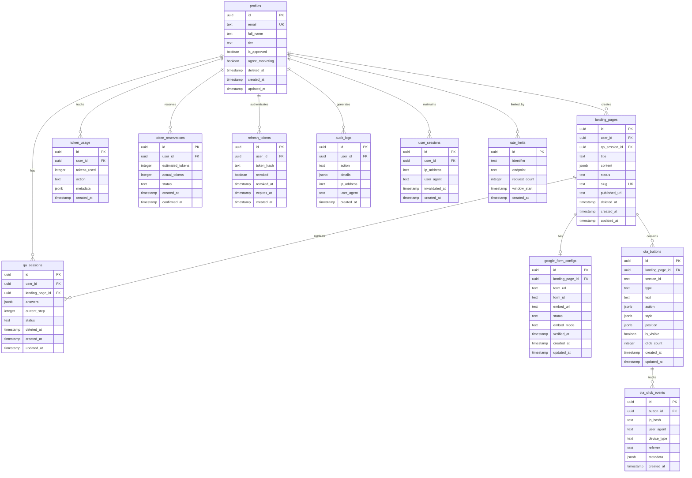

# PRD: 데이터베이스 설계

## 1. 개요

이 문서는 마그네틱 세일즈 웹앱의 전체 데이터베이스 스키마, 마이그레이션 전략, 시드 데이터, 그리고 운영 가이드를 정의합니다.

## 2. 의존성

- 이 문서 작성 전 필요: `02_PRD_기술스택.md`
- 이 문서 작성 후 진행: `09_PRD_API명세.md`
- 관련 문서: `04_PRD_인증시스템.md`, `05_PRD_AI기획도우미.md`, `06_PRD_랜딩페이지빌더.md`, `07_PRD_DB수집페이지.md`

---

## 3. 데이터베이스 아키텍처

### 3.1 기술 스택

| 구성 요소 | 기술 | 버전 |
|----------|------|------|
| DBMS | PostgreSQL | 15.x |
| BaaS | Supabase | Latest |
| 인증 | Supabase Auth | Latest |
| 스토리지 | Supabase Storage | Latest |
| 실시간 | Supabase Realtime | Latest |

### 3.2 설계 원칙

```yaml
설계_원칙:
  보안:
    - Row Level Security (RLS) 모든 테이블 적용
    - deleted_at 기반 Soft Delete
    - 감사 로그 필수 기록

  성능:
    - 적절한 인덱스 전략
    - 부분 인덱스 활용
    - JSONB 최적화

  확장성:
    - UUID 기본키 사용
    - 정규화된 스키마
    - 확장 가능한 JSONB 필드

  무결성:
    - 외래 키 제약
    - CHECK 제약 조건
    - 트리거 기반 자동화
```

---

## 4. 전체 스키마 다이어그램

### 4.1 ERD (Entity Relationship Diagram)



### 4.2 테이블 관계 요약

| 관계 | 설명 | 타입 |
|------|------|------|
| profiles -> landing_pages | 사용자가 랜딩페이지 생성 | 1:N |
| profiles -> qa_sessions | 사용자가 Q&A 세션 보유 | 1:N |
| landing_pages -> qa_sessions | 랜딩페이지에 Q&A 세션 연결 | 1:N |
| landing_pages -> google_form_configs | 랜딩페이지에 폼 설정 | 1:1 |
| landing_pages -> cta_buttons | 랜딩페이지에 CTA 버튼 | 1:N |
| cta_buttons -> cta_click_events | CTA 버튼 클릭 추적 | 1:N |

---

## 5. 테이블 상세 정의

### 5.1 profiles (사용자 프로필)

#### 테이블 정의

```sql
-- =============================================================================
-- profiles 테이블
-- 설명: Supabase Auth의 auth.users를 확장하는 사용자 프로필 정보
-- 버전: v2 (Red Team 보안 리뷰 반영)
-- =============================================================================

CREATE TABLE profiles (
    -- 기본 키 (auth.users.id와 동일)
    id UUID PRIMARY KEY REFERENCES auth.users(id) ON DELETE CASCADE,

    -- 사용자 정보
    email TEXT UNIQUE NOT NULL,
    full_name TEXT NOT NULL,

    -- 권한 및 상태
    tier TEXT NOT NULL DEFAULT 'FREE'
        CHECK (tier IN ('FREE', 'PRO', 'ENTERPRISE')),
    is_approved BOOLEAN NOT NULL DEFAULT FALSE,

    -- 동의 정보
    agree_marketing BOOLEAN NOT NULL DEFAULT FALSE,

    -- Soft Delete (v2)
    deleted_at TIMESTAMPTZ,

    -- 타임스탬프
    created_at TIMESTAMPTZ NOT NULL DEFAULT NOW(),
    updated_at TIMESTAMPTZ NOT NULL DEFAULT NOW()
);

-- 테이블 코멘트
COMMENT ON TABLE profiles IS '사용자 프로필 정보 (auth.users 확장)';
COMMENT ON COLUMN profiles.tier IS '사용자 등급: FREE(무료), PRO(프로), ENTERPRISE(관리자)';
COMMENT ON COLUMN profiles.is_approved IS '관리자 승인 여부';
COMMENT ON COLUMN profiles.deleted_at IS 'Soft Delete 타임스탬프 (NULL이면 활성)';
```

#### 인덱스

```sql
-- profiles 인덱스
CREATE INDEX idx_profiles_email ON profiles(email);
CREATE INDEX idx_profiles_tier ON profiles(tier);
CREATE INDEX idx_profiles_is_approved ON profiles(is_approved);
CREATE INDEX idx_profiles_deleted_at ON profiles(deleted_at)
    WHERE deleted_at IS NULL;
CREATE INDEX idx_profiles_tier_approved ON profiles(tier, is_approved)
    WHERE deleted_at IS NULL;
```

#### RLS 정책

```sql
-- RLS 활성화
ALTER TABLE profiles ENABLE ROW LEVEL SECURITY;

-- 자신의 활성 프로필 조회
CREATE POLICY "profiles_select_own"
    ON profiles FOR SELECT
    USING (
        auth.uid() = id
        AND deleted_at IS NULL
    );

-- 프로필 생성 (회원가입 시)
CREATE POLICY "profiles_insert_own"
    ON profiles FOR INSERT
    WITH CHECK (auth.uid() = id);

-- 자신의 프로필 수정 (삭제되지 않은 것만)
CREATE POLICY "profiles_update_own"
    ON profiles FOR UPDATE
    USING (
        auth.uid() = id
        AND deleted_at IS NULL
    )
    WITH CHECK (
        auth.uid() = id
        AND deleted_at IS NULL
    );

-- 관리자: 모든 프로필 조회
CREATE POLICY "profiles_select_admin"
    ON profiles FOR SELECT
    USING (
        EXISTS (
            SELECT 1 FROM profiles
            WHERE id = auth.uid()
            AND tier = 'ENTERPRISE'
            AND deleted_at IS NULL
        )
    );

-- 관리자: 승인 상태 변경
CREATE POLICY "profiles_update_admin"
    ON profiles FOR UPDATE
    USING (
        EXISTS (
            SELECT 1 FROM profiles
            WHERE id = auth.uid()
            AND tier = 'ENTERPRISE'
            AND deleted_at IS NULL
        )
    );
```

#### TypeScript 타입

```typescript
// src/types/database/profiles.ts

export type UserTier = 'FREE' | 'PRO' | 'ENTERPRISE';

export interface Profile {
  id: string;
  email: string;
  fullName: string;
  tier: UserTier;
  isApproved: boolean;
  agreeMarketing: boolean;
  deletedAt: string | null;
  createdAt: string;
  updatedAt: string;
}

export interface ProfileInsert {
  id: string;
  email: string;
  fullName: string;
  tier?: UserTier;
  isApproved?: boolean;
  agreeMarketing?: boolean;
}

export interface ProfileUpdate {
  fullName?: string;
  tier?: UserTier;
  isApproved?: boolean;
  agreeMarketing?: boolean;
  deletedAt?: string | null;
}

// 티어별 제한
export const TIER_LIMITS: Record<UserTier, {
  dailyTokens: number;
  maxProjects: number;
  maxLandingPages: number;
}> = {
  FREE: {
    dailyTokens: 100000,
    maxProjects: 3,
    maxLandingPages: 5,
  },
  PRO: {
    dailyTokens: 500000,
    maxProjects: 20,
    maxLandingPages: 50,
  },
  ENTERPRISE: {
    dailyTokens: 2000000,
    maxProjects: -1, // 무제한
    maxLandingPages: -1, // 무제한
  },
};
```

---

### 5.2 landing_pages (랜딩페이지)

#### 테이블 정의

```sql
-- =============================================================================
-- landing_pages 테이블
-- 설명: AI가 생성한 랜딩페이지 콘텐츠 및 메타데이터
-- 버전: v2 (Soft Delete 추가)
-- =============================================================================

CREATE TABLE landing_pages (
    -- 기본 키
    id UUID PRIMARY KEY DEFAULT gen_random_uuid(),

    -- 관계
    user_id UUID NOT NULL REFERENCES profiles(id) ON DELETE CASCADE,
    qa_session_id UUID REFERENCES qa_sessions(id),

    -- 콘텐츠
    title TEXT NOT NULL,
    content JSONB NOT NULL DEFAULT '{}',

    -- 상태
    status TEXT NOT NULL DEFAULT 'draft'
        CHECK (status IN ('draft', 'generating', 'published', 'archived')),

    -- 배포
    slug TEXT UNIQUE,
    published_url TEXT,

    -- Soft Delete (v2)
    deleted_at TIMESTAMPTZ,

    -- 타임스탬프
    created_at TIMESTAMPTZ NOT NULL DEFAULT NOW(),
    updated_at TIMESTAMPTZ NOT NULL DEFAULT NOW()
);

-- 테이블 코멘트
COMMENT ON TABLE landing_pages IS 'AI 생성 랜딩페이지';
COMMENT ON COLUMN landing_pages.content IS 'DESIRE-MAGNETIC 구조의 섹션별 콘텐츠 (JSONB)';
COMMENT ON COLUMN landing_pages.slug IS '공개 URL용 슬러그 (예: my-awesome-page)';
```

#### 인덱스

```sql
-- landing_pages 인덱스
CREATE INDEX idx_landing_pages_user_id ON landing_pages(user_id);
CREATE INDEX idx_landing_pages_status ON landing_pages(status);
CREATE INDEX idx_landing_pages_slug ON landing_pages(slug) WHERE slug IS NOT NULL;
CREATE INDEX idx_landing_pages_deleted_at ON landing_pages(deleted_at)
    WHERE deleted_at IS NULL;
CREATE INDEX idx_landing_pages_user_deleted ON landing_pages(user_id, deleted_at);
CREATE INDEX idx_landing_pages_user_status ON landing_pages(user_id, status)
    WHERE deleted_at IS NULL;

-- content JSONB 인덱스 (섹션 검색용)
CREATE INDEX idx_landing_pages_content_gin ON landing_pages USING GIN (content);
```

#### RLS 정책

```sql
-- RLS 활성화
ALTER TABLE landing_pages ENABLE ROW LEVEL SECURITY;

-- 자신의 활성 랜딩페이지 조회
CREATE POLICY "landing_pages_select_own_active"
    ON landing_pages FOR SELECT
    USING (
        user_id = auth.uid()
        AND deleted_at IS NULL
    );

-- 자신의 삭제된 랜딩페이지 조회 (30일 이내, 복구용)
CREATE POLICY "landing_pages_select_own_deleted"
    ON landing_pages FOR SELECT
    USING (
        user_id = auth.uid()
        AND deleted_at IS NOT NULL
        AND deleted_at > NOW() - INTERVAL '30 days'
    );

-- 공개된 랜딩페이지 조회 (익명 포함)
CREATE POLICY "landing_pages_select_published"
    ON landing_pages FOR SELECT
    USING (
        status = 'published'
        AND deleted_at IS NULL
    );

-- 승인된 사용자만 생성
CREATE POLICY "landing_pages_insert"
    ON landing_pages FOR INSERT
    WITH CHECK (
        user_id = auth.uid()
        AND EXISTS (
            SELECT 1 FROM profiles
            WHERE id = auth.uid()
            AND is_approved = TRUE
            AND deleted_at IS NULL
        )
    );

-- 자신의 활성 랜딩페이지 수정
CREATE POLICY "landing_pages_update_own"
    ON landing_pages FOR UPDATE
    USING (
        user_id = auth.uid()
        AND deleted_at IS NULL
    )
    WITH CHECK (user_id = auth.uid());

-- Soft Delete용 UPDATE (deleted_at 설정)
CREATE POLICY "landing_pages_soft_delete"
    ON landing_pages FOR UPDATE
    USING (user_id = auth.uid())
    WITH CHECK (user_id = auth.uid());
```

#### content JSONB 구조

```typescript
// src/types/database/landing-pages.ts

export type LandingPageStatus = 'draft' | 'generating' | 'published' | 'archived';

// DESIRE-MAGNETIC 구조
export interface LandingPageContent {
  // DESIRE 섹션
  desire: {
    headline: string;
    subHeadline: string;
    heroImage?: string;
    cta: {
      text: string;
      action: string;
    };
  };

  // 문제 인식 섹션
  problem: {
    title: string;
    painPoints: string[];
    emotionalHook: string;
  };

  // 해결책 섹션
  solution: {
    title: string;
    description: string;
    benefits: Array<{
      icon: string;
      title: string;
      description: string;
    }>;
  };

  // 사회적 증거 섹션
  socialProof: {
    testimonials: Array<{
      name: string;
      title: string;
      content: string;
      avatar?: string;
    }>;
    stats?: Array<{
      value: string;
      label: string;
    }>;
  };

  // 제안 섹션
  offer: {
    title: string;
    description: string;
    price?: {
      original: number;
      discounted?: number;
      currency: string;
    };
    features: string[];
  };

  // 긴급성/희소성 섹션
  urgency: {
    type: 'countdown' | 'limited' | 'bonus';
    message: string;
    deadline?: string;
    remaining?: number;
  };

  // FAQ 섹션
  faq: Array<{
    question: string;
    answer: string;
  }>;

  // 최종 CTA 섹션
  finalCta: {
    headline: string;
    subHeadline: string;
    buttonText: string;
    buttonAction: string;
  };

  // 메타 정보
  meta: {
    title: string;
    description: string;
    keywords: string[];
    ogImage?: string;
  };
}

export interface LandingPage {
  id: string;
  userId: string;
  qaSessionId: string | null;
  title: string;
  content: LandingPageContent;
  status: LandingPageStatus;
  slug: string | null;
  publishedUrl: string | null;
  deletedAt: string | null;
  createdAt: string;
  updatedAt: string;
}

export interface LandingPageInsert {
  userId: string;
  qaSessionId?: string;
  title: string;
  content?: Partial<LandingPageContent>;
  status?: LandingPageStatus;
}

export interface LandingPageUpdate {
  title?: string;
  content?: Partial<LandingPageContent>;
  status?: LandingPageStatus;
  slug?: string;
  publishedUrl?: string;
  deletedAt?: string | null;
}
```

---

### 5.3 qa_sessions (Q&A 세션)

#### 테이블 정의

```sql
-- =============================================================================
-- qa_sessions 테이블
-- 설명: AI 기획 도우미 40개 질문 응답 세션
-- 버전: v2 (Soft Delete 추가)
-- =============================================================================

CREATE TABLE qa_sessions (
    -- 기본 키
    id UUID PRIMARY KEY DEFAULT gen_random_uuid(),

    -- 관계
    user_id UUID NOT NULL REFERENCES profiles(id) ON DELETE CASCADE,
    landing_page_id UUID REFERENCES landing_pages(id) ON DELETE SET NULL,

    -- 응답 데이터
    answers JSONB NOT NULL DEFAULT '{}',

    -- 진행 상태
    current_step INTEGER NOT NULL DEFAULT 1
        CHECK (current_step BETWEEN 1 AND 40),
    status TEXT NOT NULL DEFAULT 'in_progress'
        CHECK (status IN ('in_progress', 'completed', 'abandoned')),

    -- Soft Delete (v2)
    deleted_at TIMESTAMPTZ,

    -- 타임스탬프
    created_at TIMESTAMPTZ NOT NULL DEFAULT NOW(),
    updated_at TIMESTAMPTZ NOT NULL DEFAULT NOW()
);

-- 테이블 코멘트
COMMENT ON TABLE qa_sessions IS 'AI 기획 도우미 Q&A 세션';
COMMENT ON COLUMN qa_sessions.answers IS '질문별 응답 데이터 (JSONB)';
COMMENT ON COLUMN qa_sessions.current_step IS '현재 진행 중인 질문 번호 (1-40)';
```

#### 인덱스

```sql
-- qa_sessions 인덱스
CREATE INDEX idx_qa_sessions_user_id ON qa_sessions(user_id);
CREATE INDEX idx_qa_sessions_landing_page_id ON qa_sessions(landing_page_id);
CREATE INDEX idx_qa_sessions_status ON qa_sessions(status);
CREATE INDEX idx_qa_sessions_deleted_at ON qa_sessions(deleted_at)
    WHERE deleted_at IS NULL;
CREATE INDEX idx_qa_sessions_user_status ON qa_sessions(user_id, status)
    WHERE deleted_at IS NULL;

-- answers JSONB 인덱스
CREATE INDEX idx_qa_sessions_answers_gin ON qa_sessions USING GIN (answers);
```

#### RLS 정책

```sql
-- RLS 활성화
ALTER TABLE qa_sessions ENABLE ROW LEVEL SECURITY;

-- 자신의 활성 세션 조회
CREATE POLICY "qa_sessions_select_own"
    ON qa_sessions FOR SELECT
    USING (
        user_id = auth.uid()
        AND deleted_at IS NULL
    );

-- 세션 생성
CREATE POLICY "qa_sessions_insert"
    ON qa_sessions FOR INSERT
    WITH CHECK (user_id = auth.uid());

-- 자신의 활성 세션 수정
CREATE POLICY "qa_sessions_update_own"
    ON qa_sessions FOR UPDATE
    USING (
        user_id = auth.uid()
        AND deleted_at IS NULL
    )
    WITH CHECK (user_id = auth.uid());
```

#### answers JSONB 구조

```typescript
// src/types/database/qa-sessions.ts

export type QASessionStatus = 'in_progress' | 'completed' | 'abandoned';

// 40개 질문 카테고리
export type QuestionCategory =
  | 'business_info'      // 1-5: 사업 기본 정보
  | 'target_audience'    // 6-12: 타겟 고객
  | 'problem_solution'   // 13-20: 문제와 해결책
  | 'unique_value'       // 21-26: 차별화 가치
  | 'social_proof'       // 27-32: 사회적 증거
  | 'offer_details'      // 33-38: 제안 상세
  | 'urgency_cta';       // 39-40: 긴급성과 CTA

export interface QAAnswer {
  questionId: number;
  questionText: string;
  category: QuestionCategory;
  answer: string;
  answeredAt: string;

  // AI 분석 결과 (선택적)
  aiAnalysis?: {
    keywords: string[];
    sentiment: 'positive' | 'neutral' | 'negative';
    suggestions?: string[];
  };
}

export interface QAAnswers {
  [questionId: string]: QAAnswer;
}

export interface QASession {
  id: string;
  userId: string;
  landingPageId: string | null;
  answers: QAAnswers;
  currentStep: number;
  status: QASessionStatus;
  deletedAt: string | null;
  createdAt: string;
  updatedAt: string;
}

export interface QASessionInsert {
  userId: string;
  landingPageId?: string;
  answers?: QAAnswers;
  currentStep?: number;
  status?: QASessionStatus;
}

export interface QASessionUpdate {
  landingPageId?: string;
  answers?: QAAnswers;
  currentStep?: number;
  status?: QASessionStatus;
  deletedAt?: string | null;
}

// 진행률 계산
export function calculateProgress(session: QASession): number {
  const answeredCount = Object.keys(session.answers).length;
  return Math.round((answeredCount / 40) * 100);
}

// 카테고리별 완료 여부
export function getCategoryCompletion(
  answers: QAAnswers
): Record<QuestionCategory, boolean> {
  const categoryRanges: Record<QuestionCategory, [number, number]> = {
    business_info: [1, 5],
    target_audience: [6, 12],
    problem_solution: [13, 20],
    unique_value: [21, 26],
    social_proof: [27, 32],
    offer_details: [33, 38],
    urgency_cta: [39, 40],
  };

  const result: Record<QuestionCategory, boolean> = {} as Record<QuestionCategory, boolean>;

  for (const [category, [start, end]] of Object.entries(categoryRanges)) {
    const requiredIds = Array.from(
      { length: end - start + 1 },
      (_, i) => (start + i).toString()
    );
    result[category as QuestionCategory] = requiredIds.every(
      (id) => answers[id]?.answer
    );
  }

  return result;
}
```

---

### 5.4 token_usage (토큰 사용 기록)

#### 테이블 정의

```sql
-- =============================================================================
-- token_usage 테이블
-- 설명: AI API 토큰 사용량 기록 (과금 및 제한 관리)
-- =============================================================================

CREATE TABLE token_usage (
    -- 기본 키
    id UUID PRIMARY KEY DEFAULT gen_random_uuid(),

    -- 관계
    user_id UUID NOT NULL REFERENCES profiles(id) ON DELETE CASCADE,

    -- 사용량
    tokens_used INTEGER NOT NULL CHECK (tokens_used > 0),

    -- 액션 타입
    action TEXT NOT NULL
        CHECK (action IN ('generate', 'regenerate', 'edit', 'chat')),

    -- 메타데이터
    metadata JSONB DEFAULT '{}',

    -- 타임스탬프
    created_at TIMESTAMPTZ NOT NULL DEFAULT NOW()
);

-- 테이블 코멘트
COMMENT ON TABLE token_usage IS 'AI API 토큰 사용 기록';
COMMENT ON COLUMN token_usage.action IS '사용 유형: generate(생성), regenerate(재생성), edit(편집), chat(대화)';
```

#### 인덱스

```sql
-- token_usage 인덱스
CREATE INDEX idx_token_usage_user_id ON token_usage(user_id);
CREATE INDEX idx_token_usage_created_at ON token_usage(created_at);
CREATE INDEX idx_token_usage_action ON token_usage(action);

-- 일일 사용량 조회용 인덱스
CREATE INDEX idx_token_usage_user_date ON token_usage(user_id, DATE(created_at));

-- 월별 사용량 조회용 인덱스
CREATE INDEX idx_token_usage_user_month ON token_usage(
    user_id,
    DATE_TRUNC('month', created_at)
);
```

#### RLS 정책

```sql
-- RLS 활성화
ALTER TABLE token_usage ENABLE ROW LEVEL SECURITY;

-- 자신의 사용 기록 조회
CREATE POLICY "token_usage_select_own"
    ON token_usage FOR SELECT
    USING (user_id = auth.uid());

-- 시스템에서 기록 생성 (서버 사이드)
-- INSERT는 service role에서만 가능하도록 정책 없음
```

#### TypeScript 타입

```typescript
// src/types/database/token-usage.ts

export type TokenAction = 'generate' | 'regenerate' | 'edit' | 'chat';

export interface TokenUsageMetadata {
  landingPageId?: string;
  qaSessionId?: string;
  reservationId?: string;
  model?: string;
  inputTokens?: number;
  outputTokens?: number;
  duration?: number; // ms
}

export interface TokenUsage {
  id: string;
  userId: string;
  tokensUsed: number;
  action: TokenAction;
  metadata: TokenUsageMetadata;
  createdAt: string;
}

export interface TokenUsageInsert {
  userId: string;
  tokensUsed: number;
  action: TokenAction;
  metadata?: TokenUsageMetadata;
}

// 일일 사용량 집계
export interface DailyTokenUsage {
  date: string;
  total: number;
  byAction: Record<TokenAction, number>;
}

// 사용량 조회 헬퍼
export async function getDailyUsage(
  supabase: SupabaseClient,
  userId: string,
  date?: Date
): Promise<number> {
  const targetDate = date || new Date();
  const startOfDay = new Date(targetDate);
  startOfDay.setHours(0, 0, 0, 0);

  const endOfDay = new Date(targetDate);
  endOfDay.setHours(23, 59, 59, 999);

  const { data, error } = await supabase
    .from('token_usage')
    .select('tokens_used')
    .eq('user_id', userId)
    .gte('created_at', startOfDay.toISOString())
    .lte('created_at', endOfDay.toISOString());

  if (error) throw error;

  return data?.reduce((sum, row) => sum + row.tokens_used, 0) || 0;
}
```

---

### 5.5 token_reservations (토큰 예약)

#### 테이블 정의

```sql
-- =============================================================================
-- token_reservations 테이블
-- 설명: 2-Phase 토큰 관리를 위한 예약 시스템 (Race Condition 방지)
-- 버전: v2 신규
-- =============================================================================

CREATE TABLE token_reservations (
    -- 기본 키
    id UUID PRIMARY KEY DEFAULT gen_random_uuid(),

    -- 관계
    user_id UUID NOT NULL REFERENCES profiles(id) ON DELETE CASCADE,

    -- 토큰 정보
    estimated_tokens INTEGER NOT NULL CHECK (estimated_tokens > 0),
    actual_tokens INTEGER,

    -- 상태
    status TEXT NOT NULL DEFAULT 'reserved'
        CHECK (status IN ('reserved', 'confirmed', 'cancelled', 'expired')),

    -- 타임스탬프
    created_at TIMESTAMPTZ NOT NULL DEFAULT NOW(),
    confirmed_at TIMESTAMPTZ
);

-- 테이블 코멘트
COMMENT ON TABLE token_reservations IS '토큰 예약 (Race Condition 방지)';
COMMENT ON COLUMN token_reservations.estimated_tokens IS '예상 사용 토큰';
COMMENT ON COLUMN token_reservations.actual_tokens IS '실제 사용 토큰 (확정 후)';
COMMENT ON COLUMN token_reservations.status IS 'reserved(예약중), confirmed(확정), cancelled(취소), expired(만료)';
```

#### 인덱스

```sql
-- token_reservations 인덱스
CREATE INDEX idx_token_reservations_user_id ON token_reservations(user_id);
CREATE INDEX idx_token_reservations_status ON token_reservations(status);
CREATE INDEX idx_token_reservations_created_at ON token_reservations(created_at);

-- 활성 예약 조회용 부분 인덱스
CREATE INDEX idx_token_reservations_user_pending
    ON token_reservations(user_id, status)
    WHERE status = 'reserved';

-- 만료 예약 정리용 인덱스
CREATE INDEX idx_token_reservations_expired
    ON token_reservations(created_at)
    WHERE status = 'reserved';
```

#### RLS 정책

```sql
-- RLS 활성화
ALTER TABLE token_reservations ENABLE ROW LEVEL SECURITY;

-- 자신의 예약 조회
CREATE POLICY "token_reservations_select_own"
    ON token_reservations FOR SELECT
    USING (user_id = auth.uid());

-- INSERT/UPDATE는 서버 사이드에서만 (service role)
```

#### TypeScript 타입

```typescript
// src/types/database/token-reservations.ts

export type ReservationStatus = 'reserved' | 'confirmed' | 'cancelled' | 'expired';

export interface TokenReservation {
  id: string;
  userId: string;
  estimatedTokens: number;
  actualTokens: number | null;
  status: ReservationStatus;
  createdAt: string;
  confirmedAt: string | null;
}

export interface ReserveTokensResult {
  success: boolean;
  reservationId?: string;
  availableAfter?: number;
  dailyLimit?: number;
  error?: string;
  available?: number;
  requested?: number;
  usedToday?: number;
  reserved?: number;
}

export interface ConfirmTokensResult {
  success: boolean;
  estimated?: number;
  actual?: number;
  difference?: number;
  error?: string;
}
```

---

### 5.6 refresh_tokens (리프레시 토큰)

#### 테이블 정의

```sql
-- =============================================================================
-- refresh_tokens 테이블
-- 설명: Refresh Token Rotation 지원
-- 버전: v2 신규
-- =============================================================================

CREATE TABLE refresh_tokens (
    -- 기본 키
    id UUID PRIMARY KEY DEFAULT gen_random_uuid(),

    -- 관계
    user_id UUID NOT NULL REFERENCES profiles(id) ON DELETE CASCADE,

    -- 토큰 (해시만 저장)
    token_hash TEXT NOT NULL,

    -- 상태
    revoked BOOLEAN NOT NULL DEFAULT FALSE,
    revoked_at TIMESTAMPTZ,

    -- 만료
    expires_at TIMESTAMPTZ NOT NULL,

    -- 타임스탬프
    created_at TIMESTAMPTZ NOT NULL DEFAULT NOW(),

    -- 유니크 제약 (해시 충돌 방지)
    CONSTRAINT unique_token_hash UNIQUE (token_hash)
);

-- 테이블 코멘트
COMMENT ON TABLE refresh_tokens IS 'Refresh Token Rotation 관리';
COMMENT ON COLUMN refresh_tokens.token_hash IS 'SHA-256 해시된 토큰 (원본 저장 안 함)';
```

#### 인덱스

```sql
-- refresh_tokens 인덱스
CREATE INDEX idx_refresh_tokens_user_id ON refresh_tokens(user_id);
CREATE INDEX idx_refresh_tokens_token_hash ON refresh_tokens(token_hash);
CREATE INDEX idx_refresh_tokens_expires_at ON refresh_tokens(expires_at);

-- 활성 토큰 조회용 부분 인덱스
CREATE INDEX idx_refresh_tokens_user_active
    ON refresh_tokens(user_id, revoked)
    WHERE revoked = FALSE;

-- 만료 토큰 정리용 인덱스
CREATE INDEX idx_refresh_tokens_cleanup
    ON refresh_tokens(expires_at)
    WHERE revoked = FALSE;
```

#### RLS 정책

```sql
-- RLS 활성화
ALTER TABLE refresh_tokens ENABLE ROW LEVEL SECURITY;

-- 클라이언트 직접 접근 불가
-- 모든 작업은 service role에서 수행
```

#### TypeScript 타입

```typescript
// src/types/database/refresh-tokens.ts

export interface RefreshToken {
  id: string;
  userId: string;
  tokenHash: string;
  revoked: boolean;
  revokedAt: string | null;
  expiresAt: string;
  createdAt: string;
}

// 토큰 해싱 유틸리티
export function hashRefreshToken(token: string): string {
  return crypto
    .createHash('sha256')
    .update(token)
    .digest('hex');
}

// 토큰 유효성 검사
export function isTokenValid(token: RefreshToken): boolean {
  if (token.revoked) return false;
  if (new Date(token.expiresAt) < new Date()) return false;
  return true;
}
```

---

### 5.7 audit_logs (감사 로그)

#### 테이블 정의

```sql
-- =============================================================================
-- audit_logs 테이블
-- 설명: 보안 및 규정 준수를 위한 감사 로그
-- 버전: v2 신규
-- =============================================================================

CREATE TABLE audit_logs (
    -- 기본 키
    id UUID PRIMARY KEY DEFAULT gen_random_uuid(),

    -- 관계 (사용자 탈퇴 후에도 로그 유지)
    user_id UUID REFERENCES profiles(id) ON DELETE SET NULL,

    -- 액션
    action TEXT NOT NULL,

    -- 상세 정보
    details JSONB DEFAULT '{}',

    -- 요청 정보
    ip_address INET,
    user_agent TEXT,

    -- 타임스탬프
    created_at TIMESTAMPTZ NOT NULL DEFAULT NOW()
);

-- 테이블 코멘트
COMMENT ON TABLE audit_logs IS '보안 감사 로그';
COMMENT ON COLUMN audit_logs.action IS '감사 대상 액션 (아래 목록 참조)';

-- 감사 대상 액션 목록
COMMENT ON COLUMN audit_logs.action IS '
감사 대상 액션:
- signup: 회원가입
- login: 로그인
- logout: 로그아웃
- login_failed: 로그인 실패
- password_change: 비밀번호 변경
- password_reset_request: 비밀번호 재설정 요청
- profile_update: 프로필 수정
- approval_change: 승인 상태 변경
- sessions_invalidated: 세션 무효화
- token_reuse_detected: 토큰 재사용 감지 (보안 경고)
- landing_page_created: LP 생성
- landing_page_updated: LP 수정
- landing_page_deleted: LP 삭제 (soft)
- landing_page_restored: LP 복구
- landing_page_permanently_deleted: LP 영구 삭제
- landing_page_published: LP 배포
- ai_generation_started: AI 생성 시작
- ai_generation_completed: AI 생성 완료
- ai_generation_failed: AI 생성 실패
- rate_limit_exceeded: Rate Limit 초과
- suspicious_activity: 의심스러운 활동
- error: 시스템 에러
';
```

#### 인덱스

```sql
-- audit_logs 인덱스
CREATE INDEX idx_audit_logs_user_id ON audit_logs(user_id);
CREATE INDEX idx_audit_logs_action ON audit_logs(action);
CREATE INDEX idx_audit_logs_created_at ON audit_logs(created_at);
CREATE INDEX idx_audit_logs_ip_address ON audit_logs(ip_address);

-- 보안 관련 액션 빠른 조회
CREATE INDEX idx_audit_logs_security
    ON audit_logs(action, created_at)
    WHERE action IN (
        'login_failed',
        'token_reuse_detected',
        'rate_limit_exceeded',
        'suspicious_activity'
    );

-- details JSONB 인덱스
CREATE INDEX idx_audit_logs_details_gin ON audit_logs USING GIN (details);
```

#### RLS 정책

```sql
-- RLS 활성화
ALTER TABLE audit_logs ENABLE ROW LEVEL SECURITY;

-- 일반 사용자: 자신의 로그만 조회 (제한적)
CREATE POLICY "audit_logs_select_own"
    ON audit_logs FOR SELECT
    USING (
        user_id = auth.uid()
        AND action NOT IN ('suspicious_activity', 'token_reuse_detected')
    );

-- 관리자: 모든 로그 조회
CREATE POLICY "audit_logs_select_admin"
    ON audit_logs FOR SELECT
    USING (
        EXISTS (
            SELECT 1 FROM profiles
            WHERE id = auth.uid()
            AND tier = 'ENTERPRISE'
            AND deleted_at IS NULL
        )
    );

-- INSERT는 서버 사이드에서만
```

#### TypeScript 타입

```typescript
// src/types/database/audit-logs.ts

export type AuditAction =
  | 'signup'
  | 'login'
  | 'logout'
  | 'login_failed'
  | 'password_change'
  | 'password_reset_request'
  | 'profile_update'
  | 'approval_change'
  | 'sessions_invalidated'
  | 'token_reuse_detected'
  | 'landing_page_created'
  | 'landing_page_updated'
  | 'landing_page_deleted'
  | 'landing_page_restored'
  | 'landing_page_permanently_deleted'
  | 'landing_page_published'
  | 'ai_generation_started'
  | 'ai_generation_completed'
  | 'ai_generation_failed'
  | 'rate_limit_exceeded'
  | 'suspicious_activity'
  | 'error';

export interface AuditLogDetails {
  // 공통
  reason?: string;
  previousValue?: unknown;
  newValue?: unknown;

  // 인증 관련
  method?: string;
  failureReason?: string;

  // 랜딩페이지 관련
  landingPageId?: string;
  landingPageTitle?: string;

  // AI 관련
  reservationId?: string;
  tokensUsed?: number;
  model?: string;
  duration?: number;

  // Rate Limit
  endpoint?: string;
  count?: number;
  limit?: number;

  // 에러
  errorCode?: string;
  errorMessage?: string;
  stack?: string;

  // 기타
  [key: string]: unknown;
}

export interface AuditLog {
  id: string;
  userId: string | null;
  action: AuditAction;
  details: AuditLogDetails;
  ipAddress: string | null;
  userAgent: string | null;
  createdAt: string;
}

export interface AuditLogInsert {
  userId?: string;
  action: AuditAction;
  details?: AuditLogDetails;
  ipAddress?: string;
  userAgent?: string;
}

// 감사 로그 생성 유틸리티
export async function createAuditLog(
  supabase: SupabaseClient,
  log: AuditLogInsert
): Promise<void> {
  const { error } = await supabase
    .from('audit_logs')
    .insert(log);

  if (error) {
    console.error('Failed to create audit log:', error);
    // 감사 로그 실패는 조용히 처리 (사용자 흐름 방해 안 함)
  }
}
```

---

### 5.8 user_sessions (사용자 세션)

#### 테이블 정의

```sql
-- =============================================================================
-- user_sessions 테이블
-- 설명: 활성 세션 관리 및 무효화
-- 버전: v2 신규
-- =============================================================================

CREATE TABLE user_sessions (
    -- 기본 키
    id UUID PRIMARY KEY DEFAULT gen_random_uuid(),

    -- 관계
    user_id UUID NOT NULL REFERENCES profiles(id) ON DELETE CASCADE,

    -- 세션 정보
    ip_address INET,
    user_agent TEXT,

    -- 상태
    invalidated_at TIMESTAMPTZ, -- NULL이면 활성

    -- 타임스탬프
    created_at TIMESTAMPTZ NOT NULL DEFAULT NOW()
);

-- 테이블 코멘트
COMMENT ON TABLE user_sessions IS '사용자 활성 세션 관리';
COMMENT ON COLUMN user_sessions.invalidated_at IS '무효화 시간 (NULL이면 활성 세션)';
```

#### 인덱스

```sql
-- user_sessions 인덱스
CREATE INDEX idx_user_sessions_user_id ON user_sessions(user_id);
CREATE INDEX idx_user_sessions_created_at ON user_sessions(created_at);

-- 활성 세션 조회용 부분 인덱스
CREATE INDEX idx_user_sessions_user_active
    ON user_sessions(user_id, invalidated_at)
    WHERE invalidated_at IS NULL;
```

#### RLS 정책

```sql
-- RLS 활성화
ALTER TABLE user_sessions ENABLE ROW LEVEL SECURITY;

-- 자신의 세션 조회
CREATE POLICY "user_sessions_select_own"
    ON user_sessions FOR SELECT
    USING (user_id = auth.uid());
```

#### TypeScript 타입

```typescript
// src/types/database/user-sessions.ts

export interface UserSession {
  id: string;
  userId: string;
  ipAddress: string | null;
  userAgent: string | null;
  invalidatedAt: string | null;
  createdAt: string;
}

export interface UserSessionInsert {
  userId: string;
  ipAddress?: string;
  userAgent?: string;
}

// 세션 유효성 확인
export function isSessionValid(session: UserSession): boolean {
  return session.invalidatedAt === null;
}

// 활성 세션 수 확인
export async function getActiveSessionCount(
  supabase: SupabaseClient,
  userId: string
): Promise<number> {
  const { count, error } = await supabase
    .from('user_sessions')
    .select('*', { count: 'exact', head: true })
    .eq('user_id', userId)
    .is('invalidated_at', null);

  if (error) throw error;
  return count || 0;
}
```

---

### 5.9 rate_limits (Rate Limit)

#### 테이블 정의

```sql
-- =============================================================================
-- rate_limits 테이블
-- 설명: PostgreSQL 기반 Rate Limiting (Supabase 네이티브)
-- 버전: v2 신규
-- =============================================================================

CREATE TABLE rate_limits (
    -- 기본 키
    id UUID PRIMARY KEY DEFAULT gen_random_uuid(),

    -- 식별자 (IP 또는 user_id)
    identifier TEXT NOT NULL,

    -- 엔드포인트
    endpoint TEXT NOT NULL,

    -- 카운터
    request_count INTEGER NOT NULL DEFAULT 1,

    -- 윈도우
    window_start TIMESTAMPTZ NOT NULL DEFAULT NOW(),

    -- 타임스탬프
    created_at TIMESTAMPTZ NOT NULL DEFAULT NOW(),

    -- 복합 유니크 키
    CONSTRAINT unique_rate_limit UNIQUE (identifier, endpoint, window_start)
);

-- 테이블 코멘트
COMMENT ON TABLE rate_limits IS 'API Rate Limiting (슬라이딩 윈도우)';
```

#### 인덱스

```sql
-- rate_limits 인덱스
CREATE INDEX idx_rate_limits_identifier ON rate_limits(identifier);
CREATE INDEX idx_rate_limits_endpoint ON rate_limits(endpoint);
CREATE INDEX idx_rate_limits_window_start ON rate_limits(window_start);

-- 조회 최적화용 복합 인덱스
CREATE INDEX idx_rate_limits_lookup
    ON rate_limits(identifier, endpoint, window_start);

-- 정리용 인덱스
CREATE INDEX idx_rate_limits_cleanup
    ON rate_limits(window_start);
```

#### TypeScript 타입

```typescript
// src/types/database/rate-limits.ts

export interface RateLimit {
  id: string;
  identifier: string;
  endpoint: string;
  requestCount: number;
  windowStart: string;
  createdAt: string;
}

export interface RateLimitConfig {
  endpoint: string;
  limit: number;
  windowSeconds: number;
}

// 엔드포인트별 Rate Limit 설정
export const RATE_LIMIT_CONFIGS: Record<string, RateLimitConfig> = {
  'auth/login': {
    endpoint: 'auth/login',
    limit: 5,
    windowSeconds: 60, // 분당 5회
  },
  'auth/signup': {
    endpoint: 'auth/signup',
    limit: 3,
    windowSeconds: 3600, // 시간당 3회
  },
  'ai/generate': {
    endpoint: 'ai/generate',
    limit: 10,
    windowSeconds: 3600, // 시간당 10회
  },
  'api/default': {
    endpoint: 'api/default',
    limit: 100,
    windowSeconds: 60, // 분당 100회
  },
};

export interface RateLimitResult {
  allowed: boolean;
  current: number;
  limit: number;
  remaining?: number;
  resetAt?: string;
}
```

---

### 5.10 google_form_configs (구글 폼 설정)

#### 테이블 정의

```sql
-- =============================================================================
-- google_form_configs 테이블
-- 설명: 랜딩페이지에 연결된 구글 폼 설정
-- =============================================================================

CREATE TABLE google_form_configs (
    -- 기본 키
    id UUID PRIMARY KEY DEFAULT gen_random_uuid(),

    -- 관계 (1:1)
    landing_page_id UUID NOT NULL REFERENCES landing_pages(id) ON DELETE CASCADE,

    -- 폼 정보
    form_url TEXT NOT NULL,
    form_id TEXT,
    embed_url TEXT,

    -- 상태
    status TEXT NOT NULL DEFAULT 'pending'
        CHECK (status IN ('pending', 'verified', 'error')),

    -- 임베드 설정
    embed_mode TEXT NOT NULL DEFAULT 'iframe'
        CHECK (embed_mode IN ('iframe', 'popup', 'redirect')),

    -- 검증
    verified_at TIMESTAMPTZ,

    -- 타임스탬프
    created_at TIMESTAMPTZ NOT NULL DEFAULT NOW(),
    updated_at TIMESTAMPTZ NOT NULL DEFAULT NOW(),

    -- 유니크 제약 (랜딩페이지당 하나의 폼)
    CONSTRAINT unique_landing_page_form UNIQUE (landing_page_id)
);

-- 테이블 코멘트
COMMENT ON TABLE google_form_configs IS '구글 폼 연동 설정';
COMMENT ON COLUMN google_form_configs.embed_mode IS 'iframe(임베드), popup(팝업), redirect(리다이렉트)';
```

#### 인덱스

```sql
-- google_form_configs 인덱스
CREATE INDEX idx_google_form_configs_landing_page_id
    ON google_form_configs(landing_page_id);
CREATE INDEX idx_google_form_configs_status
    ON google_form_configs(status);
CREATE INDEX idx_google_form_configs_form_id
    ON google_form_configs(form_id) WHERE form_id IS NOT NULL;
```

#### RLS 정책

```sql
-- RLS 활성화
ALTER TABLE google_form_configs ENABLE ROW LEVEL SECURITY;

-- 자신의 랜딩페이지 폼 설정 조회
CREATE POLICY "google_form_configs_select_own"
    ON google_form_configs FOR SELECT
    USING (
        EXISTS (
            SELECT 1 FROM landing_pages
            WHERE landing_pages.id = google_form_configs.landing_page_id
            AND landing_pages.user_id = auth.uid()
        )
    );

-- 공개 랜딩페이지의 폼 설정 조회
CREATE POLICY "google_form_configs_select_published"
    ON google_form_configs FOR SELECT
    USING (
        EXISTS (
            SELECT 1 FROM landing_pages
            WHERE landing_pages.id = google_form_configs.landing_page_id
            AND landing_pages.status = 'published'
            AND landing_pages.deleted_at IS NULL
        )
    );

-- 자신의 랜딩페이지에 폼 설정 생성
CREATE POLICY "google_form_configs_insert"
    ON google_form_configs FOR INSERT
    WITH CHECK (
        EXISTS (
            SELECT 1 FROM landing_pages
            WHERE landing_pages.id = google_form_configs.landing_page_id
            AND landing_pages.user_id = auth.uid()
        )
    );

-- 자신의 폼 설정 수정
CREATE POLICY "google_form_configs_update"
    ON google_form_configs FOR UPDATE
    USING (
        EXISTS (
            SELECT 1 FROM landing_pages
            WHERE landing_pages.id = google_form_configs.landing_page_id
            AND landing_pages.user_id = auth.uid()
        )
    );

-- 자신의 폼 설정 삭제
CREATE POLICY "google_form_configs_delete"
    ON google_form_configs FOR DELETE
    USING (
        EXISTS (
            SELECT 1 FROM landing_pages
            WHERE landing_pages.id = google_form_configs.landing_page_id
            AND landing_pages.user_id = auth.uid()
        )
    );
```

---

### 5.11 cta_buttons (CTA 버튼)

#### 테이블 정의

```sql
-- =============================================================================
-- cta_buttons 테이블
-- 설명: 랜딩페이지의 CTA 버튼 설정
-- =============================================================================

CREATE TABLE cta_buttons (
    -- 기본 키
    id UUID PRIMARY KEY DEFAULT gen_random_uuid(),

    -- 관계
    landing_page_id UUID NOT NULL REFERENCES landing_pages(id) ON DELETE CASCADE,

    -- 위치
    section_id TEXT NOT NULL,

    -- 버튼 타입
    type TEXT NOT NULL DEFAULT 'primary'
        CHECK (type IN ('primary', 'secondary', 'ghost', 'link')),

    -- 텍스트
    text TEXT NOT NULL,

    -- 액션 (JSONB)
    action JSONB NOT NULL DEFAULT '{"type": "scroll", "target": "#form"}',

    -- 스타일 (JSONB)
    style JSONB NOT NULL DEFAULT '{}',

    -- 위치 (JSONB)
    position JSONB NOT NULL DEFAULT '{"alignment": "center"}',

    -- 상태
    is_visible BOOLEAN NOT NULL DEFAULT TRUE,

    -- 통계
    click_count INTEGER NOT NULL DEFAULT 0,

    -- 타임스탬프
    created_at TIMESTAMPTZ NOT NULL DEFAULT NOW(),
    updated_at TIMESTAMPTZ NOT NULL DEFAULT NOW()
);

-- 테이블 코멘트
COMMENT ON TABLE cta_buttons IS 'CTA 버튼 설정';
COMMENT ON COLUMN cta_buttons.action IS '버튼 액션: {type: scroll|link|form|custom, target: string, ...}';
COMMENT ON COLUMN cta_buttons.style IS '스타일 옵션: {bgColor, textColor, borderRadius, size, ...}';
```

#### 인덱스

```sql
-- cta_buttons 인덱스
CREATE INDEX idx_cta_buttons_landing_page_id ON cta_buttons(landing_page_id);
CREATE INDEX idx_cta_buttons_section_id ON cta_buttons(section_id);
CREATE INDEX idx_cta_buttons_type ON cta_buttons(type);
CREATE INDEX idx_cta_buttons_is_visible ON cta_buttons(is_visible);

-- 랜딩페이지별 활성 버튼 조회
CREATE INDEX idx_cta_buttons_landing_visible
    ON cta_buttons(landing_page_id, is_visible)
    WHERE is_visible = TRUE;
```

#### RLS 정책

```sql
-- RLS 활성화
ALTER TABLE cta_buttons ENABLE ROW LEVEL SECURITY;

-- 자신의 랜딩페이지 버튼 조회
CREATE POLICY "cta_buttons_select_own"
    ON cta_buttons FOR SELECT
    USING (
        EXISTS (
            SELECT 1 FROM landing_pages
            WHERE landing_pages.id = cta_buttons.landing_page_id
            AND landing_pages.user_id = auth.uid()
        )
    );

-- 공개 랜딩페이지의 버튼 조회
CREATE POLICY "cta_buttons_select_published"
    ON cta_buttons FOR SELECT
    USING (
        EXISTS (
            SELECT 1 FROM landing_pages
            WHERE landing_pages.id = cta_buttons.landing_page_id
            AND landing_pages.status = 'published'
            AND landing_pages.deleted_at IS NULL
        )
    );

-- CRUD 정책
CREATE POLICY "cta_buttons_insert"
    ON cta_buttons FOR INSERT
    WITH CHECK (
        EXISTS (
            SELECT 1 FROM landing_pages
            WHERE landing_pages.id = cta_buttons.landing_page_id
            AND landing_pages.user_id = auth.uid()
        )
    );

CREATE POLICY "cta_buttons_update"
    ON cta_buttons FOR UPDATE
    USING (
        EXISTS (
            SELECT 1 FROM landing_pages
            WHERE landing_pages.id = cta_buttons.landing_page_id
            AND landing_pages.user_id = auth.uid()
        )
    );

CREATE POLICY "cta_buttons_delete"
    ON cta_buttons FOR DELETE
    USING (
        EXISTS (
            SELECT 1 FROM landing_pages
            WHERE landing_pages.id = cta_buttons.landing_page_id
            AND landing_pages.user_id = auth.uid()
        )
    );
```

---

### 5.12 cta_click_events (클릭 이벤트)

#### 테이블 정의

```sql
-- =============================================================================
-- cta_click_events 테이블
-- 설명: CTA 버튼 클릭 추적 (프라이버시 보호)
-- =============================================================================

CREATE TABLE cta_click_events (
    -- 기본 키
    id UUID PRIMARY KEY DEFAULT gen_random_uuid(),

    -- 관계
    button_id UUID NOT NULL REFERENCES cta_buttons(id) ON DELETE CASCADE,

    -- 클릭 정보 (해시된 IP)
    ip_hash TEXT NOT NULL,
    user_agent TEXT,
    device_type TEXT CHECK (device_type IN ('desktop', 'tablet', 'mobile')),
    referrer TEXT,

    -- 메타데이터
    metadata JSONB DEFAULT '{}',

    -- 타임스탬프
    created_at TIMESTAMPTZ NOT NULL DEFAULT NOW()
);

-- 테이블 코멘트
COMMENT ON TABLE cta_click_events IS 'CTA 버튼 클릭 이벤트 (프라이버시 보호)';
COMMENT ON COLUMN cta_click_events.ip_hash IS 'SHA-256 해시된 IP (일별 Salt 적용)';
```

#### 인덱스

```sql
-- cta_click_events 인덱스
CREATE INDEX idx_cta_click_events_button_id ON cta_click_events(button_id);
CREATE INDEX idx_cta_click_events_created_at ON cta_click_events(created_at);
CREATE INDEX idx_cta_click_events_device_type ON cta_click_events(device_type);

-- 분석용 인덱스
CREATE INDEX idx_cta_click_events_button_date
    ON cta_click_events(button_id, DATE(created_at));
```

#### RLS 정책

```sql
-- RLS 활성화
ALTER TABLE cta_click_events ENABLE ROW LEVEL SECURITY;

-- 자신의 버튼 클릭 이벤트 조회
CREATE POLICY "cta_click_events_select_own"
    ON cta_click_events FOR SELECT
    USING (
        EXISTS (
            SELECT 1 FROM cta_buttons
            JOIN landing_pages ON landing_pages.id = cta_buttons.landing_page_id
            WHERE cta_buttons.id = cta_click_events.button_id
            AND landing_pages.user_id = auth.uid()
        )
    );

-- 익명 클릭 기록 (INSERT만 허용)
CREATE POLICY "cta_click_events_insert_anonymous"
    ON cta_click_events FOR INSERT
    WITH CHECK (
        EXISTS (
            SELECT 1 FROM cta_buttons
            JOIN landing_pages ON landing_pages.id = cta_buttons.landing_page_id
            WHERE cta_buttons.id = cta_click_events.button_id
            AND landing_pages.status = 'published'
            AND landing_pages.deleted_at IS NULL
        )
    );
```

---

## 6. 함수 및 트리거

### 6.1 updated_at 자동 갱신

```sql
-- =============================================================================
-- updated_at 자동 갱신 함수
-- =============================================================================

CREATE OR REPLACE FUNCTION update_updated_at_column()
RETURNS TRIGGER AS $$
BEGIN
    NEW.updated_at = NOW();
    RETURN NEW;
END;
$$ LANGUAGE plpgsql;

-- 트리거 적용
CREATE TRIGGER update_profiles_updated_at
    BEFORE UPDATE ON profiles
    FOR EACH ROW
    EXECUTE FUNCTION update_updated_at_column();

CREATE TRIGGER update_landing_pages_updated_at
    BEFORE UPDATE ON landing_pages
    FOR EACH ROW
    EXECUTE FUNCTION update_updated_at_column();

CREATE TRIGGER update_qa_sessions_updated_at
    BEFORE UPDATE ON qa_sessions
    FOR EACH ROW
    EXECUTE FUNCTION update_updated_at_column();

CREATE TRIGGER update_google_form_configs_updated_at
    BEFORE UPDATE ON google_form_configs
    FOR EACH ROW
    EXECUTE FUNCTION update_updated_at_column();

CREATE TRIGGER update_cta_buttons_updated_at
    BEFORE UPDATE ON cta_buttons
    FOR EACH ROW
    EXECUTE FUNCTION update_updated_at_column();
```

### 6.2 세션 무효화 트리거

```sql
-- =============================================================================
-- 승인 상태 변경 시 세션 무효화
-- =============================================================================

CREATE OR REPLACE FUNCTION invalidate_user_sessions()
RETURNS TRIGGER AS $$
BEGIN
    -- is_approved가 변경된 경우
    IF OLD.is_approved IS DISTINCT FROM NEW.is_approved THEN
        -- 모든 Refresh Token 폐기
        UPDATE refresh_tokens
        SET revoked = TRUE, revoked_at = NOW()
        WHERE user_id = NEW.id AND revoked = FALSE;

        -- 세션 무효화
        UPDATE user_sessions
        SET invalidated_at = NOW()
        WHERE user_id = NEW.id AND invalidated_at IS NULL;

        -- 감사 로그
        INSERT INTO audit_logs (user_id, action, details)
        VALUES (
            NEW.id,
            'sessions_invalidated',
            jsonb_build_object(
                'reason', 'approval_status_changed',
                'old_status', OLD.is_approved,
                'new_status', NEW.is_approved
            )
        );
    END IF;

    RETURN NEW;
END;
$$ LANGUAGE plpgsql SECURITY DEFINER;

CREATE TRIGGER on_approval_change
    AFTER UPDATE ON profiles
    FOR EACH ROW
    EXECUTE FUNCTION invalidate_user_sessions();
```

### 6.3 토큰 예약 함수

```sql
-- =============================================================================
-- 토큰 예약 함수 (Advisory Lock으로 Race Condition 방지)
-- =============================================================================

CREATE OR REPLACE FUNCTION check_and_reserve_tokens(
    p_user_id UUID,
    p_estimated_tokens INTEGER
)
RETURNS JSONB AS $$
DECLARE
    v_tier TEXT;
    v_daily_limit INTEGER;
    v_used_today INTEGER;
    v_reserved_pending INTEGER;
    v_available INTEGER;
    v_reservation_id UUID;
BEGIN
    -- Advisory Lock 획득 (사용자별 직렬화)
    PERFORM pg_advisory_xact_lock(hashtext(p_user_id::text));

    -- 사용자 티어 확인
    SELECT tier INTO v_tier
    FROM profiles
    WHERE id = p_user_id AND deleted_at IS NULL;

    IF v_tier IS NULL THEN
        RETURN jsonb_build_object('success', FALSE, 'error', 'user_not_found');
    END IF;

    -- 티어별 일일 한도
    v_daily_limit := CASE v_tier
        WHEN 'FREE' THEN 100000
        WHEN 'PRO' THEN 500000
        WHEN 'ENTERPRISE' THEN 2000000
        ELSE 100000
    END;

    -- 오늘 사용량 조회
    SELECT COALESCE(SUM(tokens_used), 0) INTO v_used_today
    FROM token_usage
    WHERE user_id = p_user_id
      AND created_at >= DATE_TRUNC('day', NOW());

    -- 대기 중인 예약량 조회 (10분 이내)
    SELECT COALESCE(SUM(estimated_tokens), 0) INTO v_reserved_pending
    FROM token_reservations
    WHERE user_id = p_user_id
      AND status = 'reserved'
      AND created_at > NOW() - INTERVAL '10 minutes';

    -- 사용 가능 토큰 계산
    v_available := v_daily_limit - v_used_today - v_reserved_pending;

    IF v_available < p_estimated_tokens THEN
        RETURN jsonb_build_object(
            'success', FALSE,
            'error', 'insufficient_tokens',
            'available', v_available,
            'requested', p_estimated_tokens,
            'daily_limit', v_daily_limit,
            'used_today', v_used_today,
            'reserved', v_reserved_pending
        );
    END IF;

    -- 예약 생성
    INSERT INTO token_reservations (user_id, estimated_tokens, status)
    VALUES (p_user_id, p_estimated_tokens, 'reserved')
    RETURNING id INTO v_reservation_id;

    RETURN jsonb_build_object(
        'success', TRUE,
        'reservation_id', v_reservation_id,
        'available_after', v_available - p_estimated_tokens,
        'daily_limit', v_daily_limit
    );
END;
$$ LANGUAGE plpgsql SECURITY DEFINER;
```

### 6.4 토큰 확정 함수

```sql
-- =============================================================================
-- 토큰 사용 확정 함수
-- =============================================================================

CREATE OR REPLACE FUNCTION confirm_token_usage(
    p_reservation_id UUID,
    p_actual_tokens INTEGER
)
RETURNS JSONB AS $$
DECLARE
    v_reservation RECORD;
BEGIN
    -- 예약 조회 및 업데이트
    UPDATE token_reservations
    SET
        status = 'confirmed',
        actual_tokens = p_actual_tokens,
        confirmed_at = NOW()
    WHERE id = p_reservation_id AND status = 'reserved'
    RETURNING * INTO v_reservation;

    IF v_reservation IS NULL THEN
        RETURN jsonb_build_object('success', FALSE, 'error', 'reservation_not_found');
    END IF;

    -- token_usage에 실제 사용량 기록
    INSERT INTO token_usage (user_id, tokens_used, action, metadata)
    VALUES (
        v_reservation.user_id,
        p_actual_tokens,
        'generate',
        jsonb_build_object('reservation_id', p_reservation_id)
    );

    RETURN jsonb_build_object(
        'success', TRUE,
        'estimated', v_reservation.estimated_tokens,
        'actual', p_actual_tokens,
        'difference', v_reservation.estimated_tokens - p_actual_tokens
    );
END;
$$ LANGUAGE plpgsql SECURITY DEFINER;
```

### 6.5 토큰 예약 취소 함수

```sql
-- =============================================================================
-- 토큰 예약 취소 함수
-- =============================================================================

CREATE OR REPLACE FUNCTION cancel_token_reservation(
    p_reservation_id UUID
)
RETURNS JSONB AS $$
DECLARE
    v_updated INTEGER;
BEGIN
    UPDATE token_reservations
    SET status = 'cancelled'
    WHERE id = p_reservation_id AND status = 'reserved';

    GET DIAGNOSTICS v_updated = ROW_COUNT;

    IF v_updated = 0 THEN
        RETURN jsonb_build_object('success', FALSE, 'error', 'reservation_not_found');
    END IF;

    RETURN jsonb_build_object('success', TRUE);
END;
$$ LANGUAGE plpgsql SECURITY DEFINER;
```

### 6.6 Rate Limit 체크 함수

```sql
-- =============================================================================
-- Rate Limit 체크 함수 (슬라이딩 윈도우)
-- =============================================================================

CREATE OR REPLACE FUNCTION check_rate_limit(
    p_identifier TEXT,
    p_endpoint TEXT,
    p_limit INTEGER,
    p_window_seconds INTEGER
)
RETURNS JSONB AS $$
DECLARE
    v_window_start TIMESTAMPTZ;
    v_current_count INTEGER;
BEGIN
    -- 윈도우 시작 시간 계산
    v_window_start := DATE_TRUNC('second', NOW())
        - (EXTRACT(EPOCH FROM NOW())::INTEGER % p_window_seconds) * INTERVAL '1 second';

    -- 현재 카운트 조회 및 증가 (UPSERT)
    INSERT INTO rate_limits (identifier, endpoint, request_count, window_start)
    VALUES (p_identifier, p_endpoint, 1, v_window_start)
    ON CONFLICT (identifier, endpoint, window_start)
    DO UPDATE SET request_count = rate_limits.request_count + 1
    RETURNING request_count INTO v_current_count;

    -- 제한 초과 확인
    IF v_current_count > p_limit THEN
        -- 감사 로그
        INSERT INTO audit_logs (action, details, ip_address)
        VALUES (
            'rate_limit_exceeded',
            jsonb_build_object(
                'identifier', p_identifier,
                'endpoint', p_endpoint,
                'count', v_current_count,
                'limit', p_limit
            ),
            CASE
                WHEN p_identifier ~ '^[0-9.]+$' OR p_identifier ~ ':'
                THEN p_identifier::INET
                ELSE NULL
            END
        );

        RETURN jsonb_build_object(
            'allowed', FALSE,
            'current', v_current_count,
            'limit', p_limit,
            'reset_at', v_window_start + (p_window_seconds * INTERVAL '1 second')
        );
    END IF;

    RETURN jsonb_build_object(
        'allowed', TRUE,
        'current', v_current_count,
        'limit', p_limit,
        'remaining', p_limit - v_current_count
    );
END;
$$ LANGUAGE plpgsql;
```

### 6.7 CTA 클릭 카운트 증가 트리거

```sql
-- =============================================================================
-- CTA 버튼 클릭 시 카운트 자동 증가
-- =============================================================================

CREATE OR REPLACE FUNCTION increment_cta_click_count()
RETURNS TRIGGER AS $$
BEGIN
    UPDATE cta_buttons
    SET click_count = click_count + 1
    WHERE id = NEW.button_id;

    RETURN NEW;
END;
$$ LANGUAGE plpgsql;

CREATE TRIGGER on_cta_click
    AFTER INSERT ON cta_click_events
    FOR EACH ROW
    EXECUTE FUNCTION increment_cta_click_count();
```

### 6.8 정리 함수들

```sql
-- =============================================================================
-- 만료된 토큰 예약 정리 (10분 초과)
-- =============================================================================

CREATE OR REPLACE FUNCTION cleanup_expired_reservations()
RETURNS INTEGER AS $$
DECLARE
    v_count INTEGER;
BEGIN
    UPDATE token_reservations
    SET status = 'expired'
    WHERE status = 'reserved'
      AND created_at < NOW() - INTERVAL '10 minutes';

    GET DIAGNOSTICS v_count = ROW_COUNT;
    RETURN v_count;
END;
$$ LANGUAGE plpgsql;

-- =============================================================================
-- 오래된 Rate Limit 데이터 정리 (1시간 초과)
-- =============================================================================

CREATE OR REPLACE FUNCTION cleanup_old_rate_limits()
RETURNS INTEGER AS $$
DECLARE
    v_count INTEGER;
BEGIN
    DELETE FROM rate_limits
    WHERE window_start < NOW() - INTERVAL '1 hour';

    GET DIAGNOSTICS v_count = ROW_COUNT;
    RETURN v_count;
END;
$$ LANGUAGE plpgsql;

-- =============================================================================
-- 오래된 감사 로그 정리 (90일 초과)
-- =============================================================================

CREATE OR REPLACE FUNCTION cleanup_old_audit_logs()
RETURNS INTEGER AS $$
DECLARE
    v_count INTEGER;
BEGIN
    DELETE FROM audit_logs
    WHERE created_at < NOW() - INTERVAL '90 days'
      AND action NOT IN ('token_reuse_detected', 'suspicious_activity');

    GET DIAGNOSTICS v_count = ROW_COUNT;
    RETURN v_count;
END;
$$ LANGUAGE plpgsql;

-- =============================================================================
-- 만료된 Refresh Token 정리
-- =============================================================================

CREATE OR REPLACE FUNCTION cleanup_expired_refresh_tokens()
RETURNS INTEGER AS $$
DECLARE
    v_count INTEGER;
BEGIN
    DELETE FROM refresh_tokens
    WHERE expires_at < NOW() - INTERVAL '7 days';

    GET DIAGNOSTICS v_count = ROW_COUNT;
    RETURN v_count;
END;
$$ LANGUAGE plpgsql;

-- =============================================================================
-- 영구 삭제 대상 데이터 정리 (Soft Delete 30일 초과)
-- =============================================================================

CREATE OR REPLACE FUNCTION cleanup_permanently_deleted()
RETURNS JSONB AS $$
DECLARE
    v_profiles INTEGER;
    v_landing_pages INTEGER;
    v_qa_sessions INTEGER;
BEGIN
    -- 30일 이상 삭제 상태인 데이터 영구 삭제
    DELETE FROM profiles
    WHERE deleted_at < NOW() - INTERVAL '30 days';
    GET DIAGNOSTICS v_profiles = ROW_COUNT;

    DELETE FROM landing_pages
    WHERE deleted_at < NOW() - INTERVAL '30 days';
    GET DIAGNOSTICS v_landing_pages = ROW_COUNT;

    DELETE FROM qa_sessions
    WHERE deleted_at < NOW() - INTERVAL '30 days';
    GET DIAGNOSTICS v_qa_sessions = ROW_COUNT;

    RETURN jsonb_build_object(
        'profiles', v_profiles,
        'landing_pages', v_landing_pages,
        'qa_sessions', v_qa_sessions
    );
END;
$$ LANGUAGE plpgsql;
```

---

## 7. 마이그레이션

### 7.1 초기 마이그레이션 (001_initial.sql)

```sql
-- =============================================================================
-- 001_initial.sql
-- 설명: 초기 테이블 및 함수 생성
-- =============================================================================

-- 트랜잭션 시작
BEGIN;

-- updated_at 함수 생성
CREATE OR REPLACE FUNCTION update_updated_at_column()
RETURNS TRIGGER AS $$
BEGIN
    NEW.updated_at = NOW();
    RETURN NEW;
END;
$$ LANGUAGE plpgsql;

-- profiles 테이블
CREATE TABLE IF NOT EXISTS profiles (
    id UUID PRIMARY KEY REFERENCES auth.users(id) ON DELETE CASCADE,
    email TEXT UNIQUE NOT NULL,
    full_name TEXT NOT NULL,
    tier TEXT NOT NULL DEFAULT 'FREE' CHECK (tier IN ('FREE', 'PRO', 'ENTERPRISE')),
    is_approved BOOLEAN NOT NULL DEFAULT FALSE,
    agree_marketing BOOLEAN NOT NULL DEFAULT FALSE,
    deleted_at TIMESTAMPTZ,
    created_at TIMESTAMPTZ NOT NULL DEFAULT NOW(),
    updated_at TIMESTAMPTZ NOT NULL DEFAULT NOW()
);

-- landing_pages 테이블
CREATE TABLE IF NOT EXISTS landing_pages (
    id UUID PRIMARY KEY DEFAULT gen_random_uuid(),
    user_id UUID NOT NULL REFERENCES profiles(id) ON DELETE CASCADE,
    qa_session_id UUID,
    title TEXT NOT NULL,
    content JSONB NOT NULL DEFAULT '{}',
    status TEXT NOT NULL DEFAULT 'draft' CHECK (status IN ('draft', 'generating', 'published', 'archived')),
    slug TEXT UNIQUE,
    published_url TEXT,
    deleted_at TIMESTAMPTZ,
    created_at TIMESTAMPTZ NOT NULL DEFAULT NOW(),
    updated_at TIMESTAMPTZ NOT NULL DEFAULT NOW()
);

-- qa_sessions 테이블
CREATE TABLE IF NOT EXISTS qa_sessions (
    id UUID PRIMARY KEY DEFAULT gen_random_uuid(),
    user_id UUID NOT NULL REFERENCES profiles(id) ON DELETE CASCADE,
    landing_page_id UUID REFERENCES landing_pages(id) ON DELETE SET NULL,
    answers JSONB NOT NULL DEFAULT '{}',
    current_step INTEGER NOT NULL DEFAULT 1 CHECK (current_step BETWEEN 1 AND 40),
    status TEXT NOT NULL DEFAULT 'in_progress' CHECK (status IN ('in_progress', 'completed', 'abandoned')),
    deleted_at TIMESTAMPTZ,
    created_at TIMESTAMPTZ NOT NULL DEFAULT NOW(),
    updated_at TIMESTAMPTZ NOT NULL DEFAULT NOW()
);

-- landing_pages.qa_session_id FK 추가
ALTER TABLE landing_pages
ADD CONSTRAINT fk_landing_pages_qa_session
FOREIGN KEY (qa_session_id) REFERENCES qa_sessions(id);

-- token_usage 테이블
CREATE TABLE IF NOT EXISTS token_usage (
    id UUID PRIMARY KEY DEFAULT gen_random_uuid(),
    user_id UUID NOT NULL REFERENCES profiles(id) ON DELETE CASCADE,
    tokens_used INTEGER NOT NULL CHECK (tokens_used > 0),
    action TEXT NOT NULL CHECK (action IN ('generate', 'regenerate', 'edit', 'chat')),
    metadata JSONB DEFAULT '{}',
    created_at TIMESTAMPTZ NOT NULL DEFAULT NOW()
);

-- token_reservations 테이블
CREATE TABLE IF NOT EXISTS token_reservations (
    id UUID PRIMARY KEY DEFAULT gen_random_uuid(),
    user_id UUID NOT NULL REFERENCES profiles(id) ON DELETE CASCADE,
    estimated_tokens INTEGER NOT NULL CHECK (estimated_tokens > 0),
    actual_tokens INTEGER,
    status TEXT NOT NULL DEFAULT 'reserved' CHECK (status IN ('reserved', 'confirmed', 'cancelled', 'expired')),
    created_at TIMESTAMPTZ NOT NULL DEFAULT NOW(),
    confirmed_at TIMESTAMPTZ
);

-- refresh_tokens 테이블
CREATE TABLE IF NOT EXISTS refresh_tokens (
    id UUID PRIMARY KEY DEFAULT gen_random_uuid(),
    user_id UUID NOT NULL REFERENCES profiles(id) ON DELETE CASCADE,
    token_hash TEXT NOT NULL,
    revoked BOOLEAN NOT NULL DEFAULT FALSE,
    revoked_at TIMESTAMPTZ,
    expires_at TIMESTAMPTZ NOT NULL,
    created_at TIMESTAMPTZ NOT NULL DEFAULT NOW(),
    CONSTRAINT unique_token_hash UNIQUE (token_hash)
);

-- audit_logs 테이블
CREATE TABLE IF NOT EXISTS audit_logs (
    id UUID PRIMARY KEY DEFAULT gen_random_uuid(),
    user_id UUID REFERENCES profiles(id) ON DELETE SET NULL,
    action TEXT NOT NULL,
    details JSONB DEFAULT '{}',
    ip_address INET,
    user_agent TEXT,
    created_at TIMESTAMPTZ NOT NULL DEFAULT NOW()
);

-- user_sessions 테이블
CREATE TABLE IF NOT EXISTS user_sessions (
    id UUID PRIMARY KEY DEFAULT gen_random_uuid(),
    user_id UUID NOT NULL REFERENCES profiles(id) ON DELETE CASCADE,
    ip_address INET,
    user_agent TEXT,
    invalidated_at TIMESTAMPTZ,
    created_at TIMESTAMPTZ NOT NULL DEFAULT NOW()
);

-- rate_limits 테이블
CREATE TABLE IF NOT EXISTS rate_limits (
    id UUID PRIMARY KEY DEFAULT gen_random_uuid(),
    identifier TEXT NOT NULL,
    endpoint TEXT NOT NULL,
    request_count INTEGER NOT NULL DEFAULT 1,
    window_start TIMESTAMPTZ NOT NULL DEFAULT NOW(),
    created_at TIMESTAMPTZ NOT NULL DEFAULT NOW(),
    CONSTRAINT unique_rate_limit UNIQUE (identifier, endpoint, window_start)
);

-- google_form_configs 테이블
CREATE TABLE IF NOT EXISTS google_form_configs (
    id UUID PRIMARY KEY DEFAULT gen_random_uuid(),
    landing_page_id UUID NOT NULL REFERENCES landing_pages(id) ON DELETE CASCADE,
    form_url TEXT NOT NULL,
    form_id TEXT,
    embed_url TEXT,
    status TEXT NOT NULL DEFAULT 'pending' CHECK (status IN ('pending', 'verified', 'error')),
    embed_mode TEXT NOT NULL DEFAULT 'iframe' CHECK (embed_mode IN ('iframe', 'popup', 'redirect')),
    verified_at TIMESTAMPTZ,
    created_at TIMESTAMPTZ NOT NULL DEFAULT NOW(),
    updated_at TIMESTAMPTZ NOT NULL DEFAULT NOW(),
    CONSTRAINT unique_landing_page_form UNIQUE (landing_page_id)
);

-- cta_buttons 테이블
CREATE TABLE IF NOT EXISTS cta_buttons (
    id UUID PRIMARY KEY DEFAULT gen_random_uuid(),
    landing_page_id UUID NOT NULL REFERENCES landing_pages(id) ON DELETE CASCADE,
    section_id TEXT NOT NULL,
    type TEXT NOT NULL DEFAULT 'primary' CHECK (type IN ('primary', 'secondary', 'ghost', 'link')),
    text TEXT NOT NULL,
    action JSONB NOT NULL DEFAULT '{"type": "scroll", "target": "#form"}',
    style JSONB NOT NULL DEFAULT '{}',
    position JSONB NOT NULL DEFAULT '{"alignment": "center"}',
    is_visible BOOLEAN NOT NULL DEFAULT TRUE,
    click_count INTEGER NOT NULL DEFAULT 0,
    created_at TIMESTAMPTZ NOT NULL DEFAULT NOW(),
    updated_at TIMESTAMPTZ NOT NULL DEFAULT NOW()
);

-- cta_click_events 테이블
CREATE TABLE IF NOT EXISTS cta_click_events (
    id UUID PRIMARY KEY DEFAULT gen_random_uuid(),
    button_id UUID NOT NULL REFERENCES cta_buttons(id) ON DELETE CASCADE,
    ip_hash TEXT NOT NULL,
    user_agent TEXT,
    device_type TEXT CHECK (device_type IN ('desktop', 'tablet', 'mobile')),
    referrer TEXT,
    metadata JSONB DEFAULT '{}',
    created_at TIMESTAMPTZ NOT NULL DEFAULT NOW()
);

COMMIT;
```

### 7.2 인덱스 마이그레이션 (002_indexes.sql)

```sql
-- =============================================================================
-- 002_indexes.sql
-- 설명: 성능 최적화를 위한 인덱스 생성
-- =============================================================================

BEGIN;

-- profiles 인덱스
CREATE INDEX IF NOT EXISTS idx_profiles_email ON profiles(email);
CREATE INDEX IF NOT EXISTS idx_profiles_tier ON profiles(tier);
CREATE INDEX IF NOT EXISTS idx_profiles_is_approved ON profiles(is_approved);
CREATE INDEX IF NOT EXISTS idx_profiles_deleted_at ON profiles(deleted_at) WHERE deleted_at IS NULL;
CREATE INDEX IF NOT EXISTS idx_profiles_tier_approved ON profiles(tier, is_approved) WHERE deleted_at IS NULL;

-- landing_pages 인덱스
CREATE INDEX IF NOT EXISTS idx_landing_pages_user_id ON landing_pages(user_id);
CREATE INDEX IF NOT EXISTS idx_landing_pages_status ON landing_pages(status);
CREATE INDEX IF NOT EXISTS idx_landing_pages_slug ON landing_pages(slug) WHERE slug IS NOT NULL;
CREATE INDEX IF NOT EXISTS idx_landing_pages_deleted_at ON landing_pages(deleted_at) WHERE deleted_at IS NULL;
CREATE INDEX IF NOT EXISTS idx_landing_pages_user_deleted ON landing_pages(user_id, deleted_at);
CREATE INDEX IF NOT EXISTS idx_landing_pages_user_status ON landing_pages(user_id, status) WHERE deleted_at IS NULL;
CREATE INDEX IF NOT EXISTS idx_landing_pages_content_gin ON landing_pages USING GIN (content);

-- qa_sessions 인덱스
CREATE INDEX IF NOT EXISTS idx_qa_sessions_user_id ON qa_sessions(user_id);
CREATE INDEX IF NOT EXISTS idx_qa_sessions_landing_page_id ON qa_sessions(landing_page_id);
CREATE INDEX IF NOT EXISTS idx_qa_sessions_status ON qa_sessions(status);
CREATE INDEX IF NOT EXISTS idx_qa_sessions_deleted_at ON qa_sessions(deleted_at) WHERE deleted_at IS NULL;
CREATE INDEX IF NOT EXISTS idx_qa_sessions_user_status ON qa_sessions(user_id, status) WHERE deleted_at IS NULL;
CREATE INDEX IF NOT EXISTS idx_qa_sessions_answers_gin ON qa_sessions USING GIN (answers);

-- token_usage 인덱스
CREATE INDEX IF NOT EXISTS idx_token_usage_user_id ON token_usage(user_id);
CREATE INDEX IF NOT EXISTS idx_token_usage_created_at ON token_usage(created_at);
CREATE INDEX IF NOT EXISTS idx_token_usage_action ON token_usage(action);
CREATE INDEX IF NOT EXISTS idx_token_usage_user_date ON token_usage(user_id, DATE(created_at));
CREATE INDEX IF NOT EXISTS idx_token_usage_user_month ON token_usage(user_id, DATE_TRUNC('month', created_at));

-- token_reservations 인덱스
CREATE INDEX IF NOT EXISTS idx_token_reservations_user_id ON token_reservations(user_id);
CREATE INDEX IF NOT EXISTS idx_token_reservations_status ON token_reservations(status);
CREATE INDEX IF NOT EXISTS idx_token_reservations_created_at ON token_reservations(created_at);
CREATE INDEX IF NOT EXISTS idx_token_reservations_user_pending ON token_reservations(user_id, status) WHERE status = 'reserved';
CREATE INDEX IF NOT EXISTS idx_token_reservations_expired ON token_reservations(created_at) WHERE status = 'reserved';

-- refresh_tokens 인덱스
CREATE INDEX IF NOT EXISTS idx_refresh_tokens_user_id ON refresh_tokens(user_id);
CREATE INDEX IF NOT EXISTS idx_refresh_tokens_token_hash ON refresh_tokens(token_hash);
CREATE INDEX IF NOT EXISTS idx_refresh_tokens_expires_at ON refresh_tokens(expires_at);
CREATE INDEX IF NOT EXISTS idx_refresh_tokens_user_active ON refresh_tokens(user_id, revoked) WHERE revoked = FALSE;
CREATE INDEX IF NOT EXISTS idx_refresh_tokens_cleanup ON refresh_tokens(expires_at) WHERE revoked = FALSE;

-- audit_logs 인덱스
CREATE INDEX IF NOT EXISTS idx_audit_logs_user_id ON audit_logs(user_id);
CREATE INDEX IF NOT EXISTS idx_audit_logs_action ON audit_logs(action);
CREATE INDEX IF NOT EXISTS idx_audit_logs_created_at ON audit_logs(created_at);
CREATE INDEX IF NOT EXISTS idx_audit_logs_ip_address ON audit_logs(ip_address);
CREATE INDEX IF NOT EXISTS idx_audit_logs_security ON audit_logs(action, created_at)
    WHERE action IN ('login_failed', 'token_reuse_detected', 'rate_limit_exceeded', 'suspicious_activity');
CREATE INDEX IF NOT EXISTS idx_audit_logs_details_gin ON audit_logs USING GIN (details);

-- user_sessions 인덱스
CREATE INDEX IF NOT EXISTS idx_user_sessions_user_id ON user_sessions(user_id);
CREATE INDEX IF NOT EXISTS idx_user_sessions_created_at ON user_sessions(created_at);
CREATE INDEX IF NOT EXISTS idx_user_sessions_user_active ON user_sessions(user_id, invalidated_at) WHERE invalidated_at IS NULL;

-- rate_limits 인덱스
CREATE INDEX IF NOT EXISTS idx_rate_limits_identifier ON rate_limits(identifier);
CREATE INDEX IF NOT EXISTS idx_rate_limits_endpoint ON rate_limits(endpoint);
CREATE INDEX IF NOT EXISTS idx_rate_limits_window_start ON rate_limits(window_start);
CREATE INDEX IF NOT EXISTS idx_rate_limits_lookup ON rate_limits(identifier, endpoint, window_start);
CREATE INDEX IF NOT EXISTS idx_rate_limits_cleanup ON rate_limits(window_start);

-- google_form_configs 인덱스
CREATE INDEX IF NOT EXISTS idx_google_form_configs_landing_page_id ON google_form_configs(landing_page_id);
CREATE INDEX IF NOT EXISTS idx_google_form_configs_status ON google_form_configs(status);
CREATE INDEX IF NOT EXISTS idx_google_form_configs_form_id ON google_form_configs(form_id) WHERE form_id IS NOT NULL;

-- cta_buttons 인덱스
CREATE INDEX IF NOT EXISTS idx_cta_buttons_landing_page_id ON cta_buttons(landing_page_id);
CREATE INDEX IF NOT EXISTS idx_cta_buttons_section_id ON cta_buttons(section_id);
CREATE INDEX IF NOT EXISTS idx_cta_buttons_type ON cta_buttons(type);
CREATE INDEX IF NOT EXISTS idx_cta_buttons_is_visible ON cta_buttons(is_visible);
CREATE INDEX IF NOT EXISTS idx_cta_buttons_landing_visible ON cta_buttons(landing_page_id, is_visible) WHERE is_visible = TRUE;

-- cta_click_events 인덱스
CREATE INDEX IF NOT EXISTS idx_cta_click_events_button_id ON cta_click_events(button_id);
CREATE INDEX IF NOT EXISTS idx_cta_click_events_created_at ON cta_click_events(created_at);
CREATE INDEX IF NOT EXISTS idx_cta_click_events_device_type ON cta_click_events(device_type);
CREATE INDEX IF NOT EXISTS idx_cta_click_events_button_date ON cta_click_events(button_id, DATE(created_at));

COMMIT;
```

### 7.3 RLS 마이그레이션 (003_rls_policies.sql)

```sql
-- =============================================================================
-- 003_rls_policies.sql
-- 설명: Row Level Security 정책
-- =============================================================================

BEGIN;

-- RLS 활성화 (모든 테이블)
ALTER TABLE profiles ENABLE ROW LEVEL SECURITY;
ALTER TABLE landing_pages ENABLE ROW LEVEL SECURITY;
ALTER TABLE qa_sessions ENABLE ROW LEVEL SECURITY;
ALTER TABLE token_usage ENABLE ROW LEVEL SECURITY;
ALTER TABLE token_reservations ENABLE ROW LEVEL SECURITY;
ALTER TABLE refresh_tokens ENABLE ROW LEVEL SECURITY;
ALTER TABLE audit_logs ENABLE ROW LEVEL SECURITY;
ALTER TABLE user_sessions ENABLE ROW LEVEL SECURITY;
ALTER TABLE rate_limits ENABLE ROW LEVEL SECURITY;
ALTER TABLE google_form_configs ENABLE ROW LEVEL SECURITY;
ALTER TABLE cta_buttons ENABLE ROW LEVEL SECURITY;
ALTER TABLE cta_click_events ENABLE ROW LEVEL SECURITY;

-- (각 테이블별 정책은 섹션 5의 RLS 정책 참조)
-- 여기서는 생략하고, 실제 구현 시 전체 복사

COMMIT;
```

### 7.4 함수 및 트리거 마이그레이션 (004_functions_triggers.sql)

```sql
-- =============================================================================
-- 004_functions_triggers.sql
-- 설명: 함수 및 트리거 생성
-- =============================================================================

BEGIN;

-- (섹션 6의 모든 함수 및 트리거 복사)
-- 실제 구현 시 전체 포함

COMMIT;
```

---

## 8. 시드 데이터

### 8.1 개발 환경 시드 (seed_dev.sql)

```sql
-- =============================================================================
-- seed_dev.sql
-- 설명: 개발 환경용 테스트 데이터
-- 주의: 프로덕션에서 실행하지 말 것!
-- =============================================================================

-- 테스트 관리자 (Supabase Auth에서 먼저 생성 필요)
-- 아래 UUID는 예시이며, 실제 auth.users.id로 교체 필요

DO $$
DECLARE
    v_admin_id UUID := 'a0000000-0000-0000-0000-000000000001';
    v_user1_id UUID := 'a0000000-0000-0000-0000-000000000002';
    v_user2_id UUID := 'a0000000-0000-0000-0000-000000000003';
BEGIN
    -- 관리자 프로필
    INSERT INTO profiles (id, email, full_name, tier, is_approved)
    VALUES (
        v_admin_id,
        'admin@example.com',
        '관리자',
        'ENTERPRISE',
        TRUE
    )
    ON CONFLICT (id) DO NOTHING;

    -- 승인된 일반 사용자
    INSERT INTO profiles (id, email, full_name, tier, is_approved)
    VALUES (
        v_user1_id,
        'user1@example.com',
        '테스트유저1',
        'FREE',
        TRUE
    )
    ON CONFLICT (id) DO NOTHING;

    -- 미승인 사용자
    INSERT INTO profiles (id, email, full_name, tier, is_approved)
    VALUES (
        v_user2_id,
        'user2@example.com',
        '테스트유저2',
        'FREE',
        FALSE
    )
    ON CONFLICT (id) DO NOTHING;

    -- 테스트 랜딩페이지
    INSERT INTO landing_pages (user_id, title, content, status)
    VALUES (
        v_user1_id,
        '보험 상담 랜딩페이지',
        '{"desire": {"headline": "인생을 바꾸는 보험 상담"}, "meta": {"title": "보험 상담"}}',
        'draft'
    )
    ON CONFLICT DO NOTHING;

    -- 테스트 Q&A 세션
    INSERT INTO qa_sessions (user_id, answers, current_step, status)
    VALUES (
        v_user1_id,
        '{"1": {"questionId": 1, "answer": "보험 상품 판매"}}',
        2,
        'in_progress'
    )
    ON CONFLICT DO NOTHING;

    RAISE NOTICE 'Seed data inserted successfully';
END $$;
```

### 8.2 40개 질문 마스터 데이터

```typescript
// src/lib/data/questions.ts

export interface Question {
  id: number;
  category: QuestionCategory;
  text: string;
  hint?: string;
  examples?: string[];
  required: boolean;
}

export const QUESTIONS: Question[] = [
  // 사업 기본 정보 (1-5)
  {
    id: 1,
    category: 'business_info',
    text: '어떤 상품이나 서비스를 판매하시나요?',
    hint: '가장 핵심적인 제품/서비스를 하나만 선택해주세요',
    examples: ['온라인 코칭 프로그램', '보험 상품', '피부 관리 서비스'],
    required: true,
  },
  {
    id: 2,
    category: 'business_info',
    text: '사업을 시작한 지 얼마나 되셨나요?',
    hint: '대략적인 기간을 알려주세요',
    required: true,
  },
  {
    id: 3,
    category: 'business_info',
    text: '현재 월 매출은 어느 정도인가요?',
    hint: '대략적인 범위로 답변해주세요',
    required: false,
  },
  {
    id: 4,
    category: 'business_info',
    text: '주요 판매 채널은 무엇인가요?',
    examples: ['SNS', '블로그', '오프라인', '소개'],
    required: true,
  },
  {
    id: 5,
    category: 'business_info',
    text: '경쟁사 대비 가장 큰 강점은 무엇인가요?',
    required: true,
  },

  // 타겟 고객 (6-12)
  {
    id: 6,
    category: 'target_audience',
    text: '이상적인 고객의 연령대는?',
    required: true,
  },
  {
    id: 7,
    category: 'target_audience',
    text: '이상적인 고객의 성별은?',
    required: true,
  },
  {
    id: 8,
    category: 'target_audience',
    text: '이상적인 고객의 직업이나 상황은?',
    hint: '예: 직장인, 주부, 자영업자',
    required: true,
  },
  {
    id: 9,
    category: 'target_audience',
    text: '고객이 가진 가장 큰 고민은 무엇인가요?',
    required: true,
  },
  {
    id: 10,
    category: 'target_audience',
    text: '고객이 원하는 최종 결과는 무엇인가요?',
    required: true,
  },
  {
    id: 11,
    category: 'target_audience',
    text: '고객이 지금까지 시도해본 해결책은?',
    required: false,
  },
  {
    id: 12,
    category: 'target_audience',
    text: '고객이 기존 해결책에서 불만족했던 점은?',
    required: false,
  },

  // 문제와 해결책 (13-20)
  {
    id: 13,
    category: 'problem_solution',
    text: '고객이 겪는 문제의 근본 원인은 무엇인가요?',
    required: true,
  },
  {
    id: 14,
    category: 'problem_solution',
    text: '문제를 해결하지 않으면 어떤 일이 발생하나요?',
    required: true,
  },
  {
    id: 15,
    category: 'problem_solution',
    text: '당신의 해결책은 무엇인가요?',
    required: true,
  },
  {
    id: 16,
    category: 'problem_solution',
    text: '해결책의 작동 원리나 방법은?',
    required: true,
  },
  {
    id: 17,
    category: 'problem_solution',
    text: '해결책 사용 후 기대되는 변화는?',
    required: true,
  },
  {
    id: 18,
    category: 'problem_solution',
    text: '결과가 나타나기까지 걸리는 시간은?',
    required: false,
  },
  {
    id: 19,
    category: 'problem_solution',
    text: '해결책의 한계나 주의사항이 있나요?',
    required: false,
  },
  {
    id: 20,
    category: 'problem_solution',
    text: '왜 다른 방법이 아닌 이 방법이어야 하나요?',
    required: true,
  },

  // 차별화 가치 (21-26)
  {
    id: 21,
    category: 'unique_value',
    text: '당신만의 고유한 방법론이나 프로세스가 있나요?',
    hint: '이름이 있다면 알려주세요',
    required: false,
  },
  {
    id: 22,
    category: 'unique_value',
    text: '이 분야에서의 경력이나 자격은?',
    required: true,
  },
  {
    id: 23,
    category: 'unique_value',
    text: '지금까지 도움을 준 고객 수는?',
    required: false,
  },
  {
    id: 24,
    category: 'unique_value',
    text: '가장 자랑스러운 성과나 수상 경력은?',
    required: false,
  },
  {
    id: 25,
    category: 'unique_value',
    text: '미디어 출연이나 책 출간 경험이 있나요?',
    required: false,
  },
  {
    id: 26,
    category: 'unique_value',
    text: '경쟁사가 따라할 수 없는 것은?',
    required: true,
  },

  // 사회적 증거 (27-32)
  {
    id: 27,
    category: 'social_proof',
    text: '가장 인상적인 고객 성공 사례를 알려주세요',
    required: true,
  },
  {
    id: 28,
    category: 'social_proof',
    text: '고객 후기나 추천사가 있나요?',
    required: true,
  },
  {
    id: 29,
    category: 'social_proof',
    text: '구체적인 수치로 증명할 수 있는 성과는?',
    hint: '예: 매출 200% 증가, 10kg 감량',
    required: false,
  },
  {
    id: 30,
    category: 'social_proof',
    text: '협력하는 기업이나 브랜드가 있나요?',
    required: false,
  },
  {
    id: 31,
    category: 'social_proof',
    text: 'SNS 팔로워 수나 구독자 수는?',
    required: false,
  },
  {
    id: 32,
    category: 'social_proof',
    text: '고객들이 가장 많이 하는 칭찬은?',
    required: false,
  },

  // 제안 상세 (33-38)
  {
    id: 33,
    category: 'offer_details',
    text: '제품/서비스의 정가는 얼마인가요?',
    required: true,
  },
  {
    id: 34,
    category: 'offer_details',
    text: '프로모션 가격이나 할인이 있나요?',
    required: false,
  },
  {
    id: 35,
    category: 'offer_details',
    text: '제품/서비스에 포함된 구성 요소는?',
    hint: '구체적으로 나열해주세요',
    required: true,
  },
  {
    id: 36,
    category: 'offer_details',
    text: '추가 보너스나 특전이 있나요?',
    required: false,
  },
  {
    id: 37,
    category: 'offer_details',
    text: '환불 정책이나 보장 내용은?',
    required: true,
  },
  {
    id: 38,
    category: 'offer_details',
    text: '구매 후 지원 방법은?',
    required: false,
  },

  // 긴급성과 CTA (39-40)
  {
    id: 39,
    category: 'urgency_cta',
    text: '지금 구매해야 하는 특별한 이유가 있나요?',
    hint: '마감, 한정 수량, 보너스 기한 등',
    required: false,
  },
  {
    id: 40,
    category: 'urgency_cta',
    text: '고객이 다음 단계로 해야 할 행동은?',
    hint: '예: 상담 신청, 구매하기, 무료 체험',
    required: true,
  },
];

export function getQuestionsByCategory(
  category: QuestionCategory
): Question[] {
  return QUESTIONS.filter((q) => q.category === category);
}

export function getQuestion(id: number): Question | undefined {
  return QUESTIONS.find((q) => q.id === id);
}

export function getRequiredQuestions(): Question[] {
  return QUESTIONS.filter((q) => q.required);
}
```

---

## 9. Supabase Storage

### 9.1 버킷 설정

```sql
-- =============================================================================
-- Storage 버킷 생성 (Supabase Dashboard 또는 SQL)
-- =============================================================================

INSERT INTO storage.buckets (id, name, public, file_size_limit, allowed_mime_types)
VALUES (
    'project-images',
    'project-images',
    FALSE,
    5242880, -- 5MB
    ARRAY['image/jpeg', 'image/png', 'image/webp', 'image/gif']
)
ON CONFLICT (id) DO UPDATE SET
    file_size_limit = EXCLUDED.file_size_limit,
    allowed_mime_types = EXCLUDED.allowed_mime_types;
```

### 9.2 Storage RLS 정책

```sql
-- =============================================================================
-- Storage RLS 정책
-- =============================================================================

-- 자신의 폴더에만 업로드
CREATE POLICY "storage_insert_own"
ON storage.objects FOR INSERT
WITH CHECK (
    bucket_id = 'project-images'
    AND (storage.foldername(name))[1] = auth.uid()::text
);

-- 자신의 이미지만 조회
CREATE POLICY "storage_select_own"
ON storage.objects FOR SELECT
USING (
    bucket_id = 'project-images'
    AND (storage.foldername(name))[1] = auth.uid()::text
);

-- 자신의 이미지만 삭제
CREATE POLICY "storage_delete_own"
ON storage.objects FOR DELETE
USING (
    bucket_id = 'project-images'
    AND (storage.foldername(name))[1] = auth.uid()::text
);

-- 공개 랜딩페이지 이미지는 모두 조회 가능
CREATE POLICY "storage_select_published"
ON storage.objects FOR SELECT
USING (
    bucket_id = 'project-images'
    AND EXISTS (
        SELECT 1 FROM landing_pages
        WHERE landing_pages.status = 'published'
        AND landing_pages.deleted_at IS NULL
        AND landing_pages.user_id::text = (storage.foldername(name))[1]
    )
);
```

### 9.3 Storage TypeScript 유틸리티

```typescript
// src/lib/supabase/storage.ts

import { createClient } from './client';

const BUCKET_NAME = 'project-images';

export interface UploadOptions {
  userId: string;
  projectId?: string;
  purpose: 'hero' | 'product' | 'testimonial' | 'general';
  file: File;
}

export interface UploadResult {
  success: boolean;
  path?: string;
  publicUrl?: string;
  error?: string;
}

export async function uploadImage(
  options: UploadOptions
): Promise<UploadResult> {
  const supabase = createClient();
  const { userId, projectId, purpose, file } = options;

  // 파일명 생성
  const timestamp = Date.now();
  const extension = file.name.split('.').pop()?.toLowerCase() || 'jpg';
  const fileName = `${purpose}-${timestamp}.${extension}`;

  // 경로 생성
  const path = projectId
    ? `${userId}/${projectId}/${fileName}`
    : `${userId}/${fileName}`;

  try {
    const { data, error } = await supabase.storage
      .from(BUCKET_NAME)
      .upload(path, file, {
        cacheControl: '3600',
        upsert: false,
      });

    if (error) {
      return { success: false, error: error.message };
    }

    // Public URL 생성
    const { data: urlData } = supabase.storage
      .from(BUCKET_NAME)
      .getPublicUrl(data.path);

    return {
      success: true,
      path: data.path,
      publicUrl: urlData.publicUrl,
    };
  } catch (err) {
    return {
      success: false,
      error: err instanceof Error ? err.message : 'Upload failed',
    };
  }
}

export async function deleteImage(path: string): Promise<boolean> {
  const supabase = createClient();

  const { error } = await supabase.storage
    .from(BUCKET_NAME)
    .remove([path]);

  return !error;
}

export async function listImages(
  userId: string,
  projectId?: string
): Promise<string[]> {
  const supabase = createClient();
  const prefix = projectId ? `${userId}/${projectId}` : userId;

  const { data, error } = await supabase.storage
    .from(BUCKET_NAME)
    .list(prefix);

  if (error || !data) return [];

  return data.map((item) => `${prefix}/${item.name}`);
}
```

---

## 10. TypeScript 타입 자동 생성

### 10.1 Supabase CLI 설정

```bash
# supabase CLI 설치
npm install -D supabase

# 프로젝트 ID 설정
npx supabase init

# 타입 생성 명령어 (package.json에 추가)
# "db:generate": "supabase gen types typescript --project-id YOUR_PROJECT_ID > src/types/supabase.ts"
```

### 10.2 생성된 타입 활용

```typescript
// src/types/supabase.ts (자동 생성)

export type Database = {
  public: {
    Tables: {
      profiles: {
        Row: {
          id: string;
          email: string;
          full_name: string;
          tier: 'FREE' | 'PRO' | 'ENTERPRISE';
          is_approved: boolean;
          agree_marketing: boolean;
          deleted_at: string | null;
          created_at: string;
          updated_at: string;
        };
        Insert: {
          // ...
        };
        Update: {
          // ...
        };
      };
      // ... 다른 테이블들
    };
    Functions: {
      check_and_reserve_tokens: {
        Args: {
          p_user_id: string;
          p_estimated_tokens: number;
        };
        Returns: Json;
      };
      // ... 다른 함수들
    };
  };
};

// 타입 헬퍼
export type Tables<T extends keyof Database['public']['Tables']> =
  Database['public']['Tables'][T]['Row'];

export type InsertTables<T extends keyof Database['public']['Tables']> =
  Database['public']['Tables'][T]['Insert'];

export type UpdateTables<T extends keyof Database['public']['Tables']> =
  Database['public']['Tables'][T]['Update'];
```

---

## 11. 스케줄 작업 (pg_cron)

### 11.1 Cron Job 설정

```sql
-- =============================================================================
-- pg_cron 스케줄 작업 설정
-- Supabase Dashboard > Database > Extensions에서 pg_cron 활성화 필요
-- =============================================================================

-- 매 분: 만료된 토큰 예약 정리
SELECT cron.schedule(
    'cleanup-reservations',
    '* * * * *',
    'SELECT cleanup_expired_reservations()'
);

-- 매 시간: 오래된 Rate Limit 정리
SELECT cron.schedule(
    'cleanup-rate-limits',
    '0 * * * *',
    'SELECT cleanup_old_rate_limits()'
);

-- 매일 새벽 3시: 오래된 감사 로그 정리
SELECT cron.schedule(
    'cleanup-audit-logs',
    '0 3 * * *',
    'SELECT cleanup_old_audit_logs()'
);

-- 매일 새벽 4시: 만료된 Refresh Token 정리
SELECT cron.schedule(
    'cleanup-refresh-tokens',
    '0 4 * * *',
    'SELECT cleanup_expired_refresh_tokens()'
);

-- 매주 일요일 새벽 5시: Soft Delete 영구 삭제
SELECT cron.schedule(
    'cleanup-permanently-deleted',
    '0 5 * * 0',
    'SELECT cleanup_permanently_deleted()'
);
```

### 11.2 Cron Job 관리

```sql
-- 스케줄된 작업 조회
SELECT * FROM cron.job;

-- 작업 실행 이력 조회
SELECT * FROM cron.job_run_details
ORDER BY start_time DESC
LIMIT 20;

-- 작업 비활성화
UPDATE cron.job
SET active = FALSE
WHERE jobname = 'cleanup-reservations';

-- 작업 삭제
SELECT cron.unschedule('cleanup-reservations');
```

---

## 12. 백업 및 복구

### 12.1 Supabase 자동 백업

```yaml
백업_설정:
  자동_백업: true (Pro 플랜 이상)
  백업_주기: 일일
  보관_기간: 7일 (Pro), 14일 (Team)
  PITR: 가능 (Pro 플랜 이상)
```

### 12.2 수동 백업 스크립트

```bash
#!/bin/bash
# backup.sh

# 환경변수
export PGPASSWORD="your-db-password"
DB_HOST="db.yourproject.supabase.co"
DB_NAME="postgres"
DB_USER="postgres"
BACKUP_DIR="/backups"
DATE=$(date +%Y%m%d_%H%M%S)

# 전체 백업
pg_dump -h $DB_HOST -U $DB_USER -d $DB_NAME \
  --no-owner --no-privileges \
  -F c -f "$BACKUP_DIR/full_backup_$DATE.dump"

# 특정 테이블만 백업
pg_dump -h $DB_HOST -U $DB_USER -d $DB_NAME \
  -t profiles -t landing_pages -t qa_sessions \
  --no-owner --no-privileges \
  -F c -f "$BACKUP_DIR/core_tables_$DATE.dump"

echo "Backup completed: $DATE"
```

### 12.3 복구 절차

```bash
#!/bin/bash
# restore.sh

# 복구 (주의: 기존 데이터 덮어씀)
pg_restore -h $DB_HOST -U $DB_USER -d $DB_NAME \
  --clean --if-exists \
  "$BACKUP_DIR/full_backup_$DATE.dump"
```

---

## 13. 모니터링

### 13.1 데이터베이스 상태 쿼리

```sql
-- 테이블 크기 조회
SELECT
    schemaname,
    tablename,
    pg_size_pretty(pg_total_relation_size(schemaname || '.' || tablename)) AS total_size,
    pg_size_pretty(pg_table_size(schemaname || '.' || tablename)) AS table_size,
    pg_size_pretty(pg_indexes_size(schemaname || '.' || tablename)) AS index_size
FROM pg_tables
WHERE schemaname = 'public'
ORDER BY pg_total_relation_size(schemaname || '.' || tablename) DESC;

-- 인덱스 사용량 조회
SELECT
    schemaname,
    tablename,
    indexname,
    idx_scan AS scans,
    idx_tup_read AS tuples_read,
    idx_tup_fetch AS tuples_fetched
FROM pg_stat_user_indexes
ORDER BY idx_scan DESC;

-- 느린 쿼리 조회
SELECT
    query,
    calls,
    total_time / 1000 AS total_seconds,
    mean_time / 1000 AS avg_seconds,
    rows
FROM pg_stat_statements
ORDER BY total_time DESC
LIMIT 10;

-- 활성 연결 조회
SELECT
    datname,
    usename,
    application_name,
    client_addr,
    state,
    query_start,
    NOW() - query_start AS query_duration
FROM pg_stat_activity
WHERE state = 'active';
```

### 13.2 알림 설정

```typescript
// src/lib/monitoring/alerts.ts

export async function checkDatabaseHealth(): Promise<void> {
  const alerts: string[] = [];

  // 1. 연결 수 체크
  const connections = await getActiveConnections();
  if (connections > 80) {
    alerts.push(`High connection count: ${connections}`);
  }

  // 2. 토큰 사용량 이상 체크
  const unusualUsage = await checkUnusualTokenUsage();
  if (unusualUsage.length > 0) {
    alerts.push(`Unusual token usage detected: ${unusualUsage.join(', ')}`);
  }

  // 3. Rate Limit 과다 체크
  const rateLimitExceeds = await countRateLimitExceeds();
  if (rateLimitExceeds > 100) {
    alerts.push(`High rate limit exceeds: ${rateLimitExceeds}`);
  }

  // 알림 전송
  if (alerts.length > 0) {
    await sendAlert(alerts);
  }
}
```

---

## 14. 체크리스트

### 14.1 초기 설정
- [ ] Supabase 프로젝트 생성
- [ ] pg_cron 확장 활성화
- [ ] 환경변수 설정

### 14.2 마이그레이션
- [ ] 001_initial.sql 실행
- [ ] 002_indexes.sql 실행
- [ ] 003_rls_policies.sql 실행
- [ ] 004_functions_triggers.sql 실행

### 14.3 Storage
- [ ] project-images 버킷 생성
- [ ] Storage RLS 정책 적용

### 14.4 스케줄 작업
- [ ] cleanup-reservations 설정
- [ ] cleanup-rate-limits 설정
- [ ] cleanup-audit-logs 설정
- [ ] cleanup-refresh-tokens 설정
- [ ] cleanup-permanently-deleted 설정

### 14.5 모니터링
- [ ] 데이터베이스 알림 설정
- [ ] 백업 스크립트 설정
- [ ] 복구 절차 테스트

---

## 변경 이력

| 버전 | 날짜 | 변경 내용 | 작성자 |
|------|------|----------|--------|
| 1.0 | 2025-01-15 | 초기 작성 | CTO |

