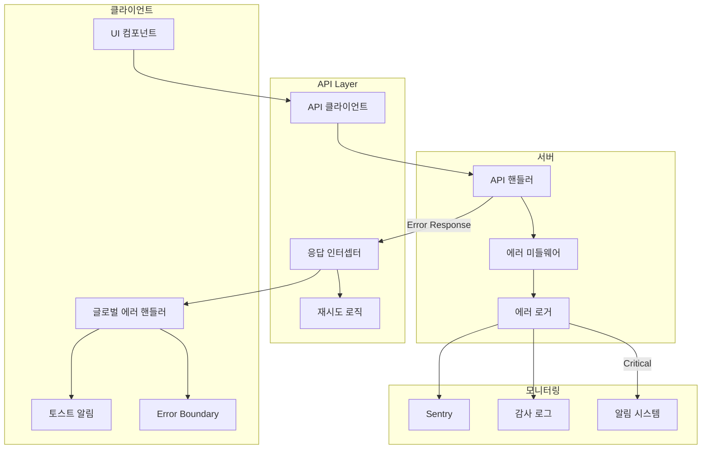

# PRD: 에러 처리 명세

## 문서 정보

| 항목 | 내용 |
|------|------|
| 문서명 | 11_PRD_에러처리.md |
| 버전 | 1.0 |
| 작성일 | 2025-01-15 |
| 의존 문서 | 09_PRD_API명세.md, 10_PRD_보안구현.md |
| 후속 문서 | 12_PRD_테스트전략.md |

---

## 1. 에러 처리 아키텍처

### 1.1 전체 구조



### 1.2 에러 처리 원칙

| 원칙 | 설명 | 구현 |
|------|------|------|
| **일관성** | 모든 에러에 동일한 형식 적용 | ErrorResponse 인터페이스 |
| **사용자 친화적** | 기술적 용어 대신 이해하기 쉬운 메시지 | 에러 메시지 가이드라인 |
| **추적 가능성** | 모든 에러에 고유 참조 ID | reference 필드 |
| **복구 가능성** | 가능한 경우 복구 방법 안내 | 재시도, 대체 액션 제공 |
| **보안** | 민감한 정보 노출 방지 | 스택 트레이스 숨김 |

---

## 2. 에러 응답 형식

### 2.1 표준 에러 응답 인터페이스

```typescript
// src/types/error.ts

/**
 * 표준 에러 응답 형식
 */
export interface ErrorResponse {
  success: false;
  error: {
    /** 에러 코드 (예: AUTH_001) */
    code: string;
    /** 사용자 친화적 메시지 */
    message: string;
    /** 추적용 참조 ID (선택) */
    reference?: string;
    /** 필드별 검증 에러 (선택) */
    details?: Record<string, string[]>;
    /** HTTP 상태 코드 */
    status?: number;
  };
}

/**
 * 에러 상세 정보 (내부용)
 */
export interface ErrorDetails {
  /** 에러 코드 */
  code: string;
  /** 사용자 메시지 */
  message: string;
  /** HTTP 상태 코드 */
  status: number;
  /** 개발자용 상세 메시지 (프로덕션에서 숨김) */
  devMessage?: string;
  /** 원본 에러 */
  cause?: Error;
  /** 메타 정보 */
  meta?: Record<string, any>;
}

/**
 * 필드 검증 에러
 */
export interface ValidationError {
  /** 필드별 에러 메시지 */
  fieldErrors: Record<string, string[]>;
  /** 폼 레벨 에러 */
  formErrors: string[];
}
```

### 2.2 에러 응답 예시

```typescript
// 인증 에러
{
  "success": false,
  "error": {
    "code": "AUTH_001",
    "message": "이메일 또는 비밀번호를 확인해주세요",
    "reference": "err_1705312800123_abc123"
  }
}

// 검증 에러
{
  "success": false,
  "error": {
    "code": "GEN_002",
    "message": "잘못된 요청입니다",
    "reference": "err_1705312800456_def456",
    "details": {
      "email": ["유효한 이메일 형식이 아닙니다"],
      "password": ["8자 이상 입력해주세요", "숫자를 포함해야 합니다"]
    }
  }
}

// Rate Limit 에러
{
  "success": false,
  "error": {
    "code": "RATE_001",
    "message": "요청이 너무 많습니다. 잠시 후 다시 시도해주세요",
    "reference": "err_1705312800789_ghi789"
  }
}
```

---

## 3. 에러 코드 체계

### 3.1 에러 코드 명명 규칙

```
[CATEGORY]_[NUMBER]

- CATEGORY: 대문자 알파벳 (2-6자)
- NUMBER: 3자리 숫자 (001-999)

예시:
- AUTH_001: 인증 관련 첫 번째 에러
- LP_002: 랜딩페이지 관련 두 번째 에러
```

### 3.2 전체 에러 코드 정의

```typescript
// src/constants/error-codes.ts

/**
 * 에러 코드 정의
 */
export const ERROR_CODES = {
  // ========================================================================
  // 인증 에러 (AUTH)
  // ========================================================================
  AUTH_001: {
    code: 'AUTH_001',
    status: 401,
    message: '이메일 또는 비밀번호를 확인해주세요',
    devMessage: 'Invalid credentials',
  },
  AUTH_002: {
    code: 'AUTH_002',
    status: 403,
    message: '관리자 승인 대기 중입니다',
    devMessage: 'User not approved',
  },
  AUTH_003: {
    code: 'AUTH_003',
    status: 401,
    message: '세션이 만료되었습니다',
    devMessage: 'Session expired',
  },
  AUTH_004: {
    code: 'AUTH_004',
    status: 401,
    message: '보안 문제가 감지되었습니다. 다시 로그인해주세요',
    devMessage: 'Token reuse detected',
  },
  AUTH_005: {
    code: 'AUTH_005',
    status: 409,
    message: '이미 가입된 이메일입니다',
    devMessage: 'Email already exists',
  },
  AUTH_006: {
    code: 'AUTH_006',
    status: 403,
    message: '탈퇴한 계정입니다',
    devMessage: 'User deleted (soft)',
  },
  AUTH_007: {
    code: 'AUTH_007',
    status: 400,
    message: '비밀번호가 일치하지 않습니다',
    devMessage: 'Password mismatch',
  },
  AUTH_008: {
    code: 'AUTH_008',
    status: 400,
    message: '이메일 인증이 필요합니다',
    devMessage: 'Email not verified',
  },

  // ========================================================================
  // Q&A 세션 에러 (QA)
  // ========================================================================
  QA_001: {
    code: 'QA_001',
    status: 429,
    message: '프로젝트 수 제한을 초과했습니다',
    devMessage: 'Project limit exceeded',
  },
  QA_002: {
    code: 'QA_002',
    status: 404,
    message: '세션을 찾을 수 없습니다',
    devMessage: 'QA session not found',
  },
  QA_003: {
    code: 'QA_003',
    status: 400,
    message: '이미 완료된 세션입니다',
    devMessage: 'Session already completed',
  },
  QA_004: {
    code: 'QA_004',
    status: 400,
    message: '모든 질문에 답변해야 합니다',
    devMessage: 'Incomplete answers',
  },

  // ========================================================================
  // 랜딩페이지 에러 (LP)
  // ========================================================================
  LP_001: {
    code: 'LP_001',
    status: 404,
    message: '랜딩페이지를 찾을 수 없습니다',
    devMessage: 'Landing page not found',
  },
  LP_002: {
    code: 'LP_002',
    status: 410,
    message: '복구 기간(30일)이 만료되었습니다',
    devMessage: 'Recovery period expired',
  },
  LP_003: {
    code: 'LP_003',
    status: 429,
    message: '랜딩페이지 수 제한을 초과했습니다',
    devMessage: 'Landing page limit exceeded',
  },
  LP_004: {
    code: 'LP_004',
    status: 409,
    message: '이미 사용 중인 URL입니다',
    devMessage: 'Slug already in use',
  },
  LP_005: {
    code: 'LP_005',
    status: 400,
    message: '발행되지 않은 페이지입니다',
    devMessage: 'Page not published',
  },

  // ========================================================================
  // 토큰 에러 (TOKEN)
  // ========================================================================
  TOKEN_001: {
    code: 'TOKEN_001',
    status: 429,
    message: '토큰이 부족합니다',
    devMessage: 'Insufficient tokens',
  },
  TOKEN_002: {
    code: 'TOKEN_002',
    status: 429,
    message: '오늘의 사용량을 모두 소진했습니다',
    devMessage: 'Daily token limit exceeded',
  },
  TOKEN_003: {
    code: 'TOKEN_003',
    status: 400,
    message: '토큰 예약에 실패했습니다',
    devMessage: 'Token reservation failed',
  },

  // ========================================================================
  // AI 생성 에러 (AI)
  // ========================================================================
  AI_001: {
    code: 'AI_001',
    status: 500,
    message: '생성에 실패했습니다',
    devMessage: 'AI generation failed',
  },
  AI_002: {
    code: 'AI_002',
    status: 408,
    message: '요청 시간이 초과되었습니다',
    devMessage: 'AI generation timeout',
  },
  AI_003: {
    code: 'AI_003',
    status: 400,
    message: '입력 내용이 적합하지 않습니다',
    devMessage: 'Prompt injection detected or invalid input',
  },
  AI_004: {
    code: 'AI_004',
    status: 503,
    message: 'AI 서비스가 일시적으로 이용 불가합니다',
    devMessage: 'Claude API unavailable',
  },

  // ========================================================================
  // Google Form 에러 (FORM)
  // ========================================================================
  FORM_001: {
    code: 'FORM_001',
    status: 400,
    message: '유효한 Google Forms URL을 입력해주세요',
    devMessage: 'Invalid Google Forms URL',
  },
  FORM_002: {
    code: 'FORM_002',
    status: 400,
    message: '폼에 접근할 수 없습니다',
    devMessage: 'Google Form not accessible',
  },

  // ========================================================================
  // 스토리지 에러 (STORAGE)
  // ========================================================================
  STORAGE_001: {
    code: 'STORAGE_001',
    status: 413,
    message: '파일 크기가 5MB를 초과합니다',
    devMessage: 'File too large',
  },
  STORAGE_002: {
    code: 'STORAGE_002',
    status: 415,
    message: '지원하지 않는 파일 형식입니다',
    devMessage: 'Unsupported file type',
  },
  STORAGE_003: {
    code: 'STORAGE_003',
    status: 507,
    message: '저장 공간이 부족합니다',
    devMessage: 'Storage quota exceeded',
  },

  // ========================================================================
  // Rate Limit 에러 (RATE)
  // ========================================================================
  RATE_001: {
    code: 'RATE_001',
    status: 429,
    message: '요청이 너무 많습니다. 잠시 후 다시 시도해주세요',
    devMessage: 'Rate limit exceeded',
  },

  // ========================================================================
  // CORS 에러 (CORS)
  // ========================================================================
  CORS_001: {
    code: 'CORS_001',
    status: 403,
    message: '허용되지 않은 요청입니다',
    devMessage: 'Origin not allowed',
  },

  // ========================================================================
  // 검증 에러 (VALIDATION)
  // ========================================================================
  VALIDATION_001: {
    code: 'VALIDATION_001',
    status: 400,
    message: '입력 값을 확인해주세요',
    devMessage: 'Validation failed',
  },
  VALIDATION_002: {
    code: 'VALIDATION_002',
    status: 400,
    message: '필수 항목을 입력해주세요',
    devMessage: 'Required field missing',
  },

  // ========================================================================
  // 일반 에러 (GEN)
  // ========================================================================
  GEN_001: {
    code: 'GEN_001',
    status: 500,
    message: '서비스 연결에 문제가 있습니다',
    devMessage: 'Internal server error',
  },
  GEN_002: {
    code: 'GEN_002',
    status: 400,
    message: '잘못된 요청입니다',
    devMessage: 'Bad request',
  },
  GEN_003: {
    code: 'GEN_003',
    status: 403,
    message: '접근 권한이 없습니다',
    devMessage: 'Forbidden',
  },
  GEN_004: {
    code: 'GEN_004',
    status: 404,
    message: '요청한 리소스를 찾을 수 없습니다',
    devMessage: 'Resource not found',
  },
  GEN_005: {
    code: 'GEN_005',
    status: 503,
    message: '서비스 점검 중입니다',
    devMessage: 'Service unavailable',
  },

  // ========================================================================
  // 관리자 에러 (ADMIN)
  // ========================================================================
  ADMIN_001: {
    code: 'ADMIN_001',
    status: 403,
    message: '관리자 권한이 필요합니다',
    devMessage: 'Admin access required',
  },
  ADMIN_002: {
    code: 'ADMIN_002',
    status: 404,
    message: '사용자를 찾을 수 없습니다',
    devMessage: 'User not found',
  },
} as const;

export type ErrorCode = keyof typeof ERROR_CODES;

/**
 * 에러 코드로 에러 정보 조회
 */
export function getErrorInfo(code: ErrorCode) {
  return ERROR_CODES[code];
}

/**
 * HTTP 상태 코드로 기본 에러 코드 조회
 */
export function getDefaultErrorCode(status: number): ErrorCode {
  const statusMap: Record<number, ErrorCode> = {
    400: 'GEN_002',
    401: 'AUTH_003',
    403: 'GEN_003',
    404: 'GEN_004',
    408: 'AI_002',
    409: 'AUTH_005',
    413: 'STORAGE_001',
    415: 'STORAGE_002',
    429: 'RATE_001',
    500: 'GEN_001',
    503: 'GEN_005',
  };

  return statusMap[status] || 'GEN_001';
}
```

---

## 4. 서버 사이드 에러 처리

### 4.1 커스텀 에러 클래스

```typescript
// src/lib/errors/AppError.ts

import { ERROR_CODES, ErrorCode } from '@/constants/error-codes';

/**
 * 애플리케이션 커스텀 에러
 */
export class AppError extends Error {
  readonly code: string;
  readonly status: number;
  readonly reference: string;
  readonly details?: Record<string, string[]>;
  readonly cause?: Error;

  constructor(
    errorCode: ErrorCode,
    options?: {
      details?: Record<string, string[]>;
      cause?: Error;
      customMessage?: string;
    }
  ) {
    const errorInfo = ERROR_CODES[errorCode];

    super(options?.customMessage || errorInfo.message);

    this.name = 'AppError';
    this.code = errorInfo.code;
    this.status = errorInfo.status;
    this.reference = generateErrorReference();
    this.details = options?.details;
    this.cause = options?.cause;

    // Error 스택 트레이스 캡처
    Error.captureStackTrace(this, this.constructor);
  }

  /**
   * JSON 응답으로 변환
   */
  toJSON() {
    return {
      success: false,
      error: {
        code: this.code,
        message: this.message,
        reference: this.reference,
        ...(this.details && { details: this.details }),
      },
    };
  }
}

/**
 * 에러 참조 ID 생성
 */
function generateErrorReference(): string {
  const timestamp = Date.now();
  const random = Math.random().toString(36).substring(2, 8);
  return `err_${timestamp}_${random}`;
}

// ============================================================================
// 특수 에러 클래스
// ============================================================================

/**
 * 인증 에러
 */
export class AuthError extends AppError {
  constructor(
    errorCode: Extract<ErrorCode, `AUTH_${string}`>,
    options?: { cause?: Error }
  ) {
    super(errorCode, options);
    this.name = 'AuthError';
  }
}

/**
 * 검증 에러
 */
export class ValidationError extends AppError {
  constructor(
    details: Record<string, string[]>,
    options?: { cause?: Error }
  ) {
    super('VALIDATION_001', { details, ...options });
    this.name = 'ValidationError';
  }

  /**
   * Zod 에러에서 생성
   */
  static fromZodError(zodError: z.ZodError): ValidationError {
    const details: Record<string, string[]> = {};

    zodError.errors.forEach((err) => {
      const path = err.path.join('.');
      if (!details[path]) {
        details[path] = [];
      }
      details[path].push(err.message);
    });

    return new ValidationError(details);
  }
}

/**
 * Rate Limit 에러
 */
export class RateLimitError extends AppError {
  readonly retryAfter: number;

  constructor(retryAfter: number) {
    super('RATE_001');
    this.name = 'RateLimitError';
    this.retryAfter = retryAfter;
  }
}

/**
 * 리소스 없음 에러
 */
export class NotFoundError extends AppError {
  constructor(resource: string) {
    super('GEN_004', { customMessage: `${resource}을(를) 찾을 수 없습니다` });
    this.name = 'NotFoundError';
  }
}

/**
 * 권한 없음 에러
 */
export class ForbiddenError extends AppError {
  constructor(message?: string) {
    super('GEN_003', { customMessage: message });
    this.name = 'ForbiddenError';
  }
}
```

### 4.2 에러 핸들러 미들웨어

```typescript
// src/lib/errors/handler.ts

import { NextRequest, NextResponse } from 'next/server';
import { z } from 'zod';
import { AppError, ValidationError } from './AppError';
import { logAudit } from '@/lib/audit/logger';
import * as Sentry from '@sentry/nextjs';

/**
 * API 핸들러 래퍼
 * - 에러 자동 캐치 및 변환
 * - 로깅 및 모니터링
 */
export function withErrorHandler<T>(
  handler: (request: NextRequest, context?: any) => Promise<NextResponse<T>>
) {
  return async (
    request: NextRequest,
    context?: any
  ): Promise<NextResponse> => {
    try {
      return await handler(request, context);
    } catch (error) {
      return handleError(error, request);
    }
  };
}

/**
 * 에러 처리 및 응답 생성
 */
export function handleError(
  error: unknown,
  request: NextRequest
): NextResponse {
  // 참조 ID 생성
  const reference = `err_${Date.now()}_${Math.random().toString(36).substring(2, 8)}`;

  // 에러 로깅
  logError(error, reference, request);

  // AppError인 경우
  if (error instanceof AppError) {
    return NextResponse.json(error.toJSON(), { status: error.status });
  }

  // Zod 검증 에러
  if (error instanceof z.ZodError) {
    const validationError = ValidationError.fromZodError(error);
    return NextResponse.json(validationError.toJSON(), {
      status: validationError.status,
    });
  }

  // 일반 Error
  if (error instanceof Error) {
    // Sentry에 보고
    Sentry.captureException(error);

    // 프로덕션에서는 상세 정보 숨김
    const isDev = process.env.NODE_ENV === 'development';

    return NextResponse.json(
      {
        success: false,
        error: {
          code: 'GEN_001',
          message: '서비스 연결에 문제가 있습니다',
          reference,
          ...(isDev && { devMessage: error.message }),
        },
      },
      { status: 500 }
    );
  }

  // 알 수 없는 에러
  return NextResponse.json(
    {
      success: false,
      error: {
        code: 'GEN_001',
        message: '알 수 없는 오류가 발생했습니다',
        reference,
      },
    },
    { status: 500 }
  );
}

/**
 * 에러 로깅
 */
async function logError(
  error: unknown,
  reference: string,
  request: NextRequest
): Promise<void> {
  const errorInfo = {
    reference,
    url: request.url,
    method: request.method,
    timestamp: new Date().toISOString(),
    error: error instanceof Error ? {
      name: error.name,
      message: error.message,
      stack: error.stack,
    } : String(error),
  };

  // 콘솔 로깅
  console.error('[API Error]', JSON.stringify(errorInfo, null, 2));

  // 감사 로그 (비동기)
  try {
    await logAudit({
      action: 'api_error',
      details: {
        reference,
        error_code: error instanceof AppError ? error.code : 'GEN_001',
        path: new URL(request.url).pathname,
        method: request.method,
      },
      ipAddress: request.headers.get('x-forwarded-for')?.split(',')[0],
    });
  } catch (auditError) {
    console.error('[Audit] Failed to log error:', auditError);
  }
}

/**
 * API 핸들러 사용 예시
 */
/*
export const POST = withErrorHandler(async (request: NextRequest) => {
  const body = await request.json();

  // 검증 에러 발생 시 자동 처리
  const validated = loginSchema.parse(body);

  // 비즈니스 로직 에러
  if (!user) {
    throw new AuthError('AUTH_001');
  }

  return NextResponse.json({ success: true, data: user });
});
*/
```

### 4.3 API 라우트 에러 처리 예시

```typescript
// app/api/auth/login/route.ts

import { NextRequest, NextResponse } from 'next/server';
import { z } from 'zod';
import { withErrorHandler } from '@/lib/errors/handler';
import { AppError, AuthError, ValidationError } from '@/lib/errors/AppError';
import { createSuccessResponse } from '@/types/api/response';

// 요청 스키마
const loginSchema = z.object({
  email: z.string().email('유효한 이메일을 입력해주세요'),
  password: z.string().min(8, '비밀번호는 8자 이상입니다'),
});

export const POST = withErrorHandler(async (request: NextRequest) => {
  // 1. 요청 파싱 및 검증
  const body = await request.json();
  const result = loginSchema.safeParse(body);

  if (!result.success) {
    throw ValidationError.fromZodError(result.error);
  }

  const { email, password } = result.data;

  // 2. 인증 처리
  const { data: authData, error: authError } = await supabase.auth
    .signInWithPassword({ email, password });

  if (authError) {
    throw new AuthError('AUTH_001', { cause: authError });
  }

  // 3. 승인 상태 확인
  const { data: profile } = await supabase
    .from('profiles')
    .select('is_approved, deleted_at')
    .eq('id', authData.user.id)
    .single();

  if (profile?.deleted_at) {
    throw new AuthError('AUTH_006');
  }

  if (!profile?.is_approved) {
    throw new AuthError('AUTH_002');
  }

  // 4. 성공 응답
  return NextResponse.json(
    createSuccessResponse({
      accessToken: authData.session.access_token,
      user: {
        id: authData.user.id,
        email: authData.user.email,
      },
    }),
    {
      status: 200,
      headers: {
        'Set-Cookie': createRefreshTokenCookie(refreshToken),
      },
    }
  );
});
```

---

## 5. 클라이언트 사이드 에러 처리

### 5.1 API 클라이언트

```typescript
// src/lib/api/client.ts

import type { ErrorResponse } from '@/types/error';

// ============================================================================
// 타입 정의
// ============================================================================

interface ApiClientConfig {
  baseUrl?: string;
  timeout?: number;
  retryCount?: number;
  retryDelay?: number;
}

interface RequestConfig extends RequestInit {
  timeout?: number;
  retry?: boolean;
}

// ============================================================================
// API 클라이언트 클래스
// ============================================================================

class ApiClient {
  private baseUrl: string;
  private timeout: number;
  private retryCount: number;
  private retryDelay: number;

  constructor(config: ApiClientConfig = {}) {
    this.baseUrl = config.baseUrl || '';
    this.timeout = config.timeout || 30000;
    this.retryCount = config.retryCount || 3;
    this.retryDelay = config.retryDelay || 1000;
  }

  /**
   * API 요청 실행
   */
  async request<T>(
    endpoint: string,
    config: RequestConfig = {}
  ): Promise<T> {
    const url = `${this.baseUrl}${endpoint}`;
    const { timeout = this.timeout, retry = true, ...fetchConfig } = config;

    // 타임아웃 설정
    const controller = new AbortController();
    const timeoutId = setTimeout(() => controller.abort(), timeout);

    // 기본 헤더
    const headers: HeadersInit = {
      'Content-Type': 'application/json',
      ...fetchConfig.headers,
    };

    try {
      const response = await this.executeWithRetry(
        url,
        {
          ...fetchConfig,
          headers,
          signal: controller.signal,
        },
        retry ? this.retryCount : 0
      );

      clearTimeout(timeoutId);

      // 응답 파싱
      const data = await response.json();

      // 에러 응답 처리
      if (!response.ok || data.success === false) {
        throw new ApiError(data.error || {
          code: 'GEN_001',
          message: '요청 처리에 실패했습니다',
        }, response.status);
      }

      return data.data as T;
    } catch (error) {
      clearTimeout(timeoutId);

      // AbortError (타임아웃)
      if (error instanceof Error && error.name === 'AbortError') {
        throw new ApiError({
          code: 'AI_002',
          message: '요청 시간이 초과되었습니다',
        }, 408);
      }

      // 이미 ApiError인 경우
      if (error instanceof ApiError) {
        throw error;
      }

      // 네트워크 에러
      throw new ApiError({
        code: 'GEN_001',
        message: '네트워크 연결을 확인해주세요',
      }, 0);
    }
  }

  /**
   * 재시도 로직
   */
  private async executeWithRetry(
    url: string,
    config: RequestInit,
    retries: number
  ): Promise<Response> {
    try {
      const response = await fetch(url, config);

      // 5xx 에러 시 재시도
      if (response.status >= 500 && retries > 0) {
        await this.delay(this.retryDelay);
        return this.executeWithRetry(url, config, retries - 1);
      }

      return response;
    } catch (error) {
      if (retries > 0) {
        await this.delay(this.retryDelay);
        return this.executeWithRetry(url, config, retries - 1);
      }
      throw error;
    }
  }

  private delay(ms: number): Promise<void> {
    return new Promise(resolve => setTimeout(resolve, ms));
  }

  // ========================================================================
  // 편의 메서드
  // ========================================================================

  async get<T>(endpoint: string, config?: RequestConfig): Promise<T> {
    return this.request<T>(endpoint, { ...config, method: 'GET' });
  }

  async post<T>(endpoint: string, data?: unknown, config?: RequestConfig): Promise<T> {
    return this.request<T>(endpoint, {
      ...config,
      method: 'POST',
      body: JSON.stringify(data),
    });
  }

  async patch<T>(endpoint: string, data?: unknown, config?: RequestConfig): Promise<T> {
    return this.request<T>(endpoint, {
      ...config,
      method: 'PATCH',
      body: JSON.stringify(data),
    });
  }

  async delete<T>(endpoint: string, config?: RequestConfig): Promise<T> {
    return this.request<T>(endpoint, { ...config, method: 'DELETE' });
  }
}

// ============================================================================
// API 에러 클래스
// ============================================================================

export class ApiError extends Error {
  readonly code: string;
  readonly status: number;
  readonly reference?: string;
  readonly details?: Record<string, string[]>;

  constructor(
    error: {
      code: string;
      message: string;
      reference?: string;
      details?: Record<string, string[]>;
    },
    status: number
  ) {
    super(error.message);
    this.name = 'ApiError';
    this.code = error.code;
    this.status = status;
    this.reference = error.reference;
    this.details = error.details;
  }

  /**
   * 재시도 가능한 에러인지 확인
   */
  get isRetryable(): boolean {
    return this.status >= 500 || this.status === 408;
  }

  /**
   * 인증 에러인지 확인
   */
  get isAuthError(): boolean {
    return this.status === 401 || this.code.startsWith('AUTH_');
  }

  /**
   * Rate Limit 에러인지 확인
   */
  get isRateLimited(): boolean {
    return this.status === 429;
  }
}

// ============================================================================
// 기본 인스턴스 및 내보내기
// ============================================================================

export const apiClient = new ApiClient({
  baseUrl: '/api',
  timeout: 30000,
  retryCount: 3,
});

export default apiClient;
```

### 5.2 글로벌 에러 핸들러

```typescript
// src/lib/errors/global-handler.ts

import { ApiError } from '@/lib/api/client';
import { useAuthStore } from '@/stores/auth';
import { toast } from '@/components/ui/toast';

/**
 * 글로벌 에러 핸들러 타입
 */
export interface GlobalErrorHandler {
  handle: (error: unknown) => void;
  handleApiError: (error: ApiError) => void;
}

/**
 * 글로벌 에러 핸들러 생성
 */
export function createGlobalErrorHandler(): GlobalErrorHandler {
  const handleApiError = (error: ApiError) => {
    // 인증 에러 처리
    if (error.isAuthError) {
      handleAuthError(error);
      return;
    }

    // Rate Limit 에러 처리
    if (error.isRateLimited) {
      handleRateLimitError(error);
      return;
    }

    // 검증 에러 처리
    if (error.code === 'VALIDATION_001' && error.details) {
      handleValidationError(error);
      return;
    }

    // 일반 에러 토스트
    toast.error(error.message);
  };

  const handle = (error: unknown) => {
    if (error instanceof ApiError) {
      handleApiError(error);
      return;
    }

    if (error instanceof Error) {
      console.error('[Error]', error);
      toast.error('오류가 발생했습니다');
      return;
    }

    console.error('[Unknown Error]', error);
    toast.error('알 수 없는 오류가 발생했습니다');
  };

  return { handle, handleApiError };
}

// ============================================================================
// 특수 에러 핸들러
// ============================================================================

/**
 * 인증 에러 처리
 */
function handleAuthError(error: ApiError): void {
  const authStore = useAuthStore.getState();

  switch (error.code) {
    case 'AUTH_003': // 세션 만료
    case 'AUTH_004': // 토큰 재사용 감지
      toast.warning('세션이 만료되었습니다. 다시 로그인해주세요.');
      authStore.logout();
      window.location.href = '/login?expired=true';
      break;

    case 'AUTH_002': // 승인 대기
      toast.info('관리자 승인 대기 중입니다.');
      authStore.logout();
      window.location.href = '/pending-approval';
      break;

    default:
      toast.error(error.message);
  }
}

/**
 * Rate Limit 에러 처리
 */
function handleRateLimitError(error: ApiError): void {
  toast.warning(
    '요청이 너무 많습니다. 잠시 후 다시 시도해주세요.',
    { duration: 5000 }
  );
}

/**
 * 검증 에러 처리
 */
function handleValidationError(error: ApiError): void {
  if (error.details) {
    // 첫 번째 에러만 표시
    const firstField = Object.keys(error.details)[0];
    const firstMessage = error.details[firstField][0];
    toast.error(firstMessage);
  } else {
    toast.error(error.message);
  }
}

// ============================================================================
// 전역 인스턴스
// ============================================================================

export const globalErrorHandler = createGlobalErrorHandler();
```

### 5.3 React Error Boundary

```typescript
// src/components/ErrorBoundary.tsx

'use client';

import React, { Component, ErrorInfo, ReactNode } from 'react';
import * as Sentry from '@sentry/nextjs';

// ============================================================================
// 타입 정의
// ============================================================================

interface ErrorBoundaryProps {
  children: ReactNode;
  fallback?: ReactNode | ((error: Error, reset: () => void) => ReactNode);
  onError?: (error: Error, errorInfo: ErrorInfo) => void;
}

interface ErrorBoundaryState {
  hasError: boolean;
  error: Error | null;
}

// ============================================================================
// Error Boundary 컴포넌트
// ============================================================================

export class ErrorBoundary extends Component<
  ErrorBoundaryProps,
  ErrorBoundaryState
> {
  constructor(props: ErrorBoundaryProps) {
    super(props);
    this.state = { hasError: false, error: null };
  }

  static getDerivedStateFromError(error: Error): ErrorBoundaryState {
    return { hasError: true, error };
  }

  componentDidCatch(error: Error, errorInfo: ErrorInfo): void {
    // Sentry에 보고
    Sentry.captureException(error, {
      extra: {
        componentStack: errorInfo.componentStack,
      },
    });

    // 콘솔 로깅
    console.error('[ErrorBoundary]', error, errorInfo);

    // 커스텀 에러 핸들러 호출
    this.props.onError?.(error, errorInfo);
  }

  handleReset = (): void => {
    this.setState({ hasError: false, error: null });
  };

  render(): ReactNode {
    if (this.state.hasError && this.state.error) {
      // 커스텀 fallback
      if (typeof this.props.fallback === 'function') {
        return this.props.fallback(this.state.error, this.handleReset);
      }

      if (this.props.fallback) {
        return this.props.fallback;
      }

      // 기본 fallback
      return (
        <DefaultErrorFallback
          error={this.state.error}
          reset={this.handleReset}
        />
      );
    }

    return this.props.children;
  }
}

// ============================================================================
// 기본 에러 Fallback UI
// ============================================================================

interface ErrorFallbackProps {
  error: Error;
  reset: () => void;
}

function DefaultErrorFallback({ error, reset }: ErrorFallbackProps) {
  return (
    <div className="flex min-h-screen flex-col items-center justify-center p-4">
      <div className="w-full max-w-md rounded-lg bg-white p-6 shadow-lg">
        <div className="mb-4 flex items-center justify-center">
          <svg
            className="h-12 w-12 text-red-500"
            fill="none"
            viewBox="0 0 24 24"
            stroke="currentColor"
          >
            <path
              strokeLinecap="round"
              strokeLinejoin="round"
              strokeWidth={2}
              d="M12 9v2m0 4h.01m-6.938 4h13.856c1.54 0 2.502-1.667 1.732-3L13.732 4c-.77-1.333-2.694-1.333-3.464 0L3.34 16c-.77 1.333.192 3 1.732 3z"
            />
          </svg>
        </div>

        <h2 className="mb-2 text-center text-xl font-semibold text-gray-900">
          오류가 발생했습니다
        </h2>

        <p className="mb-4 text-center text-gray-600">
          페이지를 표시하는 중 문제가 발생했습니다.
        </p>

        {process.env.NODE_ENV === 'development' && (
          <pre className="mb-4 overflow-auto rounded bg-gray-100 p-2 text-xs text-gray-700">
            {error.message}
          </pre>
        )}

        <div className="flex gap-2">
          <button
            onClick={reset}
            className="flex-1 rounded-md bg-blue-600 px-4 py-2 text-white hover:bg-blue-700"
          >
            다시 시도
          </button>

          <button
            onClick={() => window.location.reload()}
            className="flex-1 rounded-md border border-gray-300 px-4 py-2 text-gray-700 hover:bg-gray-50"
          >
            페이지 새로고침
          </button>
        </div>
      </div>
    </div>
  );
}

// ============================================================================
// 페이지별 Error Boundary
// ============================================================================

interface PageErrorBoundaryProps {
  children: ReactNode;
  pageName?: string;
}

export function PageErrorBoundary({
  children,
  pageName = 'Page',
}: PageErrorBoundaryProps) {
  return (
    <ErrorBoundary
      onError={(error) => {
        console.error(`[${pageName}] Error:`, error);
      }}
      fallback={(error, reset) => (
        <div className="p-4">
          <div className="rounded-lg border border-red-200 bg-red-50 p-4">
            <h3 className="font-medium text-red-800">
              {pageName} 로딩 중 오류가 발생했습니다
            </h3>
            <p className="mt-1 text-sm text-red-600">
              {error.message}
            </p>
            <button
              onClick={reset}
              className="mt-2 text-sm font-medium text-red-700 underline"
            >
              다시 시도
            </button>
          </div>
        </div>
      )}
    >
      {children}
    </ErrorBoundary>
  );
}

export default ErrorBoundary;
```

### 5.4 React Query 에러 처리

```typescript
// src/lib/query/error-handler.ts

import { QueryClient, MutationCache, QueryCache } from '@tanstack/react-query';
import { ApiError } from '@/lib/api/client';
import { globalErrorHandler } from '@/lib/errors/global-handler';

/**
 * React Query 클라이언트 생성 (에러 처리 포함)
 */
export function createQueryClient(): QueryClient {
  return new QueryClient({
    defaultOptions: {
      queries: {
        // 재시도 설정
        retry: (failureCount, error) => {
          // ApiError가 재시도 가능하고 3회 미만인 경우만 재시도
          if (error instanceof ApiError) {
            return error.isRetryable && failureCount < 3;
          }
          return failureCount < 3;
        },

        // 재시도 딜레이 (지수 백오프)
        retryDelay: (attemptIndex) => Math.min(1000 * 2 ** attemptIndex, 30000),

        // 포커스 시 재조회
        refetchOnWindowFocus: false,

        // 에러 유지 시간
        staleTime: 1000 * 60 * 5, // 5분
      },

      mutations: {
        // 뮤테이션 재시도 없음
        retry: false,
      },
    },

    // 뮤테이션 에러 처리
    mutationCache: new MutationCache({
      onError: (error) => {
        globalErrorHandler.handle(error);
      },
    }),

    // 쿼리 에러 처리
    queryCache: new QueryCache({
      onError: (error, query) => {
        // 백그라운드 에러는 무시
        if (query.state.data !== undefined) {
          return;
        }

        // 인증 에러는 글로벌 핸들러에서 처리
        if (error instanceof ApiError && error.isAuthError) {
          globalErrorHandler.handleApiError(error);
          return;
        }

        // 그 외 에러는 로깅만
        console.error('[Query Error]', error);
      },
    }),
  });
}

/**
 * 쿼리 에러 훅
 */
export function useQueryError(error: unknown) {
  if (error instanceof ApiError) {
    return {
      code: error.code,
      message: error.message,
      isRetryable: error.isRetryable,
      isAuthError: error.isAuthError,
    };
  }

  if (error instanceof Error) {
    return {
      code: 'GEN_001',
      message: error.message,
      isRetryable: false,
      isAuthError: false,
    };
  }

  return {
    code: 'GEN_001',
    message: '알 수 없는 오류',
    isRetryable: false,
    isAuthError: false,
  };
}
```

---

## 6. 토스트 알림 시스템

### 6.1 토스트 컴포넌트

```typescript
// src/components/ui/toast/Toast.tsx

'use client';

import React, { createContext, useContext, useState, useCallback } from 'react';
import { createPortal } from 'react-dom';

// ============================================================================
// 타입 정의
// ============================================================================

type ToastType = 'success' | 'error' | 'warning' | 'info';

interface ToastItem {
  id: string;
  type: ToastType;
  message: string;
  duration: number;
}

interface ToastOptions {
  duration?: number;
}

interface ToastContextType {
  success: (message: string, options?: ToastOptions) => void;
  error: (message: string, options?: ToastOptions) => void;
  warning: (message: string, options?: ToastOptions) => void;
  info: (message: string, options?: ToastOptions) => void;
}

// ============================================================================
// Context
// ============================================================================

const ToastContext = createContext<ToastContextType | null>(null);

export function useToast(): ToastContextType {
  const context = useContext(ToastContext);
  if (!context) {
    throw new Error('useToast must be used within ToastProvider');
  }
  return context;
}

// ============================================================================
// Provider
// ============================================================================

const DEFAULT_DURATION = 3000;

export function ToastProvider({ children }: { children: React.ReactNode }) {
  const [toasts, setToasts] = useState<ToastItem[]>([]);

  const addToast = useCallback(
    (type: ToastType, message: string, options: ToastOptions = {}) => {
      const id = `toast-${Date.now()}-${Math.random().toString(36).slice(2)}`;
      const duration = options.duration ?? DEFAULT_DURATION;

      setToasts((prev) => [...prev, { id, type, message, duration }]);

      // 자동 제거
      setTimeout(() => {
        setToasts((prev) => prev.filter((t) => t.id !== id));
      }, duration);
    },
    []
  );

  const removeToast = useCallback((id: string) => {
    setToasts((prev) => prev.filter((t) => t.id !== id));
  }, []);

  const value: ToastContextType = {
    success: (message, options) => addToast('success', message, options),
    error: (message, options) => addToast('error', message, options),
    warning: (message, options) => addToast('warning', message, options),
    info: (message, options) => addToast('info', message, options),
  };

  return (
    <ToastContext.Provider value={value}>
      {children}
      {typeof window !== 'undefined' &&
        createPortal(
          <ToastContainer toasts={toasts} onRemove={removeToast} />,
          document.body
        )}
    </ToastContext.Provider>
  );
}

// ============================================================================
// 컨테이너
// ============================================================================

interface ToastContainerProps {
  toasts: ToastItem[];
  onRemove: (id: string) => void;
}

function ToastContainer({ toasts, onRemove }: ToastContainerProps) {
  return (
    <div className="fixed bottom-4 right-4 z-50 flex flex-col gap-2">
      {toasts.map((toast) => (
        <ToastItem key={toast.id} toast={toast} onRemove={onRemove} />
      ))}
    </div>
  );
}

// ============================================================================
// 개별 토스트
// ============================================================================

interface ToastItemProps {
  toast: ToastItem;
  onRemove: (id: string) => void;
}

function ToastItem({ toast, onRemove }: ToastItemProps) {
  const typeStyles: Record<ToastType, string> = {
    success: 'bg-green-500 text-white',
    error: 'bg-red-500 text-white',
    warning: 'bg-yellow-500 text-white',
    info: 'bg-blue-500 text-white',
  };

  const icons: Record<ToastType, string> = {
    success: 'check-circle',
    error: 'x-circle',
    warning: 'exclamation',
    info: 'information-circle',
  };

  return (
    <div
      className={`
        flex items-center gap-3 rounded-lg px-4 py-3 shadow-lg
        animate-in slide-in-from-right-full duration-300
        ${typeStyles[toast.type]}
      `}
      role="alert"
    >
      <span className="text-sm font-medium">{toast.message}</span>

      <button
        onClick={() => onRemove(toast.id)}
        className="ml-2 hover:opacity-70"
        aria-label="닫기"
      >
        <svg
          className="h-4 w-4"
          fill="none"
          viewBox="0 0 24 24"
          stroke="currentColor"
        >
          <path
            strokeLinecap="round"
            strokeLinejoin="round"
            strokeWidth={2}
            d="M6 18L18 6M6 6l12 12"
          />
        </svg>
      </button>
    </div>
  );
}

// ============================================================================
// 글로벌 toast 객체 (Provider 외부에서 사용)
// ============================================================================

let toastInstance: ToastContextType | null = null;

export function setToastInstance(instance: ToastContextType) {
  toastInstance = instance;
}

export const toast = {
  success: (message: string, options?: ToastOptions) =>
    toastInstance?.success(message, options),
  error: (message: string, options?: ToastOptions) =>
    toastInstance?.error(message, options),
  warning: (message: string, options?: ToastOptions) =>
    toastInstance?.warning(message, options),
  info: (message: string, options?: ToastOptions) =>
    toastInstance?.info(message, options),
};
```

---

## 7. 폼 에러 처리

### 7.1 React Hook Form 통합

```typescript
// src/lib/form/error-handler.ts

import { UseFormSetError, FieldValues, Path } from 'react-hook-form';
import { ApiError } from '@/lib/api/client';
import { toast } from '@/components/ui/toast';

/**
 * API 에러를 폼 에러로 변환
 */
export function setApiErrorsToForm<T extends FieldValues>(
  error: ApiError,
  setError: UseFormSetError<T>,
  fieldMapping?: Record<string, Path<T>>
): void {
  // 검증 에러인 경우 필드별 에러 설정
  if (error.details) {
    Object.entries(error.details).forEach(([field, messages]) => {
      const mappedField = fieldMapping?.[field] || (field as Path<T>);

      setError(mappedField, {
        type: 'server',
        message: messages[0], // 첫 번째 에러만 표시
      });
    });

    return;
  }

  // 특정 필드 관련 에러 처리
  const fieldErrorMap: Record<string, Path<T>> = {
    AUTH_005: 'email' as Path<T>, // 이메일 중복
    AUTH_007: 'confirmPassword' as Path<T>, // 비밀번호 불일치
  };

  const targetField = fieldErrorMap[error.code];
  if (targetField) {
    setError(targetField, {
      type: 'server',
      message: error.message,
    });
    return;
  }

  // 폼 레벨 에러로 처리 (root 에러)
  setError('root', {
    type: 'server',
    message: error.message,
  });
}

/**
 * 폼 제출 래퍼 (에러 처리 포함)
 */
export async function handleFormSubmit<T extends FieldValues, R>(
  submitFn: (data: T) => Promise<R>,
  setError: UseFormSetError<T>,
  options?: {
    onSuccess?: (result: R) => void;
    onError?: (error: ApiError) => void;
    showToast?: boolean;
  }
): Promise<(data: T) => Promise<void>> {
  return async (data: T) => {
    try {
      const result = await submitFn(data);
      options?.onSuccess?.(result);
    } catch (error) {
      if (error instanceof ApiError) {
        setApiErrorsToForm(error, setError);
        options?.onError?.(error);

        if (options?.showToast !== false) {
          // 검증 에러는 필드에 표시하므로 토스트 생략
          if (!error.details) {
            toast.error(error.message);
          }
        }
      } else {
        setError('root', {
          type: 'server',
          message: '오류가 발생했습니다. 다시 시도해주세요.',
        });

        if (options?.showToast !== false) {
          toast.error('오류가 발생했습니다');
        }
      }
    }
  };
}
```

### 7.2 폼 에러 컴포넌트

```typescript
// src/components/form/FormError.tsx

import React from 'react';
import { FieldError, FieldErrors } from 'react-hook-form';

// ============================================================================
// 필드 에러
// ============================================================================

interface FieldErrorMessageProps {
  error?: FieldError;
  className?: string;
}

export function FieldErrorMessage({
  error,
  className = '',
}: FieldErrorMessageProps) {
  if (!error) return null;

  return (
    <p
      className={`mt-1 text-sm text-red-600 ${className}`}
      role="alert"
    >
      {error.message}
    </p>
  );
}

// ============================================================================
// 폼 레벨 에러
// ============================================================================

interface FormErrorProps {
  errors: FieldErrors;
  className?: string;
}

export function FormError({ errors, className = '' }: FormErrorProps) {
  const rootError = errors.root;

  if (!rootError) return null;

  return (
    <div
      className={`rounded-md bg-red-50 p-4 ${className}`}
      role="alert"
    >
      <div className="flex">
        <div className="flex-shrink-0">
          <svg
            className="h-5 w-5 text-red-400"
            viewBox="0 0 20 20"
            fill="currentColor"
          >
            <path
              fillRule="evenodd"
              d="M10 18a8 8 0 100-16 8 8 0 000 16zM8.707 7.293a1 1 0 00-1.414 1.414L8.586 10l-1.293 1.293a1 1 0 101.414 1.414L10 11.414l1.293 1.293a1 1 0 001.414-1.414L11.414 10l1.293-1.293a1 1 0 00-1.414-1.414L10 8.586 8.707 7.293z"
              clipRule="evenodd"
            />
          </svg>
        </div>
        <div className="ml-3">
          <p className="text-sm font-medium text-red-800">
            {rootError.message}
          </p>
        </div>
      </div>
    </div>
  );
}

// ============================================================================
// 에러 요약 (여러 필드 에러)
// ============================================================================

interface ErrorSummaryProps {
  errors: FieldErrors;
  className?: string;
}

export function ErrorSummary({ errors, className = '' }: ErrorSummaryProps) {
  const errorList = Object.entries(errors)
    .filter(([key]) => key !== 'root')
    .map(([key, error]) => ({
      field: key,
      message: (error as FieldError)?.message || '유효하지 않은 값입니다',
    }));

  if (errorList.length === 0) return null;

  return (
    <div
      className={`rounded-md bg-red-50 p-4 ${className}`}
      role="alert"
    >
      <div className="flex">
        <div className="flex-shrink-0">
          <svg
            className="h-5 w-5 text-red-400"
            viewBox="0 0 20 20"
            fill="currentColor"
          >
            <path
              fillRule="evenodd"
              d="M10 18a8 8 0 100-16 8 8 0 000 16zM8.707 7.293a1 1 0 00-1.414 1.414L8.586 10l-1.293 1.293a1 1 0 101.414 1.414L10 11.414l1.293 1.293a1 1 0 001.414-1.414L11.414 10l1.293-1.293a1 1 0 00-1.414-1.414L10 8.586 8.707 7.293z"
              clipRule="evenodd"
            />
          </svg>
        </div>
        <div className="ml-3">
          <h3 className="text-sm font-medium text-red-800">
            입력 내용을 확인해주세요
          </h3>
          <ul className="mt-2 list-disc pl-5 text-sm text-red-700">
            {errorList.map(({ field, message }) => (
              <li key={field}>{message}</li>
            ))}
          </ul>
        </div>
      </div>
    </div>
  );
}
```

---

## 8. 에러 모니터링

### 8.1 Sentry 설정

```typescript
// sentry.client.config.ts

import * as Sentry from '@sentry/nextjs';
import { ApiError } from '@/lib/api/client';

Sentry.init({
  dsn: process.env.NEXT_PUBLIC_SENTRY_DSN,

  // 샘플링 레이트 (프로덕션)
  tracesSampleRate: process.env.NODE_ENV === 'production' ? 0.1 : 1.0,

  // 에러 필터링
  beforeSend(event, hint) {
    const error = hint.originalException;

    // ApiError 중 사용자 에러는 무시
    if (error instanceof ApiError) {
      // 4xx 에러는 사용자 실수이므로 무시
      if (error.status >= 400 && error.status < 500) {
        return null;
      }
    }

    // 네트워크 에러는 별도 분류
    if (error instanceof TypeError && error.message.includes('fetch')) {
      event.tags = {
        ...event.tags,
        error_category: 'network',
      };
    }

    return event;
  },

  // 태그 추가
  initialScope: {
    tags: {
      app_version: process.env.NEXT_PUBLIC_APP_VERSION,
      environment: process.env.NODE_ENV,
    },
  },

  // 브레드크럼 필터링 (민감 정보 제거)
  beforeBreadcrumb(breadcrumb) {
    // fetch 요청에서 Authorization 헤더 제거
    if (breadcrumb.category === 'fetch' && breadcrumb.data) {
      delete breadcrumb.data.Authorization;
    }
    return breadcrumb;
  },
});
```

### 8.2 Sentry 서버 설정

```typescript
// sentry.server.config.ts

import * as Sentry from '@sentry/nextjs';

Sentry.init({
  dsn: process.env.SENTRY_DSN,

  tracesSampleRate: 0.1,

  // 에러 필터링
  beforeSend(event, hint) {
    const error = hint.originalException;

    // 알려진 에러 무시
    if (error instanceof Error) {
      const ignoreMessages = [
        'User not approved',
        'Invalid credentials',
        'Rate limit exceeded',
      ];

      if (ignoreMessages.some(msg => error.message.includes(msg))) {
        return null;
      }
    }

    return event;
  },

  // 서버 컨텍스트 추가
  integrations: [
    new Sentry.Integrations.Http({ tracing: true }),
    new Sentry.Integrations.Postgres(),
  ],
});
```

### 8.3 에러 리포팅 유틸리티

```typescript
// src/lib/monitoring/error-reporter.ts

import * as Sentry from '@sentry/nextjs';

/**
 * 에러 컨텍스트
 */
interface ErrorContext {
  userId?: string;
  action?: string;
  metadata?: Record<string, any>;
}

/**
 * 에러를 Sentry에 보고합니다.
 */
export function reportError(
  error: Error,
  context?: ErrorContext
): void {
  Sentry.withScope((scope) => {
    // 사용자 정보
    if (context?.userId) {
      scope.setUser({ id: context.userId });
    }

    // 태그 추가
    if (context?.action) {
      scope.setTag('action', context.action);
    }

    // 추가 데이터
    if (context?.metadata) {
      scope.setExtras(context.metadata);
    }

    // 에러 보고
    Sentry.captureException(error);
  });
}

/**
 * 커스텀 메시지 로깅
 */
export function logMessage(
  message: string,
  level: 'info' | 'warning' | 'error' = 'info',
  context?: Record<string, any>
): void {
  Sentry.withScope((scope) => {
    if (context) {
      scope.setExtras(context);
    }
    Sentry.captureMessage(message, level);
  });
}

/**
 * 사용자 피드백 수집
 */
export function showUserFeedback(eventId?: string): void {
  if (typeof window !== 'undefined') {
    Sentry.showReportDialog({
      eventId,
      title: '오류가 발생했습니다',
      subtitle: '문제 해결을 위해 의견을 남겨주세요.',
      subtitle2: '',
      labelName: '이름',
      labelEmail: '이메일',
      labelComments: '무슨 일이 있었나요?',
      labelSubmit: '제출',
      successMessage: '의견이 전송되었습니다. 감사합니다!',
    });
  }
}
```

---

## 9. 에러 복구 전략

### 9.1 자동 재시도 정책

```typescript
// src/lib/errors/retry.ts

/**
 * 재시도 옵션
 */
interface RetryOptions {
  maxRetries: number;
  baseDelay: number;
  maxDelay: number;
  exponentialBackoff: boolean;
  retryOn: (error: unknown) => boolean;
}

const DEFAULT_OPTIONS: RetryOptions = {
  maxRetries: 3,
  baseDelay: 1000,
  maxDelay: 30000,
  exponentialBackoff: true,
  retryOn: (error) => {
    if (error instanceof ApiError) {
      return error.isRetryable;
    }
    return false;
  },
};

/**
 * 재시도 래퍼
 */
export async function withRetry<T>(
  fn: () => Promise<T>,
  options: Partial<RetryOptions> = {}
): Promise<T> {
  const opts = { ...DEFAULT_OPTIONS, ...options };
  let lastError: unknown;

  for (let attempt = 0; attempt <= opts.maxRetries; attempt++) {
    try {
      return await fn();
    } catch (error) {
      lastError = error;

      // 재시도 가능 여부 확인
      if (!opts.retryOn(error) || attempt === opts.maxRetries) {
        throw error;
      }

      // 딜레이 계산
      const delay = opts.exponentialBackoff
        ? Math.min(opts.baseDelay * 2 ** attempt, opts.maxDelay)
        : opts.baseDelay;

      // 대기
      await new Promise((resolve) => setTimeout(resolve, delay));

      console.log(`[Retry] Attempt ${attempt + 1}/${opts.maxRetries}...`);
    }
  }

  throw lastError;
}
```

### 9.2 세션 복구

```typescript
// src/lib/auth/session-recovery.ts

import { useAuthStore } from '@/stores/auth';
import apiClient from '@/lib/api/client';
import { toast } from '@/components/ui/toast';

/**
 * 세션 복구 시도
 */
export async function tryRecoverSession(): Promise<boolean> {
  try {
    // 리프레시 토큰으로 새 액세스 토큰 요청
    const response = await fetch('/api/auth/refresh', {
      method: 'POST',
      credentials: 'include', // HttpOnly 쿠키 포함
    });

    if (!response.ok) {
      return false;
    }

    const data = await response.json();

    // 새 액세스 토큰 저장
    useAuthStore.getState().setAccessToken(data.accessToken);

    return true;
  } catch (error) {
    console.error('[Session] Recovery failed:', error);
    return false;
  }
}

/**
 * 자동 토큰 갱신 설정
 */
export function setupAutoRefresh(): () => void {
  // 만료 5분 전에 갱신
  const REFRESH_INTERVAL = 10 * 60 * 1000; // 10분

  const intervalId = setInterval(async () => {
    const authStore = useAuthStore.getState();

    if (authStore.isAuthenticated) {
      const success = await tryRecoverSession();

      if (!success) {
        authStore.logout();
        toast.warning('세션이 만료되었습니다. 다시 로그인해주세요.');
      }
    }
  }, REFRESH_INTERVAL);

  return () => clearInterval(intervalId);
}
```

---

## 10. 구현 체크리스트

### 10.1 서버 사이드

- [ ] AppError 클래스 구현
- [ ] 에러 코드 상수 정의
- [ ] withErrorHandler 미들웨어
- [ ] Zod 에러 변환
- [ ] 감사 로그 연동

### 10.2 클라이언트 사이드

- [ ] API 클라이언트 에러 처리
- [ ] 글로벌 에러 핸들러
- [ ] Error Boundary 구현
- [ ] React Query 에러 처리
- [ ] 토스트 알림 시스템

### 10.3 폼 처리

- [ ] 폼 에러 컴포넌트
- [ ] API 에러 -> 폼 에러 변환
- [ ] 검증 에러 표시

### 10.4 모니터링

- [ ] Sentry 클라이언트 설정
- [ ] Sentry 서버 설정
- [ ] 에러 필터링 규칙
- [ ] 사용자 피드백 수집

---

## 변경 이력

| 버전 | 날짜 | 변경 내용 | 작성자 |
|------|------|----------|--------|
| 1.0 | 2025-01-15 | 초기 작성 | CTO |
