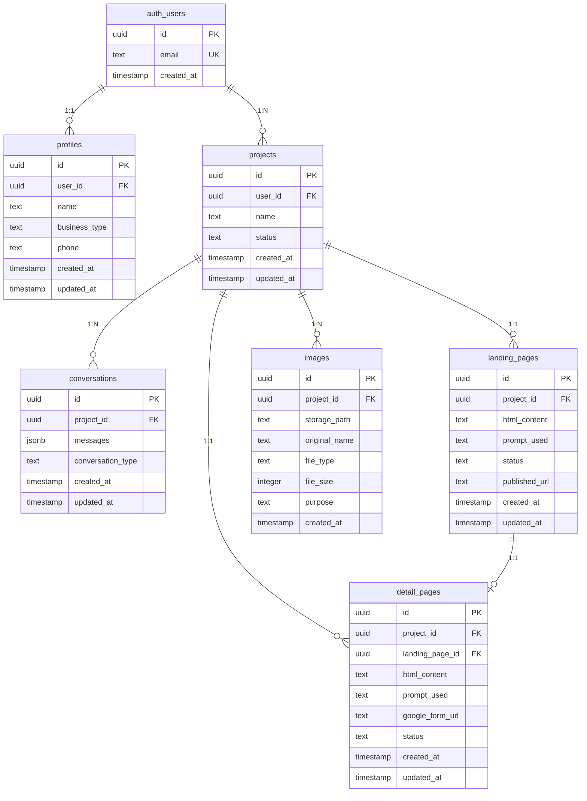

# 마그네틱 세일즈 웹앱 - DB 설계 문서

## 1. 개요

### 1.1 설계 목표
- Supabase Auth와 완전 통합된 사용자 관리
- Row Level Security(RLS)로 데이터 보안 보장
- 확장 가능한 스키마 구조
- 효율적인 쿼리를 위한 인덱스 최적화

### 1.2 기술 스택
- **DBMS**: PostgreSQL 15.x (Supabase)
- **ORM**: Supabase Client Library
- **인증**: Supabase Auth
- **스토리지**: Supabase Storage

---

## 2. ERD 다이어그램



---

## 3. 테이블 상세 설계

### 3.1 profiles (사용자 프로필)

**설명**: Supabase Auth의 `auth.users` 테이블을 확장하는 사용자 추가 정보

| 컬럼명 | 타입 | 제약조건 | 설명 |
|--------|------|----------|------|
| id | uuid | PRIMARY KEY, DEFAULT gen_random_uuid() | 프로필 ID |
| user_id | uuid | REFERENCES auth.users(id) ON DELETE CASCADE, UNIQUE | Supabase Auth 사용자 ID |
| name | text | NOT NULL | 사용자 이름 |
| business_type | text | NULL | 업종 (예: 보험, 피부샵, 코치) |
| phone | text | NULL | 연락처 |
| approved | boolean | DEFAULT false | 관리자 승인 여부 |
| created_at | timestamp | DEFAULT now() | 생성일시 |
| updated_at | timestamp | DEFAULT now() | 수정일시 |

**인덱스**:
```sql
CREATE INDEX idx_profiles_user_id ON profiles(user_id);
CREATE INDEX idx_profiles_approved ON profiles(approved);
```

---

### 3.2 projects (프로젝트)

**설명**: 사용자가 생성한 랜딩페이지 프로젝트

| 컬럼명 | 타입 | 제약조건 | 설명 |
|--------|------|----------|------|
| id | uuid | PRIMARY KEY, DEFAULT gen_random_uuid() | 프로젝트 ID |
| user_id | uuid | REFERENCES auth.users(id) ON DELETE CASCADE | 소유자 ID |
| name | text | NOT NULL | 프로젝트 이름 |
| description | text | NULL | 프로젝트 설명 |
| status | text | DEFAULT 'draft' | 상태: draft, in_progress, completed, archived |
| created_at | timestamp | DEFAULT now() | 생성일시 |
| updated_at | timestamp | DEFAULT now() | 수정일시 |

**인덱스**:
```sql
CREATE INDEX idx_projects_user_id ON projects(user_id);
CREATE INDEX idx_projects_status ON projects(status);
CREATE INDEX idx_projects_created_at ON projects(created_at DESC);
```

---

### 3.3 conversations (AI 대화 기록)

**설명**: AI 기획 도우미와의 대화 내용 저장

| 컬럼명 | 타입 | 제약조건 | 설명 |
|--------|------|----------|------|
| id | uuid | PRIMARY KEY, DEFAULT gen_random_uuid() | 대화 ID |
| project_id | uuid | REFERENCES projects(id) ON DELETE CASCADE | 프로젝트 ID |
| messages | jsonb | NOT NULL, DEFAULT '[]'::jsonb | 대화 메시지 배열 |
| conversation_type | text | DEFAULT 'landing_page' | 대화 유형: landing_page, detail_page, chatbot |
| total_tokens | integer | DEFAULT 0 | 총 토큰 사용량 |
| created_at | timestamp | DEFAULT now() | 생성일시 |
| updated_at | timestamp | DEFAULT now() | 수정일시 |

**messages JSONB 구조**:
```json
[
  {
    "role": "user",
    "content": "보험 상품 판매를 위한 랜딩페이지를 만들고 싶어요.",
    "timestamp": "2025-12-15T10:00:00Z"
  },
  {
    "role": "assistant",
    "content": "어떤 타겟 고객을 대상으로 하시나요?",
    "timestamp": "2025-12-15T10:00:05Z"
  }
]
```

**인덱스**:
```sql
CREATE INDEX idx_conversations_project_id ON conversations(project_id);
CREATE INDEX idx_conversations_type ON conversations(conversation_type);
CREATE INDEX idx_conversations_created_at ON conversations(created_at DESC);
```

---

### 3.4 landing_pages (랜딩페이지)

**설명**: 생성된 랜딩페이지 HTML 및 메타데이터

| 컬럼명 | 타입 | 제약조건 | 설명 |
|--------|------|----------|------|
| id | uuid | PRIMARY KEY, DEFAULT gen_random_uuid() | 랜딩페이지 ID |
| project_id | uuid | REFERENCES projects(id) ON DELETE CASCADE, UNIQUE | 프로젝트 ID (1:1) |
| html_content | text | NULL | 생성된 HTML 코드 |
| prompt_used | text | NULL | 사용된 프롬프트 |
| status | text | DEFAULT 'draft' | 상태: draft, published, archived |
| published_url | text | NULL, UNIQUE | 배포된 URL (예: /user123/my-insurance) |
| meta_title | text | NULL | SEO 메타 제목 |
| meta_description | text | NULL | SEO 메타 설명 |
| created_at | timestamp | DEFAULT now() | 생성일시 |
| updated_at | timestamp | DEFAULT now() | 수정일시 |

**인덱스**:
```sql
CREATE INDEX idx_landing_pages_project_id ON landing_pages(project_id);
CREATE INDEX idx_landing_pages_status ON landing_pages(status);
CREATE UNIQUE INDEX idx_landing_pages_published_url ON landing_pages(published_url) WHERE published_url IS NOT NULL;
```

---

### 3.5 detail_pages (상세페이지 / DB 수집 페이지)

**설명**: 고객 DB 수집을 위한 상세 페이지

| 컬럼명 | 타입 | 제약조건 | 설명 |
|--------|------|----------|------|
| id | uuid | PRIMARY KEY, DEFAULT gen_random_uuid() | 상세페이지 ID |
| project_id | uuid | REFERENCES projects(id) ON DELETE CASCADE | 프로젝트 ID |
| landing_page_id | uuid | REFERENCES landing_pages(id) ON DELETE SET NULL | 연결된 랜딩페이지 ID |
| html_content | text | NULL | 생성된 HTML 코드 |
| prompt_used | text | NULL | 사용된 프롬프트 |
| google_form_url | text | NULL | 구글 폼 URL |
| status | text | DEFAULT 'draft' | 상태: draft, published, archived |
| created_at | timestamp | DEFAULT now() | 생성일시 |
| updated_at | timestamp | DEFAULT now() | 수정일시 |

**인덱스**:
```sql
CREATE INDEX idx_detail_pages_project_id ON detail_pages(project_id);
CREATE INDEX idx_detail_pages_landing_page_id ON detail_pages(landing_page_id);
CREATE INDEX idx_detail_pages_status ON detail_pages(status);
```

---

### 3.6 images (이미지 파일)

**설명**: 사용자가 업로드한 이미지 메타데이터

| 컬럼명 | 타입 | 제약조건 | 설명 |
|--------|------|----------|------|
| id | uuid | PRIMARY KEY, DEFAULT gen_random_uuid() | 이미지 ID |
| project_id | uuid | REFERENCES projects(id) ON DELETE CASCADE | 프로젝트 ID |
| storage_path | text | NOT NULL, UNIQUE | Supabase Storage 경로 |
| original_name | text | NOT NULL | 원본 파일명 |
| file_type | text | NULL | 파일 확장자 (jpg, png, webp 등) |
| file_size | integer | NULL | 파일 크기 (bytes) |
| purpose | text | DEFAULT 'general' | 용도: hero, product, testimonial, general |
| created_at | timestamp | DEFAULT now() | 업로드 일시 |

**인덱스**:
```sql
CREATE INDEX idx_images_project_id ON images(project_id);
CREATE INDEX idx_images_purpose ON images(purpose);
CREATE INDEX idx_images_created_at ON images(created_at DESC);
```

---

## 4. Row Level Security (RLS) 정책

### 4.1 기본 원칙
- 사용자는 **자신의 데이터만** 읽기/쓰기 가능
- `approved=true`인 사용자만 데이터 생성 가능
- 공개된 랜딩페이지는 모두에게 읽기 허용

---

### 4.2 profiles 테이블

```sql
-- RLS 활성화
ALTER TABLE profiles ENABLE ROW LEVEL SECURITY;

-- 자신의 프로필만 읽기
CREATE POLICY "Users can view own profile"
  ON profiles FOR SELECT
  USING (auth.uid() = user_id);

-- 신규 가입 시 프로필 생성 (approved=false)
CREATE POLICY "Users can insert own profile on signup"
  ON profiles FOR INSERT
  WITH CHECK (auth.uid() = user_id);

-- 자신의 프로필만 수정
CREATE POLICY "Users can update own profile"
  ON profiles FOR UPDATE
  USING (auth.uid() = user_id)
  WITH CHECK (auth.uid() = user_id);

-- 관리자만 approved 필드 수정 가능 (별도 정책 추가 예정)
```

---

### 4.3 projects 테이블

```sql
ALTER TABLE projects ENABLE ROW LEVEL SECURITY;

-- 자신의 프로젝트만 읽기
CREATE POLICY "Users can view own projects"
  ON projects FOR SELECT
  USING (auth.uid() = user_id);

-- approved된 사용자만 프로젝트 생성
CREATE POLICY "Approved users can create projects"
  ON projects FOR INSERT
  WITH CHECK (
    auth.uid() = user_id
    AND EXISTS (
      SELECT 1 FROM profiles
      WHERE user_id = auth.uid()
      AND approved = true
    )
  );

-- 자신의 프로젝트만 수정
CREATE POLICY "Users can update own projects"
  ON projects FOR UPDATE
  USING (auth.uid() = user_id)
  WITH CHECK (auth.uid() = user_id);

-- 자신의 프로젝트만 삭제
CREATE POLICY "Users can delete own projects"
  ON projects FOR DELETE
  USING (auth.uid() = user_id);
```

---

### 4.4 conversations 테이블

```sql
ALTER TABLE conversations ENABLE ROW LEVEL SECURITY;

-- 자신의 프로젝트 대화만 읽기
CREATE POLICY "Users can view own conversations"
  ON conversations FOR SELECT
  USING (
    EXISTS (
      SELECT 1 FROM projects
      WHERE projects.id = conversations.project_id
      AND projects.user_id = auth.uid()
    )
  );

-- 자신의 프로젝트에만 대화 생성
CREATE POLICY "Users can create conversations in own projects"
  ON conversations FOR INSERT
  WITH CHECK (
    EXISTS (
      SELECT 1 FROM projects
      WHERE projects.id = conversations.project_id
      AND projects.user_id = auth.uid()
    )
  );

-- 자신의 대화만 수정
CREATE POLICY "Users can update own conversations"
  ON conversations FOR UPDATE
  USING (
    EXISTS (
      SELECT 1 FROM projects
      WHERE projects.id = conversations.project_id
      AND projects.user_id = auth.uid()
    )
  );
```

---

### 4.5 landing_pages 테이블

```sql
ALTER TABLE landing_pages ENABLE ROW LEVEL SECURITY;

-- 공개된 랜딩페이지는 모두에게 읽기 허용
CREATE POLICY "Anyone can view published landing pages"
  ON landing_pages FOR SELECT
  USING (status = 'published');

-- 자신의 프로젝트 랜딩페이지 전체 읽기
CREATE POLICY "Users can view own landing pages"
  ON landing_pages FOR SELECT
  USING (
    EXISTS (
      SELECT 1 FROM projects
      WHERE projects.id = landing_pages.project_id
      AND projects.user_id = auth.uid()
    )
  );

-- 자신의 프로젝트에만 랜딩페이지 생성
CREATE POLICY "Users can create landing pages in own projects"
  ON landing_pages FOR INSERT
  WITH CHECK (
    EXISTS (
      SELECT 1 FROM projects
      WHERE projects.id = landing_pages.project_id
      AND projects.user_id = auth.uid()
    )
  );

-- 자신의 랜딩페이지만 수정
CREATE POLICY "Users can update own landing pages"
  ON landing_pages FOR UPDATE
  USING (
    EXISTS (
      SELECT 1 FROM projects
      WHERE projects.id = landing_pages.project_id
      AND projects.user_id = auth.uid()
    )
  );
```

---

### 4.6 detail_pages 테이블

```sql
ALTER TABLE detail_pages ENABLE ROW LEVEL SECURITY;

-- 공개된 상세페이지는 모두에게 읽기 허용
CREATE POLICY "Anyone can view published detail pages"
  ON detail_pages FOR SELECT
  USING (status = 'published');

-- 자신의 프로젝트 상세페이지 전체 읽기
CREATE POLICY "Users can view own detail pages"
  ON detail_pages FOR SELECT
  USING (
    EXISTS (
      SELECT 1 FROM projects
      WHERE projects.id = detail_pages.project_id
      AND projects.user_id = auth.uid()
    )
  );

-- 자신의 프로젝트에만 상세페이지 생성
CREATE POLICY "Users can create detail pages in own projects"
  ON detail_pages FOR INSERT
  WITH CHECK (
    EXISTS (
      SELECT 1 FROM projects
      WHERE projects.id = detail_pages.project_id
      AND projects.user_id = auth.uid()
    )
  );

-- 자신의 상세페이지만 수정
CREATE POLICY "Users can update own detail pages"
  ON detail_pages FOR UPDATE
  USING (
    EXISTS (
      SELECT 1 FROM projects
      WHERE projects.id = detail_pages.project_id
      AND projects.user_id = auth.uid()
    )
  );
```

---

### 4.7 images 테이블

```sql
ALTER TABLE images ENABLE ROW LEVEL SECURITY;

-- 자신의 프로젝트 이미지만 읽기
CREATE POLICY "Users can view own images"
  ON images FOR SELECT
  USING (
    EXISTS (
      SELECT 1 FROM projects
      WHERE projects.id = images.project_id
      AND projects.user_id = auth.uid()
    )
  );

-- 자신의 프로젝트에만 이미지 업로드
CREATE POLICY "Users can upload images to own projects"
  ON images FOR INSERT
  WITH CHECK (
    EXISTS (
      SELECT 1 FROM projects
      WHERE projects.id = images.project_id
      AND projects.user_id = auth.uid()
    )
  );

-- 자신의 이미지만 삭제
CREATE POLICY "Users can delete own images"
  ON images FOR DELETE
  USING (
    EXISTS (
      SELECT 1 FROM projects
      WHERE projects.id = images.project_id
      AND projects.user_id = auth.uid()
    )
  );
```

---

## 5. Supabase Storage 설계

### 5.1 버킷 구조

| 버킷명 | 용도 | 공개 여부 | 파일 제한 |
|--------|------|----------|----------|
| project-images | 프로젝트 이미지 저장 | Private (RLS 적용) | 5MB per file, jpg/png/webp only |

---

### 5.2 Storage 경로 규칙

```
project-images/
├── {user_id}/
│   ├── {project_id}/
│   │   ├── hero-{timestamp}.jpg
│   │   ├── product-{timestamp}.png
│   │   └── testimonial-{timestamp}.webp
```

**예시**:
```
project-images/f7b8c3d1-1234-5678-90ab-cdef12345678/a1b2c3d4-5678-90ab-cdef-1234567890ab/hero-1734254123456.jpg
```

---

### 5.3 Storage RLS 정책

```sql
-- project-images 버킷에 대한 RLS 정책

-- 자신의 프로젝트 이미지만 업로드
CREATE POLICY "Users can upload to own project folders"
  ON storage.objects FOR INSERT
  WITH CHECK (
    bucket_id = 'project-images'
    AND (storage.foldername(name))[1] = auth.uid()::text
  );

-- 자신의 프로젝트 이미지만 읽기
CREATE POLICY "Users can view own project images"
  ON storage.objects FOR SELECT
  USING (
    bucket_id = 'project-images'
    AND (storage.foldername(name))[1] = auth.uid()::text
  );

-- 자신의 프로젝트 이미지만 삭제
CREATE POLICY "Users can delete own project images"
  ON storage.objects FOR DELETE
  USING (
    bucket_id = 'project-images'
    AND (storage.foldername(name))[1] = auth.uid()::text
  );

-- 공개된 랜딩/상세페이지의 이미지는 모두에게 읽기 허용
-- (추후 published 상태 확인 로직 추가)
```

---

## 6. 마이그레이션 SQL 스크립트

### 6.1 테이블 생성

```sql
-- 1. profiles 테이블
CREATE TABLE profiles (
  id uuid PRIMARY KEY DEFAULT gen_random_uuid(),
  user_id uuid REFERENCES auth.users(id) ON DELETE CASCADE UNIQUE NOT NULL,
  name text NOT NULL,
  business_type text,
  phone text,
  approved boolean DEFAULT false,
  created_at timestamp DEFAULT now(),
  updated_at timestamp DEFAULT now()
);

-- 2. projects 테이블
CREATE TABLE projects (
  id uuid PRIMARY KEY DEFAULT gen_random_uuid(),
  user_id uuid REFERENCES auth.users(id) ON DELETE CASCADE NOT NULL,
  name text NOT NULL,
  description text,
  status text DEFAULT 'draft' CHECK (status IN ('draft', 'in_progress', 'completed', 'archived')),
  created_at timestamp DEFAULT now(),
  updated_at timestamp DEFAULT now()
);

-- 3. conversations 테이블
CREATE TABLE conversations (
  id uuid PRIMARY KEY DEFAULT gen_random_uuid(),
  project_id uuid REFERENCES projects(id) ON DELETE CASCADE NOT NULL,
  messages jsonb NOT NULL DEFAULT '[]'::jsonb,
  conversation_type text DEFAULT 'landing_page' CHECK (conversation_type IN ('landing_page', 'detail_page', 'chatbot')),
  total_tokens integer DEFAULT 0,
  created_at timestamp DEFAULT now(),
  updated_at timestamp DEFAULT now()
);

-- 4. landing_pages 테이블
CREATE TABLE landing_pages (
  id uuid PRIMARY KEY DEFAULT gen_random_uuid(),
  project_id uuid REFERENCES projects(id) ON DELETE CASCADE UNIQUE NOT NULL,
  html_content text,
  prompt_used text,
  status text DEFAULT 'draft' CHECK (status IN ('draft', 'published', 'archived')),
  published_url text UNIQUE,
  meta_title text,
  meta_description text,
  created_at timestamp DEFAULT now(),
  updated_at timestamp DEFAULT now()
);

-- 5. detail_pages 테이블
CREATE TABLE detail_pages (
  id uuid PRIMARY KEY DEFAULT gen_random_uuid(),
  project_id uuid REFERENCES projects(id) ON DELETE CASCADE NOT NULL,
  landing_page_id uuid REFERENCES landing_pages(id) ON DELETE SET NULL,
  html_content text,
  prompt_used text,
  google_form_url text,
  status text DEFAULT 'draft' CHECK (status IN ('draft', 'published', 'archived')),
  created_at timestamp DEFAULT now(),
  updated_at timestamp DEFAULT now()
);

-- 6. images 테이블
CREATE TABLE images (
  id uuid PRIMARY KEY DEFAULT gen_random_uuid(),
  project_id uuid REFERENCES projects(id) ON DELETE CASCADE NOT NULL,
  storage_path text NOT NULL UNIQUE,
  original_name text NOT NULL,
  file_type text,
  file_size integer,
  purpose text DEFAULT 'general' CHECK (purpose IN ('hero', 'product', 'testimonial', 'general')),
  created_at timestamp DEFAULT now()
);
```

---

### 6.2 인덱스 생성

```sql
-- profiles 인덱스
CREATE INDEX idx_profiles_user_id ON profiles(user_id);
CREATE INDEX idx_profiles_approved ON profiles(approved);

-- projects 인덱스
CREATE INDEX idx_projects_user_id ON projects(user_id);
CREATE INDEX idx_projects_status ON projects(status);
CREATE INDEX idx_projects_created_at ON projects(created_at DESC);

-- conversations 인덱스
CREATE INDEX idx_conversations_project_id ON conversations(project_id);
CREATE INDEX idx_conversations_type ON conversations(conversation_type);
CREATE INDEX idx_conversations_created_at ON conversations(created_at DESC);

-- landing_pages 인덱스
CREATE INDEX idx_landing_pages_project_id ON landing_pages(project_id);
CREATE INDEX idx_landing_pages_status ON landing_pages(status);
CREATE UNIQUE INDEX idx_landing_pages_published_url ON landing_pages(published_url) WHERE published_url IS NOT NULL;

-- detail_pages 인덱스
CREATE INDEX idx_detail_pages_project_id ON detail_pages(project_id);
CREATE INDEX idx_detail_pages_landing_page_id ON detail_pages(landing_page_id);
CREATE INDEX idx_detail_pages_status ON detail_pages(status);

-- images 인덱스
CREATE INDEX idx_images_project_id ON images(project_id);
CREATE INDEX idx_images_purpose ON images(purpose);
CREATE INDEX idx_images_created_at ON images(created_at DESC);
```

---

### 6.3 트리거 생성 (updated_at 자동 갱신)

```sql
-- updated_at 자동 갱신 함수
CREATE OR REPLACE FUNCTION update_updated_at_column()
RETURNS TRIGGER AS $$
BEGIN
  NEW.updated_at = now();
  RETURN NEW;
END;
$$ LANGUAGE plpgsql;

-- profiles 트리거
CREATE TRIGGER update_profiles_updated_at
  BEFORE UPDATE ON profiles
  FOR EACH ROW
  EXECUTE FUNCTION update_updated_at_column();

-- projects 트리거
CREATE TRIGGER update_projects_updated_at
  BEFORE UPDATE ON projects
  FOR EACH ROW
  EXECUTE FUNCTION update_updated_at_column();

-- conversations 트리거
CREATE TRIGGER update_conversations_updated_at
  BEFORE UPDATE ON conversations
  FOR EACH ROW
  EXECUTE FUNCTION update_updated_at_column();

-- landing_pages 트리거
CREATE TRIGGER update_landing_pages_updated_at
  BEFORE UPDATE ON landing_pages
  FOR EACH ROW
  EXECUTE FUNCTION update_updated_at_column();

-- detail_pages 트리거
CREATE TRIGGER update_detail_pages_updated_at
  BEFORE UPDATE ON detail_pages
  FOR EACH ROW
  EXECUTE FUNCTION update_updated_at_column();
```

---

### 6.4 RLS 정책 적용 (전체)

```sql
-- profiles RLS
ALTER TABLE profiles ENABLE ROW LEVEL SECURITY;

CREATE POLICY "Users can view own profile"
  ON profiles FOR SELECT
  USING (auth.uid() = user_id);

CREATE POLICY "Users can insert own profile on signup"
  ON profiles FOR INSERT
  WITH CHECK (auth.uid() = user_id);

CREATE POLICY "Users can update own profile"
  ON profiles FOR UPDATE
  USING (auth.uid() = user_id)
  WITH CHECK (auth.uid() = user_id);

-- projects RLS
ALTER TABLE projects ENABLE ROW LEVEL SECURITY;

CREATE POLICY "Users can view own projects"
  ON projects FOR SELECT
  USING (auth.uid() = user_id);

CREATE POLICY "Approved users can create projects"
  ON projects FOR INSERT
  WITH CHECK (
    auth.uid() = user_id
    AND EXISTS (
      SELECT 1 FROM profiles
      WHERE user_id = auth.uid()
      AND approved = true
    )
  );

CREATE POLICY "Users can update own projects"
  ON projects FOR UPDATE
  USING (auth.uid() = user_id)
  WITH CHECK (auth.uid() = user_id);

CREATE POLICY "Users can delete own projects"
  ON projects FOR DELETE
  USING (auth.uid() = user_id);

-- conversations RLS
ALTER TABLE conversations ENABLE ROW LEVEL SECURITY;

CREATE POLICY "Users can view own conversations"
  ON conversations FOR SELECT
  USING (
    EXISTS (
      SELECT 1 FROM projects
      WHERE projects.id = conversations.project_id
      AND projects.user_id = auth.uid()
    )
  );

CREATE POLICY "Users can create conversations in own projects"
  ON conversations FOR INSERT
  WITH CHECK (
    EXISTS (
      SELECT 1 FROM projects
      WHERE projects.id = conversations.project_id
      AND projects.user_id = auth.uid()
    )
  );

CREATE POLICY "Users can update own conversations"
  ON conversations FOR UPDATE
  USING (
    EXISTS (
      SELECT 1 FROM projects
      WHERE projects.id = conversations.project_id
      AND projects.user_id = auth.uid()
    )
  );

-- landing_pages RLS
ALTER TABLE landing_pages ENABLE ROW LEVEL SECURITY;

CREATE POLICY "Anyone can view published landing pages"
  ON landing_pages FOR SELECT
  USING (status = 'published');

CREATE POLICY "Users can view own landing pages"
  ON landing_pages FOR SELECT
  USING (
    EXISTS (
      SELECT 1 FROM projects
      WHERE projects.id = landing_pages.project_id
      AND projects.user_id = auth.uid()
    )
  );

CREATE POLICY "Users can create landing pages in own projects"
  ON landing_pages FOR INSERT
  WITH CHECK (
    EXISTS (
      SELECT 1 FROM projects
      WHERE projects.id = landing_pages.project_id
      AND projects.user_id = auth.uid()
    )
  );

CREATE POLICY "Users can update own landing pages"
  ON landing_pages FOR UPDATE
  USING (
    EXISTS (
      SELECT 1 FROM projects
      WHERE projects.id = landing_pages.project_id
      AND projects.user_id = auth.uid()
    )
  );

-- detail_pages RLS
ALTER TABLE detail_pages ENABLE ROW LEVEL SECURITY;

CREATE POLICY "Anyone can view published detail pages"
  ON detail_pages FOR SELECT
  USING (status = 'published');

CREATE POLICY "Users can view own detail pages"
  ON detail_pages FOR SELECT
  USING (
    EXISTS (
      SELECT 1 FROM projects
      WHERE projects.id = detail_pages.project_id
      AND projects.user_id = auth.uid()
    )
  );

CREATE POLICY "Users can create detail pages in own projects"
  ON detail_pages FOR INSERT
  WITH CHECK (
    EXISTS (
      SELECT 1 FROM projects
      WHERE projects.id = detail_pages.project_id
      AND projects.user_id = auth.uid()
    )
  );

CREATE POLICY "Users can update own detail pages"
  ON detail_pages FOR UPDATE
  USING (
    EXISTS (
      SELECT 1 FROM projects
      WHERE projects.id = detail_pages.project_id
      AND projects.user_id = auth.uid()
    )
  );

-- images RLS
ALTER TABLE images ENABLE ROW LEVEL SECURITY;

CREATE POLICY "Users can view own images"
  ON images FOR SELECT
  USING (
    EXISTS (
      SELECT 1 FROM projects
      WHERE projects.id = images.project_id
      AND projects.user_id = auth.uid()
    )
  );

CREATE POLICY "Users can upload images to own projects"
  ON images FOR INSERT
  WITH CHECK (
    EXISTS (
      SELECT 1 FROM projects
      WHERE projects.id = images.project_id
      AND projects.user_id = auth.uid()
    )
  );

CREATE POLICY "Users can delete own images"
  ON images FOR DELETE
  USING (
    EXISTS (
      SELECT 1 FROM projects
      WHERE projects.id = images.project_id
      AND projects.user_id = auth.uid()
    )
  );
```

---

## 7. 초기 데이터 (Seed)

```sql
-- 테스트용 관리자 계정 프로필 (수동 승인됨)
-- 실제 user_id는 Supabase Auth 가입 후 생성되므로 여기서는 예시만 제공

-- 예시: 관리자 승인 로직
-- UPDATE profiles SET approved = true WHERE user_id = 'admin-user-uuid';
```

---

## 8. 쿼리 최적화 가이드

### 8.1 자주 사용되는 쿼리

**사용자 프로젝트 목록 조회**:
```sql
SELECT
  p.id,
  p.name,
  p.status,
  p.created_at,
  COUNT(DISTINCT lp.id) AS landing_page_count,
  COUNT(DISTINCT dp.id) AS detail_page_count
FROM projects p
LEFT JOIN landing_pages lp ON p.id = lp.project_id
LEFT JOIN detail_pages dp ON p.id = dp.project_id
WHERE p.user_id = 'user-uuid'
GROUP BY p.id
ORDER BY p.created_at DESC;
```

**프로젝트 상세 정보 (대화 포함)**:
```sql
SELECT
  p.*,
  lp.html_content AS landing_html,
  lp.status AS landing_status,
  dp.html_content AS detail_html,
  dp.google_form_url,
  c.messages AS conversations
FROM projects p
LEFT JOIN landing_pages lp ON p.id = lp.project_id
LEFT JOIN detail_pages dp ON p.id = dp.project_id
LEFT JOIN conversations c ON p.id = c.project_id
WHERE p.id = 'project-uuid';
```

---

### 8.2 성능 모니터링 권장사항

- `EXPLAIN ANALYZE` 사용하여 쿼리 플랜 확인
- 느린 쿼리는 추가 인덱스 고려
- JSONB 컬럼에 GIN 인덱스 적용 (필요 시)

```sql
-- 예: messages JSONB에서 특정 필드 검색이 빈번할 경우
CREATE INDEX idx_conversations_messages_gin ON conversations USING GIN (messages);
```

---

## 9. 백업 및 복구 전략

### 9.1 Supabase 자동 백업
- Supabase는 Pro 플랜 이상에서 자동 일일 백업 제공
- Point-in-time Recovery (PITR) 활성화 권장

### 9.2 수동 백업
```bash
# pg_dump를 통한 전체 DB 백업
pg_dump -h db.projectref.supabase.co -U postgres -d postgres > backup.sql

# 특정 테이블만 백업
pg_dump -h db.projectref.supabase.co -U postgres -d postgres -t profiles -t projects > partial_backup.sql
```

---

## 10. 확장 계획 (Phase 2)

### 10.1 추가 예정 테이블

| 테이블명 | 용도 | 우선순위 |
|----------|------|----------|
| templates | 랜딩페이지 템플릿 | P1 |
| analytics | 페이지 조회수, 클릭 추적 | P1 |
| payments | 결제 정보 | P2 |
| subscriptions | 구독 정보 | P2 |

### 10.2 고려 사항
- 분석 데이터는 별도 테이블로 분리 (쓰기 부하 분산)
- 결제 정보는 Stripe 연동 시 webhook 데이터 저장
- 구독 상태는 profiles에 통합 또는 별도 테이블 검토

---

## 11. 문서 업데이트 이력

| 날짜 | 버전 | 변경 내용 | 작성자 |
|------|------|-----------|--------|
| 2025-12-15 | 1.0 | 초안 작성 (ERD, 테이블 설계, RLS, 마이그레이션) | Technical Code Assistant |

---

## 12. 참고 자료

- [Supabase 공식 문서 - Row Level Security](https://supabase.com/docs/guides/auth/row-level-security)
- [PostgreSQL JSONB 인덱싱](https://www.postgresql.org/docs/current/datatype-json.html)
- [Supabase Storage 정책](https://supabase.com/docs/guides/storage/security/access-control)

---

## 부록: 전체 마이그레이션 SQL (실행 순서)

```sql
-- 1. 테이블 생성 (위 6.1 참조)
-- 2. 인덱스 생성 (위 6.2 참조)
-- 3. 트리거 생성 (위 6.3 참조)
-- 4. RLS 정책 적용 (위 6.4 참조)
-- 5. Storage 버킷 생성 (Supabase Dashboard에서 수동 생성)
-- 6. Storage RLS 정책 적용 (위 5.3 참조)
```

**주의**: 마이그레이션은 Supabase Dashboard의 SQL Editor 또는 Supabase CLI를 통해 실행하세요.

```bash
# Supabase CLI를 통한 마이그레이션 실행 예시
supabase db push
```

---

**DB 설계 완료**. 다음 단계는 Supabase 프로젝트 생성 및 마이그레이션 실행입니다.
