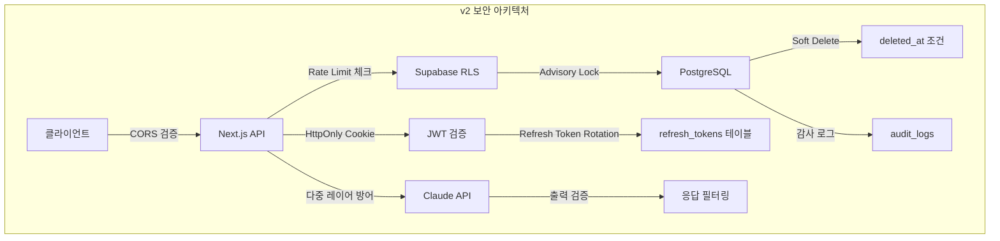
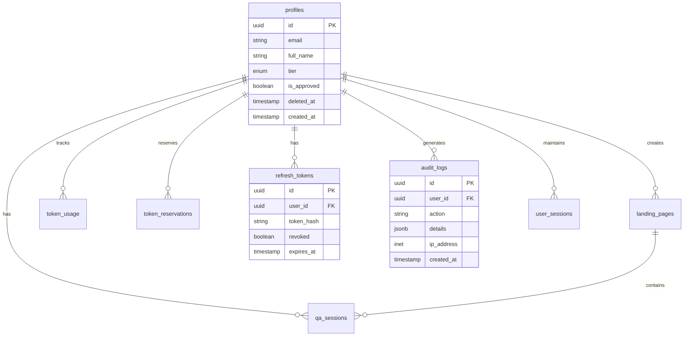

# 마그네틱 세일즈 웹앱 v2 - 종합 요약

## 문서 정보
| 항목 | 내용 |
|------|------|
| 버전 | 2.0 |
| 작성일 | 2025-01-15 |
| 작성자 | 기획팀 |
| 상태 | Red Team 최종 승인 완료 |

---

## 1. 프로젝트 개요

### 1.1 제품 비전
**"AI 기반 마그네틱 세일즈 랜딩페이지 자동 생성 서비스"**

비개발자도 40개 질문에 답변하면, AI가 전환율 높은 마그네틱 세일즈 랜딩페이지를 자동으로 생성해주는 SaaS 서비스

### 1.2 핵심 가치
- **간편함**: 복잡한 기술 지식 없이 질문 답변만으로 완성
- **효과성**: 검증된 마그네틱 세일즈 18단계 프레임워크 적용
- **경제성**: 전문 카피라이터 대비 90% 이상 비용 절감

### 1.3 타겟 사용자
- 1인 창업자 / 프리랜서
- 소규모 비즈니스 운영자
- 마케터 / 세일즈 담당자
- 코칭/컨설팅 서비스 제공자

---

## 2. v1 → v2 주요 변경 사항

### 2.1 변경 사항 요약표

| 영역 | v1 문제점 | v2 해결책 | 중요도 |
|------|-----------|-----------|--------|
| **CORS** | 와일드카드(`*`) 허용 | 명시적 화이트리스트 + Sec-Fetch-Site 검증 | CRITICAL |
| **AI 토큰** | Race Condition 취약 | PostgreSQL Advisory Lock | CRITICAL |
| **세션** | 상태 변경 시 미무효화 | 승인 상태 변경 시 전체 세션 무효화 | CRITICAL |
| **Soft Delete** | 물리적 삭제 | `deleted_at` 컬럼 + 30일 복구 기간 | CRITICAL |
| **JWT** | localStorage 저장 | HttpOnly Cookie + Refresh Token Rotation | HIGH |
| **SQL Injection** | RPC 호출 취약 | Supabase SDK 직접 사용 + Zod 검증 | HIGH |
| **XSS** | DOMPurify 미흡 | ALLOWED_URI_REGEXP로 javascript: 차단 | HIGH |
| **Rate Limiting** | Upstash Redis | Supabase PostgreSQL 기반 | HIGH |
| **Prompt Injection** | 단일 레이어 | 다중 레이어 방어 (입력/시스템/출력) | HIGH |
| **감사 로그** | 미구현 | audit_logs 테이블 구현 | HIGH |

### 2.2 아키텍처 변경 다이어그램



---

## 3. 기능 범위 (MVP)

### 3.1 핵심 기능

| 기능 | 설명 | 상태 |
|------|------|------|
| 회원가입/로그인 | Supabase Auth + 수동 승인 | v2 완료 |
| AI 질문/답변 | 40개 질문 단계별 진행 | v2 완료 |
| 랜딩페이지 생성 | DESIRE-MAGNETIC 공식 적용 | v2 완료 |
| 랜딩페이지 편집 | WYSIWYG 에디터 | v2 완료 |
| 미리보기/배포 | 고유 URL 생성 | v2 완료 |
| 대시보드 | 생성 이력, 토큰 사용량 | v2 완료 |

### 3.2 사용자 등급별 기능

| 등급 | 일일 토큰 | 랜딩페이지 수 | 가격 |
|------|----------|--------------|------|
| FREE | 100,000 | 3개 | 무료 |
| PRO | 500,000 | 무제한 | $29/월 |
| ENTERPRISE | 2,000,000 | 무제한 | $99/월 |

> **v2 변경**: FREE 티어 일일 토큰 50,000 → 100,000으로 상향

---

## 4. 기술 스택

### 4.1 프론트엔드
```yaml
Framework: Next.js 14 (App Router)
Language: TypeScript 5.x
Styling: Tailwind CSS 3.x
State: Zustand
Validation: Zod
Rich Text: TipTap Editor
Sanitization: DOMPurify (v2 강화)
```

### 4.2 백엔드
```yaml
BaaS: Supabase
Database: PostgreSQL 15
Auth: Supabase Auth + Manual Approval
Storage: Supabase Storage
Edge Functions: Supabase Edge Functions
```

### 4.3 AI
```yaml
Provider: Anthropic Claude API
Model: claude-sonnet-4-20250514
Rate Limiting: PostgreSQL 기반 (v2 변경)
Token Management: 2-Phase (Reserved → Confirmed)
```

### 4.4 인프라
```yaml
Hosting: Vercel
CDN: Vercel Edge Network
Monitoring: Vercel Analytics
Error Tracking: Sentry
```

---

## 5. 보안 체크리스트 (v2)

### 5.1 CRITICAL 항목 (4개)

- [x] **CRITICAL-API-001**: CORS 와일드카드 제거
  - 명시적 도메인 화이트리스트
  - Sec-Fetch-Site 헤더 검증
  - staging 환경도 명시적 등록

- [x] **CRITICAL-API-003**: AI 토큰 Race Condition 방지
  - PostgreSQL Advisory Lock 사용
  - `pg_advisory_xact_lock(hashtext(user_id))`
  - 원자적 토큰 예약/확정 프로세스

- [x] **CRITICAL-UX-001**: 세션 관리 강화
  - 승인 상태 변경 시 전체 세션 무효화
  - `invalidate_user_sessions()` 함수 구현
  - 트리거 기반 자동 무효화

- [x] **CRITICAL-DB-001**: Soft Delete 구현
  - `deleted_at` 컬럼 추가
  - 30일 복구 기간
  - RLS 정책에 `deleted_at IS NULL` 조건

### 5.2 HIGH 항목 (8개)

- [x] **HIGH-SEC-001**: JWT HttpOnly Cookie
  - Access Token: 15분 만료
  - Refresh Token: HttpOnly Cookie 저장
  - Refresh Token Rotation 구현

- [x] **HIGH-SEC-002**: SQL Injection 방지
  - Supabase SDK 직접 사용
  - Zod 스키마 검증
  - RPC 호출 최소화

- [x] **HIGH-SEC-003**: XSS 방지 강화
  - DOMPurify ALLOWED_URI_REGEXP 설정
  - `javascript:`, `data:` URI 차단
  - Content-Security-Policy 헤더

- [x] **HIGH-UX-001**: Rate Limiting
  - Supabase PostgreSQL 기반 구현
  - IP + User ID 복합 키
  - 슬라이딩 윈도우 알고리즘

- [x] **HIGH-AI-001**: Prompt Injection 방어
  - 입력 레이어: 패턴 필터링
  - 시스템 레이어: 역할 고정
  - 출력 레이어: 응답 검증

- [x] **HIGH-DB-001**: 감사 로그
  - audit_logs 테이블 구현
  - 민감 작업 자동 기록
  - 90일 보관 정책

- [x] **HIGH-AUTH-001**: Refresh Token Rotation
  - 토큰 재사용 감지
  - 감지 시 전체 토큰 폐기
  - DB 기반 토큰 관리

- [x] **HIGH-AUTH-002**: 세션 무효화 트리거
  - 승인 상태 변경 시 자동 실행
  - 비밀번호 변경 시 자동 실행

---

## 6. 데이터베이스 스키마 (v2)

### 6.1 테이블 목록

| 테이블명 | 설명 | v2 변경 |
|----------|------|---------|
| profiles | 사용자 프로필 | `deleted_at` 추가 |
| landing_pages | 랜딩페이지 | `deleted_at` 추가 |
| qa_sessions | Q&A 세션 | `deleted_at` 추가 |
| token_usage | 토큰 사용량 | 변경 없음 |
| token_reservations | 토큰 예약 | **신규** |
| refresh_tokens | 리프레시 토큰 | **신규** |
| audit_logs | 감사 로그 | **신규** |
| rate_limits | Rate Limit | **신규** |
| user_sessions | 사용자 세션 | **신규** |

### 6.2 ER 다이어그램



---

## 7. API 엔드포인트 (v2)

### 7.1 인증 API

| Method | Endpoint | 설명 | v2 변경 |
|--------|----------|------|---------|
| POST | /api/auth/signup | 회원가입 | - |
| POST | /api/auth/login | 로그인 | HttpOnly Cookie |
| POST | /api/auth/logout | 로그아웃 | 세션 무효화 |
| POST | /api/auth/refresh | 토큰 갱신 | Rotation 적용 |

### 7.2 AI API

| Method | Endpoint | 설명 | v2 변경 |
|--------|----------|------|---------|
| POST | /api/ai/generate | LP 생성 | Advisory Lock |
| POST | /api/ai/regenerate | 재생성 | Advisory Lock |
| GET | /api/ai/tokens | 토큰 조회 | - |

### 7.3 랜딩페이지 API

| Method | Endpoint | 설명 | v2 변경 |
|--------|----------|------|---------|
| GET | /api/lp | 목록 조회 | Soft Delete 필터 |
| POST | /api/lp | 생성 | - |
| PATCH | /api/lp/:id | 수정 | - |
| DELETE | /api/lp/:id | 삭제 | Soft Delete |
| POST | /api/lp/:id/restore | 복구 | **신규** |

---

## 8. 구현 일정

### 8.1 Phase 1: 핵심 보안 (1주차)
- [ ] CORS 미들웨어 구현
- [ ] JWT HttpOnly Cookie 전환
- [ ] Refresh Token Rotation 구현
- [ ] Rate Limiting 구현

### 8.2 Phase 2: 데이터베이스 (2주차)
- [ ] Soft Delete 마이그레이션
- [ ] 신규 테이블 생성
- [ ] RLS 정책 업데이트
- [ ] Advisory Lock 함수 구현

### 8.3 Phase 3: AI 보안 (3주차)
- [ ] Prompt Injection 방어 구현
- [ ] 토큰 2-Phase 관리 구현
- [ ] 출력 검증 로직 추가

### 8.4 Phase 4: 통합 테스트 (4주차)
- [ ] 보안 취약점 스캔
- [ ] 성능 테스트
- [ ] UAT (사용자 수용 테스트)
- [ ] 문서화 완료

### 8.5 총 예상 일정
- **Red Team 추정**: 32일
- **Blue Team 추정**: 18.5일
- **합의 일정**: 25일 (버퍼 포함)

---

## 9. 관련 문서

| 문서 | 파일명 | 설명 |
|------|--------|------|
| UX 플로우 | 02_UX_플로우_v2.md | 사용자 여정, 와이어프레임 |
| 기능 정의 | 03_기능_정의_v2.md | 상세 기능 명세 |
| DB 설계 | 04_DB_설계_v2.md | 스키마, RLS, 마이그레이션 |
| API 설계 | 05_API_설계_v2.md | 엔드포인트, 요청/응답 |
| AI 설계 | 06_AI_설계_v2.md | 프롬프트, 토큰 관리 |
| 보안 아키텍처 | 07_보안_아키텍처_v2.md | 인증, 보안 정책 |

---

## 10. 승인 이력

| 일자 | 버전 | 검토자 | 결과 | 비고 |
|------|------|--------|------|------|
| 2025-01-10 | v1.0 | Red Team | 조건부 승인 | 42개 이슈 발견 |
| 2025-01-12 | v1.5 | Blue Team | 개선안 제출 | 35개 해결 |
| 2025-01-13 | v1.5 | Red Team | 재검토 | 4개 CRITICAL 미해결 |
| 2025-01-14 | v2.0 | Blue Team | 최종 개선 | 23개 피드백 반영 |
| 2025-01-15 | v2.0 | Red Team | **최종 승인** | 모든 CRITICAL 해결 |

---

## 부록 A: 용어 정의

| 용어 | 정의 |
|------|------|
| 마그네틱 세일즈 | 고객을 자석처럼 끌어당기는 세일즈 기법 |
| DESIRE-MAGNETIC | 랜딩페이지 구조 공식 (욕구 자극 + 마그네틱) |
| Triple-Magnetic | 3중 마그네틱 시스템 (헤드라인/스토리/오퍼) |
| Advisory Lock | PostgreSQL의 애플리케이션 레벨 잠금 |
| Refresh Token Rotation | 토큰 갱신 시 새 토큰 발급 및 이전 토큰 폐기 |
| Soft Delete | 실제 삭제 대신 삭제 표시 (복구 가능) |
| RLS | Row Level Security (행 단위 보안) |

---

## 부록 B: 변경 로그

### v2.0 (2025-01-15)
- CORS 와일드카드 제거 및 Sec-Fetch-Site 검증 추가
- PostgreSQL Advisory Lock으로 토큰 Race Condition 해결
- JWT HttpOnly Cookie + Refresh Token Rotation 구현
- Soft Delete 패턴 전체 적용
- 감사 로그 테이블 추가
- Prompt Injection 다중 레이어 방어 구현
- Supabase 기반 Rate Limiting으로 전환
- 세션 무효화 트리거 추가

### v1.0 (2025-01-08)
- 초기 기획 문서 작성
- MVP 기능 정의
- 기본 아키텍처 설계
