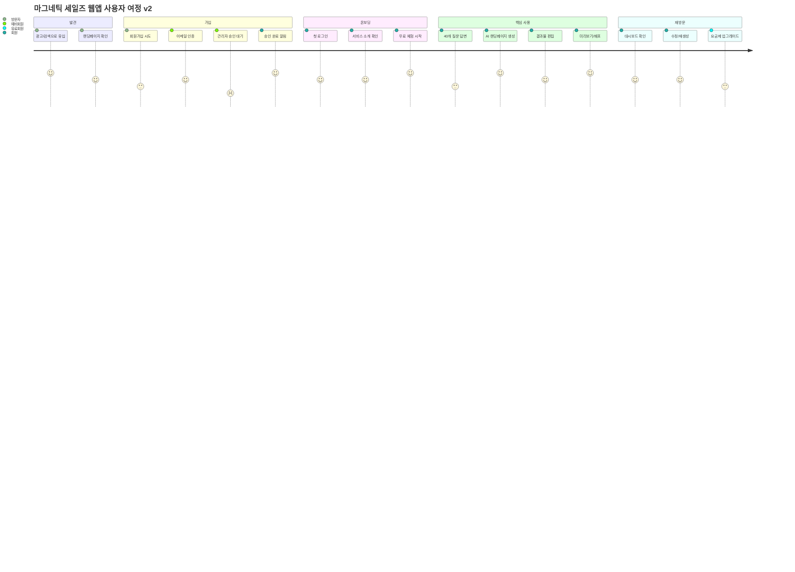
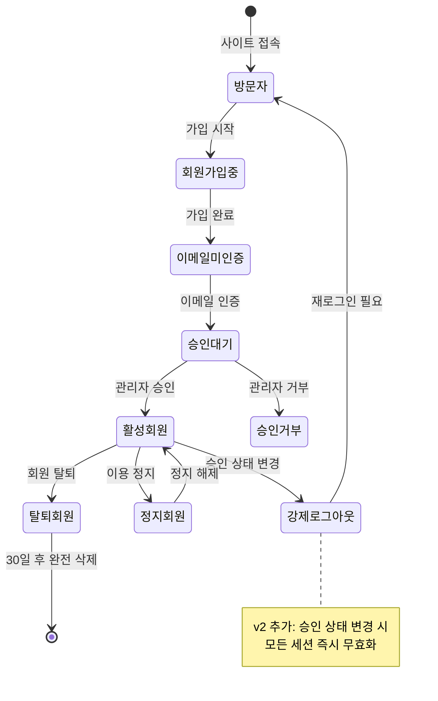
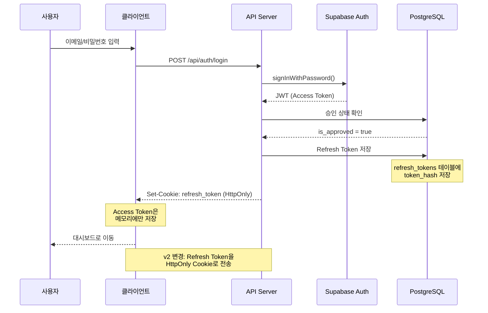
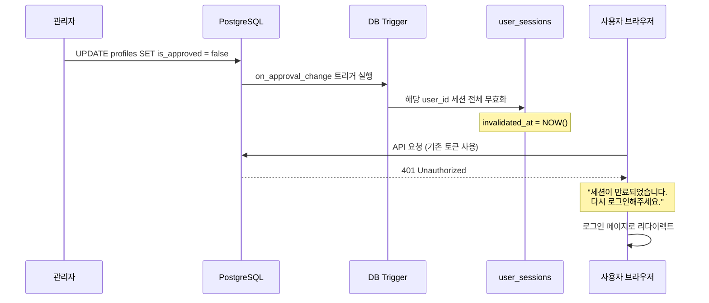
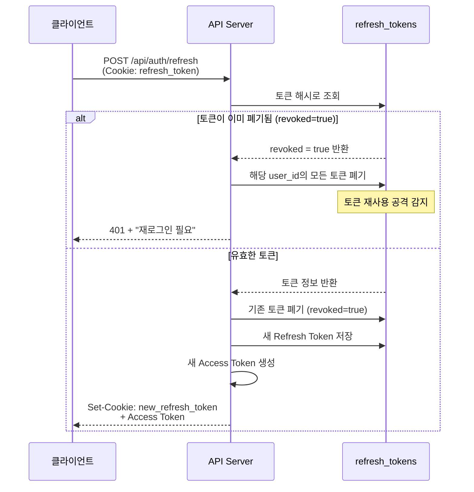
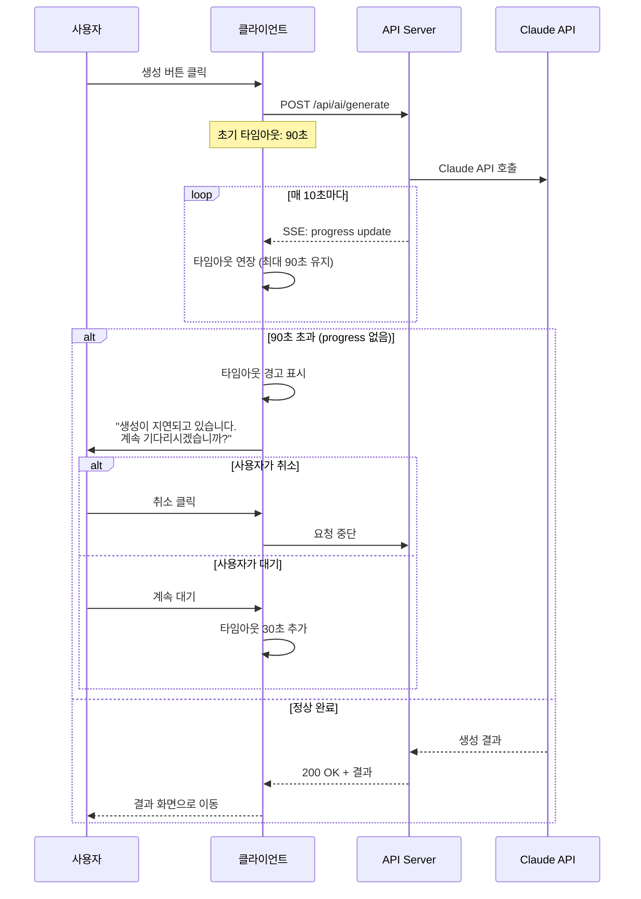
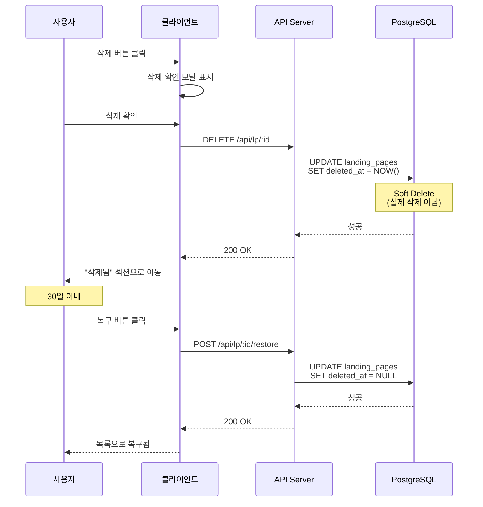
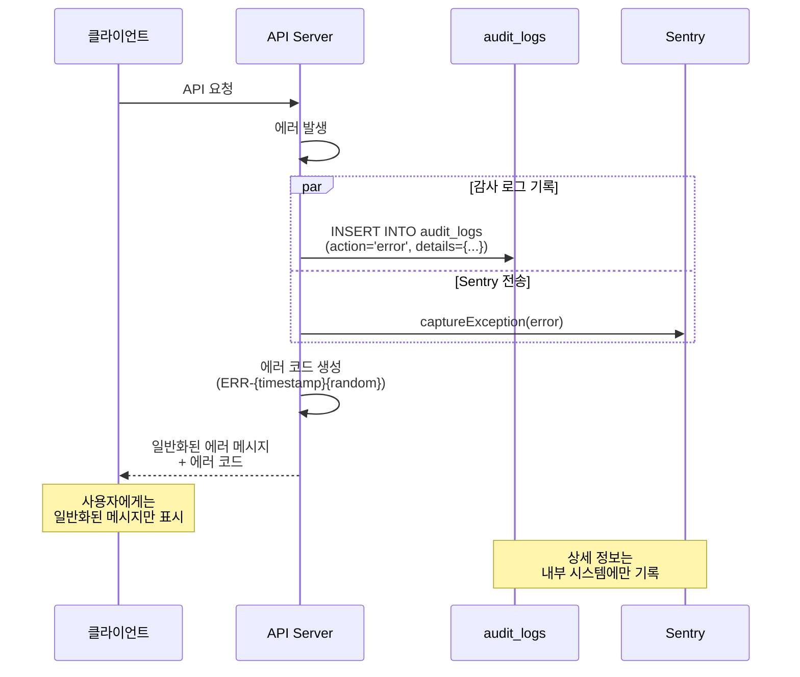
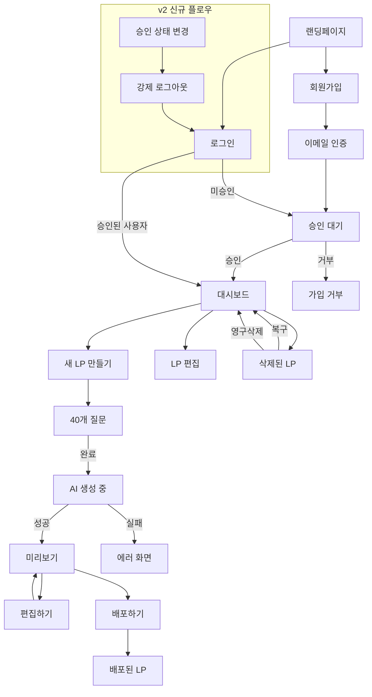

# 마그네틱 세일즈 웹앱 - UX 플로우 v2

## 문서 정보
| 항목 | 내용 |
|------|------|
| 버전 | 2.0 |
| 작성일 | 2025-01-15 |
| 이전 버전 | 01_UX_플로우.md (v1) |
| 변경 사유 | Red Team 보안 리뷰 반영 |

---

## v1 → v2 주요 변경 사항

| 영역 | v1 | v2 | 변경 사유 |
|------|----|----|-----------|
| 세션 관리 | 상태 변경 무관 | 승인 상태 변경 시 강제 로그아웃 | CRITICAL-UX-001 |
| 삭제 플로우 | 즉시 삭제 | Soft Delete + 복구 UI | CRITICAL-DB-001 |
| 에러 메시지 | 상세 노출 | 일반화된 메시지 + 로깅 | HIGH-SEC-004 |
| 타임아웃 | 5분 고정 | 90초 기본 + 동적 확장 | MEDIUM-UX-003 |
| 로딩 상태 | 단순 스피너 | 진행률 + 예상 시간 | MEDIUM-UX-002 |

---

## 1. 전체 사용자 여정 맵

### 1.1 Journey Map (v2)



### 1.2 사용자 상태 다이어그램 (v2)



---

## 2. 인증 플로우 (v2)

### 2.1 회원가입 플로우

```
┌─────────────────────────────────────────────────────────────────┐
│                        회원가입 페이지                            │
├─────────────────────────────────────────────────────────────────┤
│                                                                 │
│  ┌─────────────────────────────────────────────────────────┐   │
│  │  마그네틱 세일즈 웹앱                                      │   │
│  │  AI로 전환율 높은 랜딩페이지를 만드세요                     │   │
│  └─────────────────────────────────────────────────────────┘   │
│                                                                 │
│  ┌─────────────────────────────────────────────────────────┐   │
│  │  이메일 *                                                 │   │
│  │  ┌─────────────────────────────────────────────────┐    │   │
│  │  │ example@email.com                               │    │   │
│  │  └─────────────────────────────────────────────────┘    │   │
│  │                                                         │   │
│  │  비밀번호 *                                              │   │
│  │  ┌─────────────────────────────────────────────────┐    │   │
│  │  │ ••••••••••••                                    │    │   │
│  │  └─────────────────────────────────────────────────┘    │   │
│  │  ✓ 8자 이상  ✓ 영문+숫자  ○ 특수문자 포함               │   │
│  │                                                         │   │
│  │  비밀번호 확인 *                                         │   │
│  │  ┌─────────────────────────────────────────────────┐    │   │
│  │  │ ••••••••••••                                    │    │   │
│  │  └─────────────────────────────────────────────────┘    │   │
│  │                                                         │   │
│  │  이름 *                                                  │   │
│  │  ┌─────────────────────────────────────────────────┐    │   │
│  │  │ 홍길동                                           │    │   │
│  │  └─────────────────────────────────────────────────┘    │   │
│  │                                                         │   │
│  │  ☑ 서비스 이용약관에 동의합니다 (필수)                    │   │
│  │  ☑ 개인정보 처리방침에 동의합니다 (필수)                   │   │
│  │  ☐ 마케팅 정보 수신에 동의합니다 (선택)                    │   │
│  │                                                         │   │
│  │  ┌─────────────────────────────────────────────────┐    │   │
│  │  │              회원가입                            │    │   │
│  │  └─────────────────────────────────────────────────┘    │   │
│  │                                                         │   │
│  │  이미 계정이 있으신가요? [로그인]                          │   │
│  └─────────────────────────────────────────────────────────┘   │
│                                                                 │
└─────────────────────────────────────────────────────────────────┘
```

### 2.2 로그인 플로우 (v2 - HttpOnly Cookie)



### 2.3 세션 무효화 플로우 (v2 신규)



### 2.4 Refresh Token Rotation 플로우 (v2 신규)



---

## 3. AI 생성 플로우 (v2)

### 3.1 40개 질문 답변 플로우

```
┌─────────────────────────────────────────────────────────────────┐
│                     질문 답변 인터페이스                          │
├─────────────────────────────────────────────────────────────────┤
│  진행률: ████████████░░░░░░░░ 15/40 (37.5%)                     │
│                                                                 │
│  카테고리: 고객 페르소나 (4/8)                                    │
│                                                                 │
│  ┌─────────────────────────────────────────────────────────┐   │
│  │  Q15. 타겟 고객이 가장 두려워하는 것은 무엇인가요?         │   │
│  │                                                         │   │
│  │  이 질문이 중요한 이유:                                   │   │
│  │  고객의 두려움을 이해하면 더 강력한 마그네틱 메시지를        │   │
│  │  만들 수 있습니다.                                        │   │
│  │                                                         │   │
│  │  예시 답변:                                               │   │
│  │  "시간과 돈을 투자했는데 결과가 없을까봐 두려워합니다"       │   │
│  └─────────────────────────────────────────────────────────┘   │
│                                                                 │
│  ┌─────────────────────────────────────────────────────────┐   │
│  │                                                         │   │
│  │  실패에 대한 두려움이 가장 큽니다. 특히 주변 사람들에게     │   │
│  │  "그것 봐, 안 될 줄 알았어"라는 말을 듣는 것을 두려워       │   │
│  │  합니다.                                                 │   │
│  │                                                         │   │
│  │                                              [156/500자] │   │
│  └─────────────────────────────────────────────────────────┘   │
│                                                                 │
│  ┌──────────┐  ┌──────────┐  ┌──────────────────────────────┐  │
│  │   이전   │  │   저장   │  │         다음 질문            │  │
│  └──────────┘  └──────────┘  └──────────────────────────────┘  │
│                                                                 │
│  [임시저장됨: 2분 전] ─ 자동저장 활성화                           │
└─────────────────────────────────────────────────────────────────┘
```

### 3.2 AI 생성 대기 화면 (v2 - 90초 타임아웃)

```
┌─────────────────────────────────────────────────────────────────┐
│                     AI 랜딩페이지 생성 중                         │
├─────────────────────────────────────────────────────────────────┤
│                                                                 │
│                         ◉◉◉                                    │
│                      ◉     ◉                                   │
│                     ◉   AI  ◉                                  │
│                      ◉     ◉                                   │
│                         ◉◉◉                                    │
│                                                                 │
│              마그네틱 랜딩페이지를 생성하고 있습니다               │
│                                                                 │
│  ┌─────────────────────────────────────────────────────────┐   │
│  │ ████████████████████████░░░░░░░░░░░░░░░░  60%          │   │
│  └─────────────────────────────────────────────────────────┘   │
│                                                                 │
│  현재 단계: 마그네틱 헤드라인 최적화 중...                         │
│                                                                 │
│  ┌─────────────────────────────────────────────────────────┐   │
│  │  예상 남은 시간: 약 35초                                  │   │
│  │                                                         │   │
│  │  ✓ 고객 페르소나 분석 완료                                │   │
│  │  ✓ DESIRE 공식 적용 완료                                 │   │
│  │  ◉ 마그네틱 헤드라인 생성 중                              │   │
│  │  ○ Triple-Magnetic 시스템 적용                           │   │
│  │  ○ 최종 컨텐츠 조합                                      │   │
│  └─────────────────────────────────────────────────────────┘   │
│                                                                 │
│  ⓘ 복잡한 내용은 최대 90초까지 소요될 수 있습니다                 │
│                                                                 │
│              ┌────────────────────────────┐                    │
│              │        생성 취소           │                    │
│              └────────────────────────────┘                    │
│                                                                 │
└─────────────────────────────────────────────────────────────────┘
```

### 3.3 타임아웃 처리 (v2 신규)



---

## 4. 랜딩페이지 관리 플로우 (v2)

### 4.1 대시보드 (v2 - Soft Delete 반영)

```
┌─────────────────────────────────────────────────────────────────┐
│  마그네틱 세일즈                      [토큰: 85,420/100,000]     │
├─────────────────────────────────────────────────────────────────┤
│                                                                 │
│  내 랜딩페이지 (2/3)                    [+ 새 랜딩페이지 만들기]  │
│                                                                 │
│  ┌─────────────────────────────────────────────────────────┐   │
│  │  📄 1인 코칭 비즈니스 런칭 가이드                         │   │
│  │  생성일: 2025-01-10  |  수정일: 2025-01-14              │   │
│  │  상태: ● 배포됨                                          │   │
│  │  조회수: 1,234  |  전환율: 3.2%                          │   │
│  │                                                         │   │
│  │  [편집]  [미리보기]  [URL 복사]  [통계]  [삭제]          │   │
│  └─────────────────────────────────────────────────────────┘   │
│                                                                 │
│  ┌─────────────────────────────────────────────────────────┐   │
│  │  📄 온라인 강의 판매 페이지                               │   │
│  │  생성일: 2025-01-08  |  수정일: 2025-01-08              │   │
│  │  상태: ○ 초안                                           │   │
│  │                                                         │   │
│  │  [편집]  [미리보기]  [배포하기]  [삭제]                   │   │
│  └─────────────────────────────────────────────────────────┘   │
│                                                                 │
│  ───────────────────────────────────────────────────────────   │
│                                                                 │
│  🗑️ 최근 삭제됨 (1개) - 30일 후 영구 삭제                       │
│                                                                 │
│  ┌─────────────────────────────────────────────────────────┐   │
│  │  📄 테스트 랜딩페이지 (삭제됨)                            │   │
│  │  삭제일: 2025-01-12  |  남은 기간: 28일                  │   │
│  │                                                         │   │
│  │  [복구하기]  [영구 삭제]                                  │   │
│  └─────────────────────────────────────────────────────────┘   │
│                                                                 │
└─────────────────────────────────────────────────────────────────┘
```

### 4.2 삭제 확인 모달 (v2 신규)

```
┌─────────────────────────────────────────────────────────────────┐
│                     랜딩페이지 삭제                              │
├─────────────────────────────────────────────────────────────────┤
│                                                                 │
│  ⚠️ "1인 코칭 비즈니스 런칭 가이드"를 삭제하시겠습니까?           │
│                                                                 │
│  ┌─────────────────────────────────────────────────────────┐   │
│  │  • 삭제된 랜딩페이지는 30일간 복구할 수 있습니다           │   │
│  │  • 30일 후에는 영구적으로 삭제됩니다                      │   │
│  │  • 배포된 URL은 즉시 비활성화됩니다                       │   │
│  └─────────────────────────────────────────────────────────┘   │
│                                                                 │
│           ┌────────────┐    ┌────────────────────┐             │
│           │   취소    │    │    삭제하기        │             │
│           └────────────┘    └────────────────────┘             │
│                                                                 │
└─────────────────────────────────────────────────────────────────┘
```

### 4.3 복구 플로우 다이어그램



---

## 5. 에러 처리 (v2)

### 5.1 에러 메시지 가이드라인 (v2 - 일반화)

| 내부 에러 | v1 사용자 메시지 | v2 사용자 메시지 | 변경 사유 |
|----------|-----------------|-----------------|-----------|
| DB Connection Failed | 데이터베이스 연결 실패 | 서비스 연결에 문제가 있습니다 | 내부 구조 노출 방지 |
| Invalid JWT | JWT 토큰이 유효하지 않습니다 | 세션이 만료되었습니다 | 토큰 구조 노출 방지 |
| RLS Policy Violation | RLS 정책 위반 | 접근 권한이 없습니다 | 보안 정책 노출 방지 |
| Rate Limit Exceeded | rate_limits 테이블 초과 | 요청이 너무 많습니다. 잠시 후 다시 시도해주세요 | 구현 상세 노출 방지 |
| Token Quota Exceeded | daily_tokens 한도 초과 | 오늘의 사용량을 모두 소진했습니다 | 일관된 용어 사용 |

### 5.2 에러 화면 (v2)

```
┌─────────────────────────────────────────────────────────────────┐
│                          오류 발생                               │
├─────────────────────────────────────────────────────────────────┤
│                                                                 │
│                           ⚠️                                    │
│                                                                 │
│              서비스 연결에 문제가 있습니다                         │
│                                                                 │
│  ┌─────────────────────────────────────────────────────────┐   │
│  │  문제가 지속되면 아래 정보와 함께 문의해주세요:            │   │
│  │                                                         │   │
│  │  오류 코드: ERR-2025011514302847                         │   │
│  │  발생 시간: 2025-01-15 14:30:28                          │   │
│  └─────────────────────────────────────────────────────────┘   │
│                                                                 │
│  ┌────────────────┐    ┌────────────────────────────────┐      │
│  │  다시 시도     │    │       홈으로 돌아가기          │      │
│  └────────────────┘    └────────────────────────────────┘      │
│                                                                 │
│                      [고객센터 문의하기]                          │
│                                                                 │
└─────────────────────────────────────────────────────────────────┘
```

### 5.3 에러 로깅 플로우 (v2 신규)



---

## 6. 반응형 디자인 (v2)

### 6.1 브레이크포인트

| 디바이스 | 너비 | 레이아웃 |
|----------|------|----------|
| Mobile | < 640px | 1 컬럼 |
| Tablet | 640px - 1024px | 2 컬럼 |
| Desktop | > 1024px | 3 컬럼 |

### 6.2 모바일 질문 답변 화면

```
┌─────────────────────────┐
│  ◀  질문 15/40         │
├─────────────────────────┤
│                         │
│  고객 페르소나 (4/8)     │
│                         │
│  ┌─────────────────────┐│
│  │ Q15. 타겟 고객이    ││
│  │ 가장 두려워하는     ││
│  │ 것은 무엇인가요?    ││
│  │                     ││
│  │ ⓘ 도움말 보기       ││
│  └─────────────────────┘│
│                         │
│  ┌─────────────────────┐│
│  │                     ││
│  │ 답변을 입력하세요...││
│  │                     ││
│  │                     ││
│  │            [0/500]  ││
│  └─────────────────────┘│
│                         │
│  ████████░░░░░  37.5%   │
│                         │
│  ┌─────────────────────┐│
│  │      다음 ▶        ││
│  └─────────────────────┘│
│                         │
│  [임시저장] [나중에]     │
└─────────────────────────┘
```

---

## 7. 접근성 체크리스트 (v2)

### 7.1 WCAG 2.1 AA 준수 항목

| 항목 | 기준 | v2 구현 상태 |
|------|------|-------------|
| 색상 대비 | 4.5:1 이상 | ✅ 구현 완료 |
| 키보드 네비게이션 | 모든 기능 접근 | ✅ 구현 완료 |
| 스크린 리더 | ARIA 레이블 | ✅ 구현 완료 |
| 포커스 표시 | 명확한 시각적 표시 | ✅ 구현 완료 |
| 에러 식별 | 색상 외 추가 표시 | ✅ 구현 완료 |
| 입력 도움말 | 명확한 레이블/안내 | ✅ 구현 완료 |

### 7.2 키보드 단축키

| 단축키 | 기능 | 페이지 |
|--------|------|--------|
| Tab | 다음 요소로 이동 | 전체 |
| Shift + Tab | 이전 요소로 이동 | 전체 |
| Enter | 버튼 클릭/폼 제출 | 전체 |
| Escape | 모달 닫기 | 모달 |
| Ctrl + S | 임시 저장 | 질문/편집 |
| Ctrl + Enter | 다음 단계 | 질문 |

---

## 8. 구현 체크리스트

### 8.1 인증 관련 (v2 변경 사항)

- [ ] HttpOnly Cookie로 Refresh Token 저장
- [ ] Refresh Token Rotation 구현
- [ ] 토큰 재사용 감지 로직 구현
- [ ] 승인 상태 변경 시 세션 무효화 트리거
- [ ] 강제 로그아웃 UI 구현
- [ ] 재로그인 안내 메시지

### 8.2 Soft Delete 관련 (v2 신규)

- [ ] "최근 삭제됨" 섹션 UI 구현
- [ ] 복구 버튼 및 확인 모달
- [ ] 남은 복구 기간 표시
- [ ] 영구 삭제 확인 모달
- [ ] 삭제된 항목 필터링 (기본 목록에서 제외)

### 8.3 에러 처리 (v2 변경 사항)

- [ ] 에러 메시지 일반화
- [ ] 에러 코드 생성 로직
- [ ] audit_logs 연동
- [ ] Sentry 연동
- [ ] 에러 화면 UI 구현

### 8.4 AI 생성 (v2 변경 사항)

- [ ] 90초 기본 타임아웃 구현
- [ ] 진행률 SSE 연동
- [ ] 동적 타임아웃 연장 UI
- [ ] 타임아웃 경고 모달
- [ ] 취소/계속대기 선택 UI

---

## 부록: 화면 전환 플로우 맵


