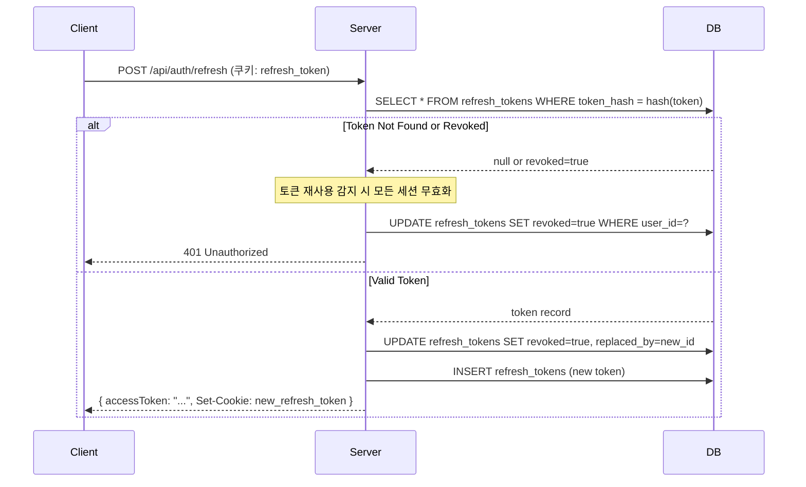

# 마그네틱 세일즈 웹앱 - 기능 정의서 v2

> **문서 버전**: 2.0
> **작성일**: 2025-12-15
> **이전 버전**: [02_기능_정의.md (v1)](/mnt/c/Users/lpian/OneDrive/문서/db-automation/magnetic-sales-webapp/기획_v1/02_기능_정의.md)
> **참조 문서**: 01_UX_플로우_v2.md, 04_의사결정_로그.md, Red/Blue Team 리뷰

---

## 문서 변경 이력

| 버전 | 날짜 | 변경 내용 | 작성자 |
|------|------|-----------|--------|
| 1.0 | 2025-12-15 | 기능 정의서 초안 작성 | Product Manager v8 |
| 2.0 | 2025-12-15 | Red/Blue Team 리뷰 반영, 보안 강화, 토큰 관리 추가 | 기획팀장 |

---

## v1 대비 v2 주요 변경 사항

| 영역 | v1 | v2 | 변경 사유 |
|------|----|----|-----------|
| **AI 토큰 관리** | 토큰 제한 없음 | TokenLimiter 기반 일/월 한도 관리 + Race Condition 방지 | CRITICAL-API-003 대응, 비용 폭증 방지 |
| **세션 보안** | 단순 JWT 토큰 | Refresh Token Rotation + HttpOnly 쿠키 + DB 저장 | HIGH-SEC-001 대응, 토큰 탈취 방지 |
| **승인 상태 관리** | 로그인 시 1회 확인 | 승인 변경 시 전체 세션 무효화 + 모든 API에서 실시간 검증 | CRITICAL-UX-001 대응, 권한 상승 방지 |
| **Rate Limiting** | 정책 미정의 | Supabase PostgreSQL 기반 Rate Limiting (fail-closed) | HIGH-UX-001 대응, DDoS 방지 |
| **프롬프트 보안** | 방어 미구현 | 프롬프트 인젝션 필터링 + 응답 검증 | CRITICAL-AI-001 대응 |
| **에러 코드** | 비체계적 | ERR_{도메인}_{코드} 형식 체계화 | NEW-MEDIUM-001 대응 |
| **18단계/40질문** | 관계 불명확 | 6 Phase - 18단계 - 40질문 계층 구조 명확화 | HIGH-FUNC-001 대응 |
| **생성 타임아웃** | 60초 | 90초 + 진행률 기반 동적 연장 | HIGH-PERF-002 대응 |

---

## Red Team 이슈 해결 현황

| 이슈 ID | 심각도 | 이슈 내용 | 해결 상태 | 해결 방법 |
|---------|--------|-----------|-----------|-----------|
| CRITICAL-AI-001 | CRITICAL | 프롬프트 인젝션 방어 미구현 | **해결** | AI-006 프롬프트 보안 기능 추가 |
| HIGH-FUNC-001 | HIGH | 18단계/40질문 관계 불일치 | **해결** | AI-003 섹션에 계층 구조 명확화 |
| HIGH-FUNC-002 | HIGH | Rate Limiting 정책 불일치 | **해결** | 공통 요구사항에 통합 Rate Limit 정책 정의 |
| HIGH-FUNC-003 | HIGH | 배포 URL 충돌 처리 미흡 | **해결** | LP-005 섹션에 URL 예약/삭제 정책 추가 |
| MEDIUM-FUNC-001 | MEDIUM | 세션 저장 한도 정책 불명확 | **해결** | AI-002 섹션에 삭제 우선순위 명확화 |
| MEDIUM-FUNC-002 | MEDIUM | 이미지 최적화 상세 미정의 | **해결** | LP-003 섹션에 프로세싱 파이프라인 추가 |
| MEDIUM-FUNC-003 | MEDIUM | 통계 갱신 시점 미정의 | **해결** | DASH-002에 cron 스케줄 명시 |

---

## 1. 기능 목록 개요

### 1.1 MVP (Phase 1) 기능

| 카테고리 | 기능 ID | 기능명 | 우선순위 | v2 변경 |
|---------|---------|--------|----------|---------|
| 인증 | AUTH-001 ~ 006 | 회원가입, 로그인, 로그아웃, 승인 확인, 비밀번호 재설정, **토큰 갱신** | P0 | AUTH-006 신규 |
| AI 기획 도우미 | AI-001 ~ 006 | 대화 시작, 히스토리, 18단계 안내, 기획 요약, 프롬프트 생성, **프롬프트 보안** | P0 | AI-006 신규 |
| 랜딩페이지 빌더 | LP-001 ~ 006 | 템플릿 선택, AI 콘텐츠 생성, 이미지 업로드, 미리보기, 배포, 수정/삭제 | P0-P1 | LP-003 상세화 |
| DB 수집 | DB-001 ~ 002 | 구글 폼 연결, CTA 버튼 삽입 | P0 | - |
| 대시보드 | DASH-001 ~ 002 | 프로젝트 목록, 기본 통계 | P1 | 갱신 주기 명시 |
| **토큰 관리** | TOKEN-001 ~ 003 | **토큰 한도 확인, 사용량 기록, 비용 모니터링** | P0 | **신규 카테고리** |

### 1.2 Phase 2 기능 (향후 개발)

| 카테고리 | 기능명 | 설명 |
|---------|--------|------|
| 인증 | 소셜 로그인 | 카카오, 네이버 로그인 |
| 인증 | 자동 승인 시스템 | 결제 연동 기반 자동 승인 |
| 인증 | 관리자 2FA | 관리자 계정 필수 이중 인증 |
| 빌더 | 고급 편집 기능 | 섹션 드래그앤드롭, 커스텀 CSS |
| 빌더 | 템플릿 마켓 | 다양한 업종별 템플릿 |
| 분석 | 분석 대시보드 | 전환율, 클릭률, 히트맵 |
| DB 수집 | 자체 폼 빌더 | Supabase 직접 저장 |
| 결제 | 결제 시스템 | 추가 기능 유료화 |
| **오프라인** | **PWA 지원** | **오프라인 캐싱, 백그라운드 동기화** |

---

## 2. 인증 기능 상세 정의

### AUTH-001: 회원가입

| 항목 | 내용 |
|------|------|
| **기능 ID** | AUTH-001 |
| **기능명** | 이메일/비밀번호 회원가입 |
| **설명** | 신규 사용자가 이메일과 비밀번호로 계정을 생성하고, 수강생 승인을 대기하는 기능 |
| **우선순위** | P0 (MVP 필수) |

#### 입력
| 필드명 | 타입 | 필수 | 검증 규칙 |
|--------|------|------|-----------|
| email | string | Y | 이메일 형식, 중복 불가 |
| password | string | Y | 최소 8자, 영문+숫자+특수문자 조합 |
| passwordConfirm | string | Y | password와 일치 |
| name | string | Y | 2-20자 |
| phone | string | N | 010-XXXX-XXXX 형식 |

#### 출력
| 필드명 | 타입 | 설명 |
|--------|------|------|
| success | boolean | 가입 성공 여부 |
| userId | string | 생성된 사용자 ID |
| message | string | 결과 메시지 |

#### 비즈니스 규칙
1. 가입 시 `approved: false`로 저장 (NOT NULL DEFAULT false)
2. 가입 완료 후 "승인 대기" 안내 페이지로 이동
3. 관리자에게 신규 가입 알림 발송 (선택사항)
4. 이메일 중복 시 "이미 가입된 이메일입니다" 메시지 표시
5. **[v2 추가] 가입 이벤트 audit_logs에 기록**

#### 예외 처리
| 상황 | 에러 코드 | 처리 방법 |
|------|-----------|-----------|
| 이메일 중복 | ERR_AUTH_1001 | 에러 메시지 표시, 로그인 페이지 링크 제공 |
| 비밀번호 불일치 | ERR_AUTH_1002 | 실시간 유효성 검사로 경고 |
| 네트워크 오류 | ERR_NET_9001 | "잠시 후 다시 시도해주세요" 메시지 |
| Supabase 오류 | ERR_SYS_9999 | 오류 로깅 후 일반 에러 메시지 표시 |

---

### AUTH-002: 로그인

| 항목 | 내용 |
|------|------|
| **기능 ID** | AUTH-002 |
| **기능명** | 이메일/비밀번호 로그인 |
| **설명** | 승인된 사용자가 이메일과 비밀번호로 로그인하여 서비스를 이용하는 기능 |
| **우선순위** | P0 (MVP 필수) |

#### 입력
| 필드명 | 타입 | 필수 | 검증 규칙 |
|--------|------|------|-----------|
| email | string | Y | 이메일 형식 |
| password | string | Y | 최소 1자 |
| rememberMe | boolean | N | 로그인 유지 옵션 |

#### 출력 [v2 변경]
| 필드명 | 타입 | 설명 |
|--------|------|------|
| success | boolean | 로그인 성공 여부 |
| accessToken | string | JWT 액세스 토큰 (15분 만료) |
| ~~refreshToken~~ | ~~string~~ | **[v2] HttpOnly 쿠키로 전달 (응답 본문에서 제거)** |
| user | object | 사용자 정보 |

#### 비즈니스 규칙 [v2 강화]
1. 승인되지 않은 사용자는 로그인 불가 (DEC-003 준수)
2. 5회 연속 실패 시 15분 잠금 (인증 Rate Limit과 통합)
3. 로그인 성공 시 대시보드로 리다이렉트
4. "로그인 유지" 옵션: Access Token 15분, Refresh Token 30일
5. **[v2 추가] Refresh Token은 HttpOnly 쿠키로 저장**
6. **[v2 추가] Refresh Token DB 저장 (refresh_tokens 테이블)**
7. **[v2 추가] 로그인 이벤트 audit_logs에 기록**

#### Rate Limiting 정책 [v2 신규]
```yaml
로그인_Rate_Limit:
  제한: 5회 / 1분 / IP
  잠금: 15분 (5회 연속 실패 시)
  정책: fail-closed (DB 장애 시 차단)
```

#### 예외 처리
| 상황 | 에러 코드 | 처리 방법 |
|------|-----------|-----------|
| 미승인 사용자 | ERR_AUTH_1002 | "관리자 승인 대기 중입니다" 메시지 |
| 잘못된 비밀번호 | ERR_AUTH_1001 | "이메일 또는 비밀번호가 일치하지 않습니다" |
| 존재하지 않는 계정 | ERR_AUTH_1001 | 동일한 에러 메시지 (보안) |
| 계정 잠금 | ERR_AUTH_1003 | "N분 후 다시 시도해주세요" |
| Rate Limit 초과 | ERR_AUTH_1004 | "요청이 너무 많습니다. N초 후 다시 시도해주세요" |

---

### AUTH-003: 로그아웃

| 항목 | 내용 |
|------|------|
| **기능 ID** | AUTH-003 |
| **기능명** | 로그아웃 |
| **설명** | 현재 세션을 종료하고 인증 토큰을 무효화하는 기능 |
| **우선순위** | P0 (MVP 필수) |

#### 입력
- 없음 (현재 세션 기반)

#### 출력
| 필드명 | 타입 | 설명 |
|--------|------|------|
| success | boolean | 로그아웃 성공 여부 |

#### 비즈니스 규칙 [v2 강화]
1. 클라이언트: 메모리의 Access Token 삭제
2. **[v2 추가] 서버: Refresh Token 쿠키 제거 (Set-Cookie: expires=past)**
3. **[v2 추가] DB: 현재 세션의 refresh_tokens 레코드 revoked=true 처리**
4. Supabase 세션 종료
5. 로그인 페이지로 리다이렉트
6. **[v2 추가] 로그아웃 이벤트 audit_logs에 기록**

#### 예외 처리
| 상황 | 처리 방법 |
|------|-----------|
| 세션 없음 | 로그인 페이지로 리다이렉트 |
| API 오류 | 클라이언트 토큰만 삭제 후 리다이렉트 |

---

### AUTH-004: 승인 상태 확인

| 항목 | 내용 |
|------|------|
| **기능 ID** | AUTH-004 |
| **기능명** | 사용자 승인 상태 확인 |
| **설명** | 현재 로그인한 사용자의 수강생 승인 상태를 확인하는 기능 |
| **우선순위** | P0 (MVP 필수) |

#### 입력
| 필드명 | 타입 | 필수 | 설명 |
|--------|------|------|------|
| userId | string | Y | 확인할 사용자 ID |

#### 출력
| 필드명 | 타입 | 설명 |
|--------|------|------|
| approved | boolean | 승인 여부 |
| approvedAt | datetime | 승인 일시 (승인된 경우) |
| status | string | 상태 코드 (pending/approved/rejected) |

#### 비즈니스 규칙 [v2 강화]
1. **[v2 추가] 모든 API 요청 시 승인 상태 실시간 DB 검증**
2. 승인되지 않은 사용자는 제한된 페이지만 접근 가능
3. 승인 상태 변경 시 사용자에게 이메일 알림 (선택사항)
4. **[v2 추가] 승인 상태 변경 시 해당 사용자의 모든 세션 무효화**
   ```sql
   -- 승인 상태 변경 시 호출
   UPDATE refresh_tokens SET revoked = true WHERE user_id = :userId;
   ```
5. **[v2 추가] 승인 변경 이벤트 audit_logs에 기록**

#### 예외 처리
| 상황 | 에러 코드 | 처리 방법 |
|------|-----------|-----------|
| 사용자 없음 | ERR_AUTH_1005 | 401 Unauthorized |
| DB 조회 실패 | ERR_SYS_9999 | 500 Internal Server Error |

---

### AUTH-005: 비밀번호 재설정

| 항목 | 내용 |
|------|------|
| **기능 ID** | AUTH-005 |
| **기능명** | 비밀번호 재설정 |
| **설명** | 이메일 인증을 통해 비밀번호를 재설정하는 기능 |
| **우선순위** | P1 |

#### 입력 (재설정 요청)
| 필드명 | 타입 | 필수 | 검증 규칙 |
|--------|------|------|-----------|
| email | string | Y | 등록된 이메일 |

#### 입력 (비밀번호 변경)
| 필드명 | 타입 | 필수 | 검증 규칙 |
|--------|------|------|-----------|
| token | string | Y | 이메일로 발송된 토큰 |
| newPassword | string | Y | 최소 8자, 영문+숫자+특수문자 |
| confirmPassword | string | Y | newPassword와 일치 |

#### 출력
| 필드명 | 타입 | 설명 |
|--------|------|------|
| success | boolean | 재설정 성공 여부 |
| message | string | 결과 메시지 |

#### 비즈니스 규칙 [v2 강화]
1. 토큰 유효시간: 30분
2. 토큰은 1회만 사용 가능
3. **[v2 추가] 재설정 완료 시 모든 기존 세션 무효화 (refresh_tokens 전체 revoked)**
4. **[v2 추가] 비밀번호 변경 이벤트 audit_logs에 기록**

#### 예외 처리
| 상황 | 에러 코드 | 처리 방법 |
|------|-----------|-----------|
| 미등록 이메일 | - | "등록된 이메일이면 재설정 링크가 발송됩니다" (보안) |
| 만료된 토큰 | ERR_AUTH_1006 | "링크가 만료되었습니다. 다시 요청해주세요" |
| 이미 사용된 토큰 | ERR_AUTH_1006 | 동일한 만료 메시지 |

---

### AUTH-006: 토큰 갱신 [v2 신규]

| 항목 | 내용 |
|------|------|
| **기능 ID** | AUTH-006 |
| **기능명** | Access Token 자동 갱신 |
| **설명** | Refresh Token을 사용하여 만료된 Access Token을 갱신하는 기능 |
| **우선순위** | P0 (MVP 필수) |

#### 입력
| 필드명 | 타입 | 필수 | 설명 |
|--------|------|------|------|
| - | HttpOnly Cookie | Y | refresh_token 쿠키 (자동 전송) |

#### 출력
| 필드명 | 타입 | 설명 |
|--------|------|------|
| accessToken | string | 새 Access Token (15분 만료) |

#### Refresh Token Rotation 플로우


#### 비즈니스 규칙
1. Access Token 만료 1분 전에 자동 갱신 시도
2. Refresh Token 사용 시 기존 토큰 즉시 무효화 (Rotation)
3. 무효화된 토큰 재사용 감지 시 해당 사용자 모든 세션 무효화 (탈취 방지)
4. 새 Refresh Token은 HttpOnly 쿠키로 응답
5. 갱신 이벤트 audit_logs에 기록

#### 예외 처리
| 상황 | 에러 코드 | 처리 방법 |
|------|-----------|-----------|
| Refresh Token 없음 | ERR_AUTH_1007 | 401 + 로그인 페이지 리다이렉트 |
| Refresh Token 만료 | ERR_AUTH_1003 | 401 + 로그인 페이지 리다이렉트 |
| 토큰 재사용 감지 | ERR_AUTH_1008 | 401 + 모든 세션 무효화 + 보안 경고 알림 |

---

## 3. AI 기획 도우미 기능 상세 정의

### AI-001: 대화 시작/종료

| 항목 | 내용 |
|------|------|
| **기능 ID** | AI-001 |
| **기능명** | AI 기획 대화 세션 관리 |
| **설명** | 마그네틱 세일즈 기반 랜딩페이지 기획을 위한 AI 대화 세션을 시작하고 종료하는 기능 |
| **우선순위** | P0 (MVP 필수) |

#### 입력 (세션 시작)
| 필드명 | 타입 | 필수 | 설명 |
|--------|------|------|------|
| projectId | string | N | 기존 프로젝트 연결 시 |
| sessionType | string | Y | 'landing_page' | 'detail_page' |

#### 입력 (대화 메시지)
| 필드명 | 타입 | 필수 | 설명 |
|--------|------|------|------|
| sessionId | string | Y | 현재 세션 ID |
| message | string | Y | 사용자 입력 메시지 |

#### 출력
| 필드명 | 타입 | 설명 |
|--------|------|------|
| sessionId | string | 생성된 세션 ID |
| response | string | AI 응답 메시지 |
| currentStep | number | 현재 진행 단계 (1-18) |
| currentQuestion | number | 현재 질문 번호 (1-40) |
| nextQuestions | array | 다음 질문 목록 |
| isComplete | boolean | 기획 완료 여부 |
| tokenUsage | object | 토큰 사용량 정보 |

#### 비즈니스 규칙 [v2 강화]
1. Claude API 사용 (claude-3-5-sonnet-20241022) - DEC-004 준수
2. 스트리밍 응답 지원 (첫 토큰 1초 이내)
3. **[v2 변경] 세션 타임아웃: 90초 (기존 30분에서 축소, 자동 저장)**
4. 컨텍스트 유지: 이전 대화 내용 기반 응답
5. **[v2 추가] 매 응답마다 debounced 자동 저장 (3초)**
6. **[v2 추가] 토큰 한도 확인 후 API 호출 (TOKEN-001 연동)**
7. **[v2 추가] 프롬프트 인젝션 필터링 (AI-006 연동)**

#### Rate Limiting 정책 [v2 신규]
```yaml
AI_Rate_Limit:
  제한: 10회 / 1분 / 사용자
  정책: fail-closed
  초과_응답: "요청이 너무 많습니다. 잠시 후 다시 시도해주세요."
```

#### 예외 처리
| 상황 | 에러 코드 | 처리 방법 |
|------|-----------|-----------|
| API 한도 초과 | ERR_AI_2001 | "일일 사용량 한도에 도달했습니다" |
| 네트워크 오류 | ERR_NET_9001 | 마지막 메시지 재전송 옵션 제공 |
| 세션 만료 | ERR_AI_2004 | 자동 저장 후 새 세션 시작 안내 |
| Rate Limit 초과 | ERR_AI_2005 | "요청이 너무 많습니다. N초 후 다시 시도해주세요" |

---

### AI-002: 대화 히스토리 저장/불러오기

| 항목 | 내용 |
|------|------|
| **기능 ID** | AI-002 |
| **기능명** | 대화 히스토리 관리 |
| **설명** | AI와의 대화 내용을 저장하고 이전 대화를 불러오는 기능 |
| **우선순위** | P1 |

#### 입력 (저장)
| 필드명 | 타입 | 필수 | 설명 |
|--------|------|------|------|
| sessionId | string | Y | 저장할 세션 ID |
| title | string | N | 세션 제목 (미입력 시 자동 생성) |

#### 입력 (불러오기)
| 필드명 | 타입 | 필수 | 설명 |
|--------|------|------|------|
| sessionId | string | Y | 불러올 세션 ID |

#### 출력 (목록 조회)
| 필드명 | 타입 | 설명 |
|--------|------|------|
| sessions | array | 세션 목록 |
| sessions[].id | string | 세션 ID |
| sessions[].title | string | 세션 제목 |
| sessions[].createdAt | datetime | 생성 일시 |
| sessions[].lastMessageAt | datetime | 마지막 메시지 일시 |
| sessions[].messageCount | number | 메시지 수 |
| sessions[].status | string | 상태 (in_progress/completed) |

#### 비즈니스 규칙 [v2 명확화]
1. 사용자당 최대 50개 세션 저장
2. 90일 이상 미사용 세션 자동 삭제
3. 세션 제목 자동 생성: "업종명 + 날짜"
4. **[v2 추가] 삭제 우선순위**: 한도 초과 시
   - 1순위: 90일 이상 미사용 세션
   - 2순위: 가장 오래된 in_progress 세션
   - 3순위: 가장 오래된 completed 세션

#### 예외 처리
| 상황 | 에러 코드 | 처리 방법 |
|------|-----------|-----------|
| 세션 없음 | ERR_AI_2006 | 404 Not Found |
| 저장 한도 초과 | ERR_AI_2007 | 가장 오래된 세션 삭제 안내 |

---

### AI-003: 마그네틱 세일즈 18단계 안내 [v2 계층 구조 명확화]

| 항목 | 내용 |
|------|------|
| **기능 ID** | AI-003 |
| **기능명** | 18단계 시스템 기반 질문 안내 |
| **설명** | 마그네틱 세일즈 18단계에 맞춰 체계적으로 질문하고 정보를 수집하는 기능 |
| **우선순위** | P0 (MVP 필수) |

#### 6 Phase - 18단계 - 40질문 계층 구조 [v2 신규]

```yaml
마그네틱_세일즈_구조:
  Phase_1_전략_설계:
    단계: 1-4
    질문: Q1-Q10
    목적: "전문가 정체성, 타겟 고객, 핵심 제안, 시나리오 설계"
    세부:
      - 단계1_정체성: [Q1, Q2]
      - 단계2_타겟: [Q3, Q4]
      - 단계3_제안: [Q5, Q6, Q7]
      - 단계4_시나리오: [Q8, Q9, Q10]

  Phase_2_오프닝:
    단계: 5-7
    질문: Q11-Q16
    목적: "첫인상, 신뢰 구축, 프레임 설정"
    세부:
      - 단계5_첫인상: [Q11, Q12]
      - 단계6_신뢰: [Q13, Q14]
      - 단계7_프레임: [Q15, Q16]

  Phase_3_Valley:
    단계: 8-10
    질문: Q17-Q24
    목적: "문제 인식, 고통 설계, 긴급성 부여"
    세부:
      - 단계8_문제인식: [Q17, Q18, Q19]
      - 단계9_고통설계: [Q20, Q21]
      - 단계10_긴급성: [Q22, Q23, Q24]

  Phase_4_Peak:
    단계: 11-13
    질문: Q25-Q30
    목적: "희망 제시, 솔루션 소개, 가치 입증"
    세부:
      - 단계11_희망: [Q25, Q26]
      - 단계12_솔루션: [Q27, Q28]
      - 단계13_가치입증: [Q29, Q30]

  Phase_5_제안:
    단계: 14-16
    질문: Q31-Q37
    목적: "가격 전략, 증거 제시, 리스크 제거"
    세부:
      - 단계14_가격: [Q31, Q32, Q33]
      - 단계15_증거: [Q34, Q35]
      - 단계16_리스크제거: [Q36, Q37]

  Phase_6_클로징:
    단계: 17-18
    질문: Q38-Q40
    목적: "긴급성 강조, CTA 설계"
    세부:
      - 단계17_긴급성: [Q38, Q39]
      - 단계18_CTA: [Q40]
```

#### 18단계 질문 체계 (랜딩페이지 기획용)

| Phase | 단계 | 카테고리 | 질문 번호 | 예시 질문 |
|-------|------|----------|-----------|-----------|
| 1 | 1-4 | 전략 설계 | Q1-Q10 | "어떤 분야의 전문가이신가요?" |
| 2 | 5-7 | 오프닝 | Q11-Q16 | "고객이 첫 방문 시 느꼈으면 하는 인상은?" |
| 3 | 8-10 | Valley | Q17-Q24 | "고객의 가장 큰 고민 3가지는?" |
| 4 | 11-13 | Peak | Q25-Q30 | "문제 해결 후 고객의 이상적인 미래는?" |
| 5 | 14-16 | 제안 | Q31-Q37 | "제공하는 보장이나 환불 정책은?" |
| 6 | 17-18 | 클로징 | Q38-Q40 | "지금 행동해야 하는 이유는?" |

#### 출력 (단계별)
| 필드명 | 타입 | 설명 |
|--------|------|------|
| currentPhase | number | 현재 Phase (1-6) |
| currentStep | number | 현재 단계 (1-18) |
| currentQuestion | number | 현재 질문 번호 (1-40) |
| stepName | string | 단계명 |
| questions | array | 해당 단계 질문 목록 |
| collectedData | object | 수집된 정보 요약 |
| progress | number | 진행률 (%) |

#### 비즈니스 규칙 [v2 강화]
1. 각 단계에서 필수 정보 수집 후 다음 단계로 진행
2. 사용자가 "건너뛰기" 선택 시 기본값 적용 (QUESTION_DEFAULTS 참조)
3. 언제든 이전 단계로 돌아가서 수정 가능
4. 진행률 시각적 표시 (프로그레스 바)
5. **[v2 추가] 매 질문 응답마다 자동 저장 (debounce 3초)**
6. **[v2 추가] 브라우저 크래시/네트워크 끊김 대비 sessionStorage 백업**

#### 질문 스킵 시 기본값 [v2 신규]
```typescript
const QUESTION_DEFAULTS = {
  Q1: { default: '미지정', message: '업종을 지정하지 않으면 범용 템플릿이 적용됩니다.' },
  Q3: { default: '30-50대 성인', message: '타겟을 지정하지 않으면 범용 타겟팅이 적용됩니다.' },
  Q37: { default: '상담 후 안내', message: '가격은 상담 후 안내로 표시됩니다.' },
  Q40: { default: '무료 상담 신청', message: 'CTA 목표는 상담 신청으로 설정됩니다.' },
  // ... 전체 40개 질문에 대한 기본값 정의
};
```

---

### AI-004: 기획 결과 요약 생성

| 항목 | 내용 |
|------|------|
| **기능 ID** | AI-004 |
| **기능명** | 기획 결과 요약 문서 생성 |
| **설명** | 18단계 대화 완료 후 랜딩페이지 기획 요약본을 생성하는 기능 |
| **우선순위** | P0 (MVP 필수) |

#### 입력
| 필드명 | 타입 | 필수 | 설명 |
|--------|------|------|------|
| sessionId | string | Y | 완료된 세션 ID |

#### 출력 (기획 요약)
```yaml
summary:
  business_info:
    industry: "업종"
    target_audience: "타겟 고객"
    unique_value: "차별화 포인트"
    phase_completion: [true, true, true, false, false, false]  # Phase별 완료 상태

  landing_page_structure:
    headline: "메인 헤드라인 (3개 옵션)"
    subheadline: "서브 헤드라인 (3개 옵션)"
    sections:
      - hook: "훅 섹션 내용"
      - valley: "문제/고통 섹션 내용"
      - peak: "희망/솔루션 섹션 내용"
      - proof: "증거/후기 섹션 내용"
      - offer: "제안 섹션 내용"
      - cta: "CTA 섹션 내용"

  copy_elements:
    pain_points: ["고통1", "고통2", "고통3"]
    benefits: ["혜택1", "혜택2", "혜택3"]
    testimonials_needed: ["후기 유형 1", "후기 유형 2"]
    cta_text: "CTA 문구 (3개 옵션)"

  required_images:
    - type: "hero"
      description: "메인 이미지 설명"
      recommended_size: "1920x1080"
    - type: "profile"
      description: "프로필 이미지"
      recommended_size: "400x400"
```

#### 비즈니스 규칙
1. **[v2 변경] 40개 질문 중 최소 24개 완료 시 요약 생성 가능 (60%)**
2. 미완료 항목은 "추가 정보 필요" 표시
3. 요약본 PDF 다운로드 지원

---

### AI-005: 랜딩페이지 프롬프트 생성

| 항목 | 내용 |
|------|------|
| **기능 ID** | AI-005 |
| **기능명** | AI 랜딩페이지 생성 프롬프트 생성 |
| **설명** | 기획 요약을 기반으로 랜딩페이지 빌더용 프롬프트를 자동 생성하는 기능 |
| **우선순위** | P0 (MVP 필수) |

#### 입력
| 필드명 | 타입 | 필수 | 설명 |
|--------|------|------|------|
| summaryId | string | Y | 기획 요약 ID |
| templateType | string | Y | 템플릿 유형 선택 |

#### 출력
| 필드명 | 타입 | 설명 |
|--------|------|------|
| prompt | string | 랜딩페이지 생성용 프롬프트 |
| imageGuide | array | 필요 이미지 목록 및 가이드 |
| estimatedSections | number | 예상 섹션 수 |
| estimatedTokens | number | 예상 토큰 사용량 |

#### 비즈니스 규칙
1. 프롬프트에 마그네틱 세일즈 원칙 자동 반영
2. FBI(Feature-Benefit-Impact) 구조 적용
3. 프롬프트 복사 버튼 제공
4. **[v2 추가] 생성 전 토큰 사용량 예측 표시**

---

### AI-006: 프롬프트 보안 [v2 신규]

| 항목 | 내용 |
|------|------|
| **기능 ID** | AI-006 |
| **기능명** | 프롬프트 인젝션 방어 |
| **설명** | 사용자 입력에서 악의적 프롬프트 인젝션을 탐지하고 차단하는 기능 |
| **우선순위** | P0 (MVP 필수) |

#### 입력 필터링
```typescript
function validateUserPrompt(input: string): { valid: boolean; sanitized?: string; error?: string } {
  const dangerousPatterns = [
    /ignore\s+(previous|all)\s+instructions/i,
    /system\s+prompt/i,
    /reveal\s+your\s+instructions/i,
    /jailbreak/i,
    /pretend\s+you\s+are/i,
    /act\s+as\s+if/i,
    /forget\s+everything/i,
    /new\s+instructions/i,
    /override\s+your\s+programming/i,
  ];

  for (const pattern of dangerousPatterns) {
    if (pattern.test(input)) {
      return { valid: false, error: 'ERR_AI_2008: 허용되지 않는 입력이 감지되었습니다.' };
    }
  }

  return { valid: true, sanitized: sanitizeInput(input) };
}
```

#### 응답 검증
```typescript
function validateAIResponse(response: string): boolean {
  const sensitivePatterns = [
    /sk-ant-/,                    // Claude API 키 패턴
    /당신은.*전환\s*최적화/,       // 시스템 프롬프트 일부
    /SYSTEM\s*PROMPT/i,
    /\bAPI[_-]?KEY\b/i,
  ];

  return !sensitivePatterns.some(p => p.test(response));
}
```

#### 비즈니스 규칙
1. 모든 사용자 입력에 대해 인젝션 패턴 검사 수행
2. 탐지 시 즉시 요청 차단 및 로깅
3. AI 응답에 민감 정보 포함 여부 검증
4. 의심스러운 패턴 발견 시 audit_logs에 기록

#### 예외 처리
| 상황 | 에러 코드 | 처리 방법 |
|------|-----------|-----------|
| 인젝션 탐지 | ERR_AI_2008 | "허용되지 않는 입력이 감지되었습니다" + 로그 기록 |
| 민감 정보 누출 탐지 | ERR_AI_2009 | 응답 차단 + 관리자 알림 |

---

## 4. 랜딩페이지 빌더 기능 상세 정의

### LP-001: 템플릿 선택

| 항목 | 내용 |
|------|------|
| **기능 ID** | LP-001 |
| **기능명** | 랜딩페이지 템플릿 선택 |
| **설명** | 업종/목적에 맞는 랜딩페이지 템플릿을 선택하는 기능 |
| **우선순위** | P0 (MVP 필수) |

#### 입력
| 필드명 | 타입 | 필수 | 설명 |
|--------|------|------|------|
| templateId | string | Y | 선택한 템플릿 ID |

#### MVP 템플릿 목록 (3종)
| 템플릿 ID | 템플릿명 | 적합 업종 | 섹션 구성 |
|-----------|----------|-----------|-----------|
| TPL-001 | 코칭/컨설팅 | 코치, 컨설턴트 | Hero + Problem + Solution + Proof + Offer + CTA |
| TPL-002 | 서비스 상세 | 보험, 피부샵 | Hero + Benefits + Process + Testimonials + FAQ + CTA |
| TPL-003 | 리드 수집 | 범용 | Hero + Value + Form + Trust |

#### 출력
| 필드명 | 타입 | 설명 |
|--------|------|------|
| template | object | 템플릿 상세 정보 |
| template.sections | array | 섹션 목록 |
| template.requiredFields | array | 필수 입력 필드 |
| template.preview | string | 미리보기 URL |

#### 비즈니스 규칙
1. MVP에서는 3가지 기본 템플릿만 제공
2. 템플릿 미리보기 제공
3. 선택 후에도 템플릿 변경 가능 (입력 데이터 유지)

---

### LP-002: AI 콘텐츠 생성

| 항목 | 내용 |
|------|------|
| **기능 ID** | LP-002 |
| **기능명** | AI 기반 랜딩페이지 콘텐츠 생성 |
| **설명** | 기획 프롬프트와 이미지를 기반으로 랜딩페이지 HTML/CSS 콘텐츠를 생성하는 기능 |
| **우선순위** | P0 (MVP 필수) |

#### 입력
| 필드명 | 타입 | 필수 | 설명 |
|--------|------|------|------|
| projectId | string | Y | 프로젝트 ID |
| prompt | string | Y | 기획 프롬프트 (AI-005 출력) |
| templateId | string | Y | 선택된 템플릿 |
| images | array | N | 업로드된 이미지 배열 |

#### 출력
| 필드명 | 타입 | 설명 |
|--------|------|------|
| jobId | string | 생성 작업 ID (비동기) |
| pageId | string | 생성된 페이지 ID |
| html | string | 생성된 HTML 코드 |
| css | string | 생성된 CSS 코드 |
| sections | array | 섹션별 콘텐츠 |
| generationTime | number | 생성 소요 시간 (초) |
| tokenUsage | object | 토큰 사용량 |

#### 비즈니스 규칙 [v2 강화]
1. Claude API로 마그네틱 세일즈 원칙 적용 콘텐츠 생성
2. 반응형 디자인 자동 적용 (Mobile-First)
3. **[v2 변경] 생성 시간 목표: 90초 이내 (기존 60초에서 조정)**
4. 이미지 위치 자동 매칭
5. **[v2 추가] 비동기 작업 큐 + 진행 상황 폴링**
6. **[v2 추가] max_tokens 16,384로 상향 (15개 섹션 지원)**

#### 비동기 생성 플로우 [v2 신규]
```yaml
생성_플로우:
  1_작업_생성:
    - jobId 즉시 반환
    - 상태: pending
    - DB에 generation_jobs 레코드 생성

  2_백그라운드_처리:
    - Edge Function에서 AI 호출
    - 진행률 업데이트 (10% -> 30% -> 60% -> 80% -> 100%)
    - 단계: 프롬프트분석 -> 구조설계 -> HTML생성 -> 스타일적용 -> 검토

  3_클라이언트_폴링:
    - 2초 간격으로 /api/jobs/{jobId}/status 조회
    - 진행률 UI 표시 (프로그레스 바 + 단계별 체크마크)

  4_타임아웃_처리:
    - 기본: 90초
    - 50% 이상 진행 시: 추가 30초 부여
    - 초과 시: 작업 취소 + 에러 반환
```

#### Rate Limiting 정책 [v2 신규]
```yaml
생성_Rate_Limit:
  제한: 10회 / 1시간 / 사용자
  정책: fail-closed
  초과_응답: "시간당 생성 한도에 도달했습니다. N분 후 다시 시도해주세요."
```

#### 예외 처리
| 상황 | 에러 코드 | 처리 방법 |
|------|-----------|-----------|
| 프롬프트 부족 | ERR_LP_3001 | 추가 정보 입력 안내 |
| 생성 실패 | ERR_LP_3002 | 재시도 버튼 제공, 로그 기록 |
| 이미지 누락 | - | 플레이스홀더 이미지 사용 |
| 토큰 한도 초과 | ERR_AI_2001 | 일일 한도 안내 |
| 타임아웃 | ERR_LP_3003 | "생성 시간 초과. 입력을 줄여서 다시 시도해주세요" |

---

### LP-003: 이미지 업로드/처리 [v2 상세화]

| 항목 | 내용 |
|------|------|
| **기능 ID** | LP-003 |
| **기능명** | 이미지 업로드 및 최적화 |
| **설명** | 랜딩페이지에 사용할 이미지를 업로드하고 자동 최적화하는 기능 |
| **우선순위** | P0 (MVP 필수) |

#### 입력
| 필드명 | 타입 | 필수 | 검증 규칙 |
|--------|------|------|-----------|
| file | File | Y | JPG, PNG, WebP |
| imageType | string | Y | hero, profile, product, testimonial |
| projectId | string | Y | 연결할 프로젝트 |

#### 출력
| 필드명 | 타입 | 설명 |
|--------|------|------|
| imageId | string | 업로드된 이미지 ID |
| url | string | 이미지 URL |
| thumbnailUrl | string | 썸네일 URL |
| optimizedSize | number | 최적화 후 파일 크기 |
| originalSize | number | 원본 파일 크기 |
| compressionRatio | number | 압축률 |

#### 제한 사항 [v2 명확화]
| 제한 항목 | 값 |
|-----------|-----|
| 파일 크기 | 최대 5MB/장 |
| 업로드 개수 | 최대 10장/프로젝트 |
| 허용 형식 | JPG, PNG, WebP |
| 총 용량 | 최대 50MB/프로젝트 |

#### 이미지 프로세싱 파이프라인 [v2 신규]
```yaml
프로세싱_단계:
  1_파일_검증:
    - 클라이언트: MIME 타입 + 확장자 확인
    - 서버: Magic Bytes 검증 (실제 파일 형식)
    - 악성 파일 탐지 (exif 메타데이터 스트립)

  2_변환_및_최적화:
    - 원본 보존 (Storage: /original/{projectId}/{imageId})
    - WebP 변환 (품질 85%, 지원 브라우저용)
    - 대체 형식 생성 (JPEG, 미지원 브라우저용)

  3_리사이징:
    - Hero: 1920x1080 (원본 비율 유지)
    - Profile: 400x400 (정사각형 크롭)
    - Product: 800x800 (정사각형 크롭)
    - Testimonial: 200x200 (썸네일)

  4_CDN_배포:
    - Supabase Storage CDN
    - 캐시 헤더: max-age=31536000 (1년)

변환_실패_처리:
  - WebP 변환 실패 시: 원본 형식 유지
  - 리사이징 실패 시: 원본 크기 사용
  - 로그 기록 + 관리자 알림
```

#### 예외 처리
| 상황 | 에러 코드 | 처리 방법 |
|------|-----------|-----------|
| 파일 크기 초과 | ERR_LP_3004 | "5MB 이하 파일만 업로드 가능합니다" |
| 지원하지 않는 형식 | ERR_LP_3005 | "JPG, PNG, WebP 형식만 가능합니다" |
| 스토리지 한도 초과 | ERR_LP_3006 | 기존 이미지 삭제 안내 |
| Magic Bytes 불일치 | ERR_LP_3007 | "유효하지 않은 파일 형식입니다" |

---

### LP-004: 미리보기

| 항목 | 내용 |
|------|------|
| **기능 ID** | LP-004 |
| **기능명** | 랜딩페이지 실시간 미리보기 |
| **설명** | 생성된 랜딩페이지를 데스크톱/모바일 뷰로 미리보는 기능 |
| **우선순위** | P0 (MVP 필수) |

#### 입력
| 필드명 | 타입 | 필수 | 설명 |
|--------|------|------|------|
| pageId | string | Y | 미리볼 페이지 ID |
| viewMode | string | Y | desktop, tablet, mobile |

#### 출력
| 필드명 | 타입 | 설명 |
|--------|------|------|
| previewUrl | string | 미리보기 URL |
| html | string | 렌더링된 HTML |

#### 비즈니스 규칙
1. 실시간 미리보기 (편집 시 즉시 반영)
2. 디바이스별 뷰 전환 버튼
3. 미리보기 URL 공유 가능 (24시간 유효)

---

### LP-005: 배포 [v2 URL 정책 강화]

| 항목 | 내용 |
|------|------|
| **기능 ID** | LP-005 |
| **기능명** | 랜딩페이지 배포 |
| **설명** | 완성된 랜딩페이지를 고유 URL로 배포하여 공개하는 기능 |
| **우선순위** | P1 |

#### 입력
| 필드명 | 타입 | 필수 | 검증 규칙 |
|--------|------|------|-----------|
| pageId | string | Y | 배포할 페이지 ID |
| customSlug | string | N | 영문, 숫자, 하이픈만 허용, 3-50자 |

#### 출력
| 필드명 | 타입 | 설명 |
|--------|------|------|
| deployedUrl | string | 배포된 URL |
| status | string | 배포 상태 |
| deployedAt | datetime | 배포 일시 |

#### URL 구조
- 기본: `https://app.domain.com/p/{userId}/{pageSlug}`
- 예시: `https://app.domain.com/p/user123/insurance-landing`

#### URL 예약/삭제 정책 [v2 신규]
```yaml
URL_정책:
  유니크_범위: 전역 (모든 사용자 통합)

  예약어_금지:
    - admin, api, auth, dashboard, login, signup
    - help, support, about, contact, privacy, terms

  삭제_URL_재사용:
    대기_기간: 30일
    이유: SEO 및 기존 링크 보호

  슬러그_검증:
    - 영문 소문자, 숫자, 하이픈만 허용
    - 3-50자
    - 연속 하이픈 금지
    - 하이픈으로 시작/끝 금지
```

#### 비즈니스 규칙
1. 배포 시 SEO 메타태그 자동 생성
2. Open Graph 태그 설정 (SNS 공유용)
3. Google Analytics 추적 코드 삽입 옵션
4. 배포 취소/비공개 전환 가능
5. **[v2 추가] 전역 유니크 슬러그 적용**
6. **[v2 추가] 삭제된 URL 30일간 예약 상태 유지**

#### 예외 처리
| 상황 | 에러 코드 | 처리 방법 |
|------|-----------|-----------|
| 슬러그 중복 | ERR_LP_3008 | "이미 사용 중인 URL입니다" |
| 예약어 사용 | ERR_LP_3009 | "사용할 수 없는 URL입니다" |
| 배포 실패 | ERR_LP_3010 | 재시도 옵션, 에러 로깅 |

---

### LP-006: 수정/삭제

| 항목 | 내용 |
|------|------|
| **기능 ID** | LP-006 |
| **기능명** | 랜딩페이지 수정 및 삭제 |
| **설명** | 기존 랜딩페이지의 콘텐츠를 수정하거나 삭제하는 기능 |
| **우선순위** | P1 |

#### 입력 (수정)
| 필드명 | 타입 | 필수 | 설명 |
|--------|------|------|------|
| pageId | string | Y | 수정할 페이지 ID |
| sectionId | string | Y | 수정할 섹션 ID |
| content | object | Y | 변경된 콘텐츠 |

#### 입력 (삭제)
| 필드명 | 타입 | 필수 | 설명 |
|--------|------|------|------|
| pageId | string | Y | 삭제할 페이지 ID |
| confirmDelete | boolean | Y | 삭제 확인 |

#### 비즈니스 규칙
1. MVP에서는 텍스트/이미지 교체만 지원
2. 섹션 순서 변경은 Phase 2
3. **[v2 변경] 소프트 삭제: deleted_at 설정 (실제 삭제 아님)**
4. 배포된 페이지 수정 시 즉시 반영
5. **[v2 추가] 삭제 후 30일간 복구 가능 (휴지통)**
6. **[v2 추가] 30일 후 영구 삭제 배치 작업 (매일 UTC 00:00)**

---

## 5. DB 수집 기능 상세 정의

### DB-001: 구글 폼 URL 연결

(v1과 동일 - 변경 없음)

### DB-002: CTA 버튼 삽입

(v1과 동일 - 변경 없음)

---

## 6. 대시보드 기능 상세 정의

### DASH-001: 프로젝트 목록

(v1과 동일 - 변경 없음)

---

### DASH-002: 기본 통계 [v2 갱신 주기 명시]

| 항목 | 내용 |
|------|------|
| **기능 ID** | DASH-002 |
| **기능명** | 기본 통계 조회 |
| **설명** | 사용자의 랜딩페이지 관련 기본 통계를 조회하는 기능 |
| **우선순위** | P1 |

#### 입력
| 필드명 | 타입 | 필수 | 설명 |
|--------|------|------|------|
| userId | string | Y | 사용자 ID |
| period | string | N | 기간 (7d, 30d, 90d) |

#### 출력
| 필드명 | 타입 | 설명 |
|--------|------|------|
| summary.totalProjects | number | 총 프로젝트 수 |
| summary.publishedPages | number | 배포된 페이지 수 |
| summary.totalViews | number | 총 조회수 |
| summary.totalClicks | number | CTA 클릭 수 |
| recentActivity | array | 최근 활동 목록 |
| lastUpdated | datetime | 마지막 갱신 시각 |

#### 데이터 갱신 정책 [v2 신규]
```yaml
통계_갱신:
  실시간:
    - totalProjects (DB 직접 쿼리)
    - publishedPages (DB 직접 쿼리)

  배치_갱신:
    - totalViews: 매시간 (cron: 0 * * * *)
    - totalClicks: 매시간 (cron: 0 * * * *)
    - 캐시: Redis 또는 Supabase 캐시 테이블

  표시:
    - "마지막 업데이트: 1시간 전" 형식으로 안내
```

#### 비즈니스 규칙
1. MVP에서는 기본 카운트 통계만 제공
2. 상세 분석 (전환율, 히트맵 등)은 Phase 2
3. **[v2 추가] 통계 데이터 매시간 갱신 (cron job)**
4. **[v2 추가] 마지막 갱신 시각 표시**

---

## 7. 토큰 관리 기능 상세 정의 [v2 신규 카테고리]

### TOKEN-001: 토큰 한도 확인

| 항목 | 내용 |
|------|------|
| **기능 ID** | TOKEN-001 |
| **기능명** | AI 토큰 한도 확인 |
| **설명** | 사용자의 일/월간 토큰 사용량과 남은 한도를 확인하는 기능 |
| **우선순위** | P0 (MVP 필수) |

#### 입력
| 필드명 | 타입 | 필수 | 설명 |
|--------|------|------|------|
| userId | string | Y | 사용자 ID |
| estimatedTokens | number | N | 예상 사용 토큰 (한도 초과 여부 확인용) |

#### 출력
| 필드명 | 타입 | 설명 |
|--------|------|------|
| dailyLimit | number | 일일 한도 |
| monthlyLimit | number | 월간 한도 |
| currentDailyUsage | number | 오늘 사용량 |
| currentMonthlyUsage | number | 이번 달 사용량 |
| remainingDaily | number | 오늘 남은 한도 |
| remainingMonthly | number | 이번 달 남은 한도 |
| tier | string | 사용자 등급 |

#### 사용자 등급별 토큰 한도 [v2 수정]
```yaml
토큰_한도:
  free:
    daily: 100000    # 10만 (기존 5만에서 상향)
    monthly: 1000000 # 100만 (기존 50만에서 상향)

  basic:
    daily: 200000    # 20만
    monthly: 2000000 # 200만

  premium:
    daily: 1000000   # 100만
    monthly: 10000000 # 1000만
```

#### 비즈니스 규칙
1. 모든 AI API 호출 전 한도 확인 필수
2. **[v2 추가] DB 레벨 원자적 연산으로 Race Condition 방지**
3. 한도 80% 도달 시 경고 알림
4. 한도 초과 시 요청 차단 + 업그레이드 안내

---

### TOKEN-002: 토큰 사용량 기록

| 항목 | 내용 |
|------|------|
| **기능 ID** | TOKEN-002 |
| **기능명** | AI 토큰 사용량 기록 |
| **설명** | AI API 호출 완료 후 실제 토큰 사용량을 기록하는 기능 |
| **우선순위** | P0 (MVP 필수) |

#### 입력
| 필드명 | 타입 | 필수 | 설명 |
|--------|------|------|------|
| userId | string | Y | 사용자 ID |
| inputTokens | number | Y | 입력 토큰 수 |
| outputTokens | number | Y | 출력 토큰 수 |
| model | string | Y | 사용한 모델명 |
| feature | string | Y | 기능 구분 (planner/generator) |

#### 출력
| 필드명 | 타입 | 설명 |
|--------|------|------|
| success | boolean | 기록 성공 여부 |
| cost | number | 계산된 비용 (USD) |

#### 원자적 토큰 집계 함수 [v2 신규]
```sql
CREATE OR REPLACE FUNCTION check_and_reserve_tokens(
  p_user_id UUID,
  p_estimated_tokens INTEGER
) RETURNS JSONB AS $$
DECLARE
  v_current_usage INTEGER;
  v_daily_limit INTEGER;
  v_tier TEXT;
BEGIN
  -- Advisory Lock으로 동시성 제어
  PERFORM pg_advisory_xact_lock(hashtext(p_user_id::text));

  -- 사용자 티어 및 한도 조회
  SELECT tier INTO v_tier FROM profiles WHERE id = p_user_id;
  v_daily_limit := CASE v_tier
    WHEN 'premium' THEN 1000000
    WHEN 'basic' THEN 200000
    ELSE 100000
  END;

  -- 현재 일일 사용량 집계
  SELECT COALESCE(SUM(input_tokens + output_tokens), 0)
  INTO v_current_usage
  FROM ai_usage_logs
  WHERE user_id = p_user_id
    AND created_at >= CURRENT_DATE;

  -- 한도 확인
  IF v_current_usage + p_estimated_tokens > v_daily_limit THEN
    RETURN jsonb_build_object(
      'allowed', false,
      'remaining', v_daily_limit - v_current_usage,
      'message', '일일 사용량 한도에 도달했습니다.'
    );
  END IF;

  RETURN jsonb_build_object(
    'allowed', true,
    'remaining', v_daily_limit - v_current_usage - p_estimated_tokens
  );
END;
$$ LANGUAGE plpgsql;
```

#### 비즈니스 규칙
1. API 응답의 usage 필드에서 실제 토큰 수 추출
2. ai_usage_logs 테이블에 기록
3. **[v2 추가] 정확한 토큰 카운팅 (@anthropic-ai/tokenizer 사용)**
4. 비용 계산: (input_tokens / 1M * $3) + (output_tokens / 1M * $15)

---

### TOKEN-003: 비용 모니터링

| 항목 | 내용 |
|------|------|
| **기능 ID** | TOKEN-003 |
| **기능명** | AI 비용 모니터링 대시보드 |
| **설명** | 관리자가 전체 AI API 비용을 모니터링하는 기능 |
| **우선순위** | P1 |

#### 출력 (관리자 대시보드)
| 필드명 | 타입 | 설명 |
|--------|------|------|
| dailyTotalCost | number | 오늘 총 비용 (USD) |
| monthlyTotalCost | number | 이번 달 총 비용 (USD) |
| topUsers | array | 상위 사용자 목록 |
| costTrend | array | 일별 비용 추이 |
| alertThreshold | number | 알림 임계값 |

#### 알림 설정
```yaml
비용_알림:
  일일_임계값: $10
  월간_임계값: $200
  알림_채널: Slack + Email (관리자)

  트리거:
    - 일일 비용 80% 도달: 경고
    - 일일 비용 100% 도달: 긴급 알림
    - 이상 사용 패턴 감지: 즉시 알림
```

---

## 8. 공통 요구사항

### 8.1 성능 요구사항 [v2 조정]

| 항목 | 기준 | v2 변경 |
|------|------|---------|
| 페이지 로딩 | 3초 이내 | - |
| AI 응답 (첫 토큰) | 1초 이내 (스트리밍) | - |
| 이미지 업로드 | 10초 이내 (5MB 기준) | - |
| 랜딩페이지 생성 | **90초 이내** | 60초에서 조정 |
| 동시 사용자 | 100명 지원 | - |

### 8.2 보안 요구사항 [v2 강화]

| 항목 | 구현 방법 | v2 추가 |
|------|-----------|---------|
| HTTPS | Vercel 자동 SSL | - |
| 인증 | Supabase Auth (JWT) | **Refresh Token Rotation** |
| API 키 보안 | 서버사이드 관리 (Edge Functions) | - |
| 입력 검증 | Zod 스키마 검증 | - |
| XSS 방지 | DOMPurify + **ALLOWED_URI_REGEXP** | javascript: URL 차단 |
| CORS | **환경별 명시적 화이트리스트** | 와일드카드 제거 |
| **프롬프트 보안** | **인젝션 필터링 + 응답 검증** | 신규 |
| **세션 관리** | **승인 변경 시 전체 무효화** | 신규 |
| **감사 로그** | **audit_logs 테이블** | 신규 |

### 8.3 Rate Limiting 통합 정책 [v2 신규]

| 엔드포인트 | 제한 | 윈도우 | 정책 |
|-----------|------|--------|------|
| `/api/*` (기본) | 60회 | 1분 | fail-closed |
| `/api/auth/login` | 5회 | 1분 | fail-closed + 잠금 |
| `/api/ai/*` | 10회 | 1분 | fail-closed |
| `/api/generate/*` | 10회 | 1시간 | fail-closed |

### 8.4 에러 코드 체계 [v2 신규]

```typescript
const ERROR_CODES = {
  // 인증 (1xxx)
  ERR_AUTH_1001: '이메일 또는 비밀번호가 올바르지 않습니다.',
  ERR_AUTH_1002: '계정 승인 대기 중입니다.',
  ERR_AUTH_1003: '세션이 만료되었습니다. 다시 로그인해주세요.',
  ERR_AUTH_1004: '요청이 너무 많습니다. 잠시 후 다시 시도해주세요.',
  ERR_AUTH_1005: '사용자를 찾을 수 없습니다.',
  ERR_AUTH_1006: '링크가 만료되었습니다.',
  ERR_AUTH_1007: '인증 토큰이 없습니다.',
  ERR_AUTH_1008: '보안 위협이 감지되었습니다. 모든 세션이 종료됩니다.',

  // AI (2xxx)
  ERR_AI_2001: '일일 사용량 한도에 도달했습니다.',
  ERR_AI_2002: '대화가 너무 깁니다. 새 대화를 시작해주세요.',
  ERR_AI_2003: 'AI 응답 생성에 실패했습니다.',
  ERR_AI_2004: '세션이 만료되었습니다.',
  ERR_AI_2005: '요청이 너무 많습니다.',
  ERR_AI_2006: '세션을 찾을 수 없습니다.',
  ERR_AI_2007: '세션 저장 한도에 도달했습니다.',
  ERR_AI_2008: '허용되지 않는 입력이 감지되었습니다.',
  ERR_AI_2009: '응답 검증에 실패했습니다.',

  // 랜딩페이지 (3xxx)
  ERR_LP_3001: '추가 정보가 필요합니다.',
  ERR_LP_3002: '페이지 생성에 실패했습니다.',
  ERR_LP_3003: '생성 시간이 초과되었습니다.',
  ERR_LP_3004: '파일 크기가 5MB를 초과합니다.',
  ERR_LP_3005: '지원하지 않는 파일 형식입니다.',
  ERR_LP_3006: '스토리지 한도에 도달했습니다.',
  ERR_LP_3007: '유효하지 않은 파일 형식입니다.',
  ERR_LP_3008: '이미 사용 중인 URL입니다.',
  ERR_LP_3009: '사용할 수 없는 URL입니다.',
  ERR_LP_3010: '배포에 실패했습니다.',

  // 네트워크/시스템 (9xxx)
  ERR_NET_9001: '네트워크 오류가 발생했습니다.',
  ERR_SYS_9999: '서버 오류가 발생했습니다.',
} as const;
```

### 8.5 에러 처리 표준 [v2 개선]

| HTTP 코드 | 상황 | 사용자 메시지 | 에러 코드 포함 |
|-----------|------|---------------|---------------|
| 400 | 잘못된 요청 | "입력 정보를 확인해주세요" | Y |
| 401 | 인증 실패 | "로그인이 필요합니다" | Y |
| 403 | 권한 없음 | "접근 권한이 없습니다" | Y |
| 404 | 리소스 없음 | "요청하신 정보를 찾을 수 없습니다" | Y |
| 429 | 요청 한도 초과 | "잠시 후 다시 시도해주세요" | Y (+ Retry-After) |
| 500 | 서버 오류 | "일시적인 오류가 발생했습니다" | Y (details 제외) |

---

## 9. 관련 문서

- [01_UX_플로우_v2.md](/mnt/c/Users/lpian/OneDrive/문서/db-automation/magnetic-sales-webapp/기획_v2/01_UX_플로우_v2.md)
- [03_DB_설계_v2.md](/mnt/c/Users/lpian/OneDrive/문서/db-automation/magnetic-sales-webapp/기획_v2/03_DB_설계_v2.md) (예정)
- [04_API_설계_v2.md](/mnt/c/Users/lpian/OneDrive/문서/db-automation/magnetic-sales-webapp/기획_v2/04_API_설계_v2.md) (예정)
- [05_AI_프롬프트_설계_v2.md](/mnt/c/Users/lpian/OneDrive/문서/db-automation/magnetic-sales-webapp/기획_v2/05_AI_프롬프트_설계_v2.md) (예정)
- [06_보안_인증_v2.md](/mnt/c/Users/lpian/OneDrive/문서/db-automation/magnetic-sales-webapp/기획_v2/06_보안_인증_v2.md) (예정)
