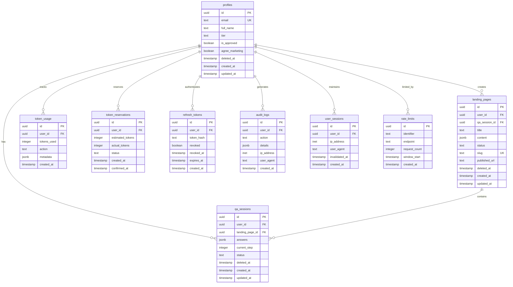

# 마그네틱 세일즈 웹앱 - DB 설계 v2

## 문서 정보
| 항목 | 내용 |
|------|------|
| 버전 | 2.0 |
| 작성일 | 2025-01-15 |
| 이전 버전 | 03_DB_설계.md (v1) |
| 변경 사유 | Red Team 보안 리뷰 반영 |

---

## v1 → v2 주요 변경 사항

| 영역 | v1 | v2 | 변경 사유 |
|------|----|----|-----------|
| Soft Delete | 미구현 | `deleted_at` 컬럼 추가 | CRITICAL-DB-001 |
| 감사 로그 | 미구현 | `audit_logs` 테이블 추가 | CRITICAL-DB-002 |
| Refresh Token | 미구현 | `refresh_tokens` 테이블 추가 | HIGH-SEC-001 |
| 토큰 예약 | 미구현 | `token_reservations` 테이블 추가 | CRITICAL-API-003 |
| 세션 관리 | 미구현 | `user_sessions` 테이블 추가 | CRITICAL-UX-001 |
| Rate Limit | Upstash | `rate_limits` 테이블 추가 | HIGH-UX-001 |
| RLS 정책 | 기본 | `deleted_at IS NULL` 조건 추가 | MEDIUM-DB-002 |

---

## 1. 전체 스키마 다이어그램



---

## 2. 테이블 상세 정의

### 2.1 profiles (사용자 프로필)

#### 테이블 정의
```sql
-- profiles 테이블 (v2)
CREATE TABLE profiles (
    id UUID PRIMARY KEY REFERENCES auth.users(id) ON DELETE CASCADE,
    email TEXT UNIQUE NOT NULL,
    full_name TEXT NOT NULL,
    tier TEXT NOT NULL DEFAULT 'FREE' CHECK (tier IN ('FREE', 'PRO', 'ENTERPRISE')),
    is_approved BOOLEAN NOT NULL DEFAULT FALSE,
    agree_marketing BOOLEAN NOT NULL DEFAULT FALSE,
    deleted_at TIMESTAMPTZ,  -- v2 추가: Soft Delete
    created_at TIMESTAMPTZ NOT NULL DEFAULT NOW(),
    updated_at TIMESTAMPTZ NOT NULL DEFAULT NOW()
);

-- 인덱스
CREATE INDEX idx_profiles_email ON profiles(email);
CREATE INDEX idx_profiles_tier ON profiles(tier);
CREATE INDEX idx_profiles_is_approved ON profiles(is_approved);
CREATE INDEX idx_profiles_deleted_at ON profiles(deleted_at) WHERE deleted_at IS NULL;

-- updated_at 자동 갱신 트리거
CREATE TRIGGER update_profiles_updated_at
    BEFORE UPDATE ON profiles
    FOR EACH ROW
    EXECUTE FUNCTION update_updated_at_column();
```

#### RLS 정책 (v2 - deleted_at 조건 추가)
```sql
-- RLS 활성화
ALTER TABLE profiles ENABLE ROW LEVEL SECURITY;

-- v2: Soft Delete 조건 추가
CREATE POLICY "Users can view own profile"
    ON profiles FOR SELECT
    USING (
        auth.uid() = id
        AND deleted_at IS NULL  -- v2 추가
    );

CREATE POLICY "Users can update own profile"
    ON profiles FOR UPDATE
    USING (
        auth.uid() = id
        AND deleted_at IS NULL  -- v2 추가
    )
    WITH CHECK (
        auth.uid() = id
        AND deleted_at IS NULL  -- v2 추가
    );

-- 관리자 정책
CREATE POLICY "Admins can view all profiles"
    ON profiles FOR SELECT
    USING (
        EXISTS (
            SELECT 1 FROM profiles
            WHERE id = auth.uid()
            AND tier = 'ENTERPRISE'
            AND deleted_at IS NULL
        )
    );

CREATE POLICY "Admins can update approval status"
    ON profiles FOR UPDATE
    USING (
        EXISTS (
            SELECT 1 FROM profiles
            WHERE id = auth.uid()
            AND tier = 'ENTERPRISE'
            AND deleted_at IS NULL
        )
    );
```

### 2.2 landing_pages (랜딩페이지)

#### 테이블 정의
```sql
-- landing_pages 테이블 (v2)
CREATE TABLE landing_pages (
    id UUID PRIMARY KEY DEFAULT gen_random_uuid(),
    user_id UUID NOT NULL REFERENCES profiles(id) ON DELETE CASCADE,
    qa_session_id UUID REFERENCES qa_sessions(id),
    title TEXT NOT NULL,
    content JSONB NOT NULL DEFAULT '{}',
    status TEXT NOT NULL DEFAULT 'draft' CHECK (status IN ('draft', 'published', 'archived')),
    slug TEXT UNIQUE,
    published_url TEXT,
    deleted_at TIMESTAMPTZ,  -- v2 추가: Soft Delete
    created_at TIMESTAMPTZ NOT NULL DEFAULT NOW(),
    updated_at TIMESTAMPTZ NOT NULL DEFAULT NOW()
);

-- 인덱스
CREATE INDEX idx_landing_pages_user_id ON landing_pages(user_id);
CREATE INDEX idx_landing_pages_status ON landing_pages(status);
CREATE INDEX idx_landing_pages_slug ON landing_pages(slug);
CREATE INDEX idx_landing_pages_deleted_at ON landing_pages(deleted_at) WHERE deleted_at IS NULL;
CREATE INDEX idx_landing_pages_user_deleted ON landing_pages(user_id, deleted_at);

-- updated_at 자동 갱신 트리거
CREATE TRIGGER update_landing_pages_updated_at
    BEFORE UPDATE ON landing_pages
    FOR EACH ROW
    EXECUTE FUNCTION update_updated_at_column();
```

#### RLS 정책 (v2)
```sql
ALTER TABLE landing_pages ENABLE ROW LEVEL SECURITY;

-- 활성 랜딩페이지 조회 (기본)
CREATE POLICY "Users can view own active landing pages"
    ON landing_pages FOR SELECT
    USING (
        user_id = auth.uid()
        AND deleted_at IS NULL  -- v2 추가
    );

-- 삭제된 랜딩페이지 조회 (복구용)
CREATE POLICY "Users can view own deleted landing pages for recovery"
    ON landing_pages FOR SELECT
    USING (
        user_id = auth.uid()
        AND deleted_at IS NOT NULL
        AND deleted_at > NOW() - INTERVAL '30 days'  -- v2: 30일 이내만
    );

-- 생성
CREATE POLICY "Users can create landing pages"
    ON landing_pages FOR INSERT
    WITH CHECK (user_id = auth.uid());

-- 수정 (삭제되지 않은 것만)
CREATE POLICY "Users can update own active landing pages"
    ON landing_pages FOR UPDATE
    USING (
        user_id = auth.uid()
        AND deleted_at IS NULL  -- v2 추가
    )
    WITH CHECK (user_id = auth.uid());

-- 삭제 (Soft Delete를 위한 UPDATE)
CREATE POLICY "Users can soft delete own landing pages"
    ON landing_pages FOR UPDATE
    USING (user_id = auth.uid())
    WITH CHECK (user_id = auth.uid());

-- 공개 랜딩페이지 조회 (배포된 것만)
CREATE POLICY "Anyone can view published landing pages"
    ON landing_pages FOR SELECT
    USING (
        status = 'published'
        AND deleted_at IS NULL  -- v2 추가
    );
```

### 2.3 qa_sessions (Q&A 세션)

#### 테이블 정의
```sql
-- qa_sessions 테이블 (v2)
CREATE TABLE qa_sessions (
    id UUID PRIMARY KEY DEFAULT gen_random_uuid(),
    user_id UUID NOT NULL REFERENCES profiles(id) ON DELETE CASCADE,
    landing_page_id UUID REFERENCES landing_pages(id) ON DELETE SET NULL,
    answers JSONB NOT NULL DEFAULT '{}',
    current_step INTEGER NOT NULL DEFAULT 1 CHECK (current_step BETWEEN 1 AND 40),
    status TEXT NOT NULL DEFAULT 'in_progress' CHECK (status IN ('in_progress', 'completed', 'abandoned')),
    deleted_at TIMESTAMPTZ,  -- v2 추가: Soft Delete
    created_at TIMESTAMPTZ NOT NULL DEFAULT NOW(),
    updated_at TIMESTAMPTZ NOT NULL DEFAULT NOW()
);

-- 인덱스
CREATE INDEX idx_qa_sessions_user_id ON qa_sessions(user_id);
CREATE INDEX idx_qa_sessions_status ON qa_sessions(status);
CREATE INDEX idx_qa_sessions_deleted_at ON qa_sessions(deleted_at) WHERE deleted_at IS NULL;

-- updated_at 자동 갱신 트리거
CREATE TRIGGER update_qa_sessions_updated_at
    BEFORE UPDATE ON qa_sessions
    FOR EACH ROW
    EXECUTE FUNCTION update_updated_at_column();
```

#### RLS 정책 (v2)
```sql
ALTER TABLE qa_sessions ENABLE ROW LEVEL SECURITY;

CREATE POLICY "Users can view own active sessions"
    ON qa_sessions FOR SELECT
    USING (
        user_id = auth.uid()
        AND deleted_at IS NULL  -- v2 추가
    );

CREATE POLICY "Users can create sessions"
    ON qa_sessions FOR INSERT
    WITH CHECK (user_id = auth.uid());

CREATE POLICY "Users can update own active sessions"
    ON qa_sessions FOR UPDATE
    USING (
        user_id = auth.uid()
        AND deleted_at IS NULL  -- v2 추가
    )
    WITH CHECK (user_id = auth.uid());
```

### 2.4 token_usage (토큰 사용 기록)

#### 테이블 정의
```sql
-- token_usage 테이블
CREATE TABLE token_usage (
    id UUID PRIMARY KEY DEFAULT gen_random_uuid(),
    user_id UUID NOT NULL REFERENCES profiles(id) ON DELETE CASCADE,
    tokens_used INTEGER NOT NULL CHECK (tokens_used > 0),
    action TEXT NOT NULL CHECK (action IN ('generate', 'regenerate', 'edit')),
    metadata JSONB DEFAULT '{}',
    created_at TIMESTAMPTZ NOT NULL DEFAULT NOW()
);

-- 인덱스
CREATE INDEX idx_token_usage_user_id ON token_usage(user_id);
CREATE INDEX idx_token_usage_created_at ON token_usage(created_at);
CREATE INDEX idx_token_usage_user_date ON token_usage(user_id, DATE(created_at));
```

#### RLS 정책
```sql
ALTER TABLE token_usage ENABLE ROW LEVEL SECURITY;

CREATE POLICY "Users can view own token usage"
    ON token_usage FOR SELECT
    USING (user_id = auth.uid());

CREATE POLICY "System can insert token usage"
    ON token_usage FOR INSERT
    WITH CHECK (user_id = auth.uid());
```

### 2.5 token_reservations (토큰 예약) - v2 신규

#### 테이블 정의
```sql
-- token_reservations 테이블 (v2 신규)
-- Race Condition 방지를 위한 2-Phase 토큰 관리
CREATE TABLE token_reservations (
    id UUID PRIMARY KEY DEFAULT gen_random_uuid(),
    user_id UUID NOT NULL REFERENCES profiles(id) ON DELETE CASCADE,
    estimated_tokens INTEGER NOT NULL CHECK (estimated_tokens > 0),
    actual_tokens INTEGER,  -- 확정 후 실제 사용량
    status TEXT NOT NULL DEFAULT 'reserved' CHECK (status IN ('reserved', 'confirmed', 'cancelled', 'expired')),
    created_at TIMESTAMPTZ NOT NULL DEFAULT NOW(),
    confirmed_at TIMESTAMPTZ,

    -- 예약 만료 시간 (10분)
    CONSTRAINT valid_reservation CHECK (
        status != 'reserved' OR created_at > NOW() - INTERVAL '10 minutes'
    )
);

-- 인덱스
CREATE INDEX idx_token_reservations_user_id ON token_reservations(user_id);
CREATE INDEX idx_token_reservations_status ON token_reservations(status);
CREATE INDEX idx_token_reservations_created_at ON token_reservations(created_at);
CREATE INDEX idx_token_reservations_user_pending ON token_reservations(user_id, status)
    WHERE status = 'reserved';
```

#### RLS 정책
```sql
ALTER TABLE token_reservations ENABLE ROW LEVEL SECURITY;

CREATE POLICY "Users can view own reservations"
    ON token_reservations FOR SELECT
    USING (user_id = auth.uid());

-- INSERT/UPDATE는 서버 사이드에서만 (service role)
```

### 2.6 refresh_tokens (리프레시 토큰) - v2 신규

#### 테이블 정의
```sql
-- refresh_tokens 테이블 (v2 신규)
-- Refresh Token Rotation 지원
CREATE TABLE refresh_tokens (
    id UUID PRIMARY KEY DEFAULT gen_random_uuid(),
    user_id UUID NOT NULL REFERENCES profiles(id) ON DELETE CASCADE,
    token_hash TEXT NOT NULL,  -- 토큰 해시 (원본 저장 안 함)
    revoked BOOLEAN NOT NULL DEFAULT FALSE,
    revoked_at TIMESTAMPTZ,
    expires_at TIMESTAMPTZ NOT NULL,
    created_at TIMESTAMPTZ NOT NULL DEFAULT NOW(),

    -- 유니크 제약 (해시 충돌 방지)
    CONSTRAINT unique_token_hash UNIQUE (token_hash)
);

-- 인덱스
CREATE INDEX idx_refresh_tokens_user_id ON refresh_tokens(user_id);
CREATE INDEX idx_refresh_tokens_token_hash ON refresh_tokens(token_hash);
CREATE INDEX idx_refresh_tokens_expires_at ON refresh_tokens(expires_at);
CREATE INDEX idx_refresh_tokens_user_active ON refresh_tokens(user_id, revoked)
    WHERE revoked = FALSE;
```

#### RLS 정책
```sql
ALTER TABLE refresh_tokens ENABLE ROW LEVEL SECURITY;

-- 서버 사이드에서만 접근 (service role)
-- 클라이언트 직접 접근 불가
```

### 2.7 audit_logs (감사 로그) - v2 신규

#### 테이블 정의
```sql
-- audit_logs 테이블 (v2 신규)
CREATE TABLE audit_logs (
    id UUID PRIMARY KEY DEFAULT gen_random_uuid(),
    user_id UUID REFERENCES profiles(id) ON DELETE SET NULL,  -- 탈퇴해도 로그 유지
    action TEXT NOT NULL,
    details JSONB DEFAULT '{}',
    ip_address INET,
    user_agent TEXT,
    created_at TIMESTAMPTZ NOT NULL DEFAULT NOW()
);

-- 인덱스
CREATE INDEX idx_audit_logs_user_id ON audit_logs(user_id);
CREATE INDEX idx_audit_logs_action ON audit_logs(action);
CREATE INDEX idx_audit_logs_created_at ON audit_logs(created_at);
CREATE INDEX idx_audit_logs_ip_address ON audit_logs(ip_address);

-- 파티셔닝 (월별) - 대용량 처리용
-- CREATE TABLE audit_logs_2025_01 PARTITION OF audit_logs
--     FOR VALUES FROM ('2025-01-01') TO ('2025-02-01');
```

#### 감사 대상 액션
```sql
-- 감사 대상 액션 정의
COMMENT ON TABLE audit_logs IS '
감사 대상 액션:
- signup: 회원가입
- login: 로그인
- logout: 로그아웃
- password_change: 비밀번호 변경
- profile_update: 프로필 수정
- approval_change: 승인 상태 변경
- sessions_invalidated: 세션 무효화
- token_reuse_detected: 토큰 재사용 감지
- landing_page_created: LP 생성
- landing_page_updated: LP 수정
- landing_page_deleted: LP 삭제 (soft)
- landing_page_restored: LP 복구
- landing_page_permanently_deleted: LP 영구 삭제
- ai_generation: AI 생성 요청
- rate_limit_exceeded: Rate Limit 초과
- error: 에러 발생
';
```

#### RLS 정책
```sql
ALTER TABLE audit_logs ENABLE ROW LEVEL SECURITY;

-- 일반 사용자: 자신의 로그만 조회
CREATE POLICY "Users can view own audit logs"
    ON audit_logs FOR SELECT
    USING (user_id = auth.uid());

-- 관리자: 모든 로그 조회
CREATE POLICY "Admins can view all audit logs"
    ON audit_logs FOR SELECT
    USING (
        EXISTS (
            SELECT 1 FROM profiles
            WHERE id = auth.uid()
            AND tier = 'ENTERPRISE'
            AND deleted_at IS NULL
        )
    );

-- INSERT는 서버 사이드에서만
```

### 2.8 user_sessions (사용자 세션) - v2 신규

#### 테이블 정의
```sql
-- user_sessions 테이블 (v2 신규)
-- 세션 무효화 관리
CREATE TABLE user_sessions (
    id UUID PRIMARY KEY DEFAULT gen_random_uuid(),
    user_id UUID NOT NULL REFERENCES profiles(id) ON DELETE CASCADE,
    ip_address INET,
    user_agent TEXT,
    invalidated_at TIMESTAMPTZ,  -- NULL이면 활성 세션
    created_at TIMESTAMPTZ NOT NULL DEFAULT NOW()
);

-- 인덱스
CREATE INDEX idx_user_sessions_user_id ON user_sessions(user_id);
CREATE INDEX idx_user_sessions_user_active ON user_sessions(user_id, invalidated_at)
    WHERE invalidated_at IS NULL;
CREATE INDEX idx_user_sessions_created_at ON user_sessions(created_at);
```

#### RLS 정책
```sql
ALTER TABLE user_sessions ENABLE ROW LEVEL SECURITY;

CREATE POLICY "Users can view own sessions"
    ON user_sessions FOR SELECT
    USING (user_id = auth.uid());
```

### 2.9 rate_limits (Rate Limit) - v2 신규

#### 테이블 정의
```sql
-- rate_limits 테이블 (v2 신규)
-- Supabase PostgreSQL 기반 Rate Limiting
CREATE TABLE rate_limits (
    id UUID PRIMARY KEY DEFAULT gen_random_uuid(),
    identifier TEXT NOT NULL,  -- IP 또는 user_id
    endpoint TEXT NOT NULL,
    request_count INTEGER NOT NULL DEFAULT 1,
    window_start TIMESTAMPTZ NOT NULL DEFAULT NOW(),
    created_at TIMESTAMPTZ NOT NULL DEFAULT NOW(),

    -- 복합 유니크 키
    CONSTRAINT unique_rate_limit UNIQUE (identifier, endpoint, window_start)
);

-- 인덱스
CREATE INDEX idx_rate_limits_identifier ON rate_limits(identifier);
CREATE INDEX idx_rate_limits_endpoint ON rate_limits(endpoint);
CREATE INDEX idx_rate_limits_window_start ON rate_limits(window_start);
CREATE INDEX idx_rate_limits_lookup ON rate_limits(identifier, endpoint, window_start);
```

#### Rate Limit 체크 함수
```sql
-- Rate Limit 체크 함수 (v2)
CREATE OR REPLACE FUNCTION check_rate_limit(
    p_identifier TEXT,
    p_endpoint TEXT,
    p_limit INTEGER,
    p_window_seconds INTEGER
)
RETURNS JSONB AS $$
DECLARE
    v_window_start TIMESTAMPTZ;
    v_current_count INTEGER;
BEGIN
    -- 윈도우 시작 시간 계산 (슬라이딩 윈도우)
    v_window_start := DATE_TRUNC('second', NOW())
        - (EXTRACT(EPOCH FROM NOW())::INTEGER % p_window_seconds) * INTERVAL '1 second';

    -- 현재 카운트 조회 및 증가
    INSERT INTO rate_limits (identifier, endpoint, request_count, window_start)
    VALUES (p_identifier, p_endpoint, 1, v_window_start)
    ON CONFLICT (identifier, endpoint, window_start)
    DO UPDATE SET request_count = rate_limits.request_count + 1
    RETURNING request_count INTO v_current_count;

    -- 제한 초과 확인
    IF v_current_count > p_limit THEN
        -- 감사 로그 (선택적)
        INSERT INTO audit_logs (action, details, ip_address)
        VALUES (
            'rate_limit_exceeded',
            jsonb_build_object(
                'identifier', p_identifier,
                'endpoint', p_endpoint,
                'count', v_current_count,
                'limit', p_limit
            ),
            p_identifier::INET
        );

        RETURN jsonb_build_object(
            'allowed', FALSE,
            'current', v_current_count,
            'limit', p_limit,
            'reset_at', v_window_start + (p_window_seconds * INTERVAL '1 second')
        );
    END IF;

    RETURN jsonb_build_object(
        'allowed', TRUE,
        'current', v_current_count,
        'limit', p_limit,
        'remaining', p_limit - v_current_count
    );
END;
$$ LANGUAGE plpgsql;
```

---

## 3. 함수 및 트리거

### 3.1 updated_at 자동 갱신

```sql
-- updated_at 자동 갱신 함수
CREATE OR REPLACE FUNCTION update_updated_at_column()
RETURNS TRIGGER AS $$
BEGIN
    NEW.updated_at = NOW();
    RETURN NEW;
END;
$$ LANGUAGE plpgsql;
```

### 3.2 세션 무효화 트리거 (v2 신규)

```sql
-- 승인 상태 변경 시 세션 무효화
CREATE OR REPLACE FUNCTION invalidate_user_sessions()
RETURNS TRIGGER AS $$
BEGIN
    -- is_approved가 변경된 경우
    IF OLD.is_approved IS DISTINCT FROM NEW.is_approved THEN
        -- 모든 Refresh Token 폐기
        UPDATE refresh_tokens
        SET revoked = TRUE, revoked_at = NOW()
        WHERE user_id = NEW.id AND revoked = FALSE;

        -- 세션 무효화
        UPDATE user_sessions
        SET invalidated_at = NOW()
        WHERE user_id = NEW.id AND invalidated_at IS NULL;

        -- 감사 로그
        INSERT INTO audit_logs (user_id, action, details)
        VALUES (
            NEW.id,
            'sessions_invalidated',
            jsonb_build_object(
                'reason', 'approval_status_changed',
                'old_status', OLD.is_approved,
                'new_status', NEW.is_approved
            )
        );
    END IF;

    RETURN NEW;
END;
$$ LANGUAGE plpgsql SECURITY DEFINER;

CREATE TRIGGER on_approval_change
    AFTER UPDATE ON profiles
    FOR EACH ROW
    EXECUTE FUNCTION invalidate_user_sessions();
```

### 3.3 토큰 예약 함수 (v2 신규)

```sql
-- 토큰 예약 함수 (Advisory Lock 사용)
CREATE OR REPLACE FUNCTION check_and_reserve_tokens(
    p_user_id UUID,
    p_estimated_tokens INTEGER
)
RETURNS JSONB AS $$
DECLARE
    v_tier TEXT;
    v_daily_limit INTEGER;
    v_used_today INTEGER;
    v_reserved_pending INTEGER;
    v_available INTEGER;
    v_reservation_id UUID;
BEGIN
    -- Advisory Lock 획득 (사용자별 직렬화)
    PERFORM pg_advisory_xact_lock(hashtext(p_user_id::text));

    -- 사용자 티어 확인
    SELECT tier INTO v_tier
    FROM profiles
    WHERE id = p_user_id AND deleted_at IS NULL;

    IF v_tier IS NULL THEN
        RETURN jsonb_build_object('success', FALSE, 'error', 'user_not_found');
    END IF;

    -- 티어별 일일 한도 (v2)
    v_daily_limit := CASE v_tier
        WHEN 'FREE' THEN 100000      -- v2: 50000 → 100000
        WHEN 'PRO' THEN 500000
        WHEN 'ENTERPRISE' THEN 2000000
        ELSE 100000
    END;

    -- 오늘 사용량 조회
    SELECT COALESCE(SUM(tokens_used), 0) INTO v_used_today
    FROM token_usage
    WHERE user_id = p_user_id
      AND created_at >= DATE_TRUNC('day', NOW());

    -- 대기 중인 예약량 조회 (10분 이내)
    SELECT COALESCE(SUM(estimated_tokens), 0) INTO v_reserved_pending
    FROM token_reservations
    WHERE user_id = p_user_id
      AND status = 'reserved'
      AND created_at > NOW() - INTERVAL '10 minutes';

    -- 사용 가능 토큰 계산
    v_available := v_daily_limit - v_used_today - v_reserved_pending;

    IF v_available < p_estimated_tokens THEN
        RETURN jsonb_build_object(
            'success', FALSE,
            'error', 'insufficient_tokens',
            'available', v_available,
            'requested', p_estimated_tokens,
            'daily_limit', v_daily_limit,
            'used_today', v_used_today,
            'reserved', v_reserved_pending
        );
    END IF;

    -- 예약 생성
    INSERT INTO token_reservations (user_id, estimated_tokens, status)
    VALUES (p_user_id, p_estimated_tokens, 'reserved')
    RETURNING id INTO v_reservation_id;

    RETURN jsonb_build_object(
        'success', TRUE,
        'reservation_id', v_reservation_id,
        'available_after', v_available - p_estimated_tokens,
        'daily_limit', v_daily_limit
    );
END;
$$ LANGUAGE plpgsql SECURITY DEFINER;
```

### 3.4 토큰 확정 함수 (v2 신규)

```sql
-- 토큰 사용 확정 함수
CREATE OR REPLACE FUNCTION confirm_token_usage(
    p_reservation_id UUID,
    p_actual_tokens INTEGER
)
RETURNS JSONB AS $$
DECLARE
    v_reservation RECORD;
BEGIN
    -- 예약 조회 및 업데이트
    UPDATE token_reservations
    SET
        status = 'confirmed',
        actual_tokens = p_actual_tokens,
        confirmed_at = NOW()
    WHERE id = p_reservation_id AND status = 'reserved'
    RETURNING * INTO v_reservation;

    IF v_reservation IS NULL THEN
        RETURN jsonb_build_object('success', FALSE, 'error', 'reservation_not_found');
    END IF;

    -- token_usage에 실제 사용량 기록
    INSERT INTO token_usage (user_id, tokens_used, action, metadata)
    VALUES (
        v_reservation.user_id,
        p_actual_tokens,
        'generate',
        jsonb_build_object('reservation_id', p_reservation_id)
    );

    RETURN jsonb_build_object(
        'success', TRUE,
        'estimated', v_reservation.estimated_tokens,
        'actual', p_actual_tokens,
        'difference', v_reservation.estimated_tokens - p_actual_tokens
    );
END;
$$ LANGUAGE plpgsql SECURITY DEFINER;
```

### 3.5 토큰 예약 취소 함수 (v2 신규)

```sql
-- 토큰 예약 취소 함수
CREATE OR REPLACE FUNCTION cancel_token_reservation(
    p_reservation_id UUID
)
RETURNS JSONB AS $$
DECLARE
    v_updated INTEGER;
BEGIN
    UPDATE token_reservations
    SET status = 'cancelled'
    WHERE id = p_reservation_id AND status = 'reserved';

    GET DIAGNOSTICS v_updated = ROW_COUNT;

    IF v_updated = 0 THEN
        RETURN jsonb_build_object('success', FALSE, 'error', 'reservation_not_found');
    END IF;

    RETURN jsonb_build_object('success', TRUE);
END;
$$ LANGUAGE plpgsql SECURITY DEFINER;
```

### 3.6 만료된 예약 정리 (스케줄 Job)

```sql
-- 만료된 예약 정리 함수 (10분 초과)
CREATE OR REPLACE FUNCTION cleanup_expired_reservations()
RETURNS INTEGER AS $$
DECLARE
    v_count INTEGER;
BEGIN
    UPDATE token_reservations
    SET status = 'expired'
    WHERE status = 'reserved'
      AND created_at < NOW() - INTERVAL '10 minutes';

    GET DIAGNOSTICS v_count = ROW_COUNT;
    RETURN v_count;
END;
$$ LANGUAGE plpgsql;

-- pg_cron으로 매 분 실행 (Supabase에서 설정)
-- SELECT cron.schedule('cleanup-reservations', '* * * * *', 'SELECT cleanup_expired_reservations()');
```

### 3.7 오래된 Rate Limit 정리

```sql
-- 오래된 Rate Limit 데이터 정리
CREATE OR REPLACE FUNCTION cleanup_old_rate_limits()
RETURNS INTEGER AS $$
DECLARE
    v_count INTEGER;
BEGIN
    DELETE FROM rate_limits
    WHERE window_start < NOW() - INTERVAL '1 hour';

    GET DIAGNOSTICS v_count = ROW_COUNT;
    RETURN v_count;
END;
$$ LANGUAGE plpgsql;

-- pg_cron으로 매 시간 실행
-- SELECT cron.schedule('cleanup-rate-limits', '0 * * * *', 'SELECT cleanup_old_rate_limits()');
```

---

## 4. 마이그레이션 스크립트

### 4.1 v1 → v2 마이그레이션

```sql
-- v1 → v2 마이그레이션 스크립트
-- 실행 전 반드시 백업할 것!

BEGIN;

-- 1. profiles에 deleted_at 추가
ALTER TABLE profiles ADD COLUMN IF NOT EXISTS deleted_at TIMESTAMPTZ;
CREATE INDEX IF NOT EXISTS idx_profiles_deleted_at ON profiles(deleted_at) WHERE deleted_at IS NULL;

-- 2. landing_pages에 deleted_at 추가
ALTER TABLE landing_pages ADD COLUMN IF NOT EXISTS deleted_at TIMESTAMPTZ;
CREATE INDEX IF NOT EXISTS idx_landing_pages_deleted_at ON landing_pages(deleted_at) WHERE deleted_at IS NULL;

-- 3. qa_sessions에 deleted_at 추가
ALTER TABLE qa_sessions ADD COLUMN IF NOT EXISTS deleted_at TIMESTAMPTZ;
CREATE INDEX IF NOT EXISTS idx_qa_sessions_deleted_at ON qa_sessions(deleted_at) WHERE deleted_at IS NULL;

-- 4. 신규 테이블 생성
-- (위의 token_reservations, refresh_tokens, audit_logs, user_sessions, rate_limits 생성 스크립트 실행)

-- 5. RLS 정책 업데이트
-- 기존 정책 삭제
DROP POLICY IF EXISTS "Users can view own profile" ON profiles;
DROP POLICY IF EXISTS "Users can view own active landing pages" ON landing_pages;
-- (새 정책 생성 스크립트 실행)

-- 6. 트리거 생성
-- (위의 invalidate_user_sessions 트리거 생성 스크립트 실행)

-- 7. 함수 생성
-- (위의 check_and_reserve_tokens, confirm_token_usage 등 함수 생성 스크립트 실행)

COMMIT;
```

### 4.2 롤백 스크립트

```sql
-- 롤백 스크립트 (v2 → v1)
BEGIN;

-- 1. 신규 테이블 삭제
DROP TABLE IF EXISTS token_reservations;
DROP TABLE IF EXISTS refresh_tokens;
DROP TABLE IF EXISTS audit_logs;
DROP TABLE IF EXISTS user_sessions;
DROP TABLE IF EXISTS rate_limits;

-- 2. deleted_at 컬럼 삭제
ALTER TABLE profiles DROP COLUMN IF EXISTS deleted_at;
ALTER TABLE landing_pages DROP COLUMN IF EXISTS deleted_at;
ALTER TABLE qa_sessions DROP COLUMN IF EXISTS deleted_at;

-- 3. 트리거 삭제
DROP TRIGGER IF EXISTS on_approval_change ON profiles;
DROP FUNCTION IF EXISTS invalidate_user_sessions();

-- 4. 함수 삭제
DROP FUNCTION IF EXISTS check_and_reserve_tokens(UUID, INTEGER);
DROP FUNCTION IF EXISTS confirm_token_usage(UUID, INTEGER);
DROP FUNCTION IF EXISTS cancel_token_reservation(UUID);
DROP FUNCTION IF EXISTS check_rate_limit(TEXT, TEXT, INTEGER, INTEGER);

COMMIT;
```

---

## 5. 구현 체크리스트

### 5.1 테이블 생성
- [ ] profiles - deleted_at 추가
- [ ] landing_pages - deleted_at 추가
- [ ] qa_sessions - deleted_at 추가
- [ ] token_reservations 신규 생성
- [ ] refresh_tokens 신규 생성
- [ ] audit_logs 신규 생성
- [ ] user_sessions 신규 생성
- [ ] rate_limits 신규 생성

### 5.2 인덱스 생성
- [ ] deleted_at 인덱스 (부분 인덱스)
- [ ] 복합 인덱스 (user_id + deleted_at)
- [ ] token_hash 인덱스
- [ ] rate_limit lookup 인덱스

### 5.3 RLS 정책
- [ ] profiles 정책 업데이트
- [ ] landing_pages 정책 업데이트
- [ ] qa_sessions 정책 업데이트
- [ ] 신규 테이블 정책 생성

### 5.4 함수 및 트리거
- [ ] invalidate_user_sessions 트리거
- [ ] check_and_reserve_tokens 함수
- [ ] confirm_token_usage 함수
- [ ] cancel_token_reservation 함수
- [ ] check_rate_limit 함수
- [ ] cleanup 함수들

### 5.5 스케줄 Job
- [ ] cleanup_expired_reservations (매 분)
- [ ] cleanup_old_rate_limits (매 시간)
- [ ] cleanup_old_audit_logs (매일, 90일 이전 삭제)

---

## 부록: 데이터 타입 참조

| PostgreSQL 타입 | TypeScript 타입 | 설명 |
|----------------|-----------------|------|
| UUID | string | UUID v4 |
| TEXT | string | 문자열 |
| INTEGER | number | 정수 |
| BOOLEAN | boolean | 참/거짓 |
| TIMESTAMPTZ | string (ISO 8601) | 타임스탬프 (타임존) |
| JSONB | Record<string, any> | JSON 데이터 |
| INET | string | IP 주소 |
