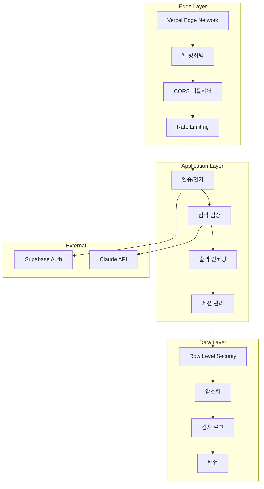
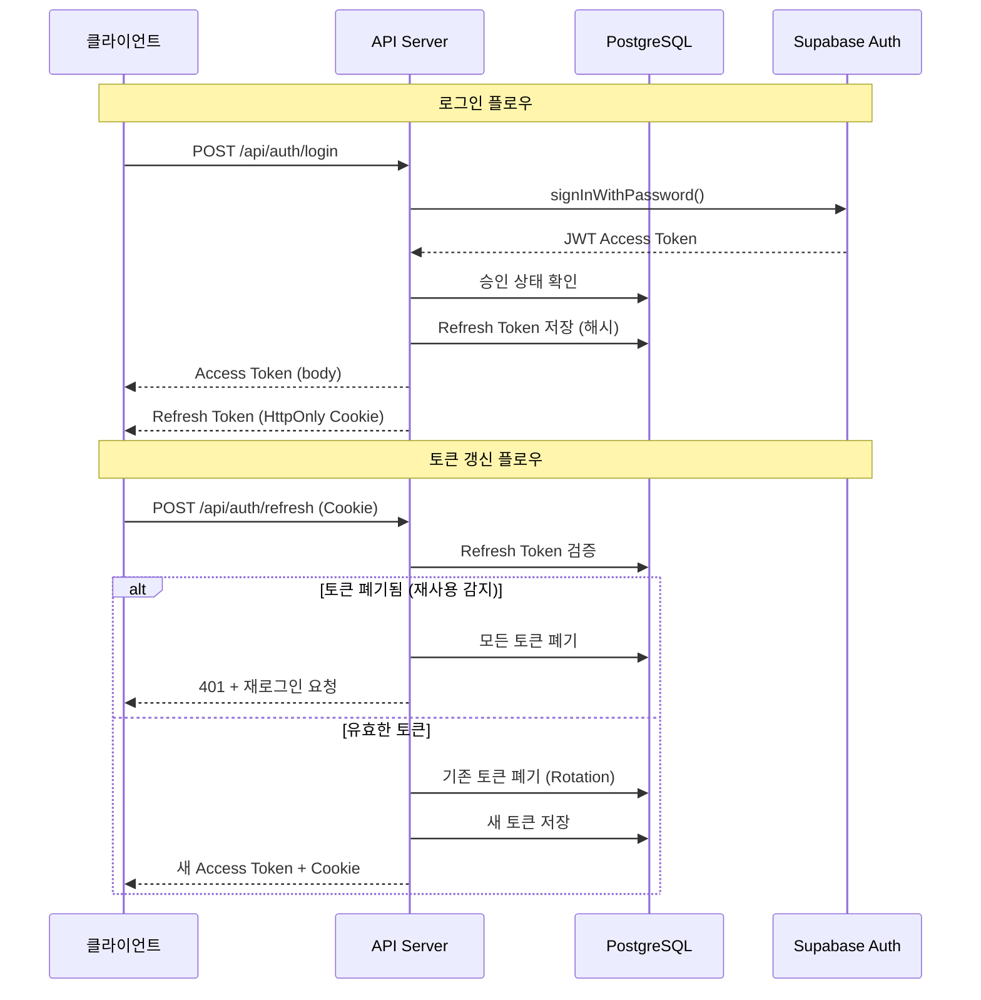
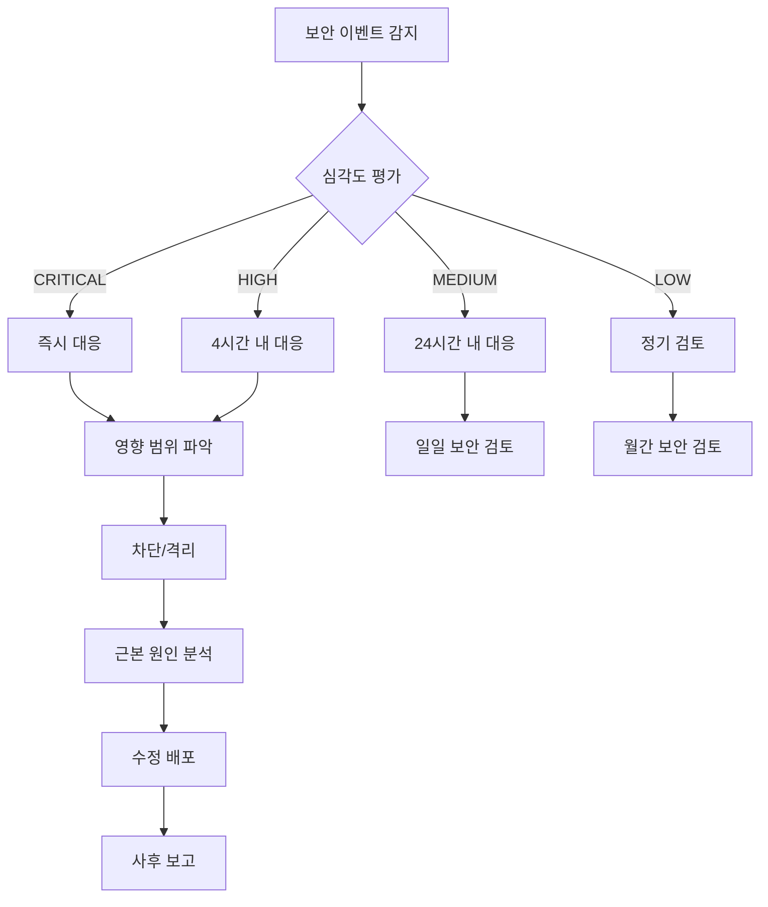

# 마그네틱 세일즈 웹앱 - 보안 아키텍처 v2

## 문서 정보
| 항목 | 내용 |
|------|------|
| 버전 | 2.0 |
| 작성일 | 2025-01-15 |
| 이전 버전 | 06_보안_인증.md (v1) |
| 변경 사유 | Red Team 보안 리뷰 반영 |

---

## v1 → v2 주요 변경 사항

| 영역 | v1 | v2 | 변경 사유 |
|------|----|----|-----------|
| JWT 저장 | localStorage | HttpOnly Cookie (Refresh Token) | HIGH-SEC-001 |
| Refresh Token | 단순 재발급 | Rotation + 재사용 감지 | HIGH-SEC-001 |
| SQL Injection | RPC 호출 | Supabase SDK + Zod 검증 | HIGH-SEC-002 |
| XSS | 기본 DOMPurify | ALLOWED_URI_REGEXP 강화 | HIGH-SEC-003 |
| CORS | 와일드카드 | 명시적 화이트리스트 | CRITICAL-API-001 |
| 세션 관리 | 무제한 | 상태 변경 시 무효화 | CRITICAL-UX-001 |
| 감사 로그 | 미구현 | audit_logs 테이블 | CRITICAL-DB-002 |

---

## 1. 보안 아키텍처 개요

### 1.1 보안 계층 구조



### 1.2 보안 원칙

| 원칙 | 설명 | 적용 영역 |
|------|------|----------|
| 최소 권한 | 필요한 최소한의 권한만 부여 | RLS, API |
| 심층 방어 | 다중 보안 계층 적용 | 전체 |
| 안전한 기본값 | 보수적인 기본 설정 | CORS, Rate Limit |
| 실패 안전 | 에러 시 안전한 상태로 | 인증, 권한 |
| 감사 가능성 | 모든 중요 작업 로깅 | audit_logs |

---

## 2. 인증 시스템 (v2)

### 2.1 JWT 토큰 관리



### 2.2 토큰 구성 (v2)

| 토큰 유형 | 저장 위치 | 만료 시간 | 용도 |
|----------|----------|----------|------|
| Access Token | 메모리 (JavaScript) | 15분 | API 인증 |
| Refresh Token | HttpOnly Cookie | 7일 | Access Token 갱신 |

### 2.3 Refresh Token Rotation 구현

```typescript
// lib/auth/refresh-token.ts (v2)
import crypto from 'crypto';
import { createClient } from '@supabase/supabase-js';

const supabase = createClient(
  process.env.NEXT_PUBLIC_SUPABASE_URL!,
  process.env.SUPABASE_SERVICE_ROLE_KEY!
);

// 보안 토큰 생성
export function generateSecureToken(length: number = 64): string {
  return crypto.randomBytes(length).toString('base64url');
}

// 토큰 해싱 (SHA-256)
export async function hashToken(token: string): Promise<string> {
  const encoder = new TextEncoder();
  const data = encoder.encode(token);
  const hashBuffer = await crypto.subtle.digest('SHA-256', data);
  const hashArray = Array.from(new Uint8Array(hashBuffer));
  return hashArray.map(b => b.toString(16).padStart(2, '0')).join('');
}

// Refresh Token 검증 및 Rotation
export async function validateAndRotateRefreshToken(
  refreshToken: string,
  ipAddress: string
): Promise<{
  valid: boolean;
  userId?: string;
  newRefreshToken?: string;
  error?: string;
}> {
  const tokenHash = await hashToken(refreshToken);

  // 1. 토큰 조회
  const { data: tokenRecord, error } = await supabase
    .from('refresh_tokens')
    .select('*')
    .eq('token_hash', tokenHash)
    .single();

  if (error || !tokenRecord) {
    return { valid: false, error: 'invalid_token' };
  }

  // 2. 재사용 감지 (v2 핵심)
  if (tokenRecord.revoked) {
    // 보안 위협: 모든 토큰 폐기
    await supabase
      .from('refresh_tokens')
      .update({ revoked: true, revoked_at: new Date().toISOString() })
      .eq('user_id', tokenRecord.user_id);

    // 모든 세션 무효화
    await supabase
      .from('user_sessions')
      .update({ invalidated_at: new Date().toISOString() })
      .eq('user_id', tokenRecord.user_id)
      .is('invalidated_at', null);

    // 감사 로그
    await supabase.from('audit_logs').insert({
      user_id: tokenRecord.user_id,
      action: 'token_reuse_detected',
      details: {
        severity: 'critical',
        token_id: tokenRecord.id,
        ip_address: ipAddress,
      },
      ip_address: ipAddress,
    });

    return { valid: false, error: 'token_reuse_detected' };
  }

  // 3. 만료 확인
  if (new Date(tokenRecord.expires_at) < new Date()) {
    return { valid: false, error: 'token_expired' };
  }

  // 4. 사용자 승인 상태 확인
  const { data: profile } = await supabase
    .from('profiles')
    .select('is_approved, deleted_at')
    .eq('id', tokenRecord.user_id)
    .single();

  if (!profile || profile.deleted_at || !profile.is_approved) {
    return { valid: false, error: 'user_not_approved' };
  }

  // 5. 기존 토큰 폐기 (Rotation)
  await supabase
    .from('refresh_tokens')
    .update({ revoked: true, revoked_at: new Date().toISOString() })
    .eq('id', tokenRecord.id);

  // 6. 새 토큰 발급
  const newRefreshToken = generateSecureToken(64);
  const newTokenHash = await hashToken(newRefreshToken);

  await supabase.from('refresh_tokens').insert({
    user_id: tokenRecord.user_id,
    token_hash: newTokenHash,
    expires_at: new Date(Date.now() + 7 * 24 * 60 * 60 * 1000).toISOString(),
    revoked: false,
  });

  return {
    valid: true,
    userId: tokenRecord.user_id,
    newRefreshToken,
  };
}
```

### 2.4 세션 무효화 (v2)

```sql
-- 세션 무효화 트리거
CREATE OR REPLACE FUNCTION invalidate_user_sessions()
RETURNS TRIGGER AS $$
BEGIN
    -- is_approved가 변경된 경우
    IF OLD.is_approved IS DISTINCT FROM NEW.is_approved THEN
        -- 모든 Refresh Token 폐기
        UPDATE refresh_tokens
        SET revoked = TRUE, revoked_at = NOW()
        WHERE user_id = NEW.id AND revoked = FALSE;

        -- 세션 무효화
        UPDATE user_sessions
        SET invalidated_at = NOW()
        WHERE user_id = NEW.id AND invalidated_at IS NULL;

        -- 감사 로그
        INSERT INTO audit_logs (user_id, action, details)
        VALUES (
            NEW.id,
            'sessions_invalidated',
            jsonb_build_object(
                'reason', 'approval_status_changed',
                'old_status', OLD.is_approved,
                'new_status', NEW.is_approved
            )
        );
    END IF;

    RETURN NEW;
END;
$$ LANGUAGE plpgsql SECURITY DEFINER;

CREATE TRIGGER on_approval_change
    AFTER UPDATE ON profiles
    FOR EACH ROW
    EXECUTE FUNCTION invalidate_user_sessions();
```

---

## 3. CORS 보안 (v2)

### 3.1 화이트리스트 기반 CORS

```typescript
// middleware.ts (v2)
import { NextResponse } from 'next/server';
import type { NextRequest } from 'next/server';

// 명시적 도메인 화이트리스트 (v2 - 와일드카드 제거)
const ALLOWED_ORIGINS = new Set([
  'https://magnetic-sales.vercel.app',
  'https://www.magnetic-sales.com',
  'https://staging.magnetic-sales.vercel.app',
]);

// 환경변수에서 추가 도메인 로드
if (process.env.ADDITIONAL_CORS_ORIGINS) {
  process.env.ADDITIONAL_CORS_ORIGINS.split(',').forEach(origin => {
    ALLOWED_ORIGINS.add(origin.trim());
  });
}

// 개발 환경
if (process.env.NODE_ENV === 'development') {
  ALLOWED_ORIGINS.add('http://localhost:3000');
}

export function middleware(request: NextRequest) {
  const origin = request.headers.get('origin');
  const response = NextResponse.next();

  // origin 헤더가 없는 경우 (same-origin 또는 non-browser)
  if (!origin) {
    const fetchSite = request.headers.get('sec-fetch-site');

    // v2: Sec-Fetch-Site 헤더 검증
    if (fetchSite === 'same-origin' || fetchSite === 'none') {
      return response;
    }

    // cross-origin인데 origin이 없으면 거부
    console.warn('CORS: No origin header but cross-origin request');
    return new NextResponse(null, { status: 403 });
  }

  // 화이트리스트 확인 (v2 - 와일드카드 없음)
  if (!ALLOWED_ORIGINS.has(origin)) {
    console.warn(`CORS blocked: ${origin}`);

    // 감사 로그 (비동기)
    logCORSViolation(origin, request);

    return new NextResponse(
      JSON.stringify({
        success: false,
        error: {
          code: 'CORS_001',
          message: 'Origin not allowed',
        },
      }),
      {
        status: 403,
        headers: { 'Content-Type': 'application/json' },
      }
    );
  }

  // CORS 헤더 설정
  response.headers.set('Access-Control-Allow-Origin', origin);
  response.headers.set('Access-Control-Allow-Credentials', 'true');
  response.headers.set(
    'Access-Control-Allow-Methods',
    'GET, POST, PUT, PATCH, DELETE, OPTIONS'
  );
  response.headers.set(
    'Access-Control-Allow-Headers',
    'Content-Type, Authorization, X-Request-ID'
  );
  response.headers.set('Access-Control-Max-Age', '86400');

  // 추가 보안 헤더
  response.headers.set('X-Content-Type-Options', 'nosniff');
  response.headers.set('X-Frame-Options', 'DENY');
  response.headers.set('X-XSS-Protection', '1; mode=block');
  response.headers.set(
    'Referrer-Policy',
    'strict-origin-when-cross-origin'
  );

  // Preflight 요청 처리
  if (request.method === 'OPTIONS') {
    return new NextResponse(null, { status: 204, headers: response.headers });
  }

  return response;
}

// 감사 로그
async function logCORSViolation(origin: string, request: NextRequest) {
  try {
    const supabase = createClient(
      process.env.NEXT_PUBLIC_SUPABASE_URL!,
      process.env.SUPABASE_SERVICE_ROLE_KEY!
    );

    await supabase.from('audit_logs').insert({
      action: 'cors_violation',
      details: {
        origin,
        path: request.nextUrl.pathname,
        method: request.method,
      },
      ip_address: request.headers.get('x-forwarded-for')?.split(',')[0],
    });
  } catch (error) {
    console.error('Failed to log CORS violation:', error);
  }
}

export const config = {
  matcher: '/api/:path*',
};
```

---

## 4. XSS 방어 (v2)

### 4.1 DOMPurify 강화 설정

```typescript
// lib/security/sanitize.ts (v2)
import DOMPurify from 'dompurify';

// v2: javascript: 및 data: URI 차단 정규식
const ALLOWED_URI_REGEXP = /^(?:(?:(?:f|ht)tps?|mailto|tel|callto|sms|cid|xmpp):|[^a-z]|[a-z+.\-]+(?:[^a-z+.\-:]|$))/i;

// 금지된 URI 스킴
const FORBIDDEN_URI_SCHEMES = [
  'javascript',
  'data',
  'vbscript',
  'file',
];

// DOMPurify 설정 (v2)
const purifyConfig: DOMPurify.Config = {
  // 허용 태그
  ALLOWED_TAGS: [
    'p', 'br', 'span', 'div',
    'h1', 'h2', 'h3', 'h4', 'h5', 'h6',
    'strong', 'em', 'b', 'i', 'u',
    'ul', 'ol', 'li',
    'a', 'img',
    'blockquote', 'pre', 'code',
    'table', 'thead', 'tbody', 'tr', 'th', 'td',
  ],

  // 허용 속성
  ALLOWED_ATTR: [
    'href', 'src', 'alt', 'title', 'class', 'id',
    'target', 'rel',
    'width', 'height',
    'colspan', 'rowspan',
  ],

  // v2: URI 검증 강화
  ALLOWED_URI_REGEXP,

  // 금지 태그
  FORBID_TAGS: ['script', 'style', 'iframe', 'object', 'embed', 'form', 'input'],

  // 금지 속성
  FORBID_ATTR: ['onerror', 'onload', 'onclick', 'onmouseover', 'onfocus', 'onblur'],

  // 데이터 속성 허용 여부
  ALLOW_DATA_ATTR: false,

  // 외부 콘텐츠 제한
  ALLOW_UNKNOWN_PROTOCOLS: false,
};

// 새니타이저 함수 (v2)
export function sanitizeHtml(dirty: string): string {
  // 1. 사전 처리: 위험한 URI 스킴 제거
  let processed = dirty;
  for (const scheme of FORBIDDEN_URI_SCHEMES) {
    const regex = new RegExp(`${scheme}\\s*:`, 'gi');
    processed = processed.replace(regex, '');
  }

  // 2. DOMPurify 실행
  const clean = DOMPurify.sanitize(processed, purifyConfig);

  // 3. 후처리: 이벤트 핸들러 재확인
  const eventHandlerRegex = /\s*on\w+\s*=\s*["'][^"']*["']/gi;
  return clean.replace(eventHandlerRegex, '');
}

// 클라이언트 사이드 초기화
export function initDOMPurify() {
  if (typeof window !== 'undefined') {
    // 후크 추가: 모든 href/src 검증
    DOMPurify.addHook('afterSanitizeAttributes', (node) => {
      if (node.hasAttribute('href')) {
        const href = node.getAttribute('href') || '';
        if (!ALLOWED_URI_REGEXP.test(href)) {
          node.removeAttribute('href');
        }
        // 외부 링크는 새 탭 + noopener
        if (href.startsWith('http') && !href.includes(window.location.hostname)) {
          node.setAttribute('target', '_blank');
          node.setAttribute('rel', 'noopener noreferrer');
        }
      }

      if (node.hasAttribute('src')) {
        const src = node.getAttribute('src') || '';
        if (!ALLOWED_URI_REGEXP.test(src)) {
          node.removeAttribute('src');
        }
      }
    });
  }
}
```

### 4.2 Content Security Policy

```typescript
// next.config.js (v2)
const securityHeaders = [
  {
    key: 'Content-Security-Policy',
    value: [
      "default-src 'self'",
      "script-src 'self' 'unsafe-inline' 'unsafe-eval'", // Next.js 요구
      "style-src 'self' 'unsafe-inline'",
      "img-src 'self' data: https: blob:",
      "font-src 'self'",
      "connect-src 'self' https://*.supabase.co https://api.anthropic.com",
      "frame-ancestors 'none'",
      "base-uri 'self'",
      "form-action 'self'",
    ].join('; '),
  },
  {
    key: 'X-Content-Type-Options',
    value: 'nosniff',
  },
  {
    key: 'X-Frame-Options',
    value: 'DENY',
  },
  {
    key: 'X-XSS-Protection',
    value: '1; mode=block',
  },
  {
    key: 'Referrer-Policy',
    value: 'strict-origin-when-cross-origin',
  },
  {
    key: 'Permissions-Policy',
    value: 'camera=(), microphone=(), geolocation=()',
  },
];

module.exports = {
  async headers() {
    return [
      {
        source: '/:path*',
        headers: securityHeaders,
      },
    ];
  },
};
```

---

## 5. SQL Injection 방어 (v2)

### 5.1 Supabase SDK 직접 사용

```typescript
// lib/db/queries.ts (v2 - RPC 최소화)

// 나쁜 예: RPC 호출 (v1)
// const { data } = await supabase.rpc('get_user_data', { user_id: userId });

// 좋은 예: SDK 직접 사용 (v2)
export async function getUserLandingPages(userId: string) {
  // Zod로 입력 검증
  const validatedUserId = z.string().uuid().parse(userId);

  const { data, error } = await supabase
    .from('landing_pages')
    .select('id, title, status, created_at, updated_at')
    .eq('user_id', validatedUserId)
    .is('deleted_at', null)
    .order('created_at', { ascending: false });

  if (error) {
    throw new DatabaseError('데이터 조회에 실패했습니다');
  }

  return data;
}

// 검색 쿼리 (v2 - 파라미터화)
export async function searchLandingPages(userId: string, query: string) {
  // 입력 검증
  const validatedUserId = z.string().uuid().parse(userId);
  const sanitizedQuery = z.string().max(100).parse(query)
    .replace(/[%_]/g, '\\$&'); // LIKE 특수문자 이스케이프

  const { data } = await supabase
    .from('landing_pages')
    .select('*')
    .eq('user_id', validatedUserId)
    .is('deleted_at', null)
    .ilike('title', `%${sanitizedQuery}%`);

  return data;
}
```

### 5.2 Zod 스키마 검증

```typescript
// lib/validation/schemas.ts (v2)
import { z } from 'zod';

// UUID 스키마
export const uuidSchema = z.string().uuid();

// 이메일 스키마
export const emailSchema = z.string().email().max(255).toLowerCase();

// 비밀번호 스키마
export const passwordSchema = z
  .string()
  .min(8, '비밀번호는 8자 이상이어야 합니다')
  .max(128, '비밀번호가 너무 깁니다')
  .regex(/[a-zA-Z]/, '영문을 포함해야 합니다')
  .regex(/[0-9]/, '숫자를 포함해야 합니다');

// 랜딩페이지 생성 스키마
export const createLandingPageSchema = z.object({
  title: z.string().min(1).max(200).trim(),
  content: z.record(z.any()), // JSON 객체
  status: z.enum(['draft', 'published']).default('draft'),
});

// 랜딩페이지 수정 스키마
export const updateLandingPageSchema = z.object({
  title: z.string().min(1).max(200).trim().optional(),
  content: z.record(z.any()).optional(),
  status: z.enum(['draft', 'published', 'archived']).optional(),
});

// 페이지네이션 스키마
export const paginationSchema = z.object({
  page: z.coerce.number().int().min(1).default(1),
  limit: z.coerce.number().int().min(1).max(100).default(10),
});

// API 요청 검증 헬퍼
export function validateRequest<T extends z.ZodSchema>(
  schema: T,
  data: unknown
): z.infer<T> {
  const result = schema.safeParse(data);

  if (!result.success) {
    const errors = result.error.errors.map(e => e.message).join(', ');
    throw new ValidationError(errors);
  }

  return result.data;
}
```

---

## 6. Rate Limiting (v2)

### 6.1 Supabase 기반 Rate Limiting

```typescript
// lib/security/rate-limit.ts (v2)
import { createClient } from '@supabase/supabase-js';

const supabase = createClient(
  process.env.NEXT_PUBLIC_SUPABASE_URL!,
  process.env.SUPABASE_SERVICE_ROLE_KEY!
);

// 엔드포인트별 제한 설정
const RATE_LIMITS: Record<string, { limit: number; window: number }> = {
  '/api/auth/login': { limit: 5, window: 60 },       // 5회/분
  '/api/auth/signup': { limit: 3, window: 60 },      // 3회/분
  '/api/auth/refresh': { limit: 10, window: 60 },    // 10회/분
  '/api/ai/generate': { limit: 10, window: 60 },     // 10회/분
  '/api/lp': { limit: 30, window: 60 },              // 30회/분
  'default': { limit: 60, window: 60 },              // 60회/분
};

export async function checkRateLimit(
  identifier: string,
  endpoint: string
): Promise<{
  allowed: boolean;
  remaining: number;
  resetAt: Date;
}> {
  const config = RATE_LIMITS[endpoint] || RATE_LIMITS['default'];

  const { data, error } = await supabase.rpc('check_rate_limit', {
    p_identifier: identifier,
    p_endpoint: endpoint,
    p_limit: config.limit,
    p_window_seconds: config.window,
  });

  if (error) {
    console.error('Rate limit check failed:', error);
    // 에러 시 허용 (fail-open) - 서비스 가용성 우선
    return {
      allowed: true,
      remaining: config.limit,
      resetAt: new Date(),
    };
  }

  return {
    allowed: data.allowed,
    remaining: data.remaining || 0,
    resetAt: new Date(data.reset_at),
  };
}

// Rate Limit 미들웨어 래퍼
export async function withRateLimit<T>(
  identifier: string,
  endpoint: string,
  handler: () => Promise<T>
): Promise<T | { error: string; status: number }> {
  const { allowed, remaining, resetAt } = await checkRateLimit(identifier, endpoint);

  if (!allowed) {
    return {
      error: '요청이 너무 많습니다. 잠시 후 다시 시도해주세요',
      status: 429,
    };
  }

  return handler();
}
```

### 6.2 Rate Limit PostgreSQL 함수

```sql
-- check_rate_limit 함수 (v2)
CREATE OR REPLACE FUNCTION check_rate_limit(
    p_identifier TEXT,
    p_endpoint TEXT,
    p_limit INTEGER,
    p_window_seconds INTEGER
)
RETURNS JSONB AS $$
DECLARE
    v_window_start TIMESTAMPTZ;
    v_current_count INTEGER;
BEGIN
    -- 윈도우 시작 시간 계산 (슬라이딩 윈도우)
    v_window_start := DATE_TRUNC('second', NOW())
        - (EXTRACT(EPOCH FROM NOW())::INTEGER % p_window_seconds) * INTERVAL '1 second';

    -- UPSERT: 카운트 증가 또는 새 레코드 생성
    INSERT INTO rate_limits (identifier, endpoint, request_count, window_start)
    VALUES (p_identifier, p_endpoint, 1, v_window_start)
    ON CONFLICT (identifier, endpoint, window_start)
    DO UPDATE SET request_count = rate_limits.request_count + 1
    RETURNING request_count INTO v_current_count;

    -- 제한 초과 확인
    IF v_current_count > p_limit THEN
        RETURN jsonb_build_object(
            'allowed', FALSE,
            'current', v_current_count,
            'limit', p_limit,
            'remaining', 0,
            'reset_at', v_window_start + (p_window_seconds * INTERVAL '1 second')
        );
    END IF;

    RETURN jsonb_build_object(
        'allowed', TRUE,
        'current', v_current_count,
        'limit', p_limit,
        'remaining', p_limit - v_current_count,
        'reset_at', v_window_start + (p_window_seconds * INTERVAL '1 second')
    );
END;
$$ LANGUAGE plpgsql;
```

---

## 7. 감사 로그 (v2)

### 7.1 감사 대상 이벤트

| 카테고리 | 이벤트 | 심각도 |
|----------|--------|--------|
| 인증 | signup, login, logout | INFO |
| 인증 | password_change | MEDIUM |
| 인증 | token_reuse_detected | CRITICAL |
| 인증 | sessions_invalidated | HIGH |
| 보안 | cors_violation | HIGH |
| 보안 | prompt_injection_attempt | CRITICAL |
| 보안 | rate_limit_exceeded | MEDIUM |
| 데이터 | landing_page_created | INFO |
| 데이터 | landing_page_deleted | MEDIUM |
| 데이터 | landing_page_permanently_deleted | HIGH |
| 관리 | approval_change | HIGH |

### 7.2 감사 로그 구현

```typescript
// lib/audit/logger.ts (v2)
import { createClient } from '@supabase/supabase-js';

const supabase = createClient(
  process.env.NEXT_PUBLIC_SUPABASE_URL!,
  process.env.SUPABASE_SERVICE_ROLE_KEY!
);

interface AuditLogEntry {
  userId?: string;
  action: string;
  details: Record<string, any>;
  ipAddress?: string;
  userAgent?: string;
}

// 감사 로그 기록
export async function logAudit(entry: AuditLogEntry): Promise<void> {
  try {
    await supabase.from('audit_logs').insert({
      user_id: entry.userId,
      action: entry.action,
      details: entry.details,
      ip_address: entry.ipAddress,
      user_agent: entry.userAgent,
    });

    // 심각한 이벤트는 즉시 알림
    if (isCriticalEvent(entry.action)) {
      await sendSecurityAlert(entry);
    }
  } catch (error) {
    // 로깅 실패는 서비스에 영향 주지 않음
    console.error('Audit log failed:', error);
  }
}

// 심각한 이벤트 판별
function isCriticalEvent(action: string): boolean {
  const criticalEvents = [
    'token_reuse_detected',
    'prompt_injection_attempt',
    'malicious_output_detected',
  ];
  return criticalEvents.includes(action);
}

// 보안 알림 전송
async function sendSecurityAlert(entry: AuditLogEntry): Promise<void> {
  // Slack 웹훅 또는 이메일 알림
  const webhook = process.env.SECURITY_ALERT_WEBHOOK;
  if (!webhook) return;

  try {
    await fetch(webhook, {
      method: 'POST',
      headers: { 'Content-Type': 'application/json' },
      body: JSON.stringify({
        text: `[SECURITY ALERT] ${entry.action}`,
        blocks: [
          {
            type: 'section',
            text: {
              type: 'mrkdwn',
              text: `*Security Event Detected*\n` +
                    `Action: ${entry.action}\n` +
                    `User: ${entry.userId || 'N/A'}\n` +
                    `IP: ${entry.ipAddress || 'N/A'}\n` +
                    `Details: ${JSON.stringify(entry.details)}`,
            },
          },
        ],
      }),
    });
  } catch (error) {
    console.error('Failed to send security alert:', error);
  }
}

// 요청 컨텍스트에서 감사 로그 생성 헬퍼
export function createAuditContext(request: Request): {
  ipAddress: string;
  userAgent: string;
} {
  return {
    ipAddress: request.headers.get('x-forwarded-for')?.split(',')[0] || 'unknown',
    userAgent: request.headers.get('user-agent') || 'unknown',
  };
}
```

---

## 8. 보안 체크리스트

### 8.1 인증/세션 (v2)

- [x] JWT Access Token 메모리 저장
- [x] Refresh Token HttpOnly Cookie
- [x] Refresh Token Rotation
- [x] 토큰 재사용 감지
- [x] 승인 상태 변경 시 세션 무효화
- [x] 비밀번호 변경 시 세션 무효화

### 8.2 입력/출력 검증 (v2)

- [x] Zod 스키마 검증
- [x] SQL Injection 방어 (SDK 직접 사용)
- [x] XSS 방어 (DOMPurify 강화)
- [x] Prompt Injection 다중 레이어 방어
- [x] 출력 검증 (구조 + 악성 패턴)

### 8.3 네트워크 보안 (v2)

- [x] CORS 와일드카드 제거
- [x] 명시적 화이트리스트
- [x] Sec-Fetch-Site 검증
- [x] Rate Limiting (Supabase 기반)
- [x] 보안 헤더 (CSP, X-Frame-Options 등)

### 8.4 데이터 보안 (v2)

- [x] RLS 정책 (deleted_at 조건)
- [x] Soft Delete 구현
- [x] 감사 로그 테이블
- [x] 민감 데이터 암호화 (토큰 해시)

### 8.5 모니터링 (v2)

- [x] 감사 로그 기록
- [x] 보안 이벤트 알림
- [x] 에러 추적 (Sentry 연동)

---

## 9. 보안 사고 대응 절차

### 9.1 대응 플로우



### 9.2 토큰 재사용 감지 시 대응

```typescript
// 토큰 재사용 감지 시 자동 대응
async function handleTokenReuseDetected(userId: string, ipAddress: string) {
  // 1. 모든 세션 즉시 종료
  await supabase
    .from('refresh_tokens')
    .update({ revoked: true, revoked_at: new Date().toISOString() })
    .eq('user_id', userId);

  await supabase
    .from('user_sessions')
    .update({ invalidated_at: new Date().toISOString() })
    .eq('user_id', userId);

  // 2. 감사 로그 기록
  await logAudit({
    userId,
    action: 'token_reuse_detected',
    details: { severity: 'critical', action_taken: 'all_sessions_revoked' },
    ipAddress,
  });

  // 3. 보안팀 알림
  await sendSecurityAlert({
    userId,
    action: 'token_reuse_detected',
    details: { ip: ipAddress },
  });

  // 4. 사용자에게 이메일 알림 (선택적)
  await sendSecurityEmail(userId, 'session_revoked');
}
```

---

## 부록: 보안 설정 환경변수

```bash
# .env.local

# Supabase
NEXT_PUBLIC_SUPABASE_URL=https://xxx.supabase.co
NEXT_PUBLIC_SUPABASE_ANON_KEY=eyJ...
SUPABASE_SERVICE_ROLE_KEY=eyJ...

# CORS
ADDITIONAL_CORS_ORIGINS=https://staging.example.com

# 보안 알림
SECURITY_ALERT_WEBHOOK=https://hooks.slack.com/services/xxx

# Sentry
SENTRY_DSN=https://xxx@sentry.io/xxx

# Claude API
ANTHROPIC_API_KEY=sk-ant-...
```

---

## 변경 이력

| 버전 | 날짜 | 변경 내용 |
|------|------|----------|
| 2.0 | 2025-01-15 | Red Team 리뷰 반영, 전면 개편 |
| 1.0 | 2025-01-08 | 초기 보안 설계 |
